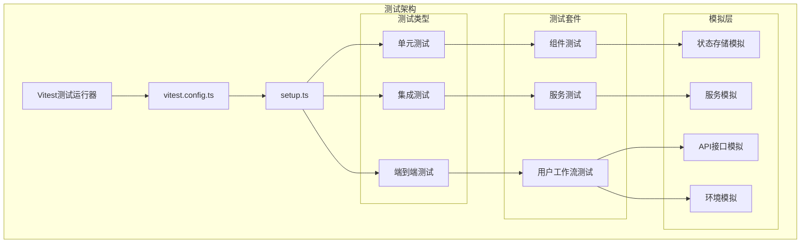
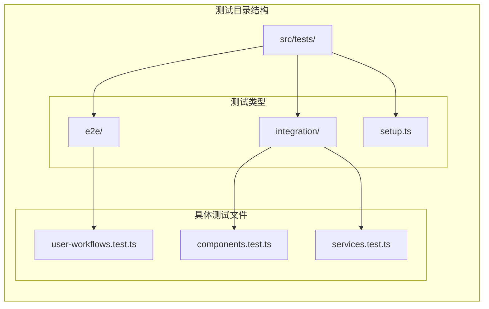

# 测试策略

<cite>
**本文档引用的文件**
- [vitest.config.ts](file://vitest.config.ts)
- [src/tests/setup.ts](file://src/tests/setup.ts)
- [src/tests/e2e/user-workflows.test.ts](file://src/tests/e2e/user-workflows.test.ts)
- [src/tests/integration/components.test.ts](file://src/tests/integration/components.test.ts)
- [src/tests/integration/services.test.ts](file://src/tests/integration/services.test.ts)
- [package.json](file://package.json)
</cite>

## 目录
1. [概述](#概述)
2. [测试架构概览](#测试架构概览)
3. [Vitest配置详解](#vitest配置详解)
4. [测试套件组织](#测试套件组织)
5. [全局配置分析](#全局配置分析)
6. [端到端测试实现](#端到端测试实现)
7. [集成测试分析](#集成测试分析)
8. [测试执行与监控](#测试执行与监控)
9. [测试覆盖率报告](#测试覆盖率报告)
10. [最佳实践建议](#最佳实践建议)

## 概述

该项目采用现代化的测试策略，基于Vitest框架构建了一套完整的测试体系。测试体系包含单元测试、集成测试和端到端测试三个层次，确保应用程序在不同层面的质量保证。

测试框架的核心特点：
- 基于Vitest的高性能测试运行器
- 完整的Vue.js生态系统支持
- 全局测试环境配置
- 模拟（Mock）技术的广泛应用
- 多层次测试覆盖策略

## 测试架构概览



**图表来源**
- [vitest.config.ts](file://vitest.config.ts#L1-L31)
- [src/tests/setup.ts](file://src/tests/setup.ts#L1-L319)

## Vitest配置详解

Vitest配置文件定义了整个测试系统的运行参数和环境设置：

```typescript
export default defineConfig({
  plugins: [vue()],
  test: {
    environment: "jsdom",
    globals: true,
    setupFiles: ["./src/tests/setup.ts"],
    coverage: {
      provider: "v8",
      reporter: ["text", "json", "html"],
      exclude: [
        "node_modules/",
        "src/tests/",
        "**/*.d.ts",
        "**/*.config.*",
        "dist/",
      ],
    },
    include: ["src/tests/**/*.test.ts", "src/tests/**/*.spec.ts"],
    exclude: ["node_modules/", "dist/", ".git/"],
  },
});
```

**关键配置要点：**

1. **环境配置**：使用jsdom作为测试环境，提供DOM操作能力
2. **全局变量**：启用全局测试函数（describe, it, expect等）
3. **设置文件**：指定全局测试配置文件路径
4. **覆盖率报告**：支持多种格式的覆盖率报告
5. **排除规则**：避免测试目录本身被测试

**章节来源**
- [vitest.config.ts](file://vitest.config.ts#L1-L31)

## 测试套件组织

项目采用分层的测试套件组织结构：



**图表来源**
- [src/tests/setup.ts](file://src/tests/setup.ts#L1-L10)
- [src/tests/e2e/user-workflows.test.ts](file://src/tests/e2e/user-workflows.test.ts#L1-L10)

**章节来源**
- [src/tests/setup.ts](file://src/tests/setup.ts#L1-L319)
- [src/tests/e2e/user-workflows.test.ts](file://src/tests/e2e/user-workflows.test.ts#L1-L405)

## 全局配置分析

`setup.ts`文件提供了全面的全局测试环境配置，包括：

### 状态管理模拟

```typescript
// Pinia状态管理模拟
vi.mock("@/stores/categories", () => ({
  useCategoriesStore: () => ({
    categories: [],
    initialize: vi.fn().mockResolvedValue([]),
    fetchCategories: vi.fn().mockResolvedValue([]),
    getCategoryById: vi.fn(),
    loading: false,
    error: null,
    initialized: false,
  }),
}));
```

### 浏览器API模拟

```typescript
// DOM和浏览器API模拟
global.IntersectionObserver = vi.fn(() => ({
  disconnect: vi.fn(),
  observe: vi.fn(),
  unobserve: vi.fn(),
  takeRecords: vi.fn(() => []),
}));

// 性能API模拟
Object.defineProperty(global.performance, "now", {
  value: vi.fn(() => Date.now()),
  writable: true,
});
```

### 网络请求模拟

```typescript
// Fetch API模拟
global.fetch = vi.fn(() =>
  Promise.resolve({
    ok: true,
    status: 200,
    json: () => Promise.resolve({}),
    text: () => Promise.resolve(""),
    headers: new Headers(),
  }),
) as any;
```

### 工具函数和辅助方法

```typescript
// 测试辅助函数
export const createMockUser = (overrides = {}) => ({
  id: "user-123",
  email: "test@example.com",
  full_name: "Test User",
  username: "testuser",
  avatar_url: null,
  role: "user",
  is_active: true,
  email_verified: true,
  created_at: new Date().toISOString(),
  updated_at: new Date().toISOString(),
  ...overrides,
});
```

**章节来源**
- [src/tests/setup.ts](file://src/tests/setup.ts#L1-L319)

## 端到端测试实现

端到端测试位于`src/tests/e2e/user-workflows.test.ts`文件中，展示了模拟的真实用户行为测试：

### 用户注册和登录流程

```typescript
describe("用户注册和登录流程", () => {
  it("用户应该能够成功注册新账户", async () => {
    // 1. 访问注册页面
    await mockBrowser.goto("/register");

    // 2. 填写注册表单
    await mockBrowser.fill("#email", "test@example.com");
    await mockBrowser.fill("#password", "password123");
    await mockBrowser.fill("#confirmPassword", "password123");
    await mockBrowser.fill("#fullName", "测试用户");

    // 3. 提交注册
    await mockBrowser.click("#register-button");

    // 4. 验证注册成功
    await mockBrowser.waitForSelector(".success-message");

    expect(true).toBe(true); // 模拟测试通过
  });
});
```

### 搜索和浏览工具流程

```typescript
describe("搜索和浏览工具流程", () => {
  it("用户应该能够搜索工具", async () => {
    // 1. 访问首页
    await mockBrowser.goto("/");

    // 2. 使用搜索功能
    await mockBrowser.fill(".search-input", "design tools");
    await mockBrowser.click(".search-button");

    // 3. 验证搜索结果
    await mockBrowser.waitForSelector(".search-results");
    await mockBrowser.waitForSelector(".tool-card");

    expect(true).toBe(true);
  });
});
```

### 产品评价流程

```typescript
describe("产品评价流程", () => {
  it("用户应该能够写评价", async () => {
    // 1. 点击写评价按钮
    await mockBrowser.click(".write-review-button");
    await mockBrowser.waitForSelector(".review-modal");

    // 2. 填写评价表单
    await mockBrowser.click(".star-rating .star:nth-child(5)"); // 5星评价
    await mockBrowser.fill("#review-title", "很棒的产品");
    await mockBrowser.fill(
      "#review-content",
      "这个产品非常好用，推荐给大家！",
    );

    // 3. 提交评价
    await mockBrowser.click(".submit-review-button");

    // 4. 验证评价提交成功
    await mockBrowser.waitForSelector(".review-success");

    expect(true).toBe(true);
  });
});
```

**章节来源**
- [src/tests/e2e/user-workflows.test.ts](file://src/tests/e2e/user-workflows.test.ts#L1-L405)

## 集成测试分析

集成测试分为两个主要部分：组件测试和服务测试。

### 组件集成测试

组件测试验证Vue组件的正确渲染和交互行为：

```typescript
describe("增强搜索框 (EnhancedSearchBox)", () => {
  it("应该正确渲染搜索框", () => {
    const wrapper = mount(EnhancedSearchBox, {
      global: {
        plugins: [router],
      },
      props: {
        placeholder: "搜索测试",
      },
    });

    expect(wrapper.find(".search-input").exists()).toBe(true);
    expect(wrapper.find(".search-input").attributes("placeholder")).toBe(
      "搜索测试",
    );
  });

  it("应该能够处理搜索输入", async () => {
    const wrapper = mount(EnhancedSearchBox, {
      global: {
        plugins: [router],
      },
    });

    const input = wrapper.find(".search-input");
    await input.setValue("test query");

    expect(input.element.value).toBe("test query");
  });
});
```

### 服务集成测试

服务测试验证业务逻辑和数据访问层的功能：

```typescript
describe("搜索服务 (SearchService)", () => {
  it("应该能够执行基本搜索", async () => {
    const searchOptions = {
      query: "test",
      type: "all" as const,
      limit: 10,
    };

    const result = await searchService.search(searchOptions);

    expect(result).toHaveProperty("items");
    expect(result).toHaveProperty("total");
    expect(result).toHaveProperty("query", "test");
    expect(result).toHaveProperty("suggestions");
    expect(result).toHaveProperty("facets");
    expect(result).toHaveProperty("searchTime");
    expect(Array.isArray(result.items)).toBe(true);
    expect(typeof result.total).toBe("number");
    expect(typeof result.searchTime).toBe("number");
  });
});
```

**章节来源**
- [src/tests/integration/components.test.ts](file://src/tests/integration/components.test.ts#L1-L519)
- [src/tests/integration/services.test.ts](file://src/tests/integration/services.test.ts#L1-L405)

## 测试执行与监控

项目提供了丰富的测试执行脚本：

### 基础测试命令

```json
{
  "test": "vitest",
  "test:ui": "vitest --ui",
  "test:run": "vitest run",
  "test:coverage": "vitest run --coverage"
}
```

### 分类测试命令

```json
{
  "test:integration": "vitest run src/tests/integration",
  "test:e2e": "vitest run src/tests/e2e"
}
```

### 部署前测试验证

```json
{
  "test:deployment": "node scripts/deployment/test-deployment-workflow.js"
}
```

这些命令提供了灵活的测试执行选项：
- `test`: 启动交互式测试UI
- `test:run`: 运行所有测试并退出
- `test:coverage`: 生成覆盖率报告
- `test:integration`: 仅运行集成测试
- `test:e2e`: 仅运行端到端测试
- `test:deployment`: 部署前的完整性检查

**章节来源**
- [package.json](file://package.json#L15-L25)

## 测试覆盖率报告

Vitest配置支持多种覆盖率报告格式：

```typescript
coverage: {
  provider: "v8",
  reporter: ["text", "json", "html"],
  exclude: [
    "node_modules/",
    "src/tests/",
    "**/*.d.ts",
    "**/*.config.*",
    "dist/",
  ],
}
```

**覆盖率报告类型：**
- **文本报告**：控制台输出的简洁摘要
- **JSON报告**：机器可读的数据格式
- **HTML报告**：可视化网页界面

**排除规则：**
- 第三方依赖（node_modules）
- 测试文件本身
- 类型定义文件
- 配置文件
- 构建产物目录

## 最佳实践建议

基于当前测试架构的分析，以下是改进建议：

### 1. 测试命名规范
- 使用描述性的测试名称
- 采用BDD风格（Given-When-Then）
- 保持测试独立性

### 2. 模拟策略优化
- 实现更真实的模拟数据
- 添加模拟调用次数验证
- 使用工厂函数生成测试数据

### 3. 测试维护
- 定期更新模拟实现
- 移除过时的测试用例
- 优化测试执行时间

### 4. 持续集成
- 在CI/CD流水线中添加测试阶段
- 设置失败阈值和告警机制
- 自动化覆盖率报告生成

### 5. 文档维护
- 更新测试文档以反映最新实践
- 提供测试编写指南
- 建立测试质量标准

通过实施这些建议，可以进一步提升测试体系的有效性和可持续性，确保应用程序的高质量交付。