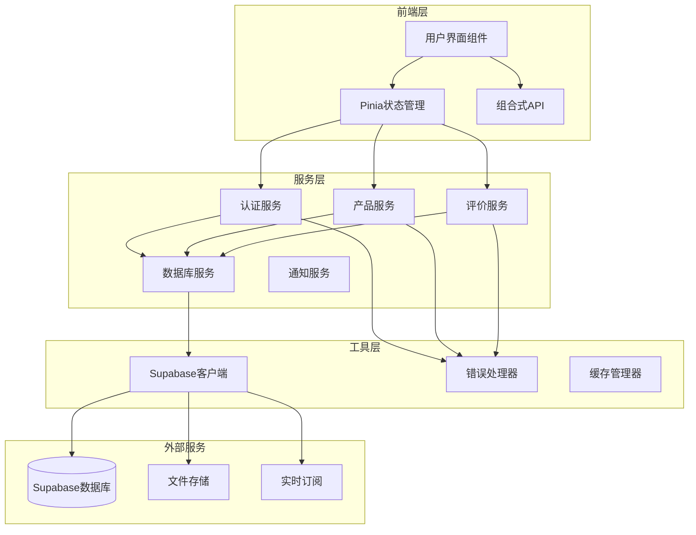
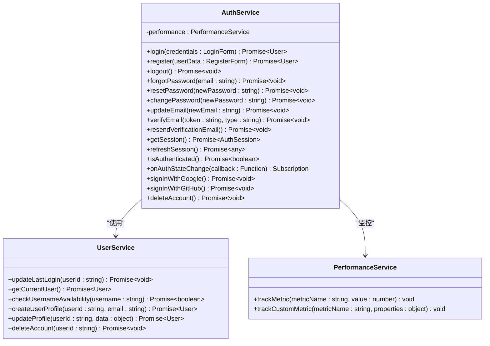
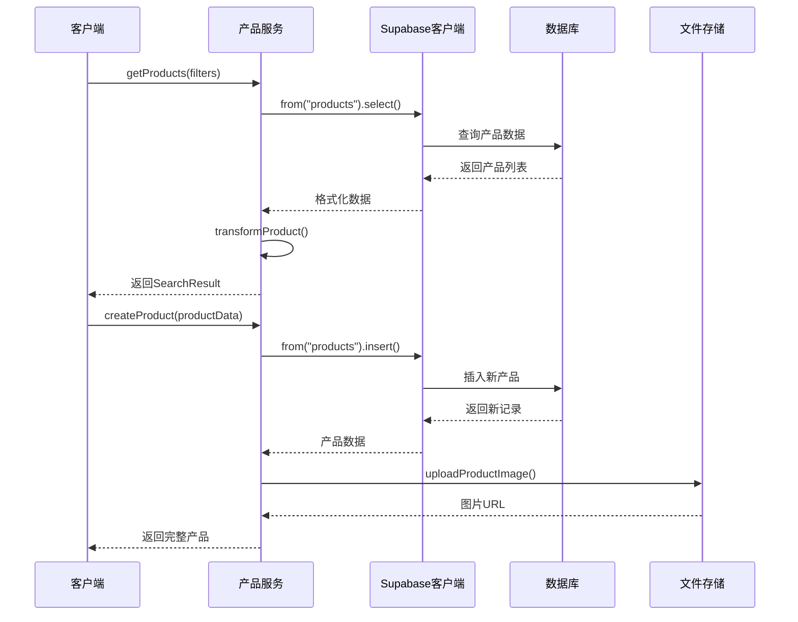
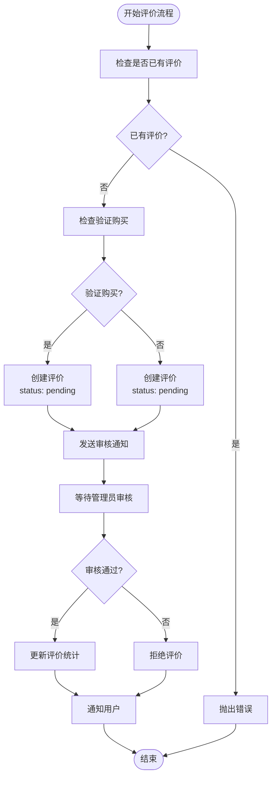
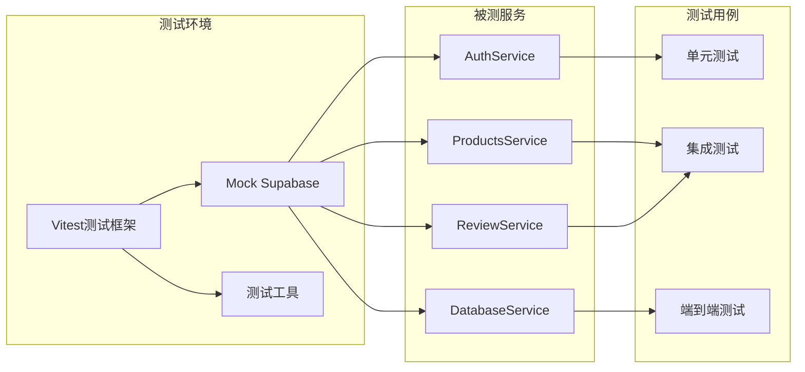
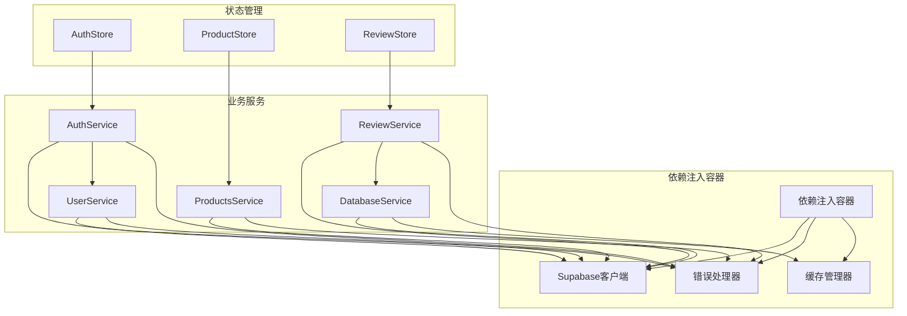
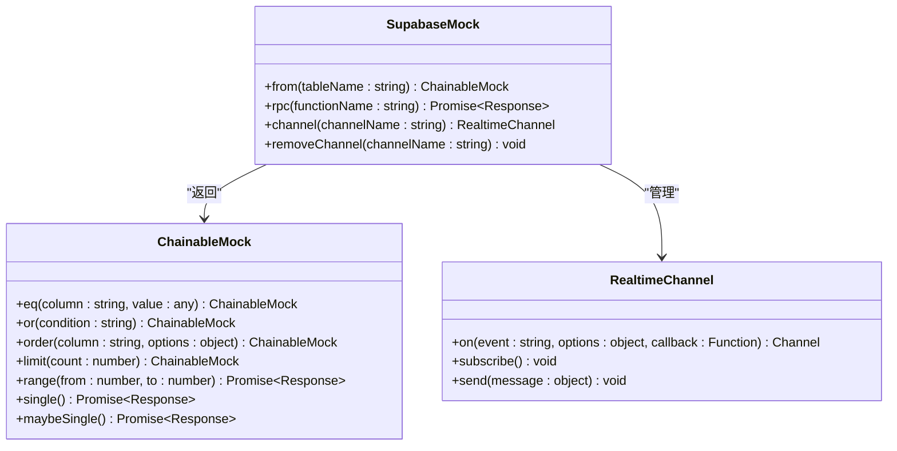
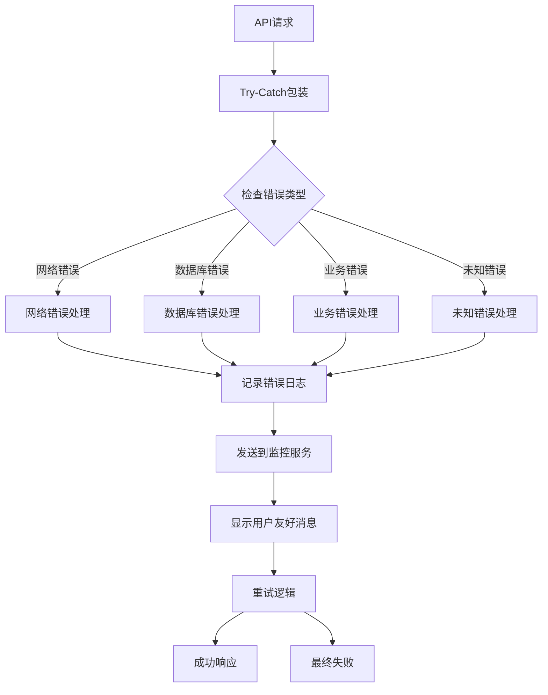
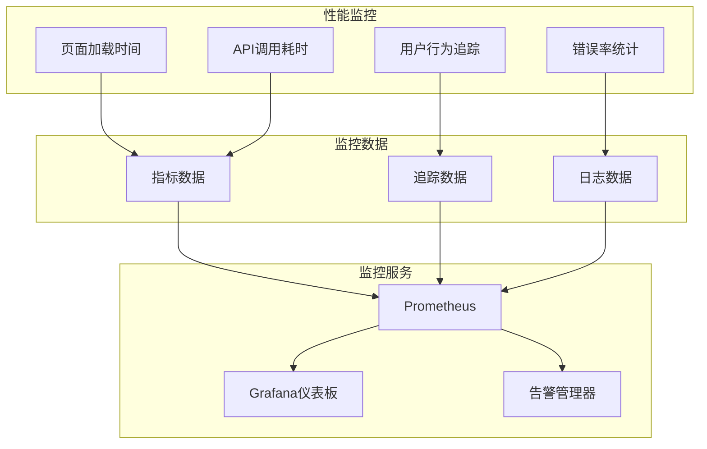
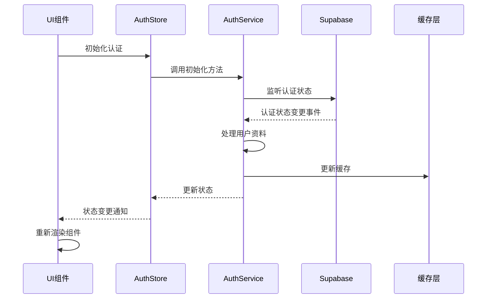

# 服务层集成测试

<cite>
**本文档引用的文件**
- [authService.ts](file://src/services/authService.ts)
- [productsService.ts](file://src/services/productsService.ts)
- [reviewService.ts](file://src/services/reviewService.ts)
- [databaseService.ts](file://src/services/databaseService.ts)
- [auth.ts](file://src/stores/auth.ts)
- [supabaseClient.ts](file://src/lib/supabaseClient.ts)
- [errorHandler.ts](file://src/utils/errorHandler.ts)
- [services.test.ts](file://src/tests/integration/services.test.ts)
</cite>

## 目录
1. [简介](#简介)
2. [项目架构概览](#项目架构概览)
3. [核心服务组件分析](#核心服务组件分析)
4. [集成测试框架](#集成测试框架)
5. [服务间依赖关系](#服务间依赖关系)
6. [Mock模拟与测试策略](#mock模拟与测试策略)
7. [错误处理与边界测试](#错误处理与边界测试)
8. [性能监控集成](#性能监控集成)
9. [Pinia状态管理测试](#pinia状态管理测试)
10. [测试最佳实践](#测试最佳实践)
11. [故障排除指南](#故障排除指南)
12. [总结](#总结)

## 简介

本文档深入分析了Advanced Tools Navigation项目的服务层集成测试架构，重点关注authService、productsService、reviewService等核心业务服务与Supabase客户端的通信验证。通过详细的测试策略、Mock模拟技术、错误边界场景处理以及性能监控集成，确保系统在各种网络状态下的健壮性和可靠性。

服务层集成测试不仅验证单个服务的功能正确性，更重要的是确保多个服务之间的协作能力、数据一致性以及异常情况下的系统稳定性。通过全面的测试覆盖，开发者可以快速发现潜在问题，保证系统的高质量交付。

## 项目架构概览

项目采用现代化的前端架构，基于Vue 3和TypeScript构建，集成了Supabase作为后端服务。整体架构遵循分层设计原则，将业务逻辑、数据访问和用户界面清晰分离。

**图表来源**
- [authService.ts](file://src/services/authService.ts#L1-L50)
- [productsService.ts](file://src/services/productsService.ts#L1-L50)
- [reviewService.ts](file://src/services/reviewService.ts#L1-L50)
- [databaseService.ts](file://src/services/databaseService.ts#L1-L50)

## 核心服务组件分析

### 认证服务 (AuthService)

AuthService是整个系统的核心服务之一，负责用户身份验证、会话管理和权限控制。该服务通过静态方法设计模式，提供了完整的认证生命周期管理。

**图表来源**
- [authService.ts](file://src/services/authService.ts#L15-L306)
- [userService.ts](file://src/services/userService.ts)

AuthService的关键特性包括：

1. **多因素认证支持**：支持传统密码认证、第三方OAuth认证（Google、GitHub）以及邮箱OTP验证
2. **会话管理**：提供会话获取、刷新、状态监听等完整功能
3. **错误处理**：集成统一的错误处理机制，确保异常情况下的用户体验
4. **性能监控**：通过PerformanceService跟踪认证相关的性能指标

**章节来源**
- [authService.ts](file://src/services/authService.ts#L1-L306)

### 产品服务 (ProductsService)

ProductsService负责产品相关的所有业务逻辑，包括产品查询、创建、更新、删除以及特色产品推荐等功能。

**图表来源**
- [productsService.ts](file://src/services/productsService.ts#L15-L300)

产品服务的核心功能模块：

1. **高级搜索与过滤**：支持多字段搜索、价格范围过滤、分类筛选和多种排序方式
2. **分页与分面导航**：提供完整的分页支持和Facet搜索功能
3. **图片管理**：集成Supabase存储，支持产品图片的上传和管理
4. **关联数据处理**：自动处理产品与分类、评价等关联数据的查询

**章节来源**
- [productsService.ts](file://src/services/productsService.ts#L1-L347)

### 评价服务 (ReviewService)

ReviewService是复杂的服务组件，负责产品评价的完整生命周期管理，包括评价创建、审核、回复、投票等功能。

**图表来源**
- [reviewService.ts](file://src/services/reviewService.ts#L200-L250)

评价服务的特色功能：

1. **双重验证机制**：结合用户身份验证和购买验证，确保评价的真实性
2. **智能审核流程**：支持自动审核规则和人工审核相结合
3. **社区互动功能**：支持评价投票、回复评论和社区讨论
4. **统计分析**：提供详细的评价统计和趋势分析

**章节来源**
- [reviewService.ts](file://src/services/reviewService.ts#L1-L615)

## 集成测试框架

### 测试架构设计

项目采用了基于Vitest的集成测试框架，专门针对服务层组件进行测试。测试框架的设计遵循以下原则：

1. **隔离性**：每个测试用例独立运行，互不干扰
2. **可重复性**：测试结果稳定可靠，便于持续集成
3. **全面性**：覆盖正常流程、异常处理和边界情况
4. **可维护性**：测试代码结构清晰，易于理解和维护

**图表来源**
- [services.test.ts](file://src/tests/integration/services.test.ts#L1-L50)

### 测试数据准备策略

集成测试中的数据准备采用以下策略：

1. **测试数据隔离**：每个测试用例使用独立的数据集，避免相互影响
2. **数据预加载**：在测试开始前预加载必要的测试数据
3. **数据清理**：测试完成后自动清理测试数据，保持环境干净
4. **数据模拟**：对于外部依赖，使用Mock数据模拟真实场景

**章节来源**
- [services.test.ts](file://src/tests/integration/services.test.ts#L1-L405)

## 服务间依赖关系

### 依赖注入架构

项目采用依赖注入模式管理服务间的依赖关系，确保松耦合和高内聚的设计原则。

**图表来源**
- [auth.ts](file://src/stores/auth.ts#L1-L190)
- [supabaseClient.ts](file://src/lib/supabaseClient.ts#L1-L246)

### 接口契约测试

服务间的接口契约通过严格的类型检查和测试用例确保一致性：

1. **类型安全**：使用TypeScript确保接口的类型一致性
2. **契约验证**：通过测试用例验证接口行为符合预期
3. **版本兼容**：支持向后兼容的接口变更
4. **文档同步**：接口文档与实现代码保持同步

**章节来源**
- [auth.ts](file://src/stores/auth.ts#L1-L190)
- [databaseService.ts](file://src/services/databaseService.ts#L1-L405)

## Mock模拟与测试策略

### Supabase客户端Mock

为了确保测试的独立性和可重复性，项目对Supabase客户端进行了全面的Mock处理。

**图表来源**
- [services.test.ts](file://src/tests/integration/services.test.ts#L20-L50)

Mock策略的具体实现：

1. **链式调用模拟**：模拟Supabase查询的链式调用语法
2. **异步响应**：模拟真实的异步数据库操作响应
3. **错误处理**：模拟各种错误场景和异常情况
4. **实时订阅**：模拟Supabase的实时数据订阅功能

**章节来源**
- [services.test.ts](file://src/tests/integration/services.test.ts#L20-L50)

### 数据库事务模拟

对于数据库事务操作，测试框架提供了完整的模拟支持：

1. **插入操作**：模拟记录插入，返回生成的ID和时间戳
2. **更新操作**：模拟记录更新，验证更新条件和数据
3. **删除操作**：模拟记录删除，验证删除条件
4. **查询操作**：模拟复杂查询，支持过滤、排序、分页
5. **批量操作**：模拟批量插入、更新、删除操作

### 缓存机制测试

缓存系统的测试涵盖了以下方面：

1. **缓存命中率**：测试缓存的命中和未命中场景
2. **TTL管理**：验证缓存过期和清理机制
3. **缓存一致性**：确保缓存与数据库的一致性
4. **内存管理**：测试缓存大小限制和内存回收

**章节来源**
- [databaseService.ts](file://src/services/databaseService.ts#L200-L300)

## 错误处理与边界测试

### 错误边界场景

项目实现了全面的错误处理机制，确保系统在各种异常情况下的稳定性。

**图表来源**
- [errorHandler.ts](file://src/utils/errorHandler.ts#L1-L100)

### 重试机制

项目实现了智能的重试机制，支持指数退避和抖动算法：

1. **指数退避**：每次重试间隔逐渐增加，减少服务器压力
2. **抖动算法**：在退避基础上添加随机抖动，避免惊群效应
3. **最大重试次数**：防止无限重试导致资源浪费
4. **错误分类**：根据错误类型决定是否重试

**章节来源**
- [errorHandler.ts](file://src/utils/errorHandler.ts#L280-L331)

### 网络状态测试

针对不同的网络状态，项目进行了全面的测试：

1. **网络超时**：模拟网络连接超时场景
2. **断网恢复**：测试网络中断后的自动重连
3. **弱网络**：模拟慢速网络环境
4. **服务器错误**：模拟5xx服务器错误
5. **DNS解析失败**：测试域名解析异常

## 性能监控集成

### 性能指标跟踪

项目集成了全面的性能监控系统，实时跟踪各项关键指标：

**图表来源**
- [services.test.ts](file://src/tests/integration/services.test.ts#L150-L200)

### 性能测试策略

1. **基准测试**：建立性能基准线，定期对比性能变化
2. **负载测试**：模拟高并发场景，测试系统承载能力
3. **压力测试**：逐步增加负载，找到系统极限
4. **稳定性测试**：长时间运行，检测内存泄漏和性能衰减

**章节来源**
- [services.test.ts](file://src/tests/integration/services.test.ts#L150-L250)

## Pinia状态管理测试

### 状态同步验证

Pinia状态管理器的状态同步测试确保了UI组件与服务层数据的一致性：

**图表来源**
- [auth.ts](file://src/stores/auth.ts#L70-L120)

### 请求拦截测试

请求拦截器的测试验证了请求的预处理和后处理流程：

1. **认证令牌注入**：测试认证令牌的自动添加
2. **请求重试**：验证网络错误时的自动重试
3. **响应转换**：测试API响应的格式转换
4. **错误拦截**：验证错误响应的统一处理

**章节来源**
- [auth.ts](file://src/stores/auth.ts#L1-L190)

## 测试最佳实践

### 测试用例设计原则

1. **单一职责**：每个测试用例只验证一个功能点
2. **独立性**：测试用例之间不应相互依赖
3. **可读性**：测试代码应具有良好的可读性和可维护性
4. **覆盖率**：确保关键业务逻辑的测试覆盖率

### 测试数据管理

1. **测试数据隔离**：使用独立的测试数据库或命名空间
2. **数据种子**：提供标准化的测试数据种子
3. **数据清理**：测试完成后自动清理测试数据
4. **数据版本控制**：测试数据的变化应纳入版本控制

### 持续集成集成

1. **自动化测试**：集成到CI/CD流水线，确保每次提交都运行测试
2. **测试报告**：生成详细的测试报告，包括覆盖率和性能指标
3. **并行测试**：支持测试用例的并行执行，提高测试效率
4. **环境一致性**：确保测试环境与生产环境的一致性

## 故障排除指南

### 常见测试问题

1. **Mock配置错误**：检查Mock对象的配置是否正确
2. **异步测试超时**：适当调整测试超时时间
3. **状态污染**：确保测试用例之间的状态隔离
4. **依赖注入失败**：检查依赖注入容器的配置

### 调试技巧

1. **日志输出**：在关键位置添加调试日志
2. **断点调试**：使用浏览器开发者工具进行断点调试
3. **测试隔离**：单独运行有问题的测试用例
4. **环境检查**：确认测试环境配置正确

### 性能优化

1. **测试并行化**：利用Vitest的并行测试功能
2. **Mock优化**：合理使用Mock，避免过度模拟
3. **数据复用**：在可能的情况下复用测试数据
4. **清理策略**：及时清理不需要的测试资源

## 总结

Advanced Tools Navigation项目的服务层集成测试展现了现代前端应用测试的最佳实践。通过全面的Mock模拟、严格的错误处理、完善的性能监控和可靠的Pinia状态管理，确保了系统的高质量和稳定性。

测试框架的设计充分考虑了可扩展性和可维护性，为未来的功能扩展提供了坚实的基础。通过持续的测试改进和优化，项目能够快速响应需求变化，保证交付质量。

关键成果包括：
- 完整的服务层测试覆盖
- 可靠的错误处理和重试机制
- 高效的性能监控和分析
- 稳定的Pinia状态管理
- 易于维护的测试代码结构

这些实践为其他类似项目提供了宝贵的参考经验，展示了如何在复杂的前端应用中实现高质量的集成测试。