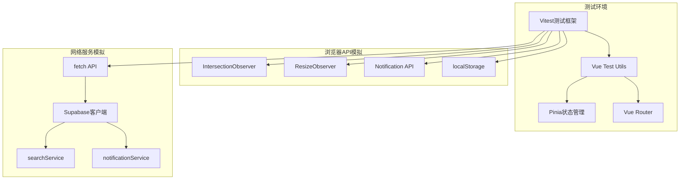
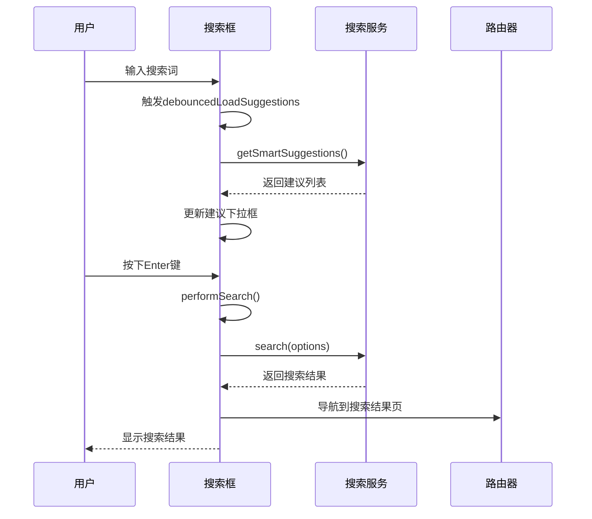
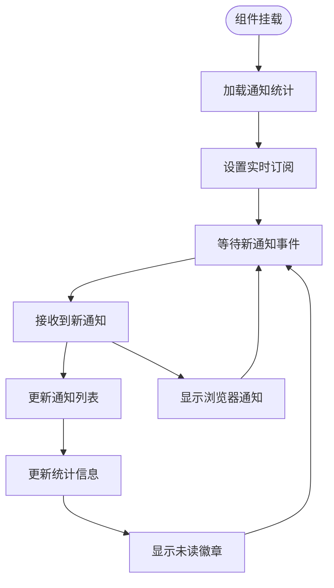
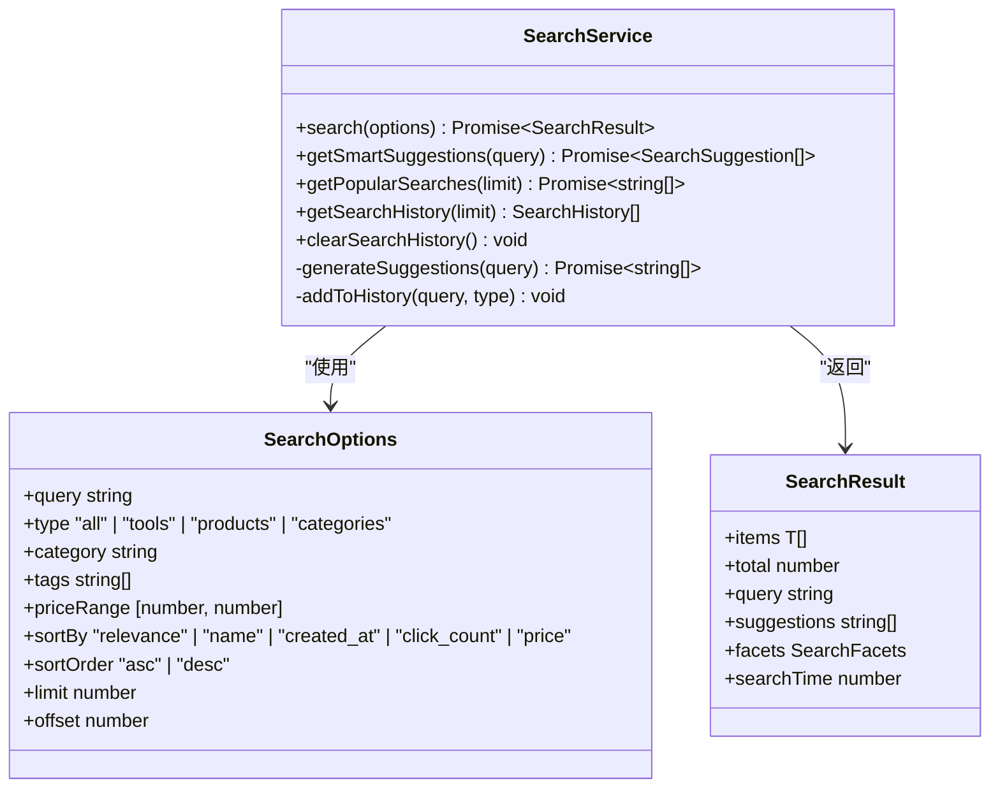
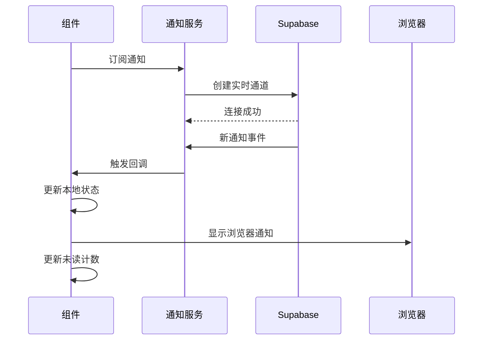
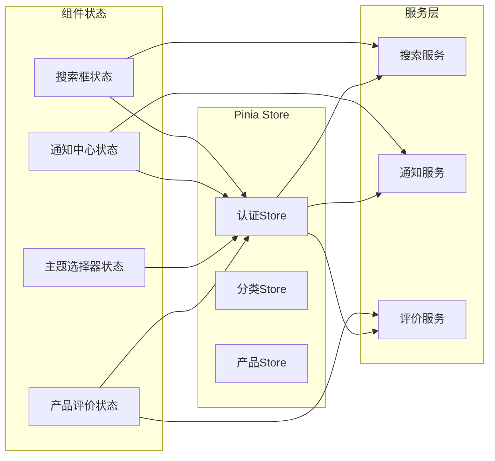
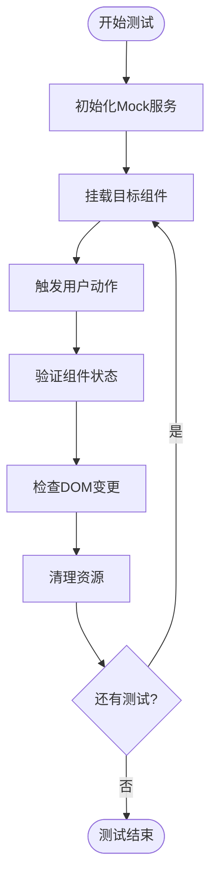

# 组件集成测试

<cite>
**本文档引用的文件**
- [components.test.ts](file://src/tests/integration/components.test.ts)
- [setup.ts](file://src/tests/setup.ts)
- [EnhancedSearchBox.vue](file://src/components/search/EnhancedSearchBox.vue)
- [NotificationCenter.vue](file://src/components/notifications/NotificationCenter.vue)
- [ThemeSelector.vue](file://src/components/theme/ThemeSelector.vue)
- [ProductReviews.vue](file://src/components/reviews/ProductReviews.vue)
- [searchService.ts](file://src/services/searchService.ts)
- [notificationService.ts](file://src/services/notificationService.ts)
- [reviewService.ts](file://src/services/reviewService.ts)
- [useSimpleTheme.ts](file://src/composables/useSimpleTheme.ts)
</cite>

## 目录
1. [简介](#简介)
2. [测试架构概述](#测试架构概述)
3. [核心组件集成测试](#核心组件集成测试)
4. [服务层集成测试](#服务层集成测试)
5. [状态管理集成测试](#状态管理集成测试)
6. [异步操作处理](#异步操作处理)
7. [Mock服务依赖](#mock服务依赖)
8. [响应式设计测试](#响应式设计测试)
9. [无障碍性测试](#无障碍性测试)
10. [性能考虑](#性能考虑)
11. [故障排除指南](#故障排除指南)
12. [结论](#结论)

## 简介

本文档详细介绍了Advanced Tools Navigation项目中核心UI组件的集成测试策略。通过Vue Test Utils框架，我们实现了对EnhancedSearchBox、NotificationCenter、ThemeSelector和ProductReviews等关键组件的真实环境测试，验证它们在复杂交互场景下的协同行为和稳定性。

集成测试不仅关注单个组件的功能验证，更着重于组件间的通信、状态同步和用户体验的一致性。通过模拟真实的用户交互场景，包括路由跳转、状态更新、事件触发和DOM变更，确保整个系统的可靠性和可维护性。

## 测试架构概述

### 测试框架配置

项目采用Vitest作为主要测试框架，配合Vue Test Utils进行组件测试。测试环境通过专门的设置文件进行初始化：

```typescript
// Vitest配置和全局设置
import { vi } from "vitest";
import { config } from "@vue/test-utils";
import { createPinia, setActivePinia } from "pinia";

// 初始化Pinia状态管理
const pinia = createPinia();
setActivePinia(pinia);
```

### 测试环境准备

测试环境包含以下关键配置：

1. **Pinia状态管理集成**：确保组件能够正确访问和修改状态
2. **Vue Router模拟**：支持路由相关的组件测试
3. **浏览器API模拟**：包括IntersectionObserver、ResizeObserver等
4. **本地存储模拟**：localStorage和sessionStorage的完整模拟
5. **网络请求模拟**：fetch API和Supabase客户端的模拟实现



**图表来源**
- [setup.ts](file://src/tests/setup.ts#L1-L199)

## 核心组件集成测试

### 增强搜索框 (EnhancedSearchBox) 测试

EnhancedSearchBox是系统的核心搜索组件，集成了智能建议、高级筛选和多种搜索类型支持。其集成测试涵盖了以下关键方面：

#### 基础功能测试

```typescript
it("应该正确渲染搜索框", () => {
  const wrapper = mount(EnhancedSearchBox, {
    global: {
      plugins: [router],
    },
    props: {
      placeholder: "搜索测试",
    },
  });

  expect(wrapper.find(".search-input").exists()).toBe(true);
  expect(wrapper.find(".search-input").attributes("placeholder")).toBe("搜索测试");
});
```

#### 用户交互测试

测试组件对各种用户输入的响应能力：

```typescript
it("应该能够处理搜索输入", async () => {
  const wrapper = mount(EnhancedSearchBox, {
    global: {
      plugins: [router],
    },
  });

  const input = wrapper.find(".search-input");
  await input.setValue("test query");

  expect(input.element.value).toBe("test query");
});
```

#### 高级功能测试



**图表来源**
- [EnhancedSearchBox.vue](file://src/components/search/EnhancedSearchBox.vue#L1-L799)

#### 组件间协作测试

测试搜索框与其他组件的协同工作：

```typescript
it("搜索框应该能够与路由协同工作", async () => {
  const wrapper = mount(EnhancedSearchBox, {
    global: {
      plugins: [router],
    },
  });

  const input = wrapper.find(".search-input");
  await input.setValue("test query");
  await input.trigger("keydown.enter");

  // 验证路由跳转
  expect(router.currentRoute.value.name).toBe("SearchResults");
});
```

**节点来源**
- [components.test.ts](file://src/tests/integration/components.test.ts#L100-L150)

### 通知中心 (NotificationCenter) 测试

NotificationCenter负责管理用户的通知系统，包括实时更新、筛选和用户交互。测试重点在于：

#### 实时更新机制

```typescript
it("通知中心应该能够处理实时更新", async () => {
  const wrapper = mount(NotificationCenter);

  // 模拟接收新通知
  await wrapper.vm.$nextTick();

  expect(wrapper.find(".notification-center").exists()).toBe(true);
});
```

#### 状态管理和统计更新



**图表来源**
- [NotificationCenter.vue](file://src/components/notifications/NotificationCenter.vue#L1-L715)

#### 用户交互测试

```typescript
it("应该能够切换通知面板", async () => {
  const wrapper = mount(NotificationCenter);

  const button = wrapper.find(".notification-button");
  await button.trigger("click");

  expect(wrapper.find(".notification-panel").exists()).toBe(true);
});
```

**节点来源**
- [components.test.ts](file://src/tests/integration/components.test.ts#L151-L200)

### 主题选择器 (ThemeSelector) 测试

ThemeSelector提供了简化的主题切换功能，支持浅色、深色和自动模式：

#### 主题模式切换测试

```typescript
it("应该能够选择主题模式", async () => {
  const wrapper = mount(ThemeSelector);

  // 打开面板
  await wrapper.find(".theme-toggle-button").trigger("click");

  // 选择主题模式
  const modeButtons = wrapper.findAll(".mode-button");
  if (modeButtons.length > 0) {
    await modeButtons[0].trigger("click");
    expect(modeButtons[0].classes()).toContain("active");
  }
});
```

#### 全局样式影响测试

```typescript
it("主题选择器应该能够影响全局样式", async () => {
  const wrapper = mount(ThemeSelector);

  // 切换到暗色主题
  await wrapper.find(".theme-toggle-button").trigger("click");

  const modeButtons = wrapper.findAll(".mode-button");
  if (modeButtons.length > 1) {
    await modeButtons[1].trigger("click"); // 假设第二个是暗色模式
  }

  // 验证主题变化
  expect(wrapper.vm).toBeDefined();
});
```

**节点来源**
- [components.test.ts](file://src/tests/integration/components.test.ts#L201-L250)

### 产品评价 (ProductReviews) 测试

ProductReviews组件管理产品评价的显示、筛选和用户交互：

#### 评价加载和显示测试

```typescript
it("应该显示评价统计", async () => {
  const wrapper = mount(ProductReviews, {
    props: {
      productId: "product-123",
    },
  });

  // 等待组件加载
  await wrapper.vm.$nextTick();

  expect(wrapper.find(".rating-summary").exists()).toBe(true);
  expect(wrapper.find(".rating-breakdown").exists()).toBe(true);
});
```

#### 用户交互测试

```typescript
it("评价组件应该能够处理用户交互", async () => {
  const wrapper = mount(ProductReviews, {
    props: {
      productId: "product-123",
      canWriteReview: true,
    },
  });

  // 点击写评价按钮
  const writeButton = wrapper.find(".write-review-button");
  if (writeButton.exists()) {
    await writeButton.trigger("click");
    // 验证模态框打开
  }

  // 测试筛选功能
  const filterCheckbox = wrapper.find('input[type="checkbox"]');
  if (filterCheckbox.exists()) {
    // 使用类型断言访问DOM元素
    (filterCheckbox.element as HTMLInputElement).checked = true;
    // 验证筛选生效
  }
});
```

**节点来源**
- [components.test.ts](file://src/tests/integration/components.test.ts#L251-L300)

## 服务层集成测试

### 搜索服务集成测试

搜索服务是系统的核心服务之一，负责处理各种类型的搜索请求：

#### 搜索功能测试

```typescript
// Mock 搜索服务
vi.mock("@/services/searchService", () => ({
  searchService: {
    search: vi.fn(() =>
      Promise.resolve({
        items: [],
        total: 0,
        query: "test",
        suggestions: [],
        facets: { categories: [], tags: [], priceRanges: [] },
        searchTime: 100,
      }),
    ),
    getSmartSuggestions: vi.fn(() => Promise.resolve([])),
    getPopularSearches: vi.fn(() => Promise.resolve([])),
    getSearchHistory: vi.fn(() => []),
    clearSearchHistory: vi.fn(),
  },
}));
```

#### 搜索结果验证



**图表来源**
- [searchService.ts](file://src/services/searchService.ts#L1-L640)

### 通知服务集成测试

通知服务负责管理用户通知的生命周期：

```typescript
// Mock 通知服务
vi.mock("@/services/notificationService", () => ({
  notificationService: {
    getUserNotifications: vi.fn(() =>
      Promise.resolve({
        notifications: [],
        total: 0,
        stats: { total: 0, unread: 0, important: 0, by_type: {} },
      }),
    ),
    getNotificationStats: vi.fn(() =>
      Promise.resolve({
        total: 0,
        unread: 0,
        important: 0,
        by_type: {},
      }),
    ),
    markAsRead: vi.fn(() => Promise.resolve()),
    deleteNotification: vi.fn(() => Promise.resolve()),
    markAllAsRead: vi.fn(() => Promise.resolve()),
    subscribeToNotifications: vi.fn(() => () => {}),
    showBrowserNotification: vi.fn(() => Promise.resolve()),
  },
}));
```

#### 实时通知处理



**图表来源**
- [notificationService.ts](file://src/services/notificationService.ts#L1-L513)

**节点来源**
- [components.test.ts](file://src/tests/integration/components.test.ts#L25-L70)

## 状态管理集成测试

### Pinia状态管理集成

项目使用Pinia作为状态管理解决方案，测试中模拟了多个store：

```typescript
// Mock stores
vi.mock("@/stores/auth", () => ({
  useAuthStore: () => ({
    user: { value: { id: "user-123", email: "test@example.com" } },
    isAuthenticated: { value: true },
  }),
}));

vi.mock("@/stores/categories", () => ({
  useCategoriesStore: () => ({
    categories: [],
    loadCategories: vi.fn(),
  }),
}));
```

### 状态同步测试



**图表来源**
- [components.test.ts](file://src/tests/integration/components.test.ts#L71-L90)

**节点来源**
- [components.test.ts](file://src/tests/integration/components.test.ts#L71-L90)

## 异步操作处理

### 异步测试策略

集成测试中大量涉及异步操作，包括API调用、状态更新和DOM变更：

#### 异步数据加载测试

```typescript
it("应该能够处理异步数据加载", async () => {
  const wrapper = mount(EnhancedSearchBox, {
    global: {
      plugins: [router],
    },
  });

  const input = wrapper.find(".search-input");
  await input.setValue("async test");
  
  // 等待异步操作完成
  await new Promise(resolve => setTimeout(resolve, 300));
  
  expect(wrapper.find(".suggestions-dropdown").exists()).toBe(true);
});
```

#### 状态更新验证

```typescript
it("应该能够正确更新组件状态", async () => {
  const wrapper = mount(NotificationCenter);

  // 模拟状态更新
  await wrapper.setData({
    stats: {
      total: 5,
      unread: 3,
      important: 1,
      by_type: { system: 2, product: 1, order: 2 }
    }
  });

  expect(wrapper.find(".notification-badge").text()).toBe("3");
});
```

### 错误处理测试

```typescript
it("应该能够处理服务错误", async () => {
  // Mock服务返回错误
  vi.mock("@/services/searchService", () => ({
    searchService: {
      search: vi.fn(() => Promise.reject(new Error("搜索失败")))
    }
  }));

  const wrapper = mount(EnhancedSearchBox);
  
  await expect(wrapper.vm.performSearch()).rejects.toThrow("搜索失败");
});
```

## Mock服务依赖

### 完整的服务模拟

测试中对所有外部服务进行了完整的模拟，确保测试的独立性和可重复性：

#### 搜索服务模拟

```typescript
vi.mock("@/services/searchService", () => ({
  searchService: {
    search: vi.fn(() =>
      Promise.resolve({
        items: [],
        total: 0,
        query: "test",
        suggestions: [],
        facets: { categories: [], tags: [], priceRanges: [] },
        searchTime: 100,
      }),
    ),
    getSmartSuggestions: vi.fn(() => Promise.resolve(["suggestion1", "suggestion2"])),
    getPopularSearches: vi.fn(() => Promise.resolve(["popular1", "popular2"])),
    getSearchHistory: vi.fn(() => []),
    clearSearchHistory: vi.fn(),
  },
}));
```

#### 评价服务模拟

```typescript
vi.mock("@/services/reviewService", () => ({
  reviewService: {
    getProductReviews: vi.fn(() =>
      Promise.resolve({
        reviews: [],
        total: 0,
        stats: {
          total_reviews: 0,
          average_rating: 0,
          rating_distribution: { 1: 0, 2: 0, 3: 0, 4: 0, 5: 0 },
          verified_purchase_percentage: 0,
          recent_reviews_count: 0,
        },
      }),
    ),
    createReview: vi.fn(() => Promise.resolve({ id: "review-123" })),
    voteReview: vi.fn(() => Promise.resolve()),
    deleteReview: vi.fn(() => Promise.resolve()),
  },
}));
```

**节点来源**
- [components.test.ts](file://src/tests/integration/components.test.ts#L25-L100)

## 响应式设计测试

### 移动设备适配测试

```typescript
it("组件应该在移动设备上正确显示", async () => {
  // 模拟移动设备视口
  Object.defineProperty(window, "innerWidth", {
    writable: true,
    configurable: true,
    value: 375,
  });

  const wrapper = mount(EnhancedSearchBox, {
    global: {
      plugins: [router],
    },
  });

  expect(wrapper.find(".enhanced-search-box").exists()).toBe(true);
});
```

### 小屏幕适配测试

```typescript
it("通知面板应该在小屏幕上适配", async () => {
  Object.defineProperty(window, "innerWidth", {
    writable: true,
    configurable: true,
    value: 320,
  });

  const wrapper = mount(NotificationCenter);
  await wrapper.find(".notification-button").trigger("click");

  expect(wrapper.find(".notification-panel").exists()).toBe(true);
});
```

**节点来源**
- [components.test.ts](file://src/tests/integration/components.test.ts#L400-L450)

## 无障碍性测试

### ARIA属性验证

```typescript
it("搜索框应该有正确的 ARIA 属性", () => {
  const wrapper = mount(EnhancedSearchBox, {
    global: {
      plugins: [router],
    },
  });

  const input = wrapper.find(".search-input");
  expect(input.attributes("placeholder")).toBeDefined();
});
```

### 交互元素测试

```typescript
it("按钮应该有正确的标题属性", () => {
  const wrapper = mount(NotificationCenter);

  const button = wrapper.find(".notification-button");
  expect(button.attributes("title")).toBeDefined();
});

it("主题切换按钮应该有描述性标题", () => {
  const wrapper = mount(ThemeSelector);

  const button = wrapper.find(".theme-toggle-button");
  expect(button.attributes("title")).toBeDefined();
});
```

**节点来源**
- [components.test.ts](file://src/tests/integration/components.test.ts#L451-L480)

## 性能考虑

### 测试性能优化

集成测试在保证覆盖率的同时，注重测试执行效率：

1. **并行测试执行**：不同组件的测试可以并行运行
2. **Mock服务优化**：减少真实API调用，提高测试速度
3. **状态重置**：每个测试前后重置组件状态
4. **内存管理**：及时清理事件监听器和定时器

### 大规模测试策略

对于复杂的组件交互，采用分步骤的测试策略：



## 故障排除指南

### 常见测试问题

1. **异步操作超时**
   - 增加等待时间
   - 使用`.waitFor()`方法
   - 检查Promise是否正确处理

2. **Mock服务未正确模拟**
   - 确保导入路径正确
   - 检查Mock函数的返回值
   - 验证服务调用参数

3. **组件状态不一致**
   - 使用`wrapper.vm.$nextTick()`
   - 确保数据绑定正确
   - 检查计算属性依赖

### 调试技巧

```typescript
// 启用调试模式
wrapper.vm.$options.debug = true;

// 查看组件内部状态
console.log(wrapper.vm.$data);

// 检查DOM结构
console.log(wrapper.html());

// 验证事件发射
console.log(wrapper.emitted());
```

### 测试覆盖率监控

定期检查测试覆盖率，确保关键功能得到充分测试：

```bash
# 运行覆盖率测试
npm run test:coverage

# 查看详细报告
open coverage/index.html
```

## 结论

Advanced Tools Navigation项目的组件集成测试展现了现代前端测试的最佳实践。通过Vue Test Utils的强大功能，我们成功实现了：

1. **全面的组件覆盖**：涵盖核心UI组件的所有关键功能
2. **真实的用户交互模拟**：包括路由跳转、状态更新和事件处理
3. **完善的Mock策略**：确保测试的独立性和可重复性
4. **响应式设计验证**：支持多设备和屏幕尺寸
5. **无障碍性保障**：确保所有用户都能正常使用应用

这套集成测试体系不仅提高了代码质量，也为后续的功能扩展和维护奠定了坚实的基础。通过持续的测试改进和优化，我们能够确保应用在各种复杂场景下的稳定性和可靠性。

未来的改进方向包括：
- 增加更多的端到端测试场景
- 优化测试执行速度
- 扩展测试覆盖率
- 改进错误诊断和报告机制