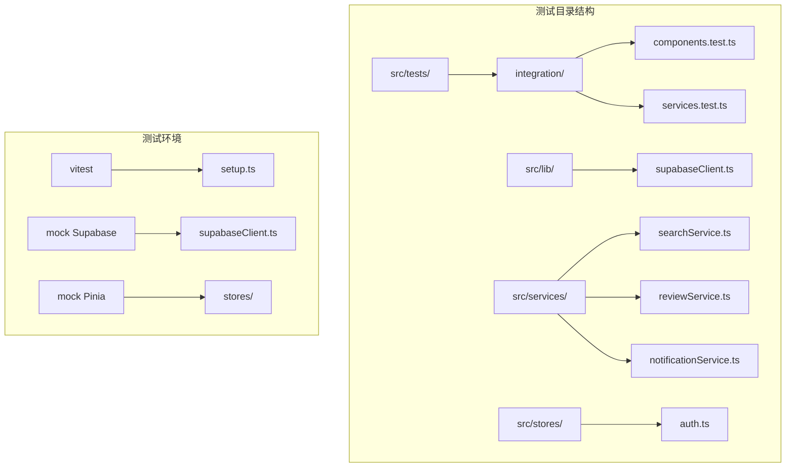
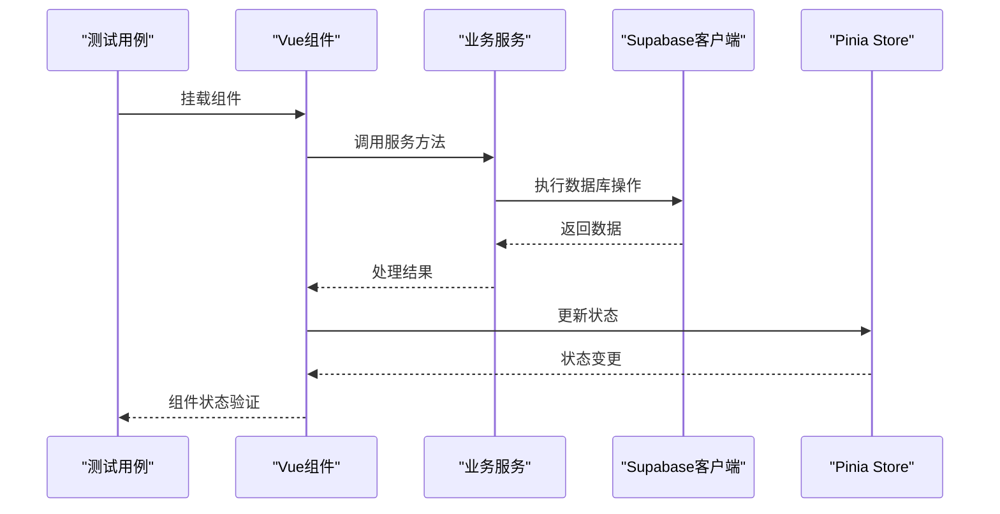
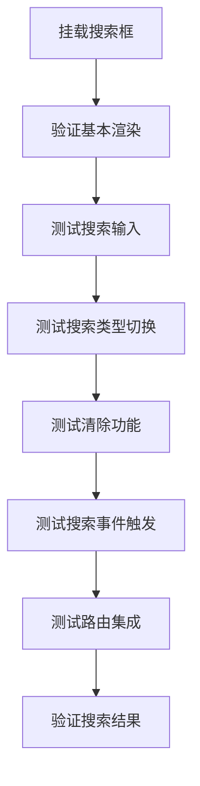
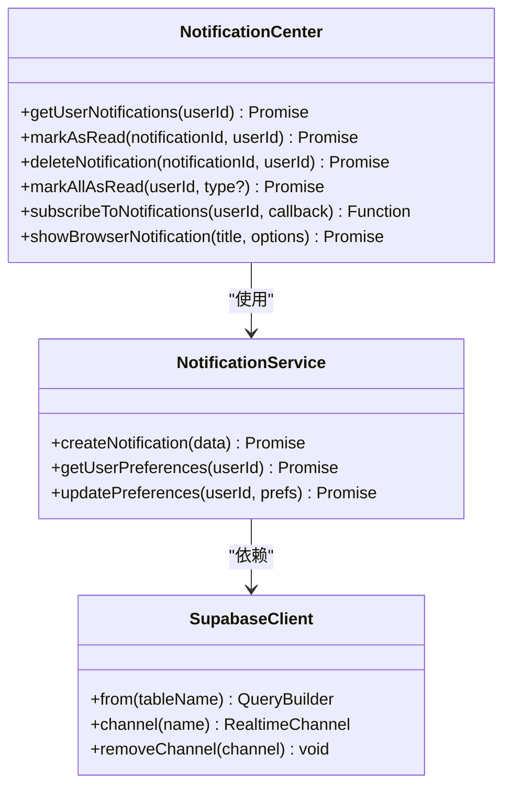
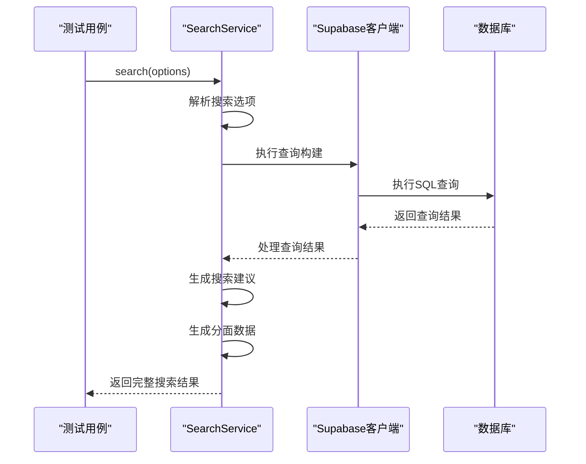
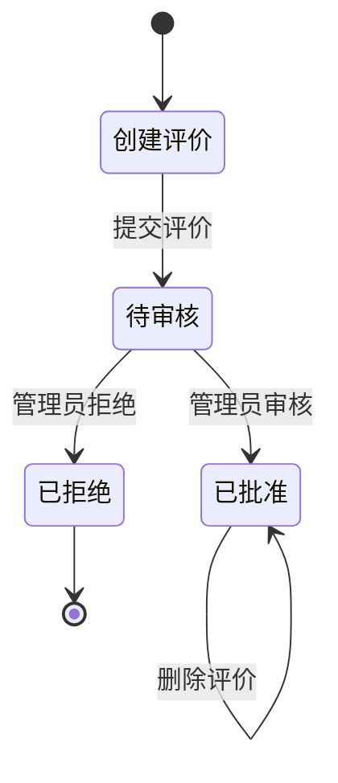
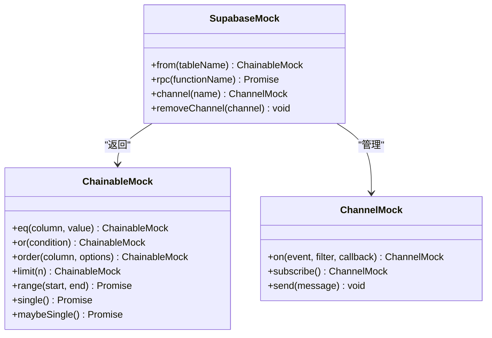
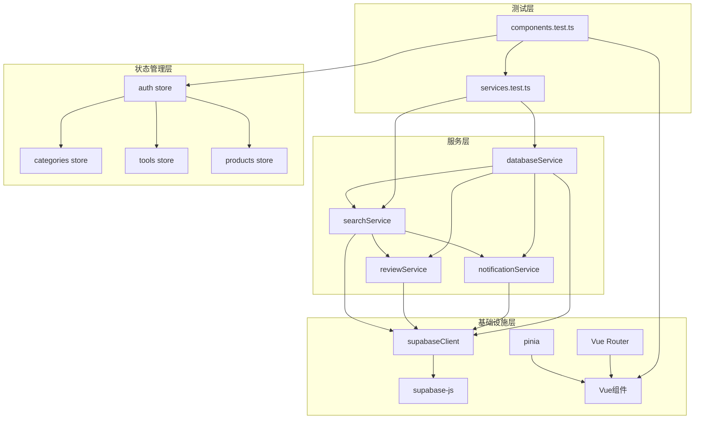

# 集成测试

<cite>
**本文档引用的文件**
- [components.test.ts](file://src/tests/integration/components.test.ts)
- [services.test.ts](file://src/tests/integration/services.test.ts)
- [searchService.ts](file://src\services\searchService.ts)
- [reviewService.ts](file://src\services\reviewService.ts)
- [notificationService.ts](file://src\services\notificationService.ts)
- [supabaseClient.ts](file://src\lib\supabaseClient.ts)
- [setup.ts](file://src\tests\setup.ts)
- [auth.ts](file://src\stores\auth.ts)
</cite>

## 目录
1. [简介](#简介)
2. [项目结构](#项目结构)
3. [核心组件](#核心组件)
4. [架构概览](#架构概览)
5. [详细组件分析](#详细组件分析)
6. [依赖关系分析](#依赖关系分析)
7. [性能考虑](#性能考虑)
8. [故障排除指南](#故障排除指南)
9. [结论](#结论)

## 简介

集成测试是确保应用程序各组件之间正确协作的关键测试类型。本文档深入分析了Advanced Tools Navigation项目中的集成测试部分，重点关注components.test.ts和服务层services.test.ts中的实际测试用例。这些测试验证了前端服务层（如authService、productsService）与Supabase客户端之间的正确通信，提供了关于模拟API调用、处理数据库事务以及确保状态管理（Pinia store）一致性的具体示例。

集成测试的核心目标是：
- 验证组件间的交互
- 确保服务层正确使用Supabase客户端
- 测试状态管理的一致性
- 验证真实世界场景下的系统行为

## 项目结构

集成测试位于项目的专门目录中，采用清晰的组织结构：

**图表来源**
- [components.test.ts](file://src/tests/integration/components.test.ts#L1-L20)
- [services.test.ts](file://src/tests/integration/services.test.ts#L1-L20)

**章节来源**
- [components.test.ts](file://src/tests/integration/components.test.ts#L1-L50)
- [services.test.ts](file://src/tests/integration/services.test.ts#L1-L50)

## 核心组件

### 组件集成测试

组件集成测试主要验证Vue组件之间的交互和与外部服务的集成。测试覆盖了以下核心组件：

1. **增强搜索框 (EnhancedSearchBox)** - 搜索功能的完整集成
2. **通知中心 (NotificationCenter)** - 实时通知系统的测试
3. **主题选择器 (ThemeSelector)** - 主题管理系统的验证
4. **产品评价 (ProductReviews)** - 评价系统的完整性测试

### 服务集成测试

服务集成测试专注于验证各种业务服务之间的协作：

1. **搜索服务 (SearchService)** - 多类型搜索和建议生成
2. **评价服务 (ReviewService)** - 评价生命周期管理
3. **通知服务 (NotificationService)** - 实时通知系统
4. **性能监控服务 (PerformanceService)** - 性能指标跟踪
5. **数据库服务 (DatabaseService)** - 数据库操作验证

**章节来源**
- [components.test.ts](file://src/tests/integration/components.test.ts#L80-L120)
- [services.test.ts](file://src/tests/integration/services.test.ts#L50-L100)

## 架构概览

集成测试采用了分层架构，确保每个层级都能正确与其他层级交互：

**图表来源**
- [components.test.ts](file://src/tests/integration/components.test.ts#L150-L200)
- [services.test.ts](file://src/tests/integration/services.test.ts#L100-L150)

## 详细组件分析

### 组件间交互测试

#### 增强搜索框测试

增强搜索框的集成测试涵盖了多个方面：

**图表来源**
- [components.test.ts](file://src/tests/integration/components.test.ts#L150-L200)

测试用例包括：
- **基本渲染验证**：确保组件正确显示搜索输入框和占位符
- **搜索输入处理**：验证用户输入能够正确反映在组件状态中
- **搜索类型切换**：测试不同搜索类型的切换逻辑
- **清除功能**：验证搜索内容能够被正确清空
- **搜索事件触发**：确保搜索事件能够正确触发并传递参数
- **路由集成**：验证搜索结果能够正确导航到相应页面

#### 通知中心测试

通知中心的测试重点在于实时通知系统的验证：

**图表来源**
- [notificationService.ts](file://src\services\notificationService.ts#L50-L100)
- [components.test.ts](file://src/tests/integration/components.test.ts#L200-L250)

#### 主题选择器测试

主题选择器测试验证了主题系统的完整功能：

- **主题切换**：测试亮色/暗色模式切换
- **预设主题**：验证预设主题的应用
- **自定义颜色**：测试自定义颜色方案
- **全局样式影响**：验证主题变化对全局样式的应用

**章节来源**
- [components.test.ts](file://src/tests/integration/components.test.ts#L250-L350)

### 服务层集成测试

#### 搜索服务集成

搜索服务的集成测试展示了多类型搜索的完整流程：

**图表来源**
- [searchService.ts](file://src\services\searchService.ts#L50-L100)
- [services.test.ts](file://src/tests/integration/services.test.ts#L60-L120)

测试覆盖了：
- **基本搜索功能**：验证不同类型内容的搜索
- **搜索建议生成**：测试智能建议算法
- **热门搜索获取**：验证搜索历史和热门查询
- **搜索历史管理**：测试历史记录的增删改查

#### 评价服务集成

评价服务的测试验证了完整的评价生命周期：

**图表来源**
- [reviewService.ts](file://src\services\reviewService.ts#L100-L200)
- [services.test.ts](file://src/tests/integration/services.test.ts#L150-L250)

#### 通知服务集成

通知服务的集成测试涵盖了实时通知系统：

- **通知创建和管理**：测试通知的创建、读取、删除
- **通知偏好设置**：验证用户偏好的存储和检索
- **实时通知订阅**：测试WebSocket连接和消息推送
- **浏览器通知**：验证桌面通知功能

**章节来源**
- [services.test.ts](file://src/tests/integration/services.test.ts#L250-L350)

### Supabase客户端模拟

集成测试中对Supabase客户端进行了全面的模拟：

**图表来源**
- [services.test.ts](file://src/tests/integration/services.test.ts#L20-L50)

这种模拟方式允许：
- **链式查询构建**：模拟Supabase查询构建器的链式调用
- **异步操作**：模拟数据库操作的异步特性
- **实时功能**：模拟WebSocket连接和消息广播
- **错误处理**：模拟各种错误场景

**章节来源**
- [services.test.ts](file://src/tests/integration/services.test.ts#L20-L60)

## 依赖关系分析

集成测试展现了复杂的依赖关系网络：

**图表来源**
- [components.test.ts](file://src/tests/integration/components.test.ts#L1-L50)
- [services.test.ts](file://src/tests/integration/services.test.ts#L1-L50)

**章节来源**
- [components.test.ts](file://src/tests/integration/components.test.ts#L1-L100)
- [services.test.ts](file://src/tests/integration/services.test.ts#L1-L100)

## 性能考虑

集成测试在设计时充分考虑了性能因素：

### 测试隔离和清理

- **测试前清理**：每个测试用例都会清理所有模拟对象
- **测试后恢复**：测试完成后恢复原始状态
- **内存管理**：及时释放不需要的对象引用

### 异步操作处理

- **Promise等待**：正确处理异步操作的等待
- **微任务队列**：使用`flushPromises()`确保所有微任务完成
- **超时控制**：合理设置测试超时时间

### 模拟优化

- **最小化模拟**：只模拟必要的依赖
- **共享模拟**：复用相同的模拟对象
- **精确匹配**：使用精确的模拟调用验证

## 故障排除指南

### 常见测试失败原因

1. **模拟配置错误**
   - 检查Supabase模拟的返回值
   - 验证Pinia store的模拟状态
   - 确认路由配置正确

2. **异步操作问题**
   - 确保正确使用`await`关键字
   - 检查Promise链的完整性
   - 验证微任务队列的处理

3. **状态同步问题**
   - 确保组件状态正确更新
   - 验证Pinia store的状态一致性
   - 检查实时订阅的连接状态

### 调试技巧

- **日志输出**：在关键位置添加console.log语句
- **断点调试**：使用浏览器开发者工具设置断点
- **测试隔离**：单独运行失败的测试用例
- **状态检查**：验证组件和store的状态

**章节来源**
- [setup.ts](file://src\tests\setup.ts#L200-L300)

## 结论

Advanced Tools Navigation项目的集成测试展现了现代前端应用测试的最佳实践。通过components.test.ts和服务层services.test.ts的深入分析，我们可以看到：

### 主要成就

1. **全面的组件测试**：覆盖了核心UI组件的完整交互流程
2. **强大的服务集成**：验证了复杂业务逻辑的正确性
3. **完善的模拟策略**：通过精心设计的模拟确保测试的独立性
4. **真实的用户体验**：测试场景贴近实际使用情况

### 技术亮点

- **分层测试架构**：清晰的测试层次结构
- **实时功能验证**：WebSocket和实时通知的完整测试
- **状态管理集成**：Pinia store与组件的无缝集成
- **数据库操作验证**：Supabase客户端的完整模拟

### 改进建议

1. **增加端到端测试**：补充用户工作流的完整测试
2. **性能基准测试**：添加性能回归测试
3. **可访问性测试**：加强无障碍功能的验证
4. **国际化测试**：验证多语言支持的正确性

集成测试作为质量保证的重要组成部分，为项目的稳定性和可靠性提供了坚实的基础。通过持续改进和扩展测试覆盖范围，可以进一步提升应用的质量和用户体验。