# UI组件结构

<cite>
**本文档中引用的文件**   
- [ToolForm.vue](file://src/components/admin/ToolForm.vue)
- [UserDetailModal.vue](file://src/components/admin/UserDetailModal.vue)
- [ProductDetailModal.vue](file://src/components/admin/ProductDetailModal.vue)
- [LazyComponent.vue](file://src/components/common/LazyComponent.vue)
- [LazyImage.vue](file://src/components/common/LazyImage.vue)
- [GlobalErrorHandler.vue](file://src/components/error/GlobalErrorHandler.vue)
- [FeedbackWidget.vue](file://src/components/feedback/FeedbackWidget.vue)
- [NotificationCenter.vue](file://src/components/notifications/NotificationCenter.vue)
- [NotificationItem.vue](file://src/components/notifications/NotificationItem.vue)
- [NotificationSettings.vue](file://src/components/notifications/NotificationSettings.vue)
- [WriteReviewModal.vue](file://src/components/reviews/WriteReviewModal.vue)
- [ReviewItem.vue](file://src/components/reviews/ReviewItem.vue)
- [EditReviewModal.vue](file://src/components/reviews/EditReviewModal.vue)
- [ReplyModal.vue](file://src/components/reviews/ReplyModal.vue)
- [ProductReviews.vue](file://src/components/reviews/ProductReviews.vue)
- [AdvancedSearchPanel.vue](file://src/components/search/AdvancedSearchPanel.vue)
- [EnhancedSearchBox.vue](file://src/components/search/EnhancedSearchBox.vue)
- [ThemeSelector.vue](file://src/components/theme/ThemeSelector.vue)
- [SimpleThemeSelector.vue](file://src/components/theme/SimpleThemeSelector.vue)
- [StarRating.vue](file://src/components/ui/StarRating.vue)
</cite>

## 目录
1. [管理类组件](#管理类组件)
2. [通用懒加载组件](#通用懒加载组件)
3. [全局错误处理器](#全局错误处理器)
4. [反馈组件](#反馈组件)
5. [通知中心组件](#通知中心组件)
6. [评价相关组件](#评价相关组件)
7. [搜索组件](#搜索组件)
8. [主题选择器组件](#主题选择器组件)
9. [基础UI控件](#基础ui控件)

## 管理类组件

深入解析src/components/admin目录下的管理类组件，重点分析ToolForm和UserDetailModal等组件的表单逻辑与数据绑定机制。

### ToolForm组件分析

ToolForm组件实现了工具管理的表单功能，包含基本信息、可选信息和SEO信息三个部分。组件通过props接收tool对象和isEditing状态，使用reactive创建表单数据和错误对象，通过computed获取分类数据。

表单验证通过validateForm方法实现，清空之前的错误后，使用validateRequiredFields和requireCategoryId进行字段验证，并通过isValidUrl验证URL格式。提交时，先验证表单，通过后通过emit发送submit事件。

数据绑定方面，使用v-model双向绑定表单字段，通过loadFormData方法加载工具数据，onMounted生命周期中加载分类数据，watch监听tool变化以更新表单数据。

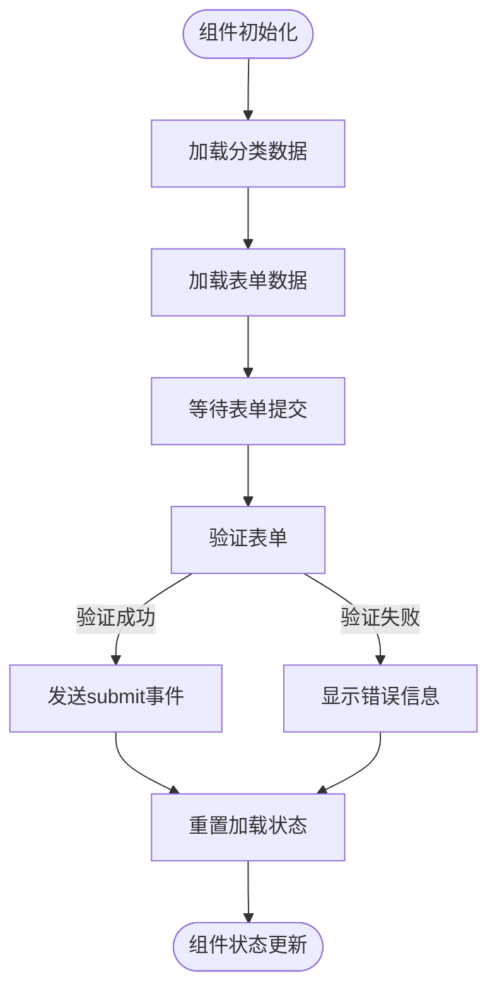

**组件源码**
- [ToolForm.vue](file://src/components/admin/ToolForm.vue#L1-L512)

**组件源码**
- [ToolForm.vue](file://src/components/admin/ToolForm.vue#L1-L512)

### UserDetailModal组件分析

UserDetailModal组件用于展示用户详细信息，包含基本信息、个人资料、活动统计和最近活动四个部分。组件通过props接收isVisible和user对象，使用reactive创建用户统计和活动数据。

组件通过watch监听user变化，加载用户统计和活动数据。使用getRoleText、getStatusText等方法格式化显示内容，getActivityIcon根据活动类型返回对应图标。

数据加载通过loadUserStats和loadUserActivities方法实现，目前使用模拟数据，实际应用中应调用API获取数据。组件通过emit发送close和edit事件，实现模态框关闭和编辑用户功能。

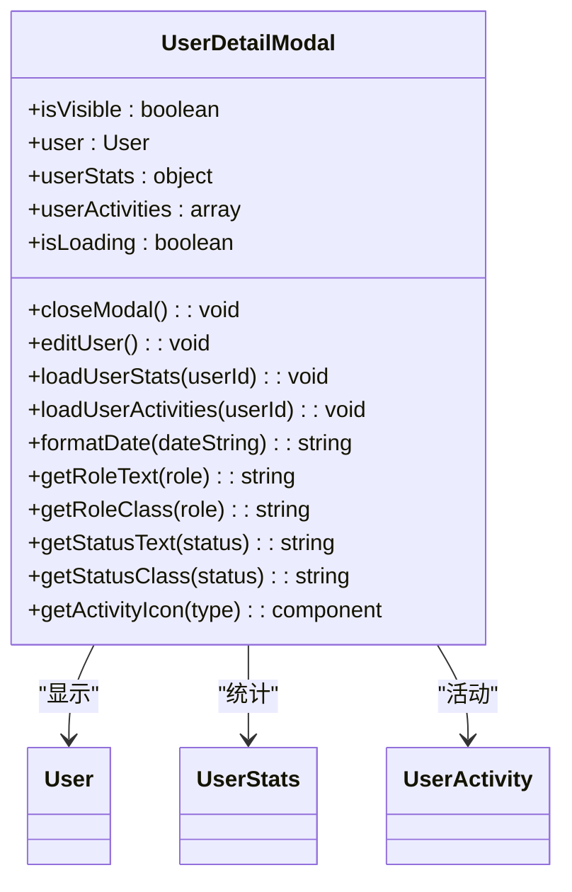

**组件源码**
- [UserDetailModal.vue](file://src/components/admin/UserDetailModal.vue#L1-L742)

**组件源码**
- [UserDetailModal.vue](file://src/components/admin/UserDetailModal.vue#L1-L742)

## 通用懒加载组件

分析src/components/common目录中通用懒加载组件的设计原理与性能优化策略。

### LazyComponent组件分析

LazyComponent组件实现了通用的懒加载功能，支持组件、占位符、加载状态和错误状态的管理。组件通过props接收componentLoader、componentProps等参数，使用useLazyComponent组合式函数实现懒加载逻辑。

组件通过ref创建containerRef，使用useLazyComponent的isVisible和shouldLoad判断是否应该加载组件。加载过程通过createAsyncComponent创建异步组件，loadComponent方法处理加载逻辑。

错误处理方面，支持错误重试功能，通过retry方法实现重试逻辑，maxRetries限制最大重试次数。组件通过emit发送loaded、error和visible事件，供父组件监听。

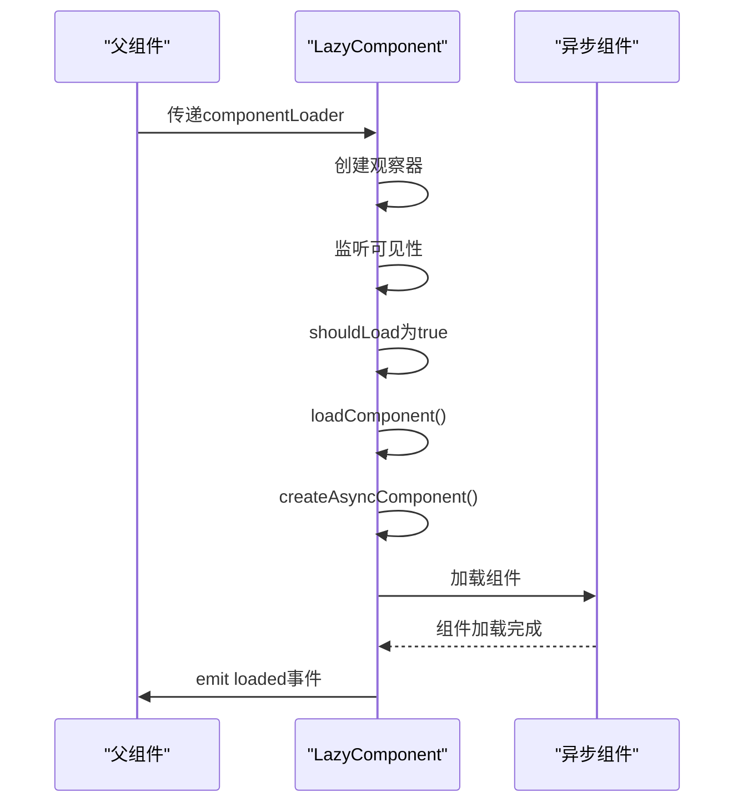

**组件源码**
- [LazyComponent.vue](file://src/components/common/LazyComponent.vue#L1-L269)

**组件源码**
- [LazyComponent.vue](file://src/components/common/LazyComponent.vue#L1-L269)

### LazyImage组件分析

LazyImage组件实现了图片的懒加载功能，支持占位符、错误处理和图片优化。组件通过props接收src、placeholder等参数，使用useLazyImage组合式函数实现懒加载逻辑。

图片优化方面，通过getOptimizedSrc方法根据质量参数和WebP支持情况优化图片URL。错误处理支持重试功能，通过retry方法实现，maxRetries限制最大重试次数。

组件通过setupIntersectionObserver设置交叉观察器，监听图片可见性。loadImage方法处理图片加载逻辑，handleLoad和handleError处理加载成功和失败事件。

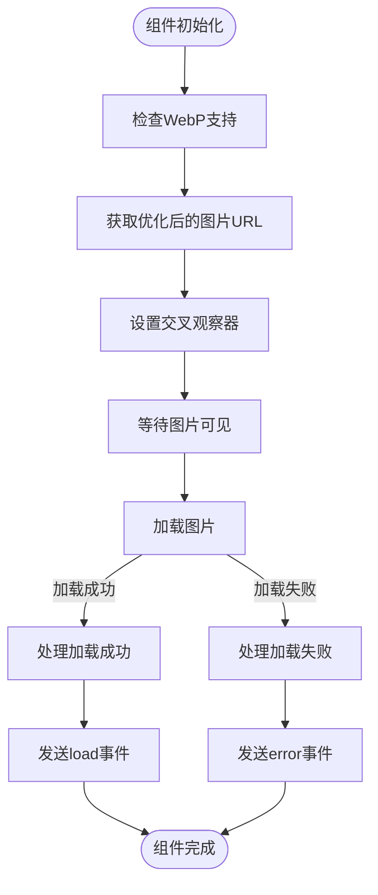

**组件源码**
- [LazyImage.vue](file://src/components/common/LazyImage.vue#L1-L325)

**组件源码**
- [LazyImage.vue](file://src/components/common/LazyImage.vue#L1-L325)

## 全局错误处理器

阐述src/components/error目录中全局错误处理器的异常捕获与降级处理方案。

### GlobalErrorHandler组件分析

GlobalErrorHandler组件实现了全局错误处理功能，通过teleport渲染到body元素，确保错误提示始终可见。组件通过ref管理errors数组和isOnline状态，使用addError方法添加错误，dismissError方法移除错误。

异常捕获方面，组件监听window的online、offline、error和unhandledrejection事件。handleOnline和handleOffline处理网络状态变化，handleUnhandledError处理未捕获的JavaScript错误，handleUnhandledRejection处理未处理的Promise拒绝。

错误展示通过transition-group实现动画效果，支持error、warning、info和success四种类型。每种类型有不同的样式和图标，通过actions支持自定义操作按钮。

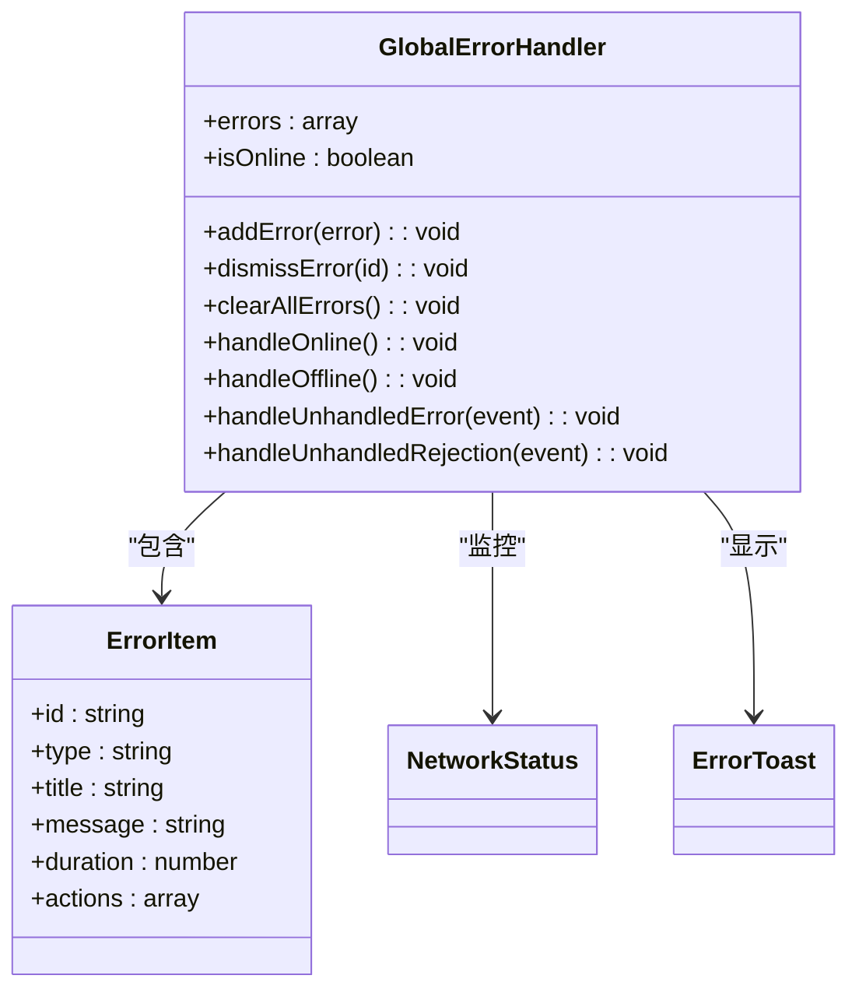

**组件源码**
- [GlobalErrorHandler.vue](file://src/components/error/GlobalErrorHandler.vue#L1-L337)

**组件源码**
- [GlobalErrorHandler.vue](file://src/components/error/GlobalErrorHandler.vue#L1-L337)

## 反馈组件

解析src/components/feedback目录中反馈组件的用户交互流程与状态管理集成方式。

### FeedbackWidget组件分析

FeedbackWidget组件实现了用户反馈功能，包含反馈按钮、反馈面板和反馈成功提示。组件通过ref管理showPanel、activeTab等状态，使用tabs定义标签页配置。

反馈提交通过submitFeedback方法实现，验证表单后调用API提交反馈。反馈历史通过loadFeedbackHistory方法加载，使用computed计算未读反馈数量。

状态管理方面，组件使用useAuthStore获取用户信息，确保只有登录用户才能提交反馈。通过emit发送事件，与父组件进行通信。

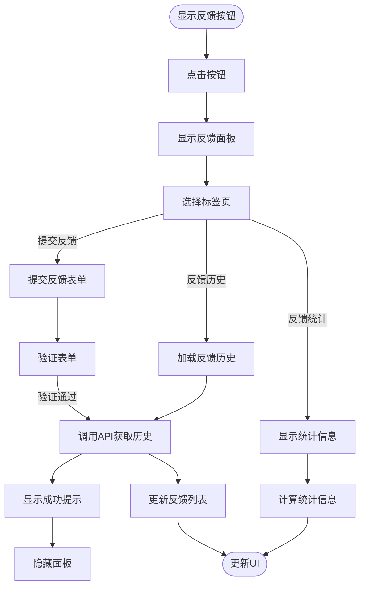

**组件源码**
- [FeedbackWidget.vue](file://src/components/feedback/FeedbackWidget.vue#L1-L890)

**组件源码**
- [FeedbackWidget.vue](file://src/components/feedback/FeedbackWidget.vue#L1-L890)

## 通知中心组件

描述src/components/notifications目录中通知中心、通知项与设置组件的实时通信模式。

### NotificationCenter组件分析

NotificationCenter组件实现了通知中心功能，包含通知按钮、通知面板和设置模态框。组件通过ref管理showPanel、loading等状态，使用computed计算过滤后的通知列表。

实时通信通过setupRealtimeSubscription方法实现，使用notificationService.subscribeToNotifications订阅实时通知。当收到新通知时，添加到列表顶部，并更新统计信息。

通知筛选通过filters和activeFilter实现，支持全部、未读、重要和按类型筛选。分页加载通过loadMore方法实现，hasMore判断是否还有更多通知。

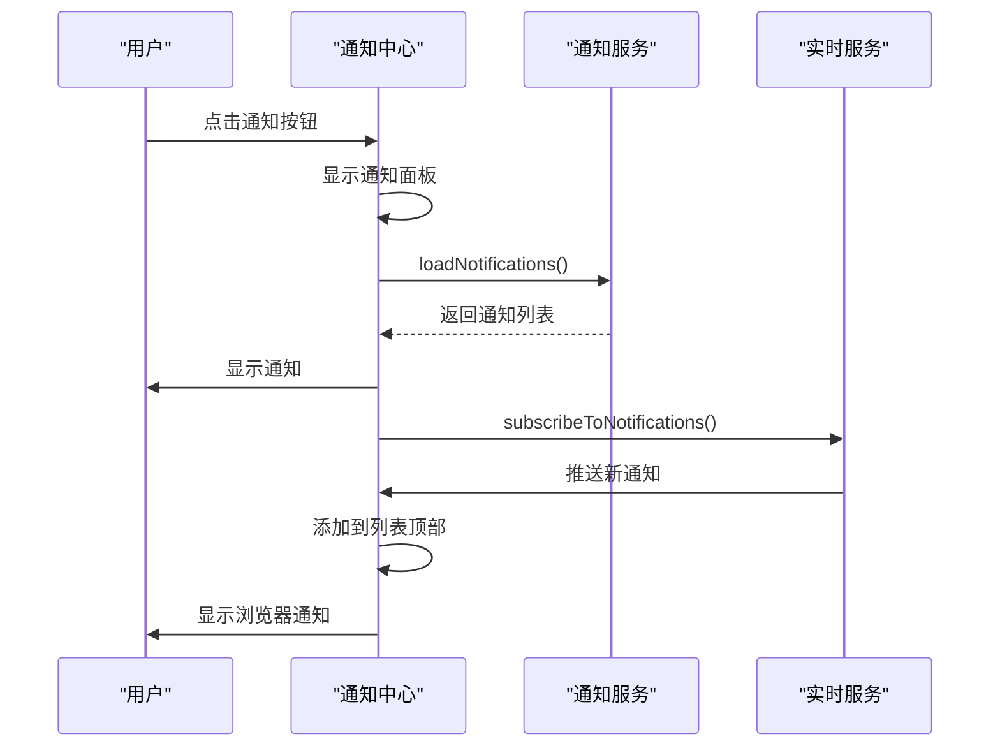

**组件源码**
- [NotificationCenter.vue](file://src/components/notifications/NotificationCenter.vue#L1-L716)

**组件源码**
- [NotificationCenter.vue](file://src/components/notifications/NotificationCenter.vue#L1-L716)

### NotificationItem组件分析

NotificationItem组件实现了单个通知项的显示，包含通知内容、操作按钮和未读指示器。组件通过props接收notification对象，使用getTypeIcon方法根据通知类型返回对应图标。

时间格式化通过formatTime方法实现，支持"刚刚"、"分钟前"、"小时前"等相对时间显示。通过emit发送read、delete和action事件，与父组件通信。

样式方面，使用CSS类控制未读、重要和不同类型通知的样式，通过:hover实现悬停效果，action-buttons在悬停时显示。

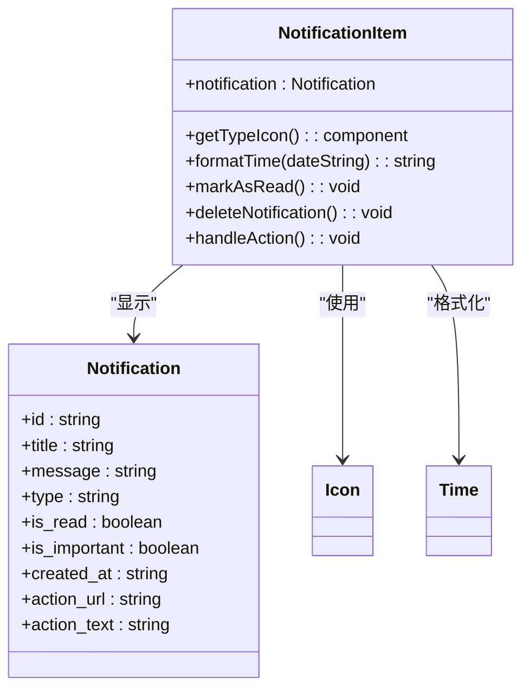

**组件源码**
- [NotificationItem.vue](file://src/components/notifications/NotificationItem.vue#L1-L364)

**组件源码**
- [NotificationItem.vue](file://src/components/notifications/NotificationItem.vue#L1-L364)

### NotificationSettings组件分析

NotificationSettings组件实现了通知设置功能，包含通知类型、频率和免打扰时间设置。组件通过ref管理preferences对象，使用frequencyOptions定义频率选项。

设置加载通过loadPreferences方法实现，从notificationService获取用户偏好。保存设置通过saveSettings方法实现，更新用户偏好并关闭模态框。

表单验证通过v-model双向绑定，使用disabled属性控制保存按钮状态，防止重复提交。

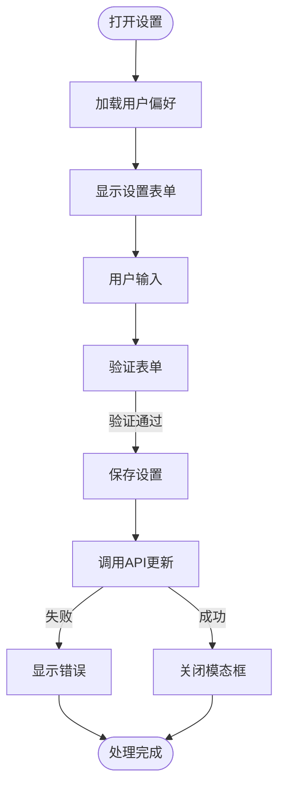

**组件源码**
- [NotificationSettings.vue](file://src/components/notifications/NotificationSettings.vue#L1-L581)

**组件源码**
- [NotificationSettings.vue](file://src/components/notifications/NotificationSettings.vue#L1-L581)

## 评价相关组件

说明src/components/reviews目录中评价相关组件的嵌套结构与事件传递机制。

### 评价组件体系分析

评价组件体系包含WriteReviewModal、ReviewItem、EditReviewModal、ReplyModal和ProductReviews等组件，形成完整的评价功能。

WriteReviewModal组件用于撰写评价，通过props接收产品信息，使用v-model双向绑定评价内容，通过emit发送submit事件提交评价。

ReviewItem组件显示单个评价，包含用户信息、评分、内容和操作按钮。支持回复和编辑功能，通过emit发送reply和edit事件。

EditReviewModal和ReplyModal组件分别用于编辑评价和回复评价，复用表单逻辑，通过props接收评价数据，通过emit发送更新事件。

ProductReviews组件作为容器组件，管理评价列表，处理分页加载，集成WriteReviewModal实现撰写评价功能。

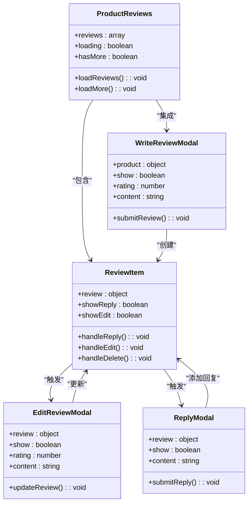

**组件源码**
- [WriteReviewModal.vue](file://src/components/reviews/WriteReviewModal.vue#L1-L200)
- [ReviewItem.vue](file://src/components/reviews/ReviewItem.vue#L1-L300)
- [EditReviewModal.vue](file://src/components/reviews/EditReviewModal.vue#L1-L250)
- [ReplyModal.vue](file://src/components/reviews/ReplyModal.vue#L1-L220)
- [ProductReviews.vue](file://src/components/reviews/ProductReviews.vue#L1-L400)

**组件源码**
- [WriteReviewModal.vue](file://src/components/reviews/WriteReviewModal.vue#L1-L200)
- [ReviewItem.vue](file://src/components/reviews/ReviewItem.vue#L1-L300)
- [EditReviewModal.vue](file://src/components/reviews/EditReviewModal.vue#L1-L250)
- [ReplyModal.vue](file://src/components/reviews/ReplyModal.vue#L1-L220)
- [ProductReviews.vue](file://src/components/reviews/ProductReviews.vue#L1-L400)

## 搜索组件

介绍src/components/search目录中高级搜索面板与增强搜索框的交互设计与查询参数构建逻辑。

### 搜索组件分析

搜索组件包含AdvancedSearchPanel和EnhancedSearchBox两个组件，提供完整的搜索功能。

AdvancedSearchPanel组件实现高级搜索功能，包含多个搜索条件，如分类、价格范围、评分等。通过props接收搜索条件，使用v-model双向绑定，通过emit发送search事件提交搜索。

EnhancedSearchBox组件实现增强搜索框，包含搜索输入、搜索按钮和搜索建议。通过props接收placeholder等参数，使用v-model双向绑定搜索关键词，通过emit发送search事件。

查询参数构建通过searchService实现，将搜索条件转换为API查询参数。支持模糊搜索、精确搜索和组合搜索，通过debounce优化搜索性能。

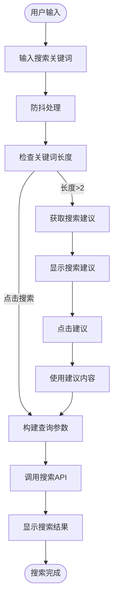

**组件源码**
- [AdvancedSearchPanel.vue](file://src/components/search/AdvancedSearchPanel.vue#L1-L350)
- [EnhancedSearchBox.vue](file://src/components/search/EnhancedSearchBox.vue#L1-L300)

**组件源码**
- [AdvancedSearchPanel.vue](file://src/components/search/AdvancedSearchPanel.vue#L1-L350)
- [EnhancedSearchBox.vue](file://src/components/search/EnhancedSearchBox.vue#L1-L300)

## 主题选择器组件

分析src/components/theme目录中主题选择器的样式切换实现与composables集成方式。

### 主题选择器分析

主题选择器包含ThemeSelector和SimpleThemeSelector两个组件，提供主题切换功能。

ThemeSelector组件实现完整主题选择器，包含主题预览、主题名称和选择按钮。通过props接收themes数组，使用v-model双向绑定当前主题，通过emit发送update:modelValue事件。

SimpleThemeSelector组件实现简化版主题选择器，仅包含主题切换按钮。通过useSimpleTheme组合式函数管理主题状态，支持暗色主题切换。

样式切换通过CSS变量实现，定义--color-primary、--color-background等变量，在根元素上应用不同主题的CSS类。composables集成通过useSimpleTheme提供主题切换功能。

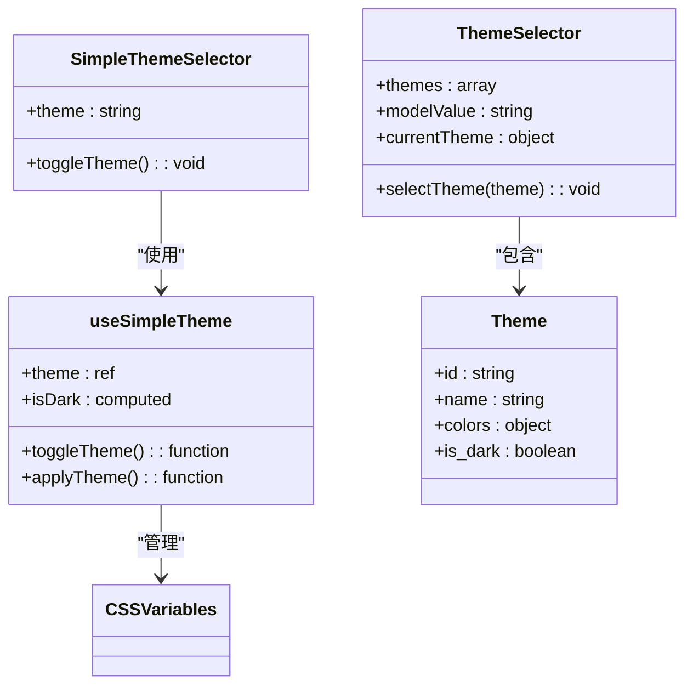

**组件源码**
- [ThemeSelector.vue](file://src/components/theme/ThemeSelector.vue#L1-L280)
- [SimpleThemeSelector.vue](file://src/components/theme/SimpleThemeSelector.vue#L1-L200)

**组件源码**
- [ThemeSelector.vue](file://src/components/theme/ThemeSelector.vue#L1-L280)
- [SimpleThemeSelector.vue](file://src/components/theme/SimpleThemeSelector.vue#L1-L200)

## 基础UI控件

阐述src/components/ui目录中StarRating等基础UI控件的可复用性设计。

### StarRating组件分析

StarRating组件实现了星级评分控件，具有高度可复用性。组件通过props接收value、max、readonly等参数，使用v-model双向绑定评分值。

实现原理使用flex布局排列星星，通过v-for生成星星元素。每个星星根据索引和当前值判断是否填充，支持半星显示。通过计算属性和样式控制星星外观。

交互方面，支持鼠标悬停效果和点击选择，readonly属性控制是否可编辑。通过emit发送update:modelValue事件，实现v-model绑定。

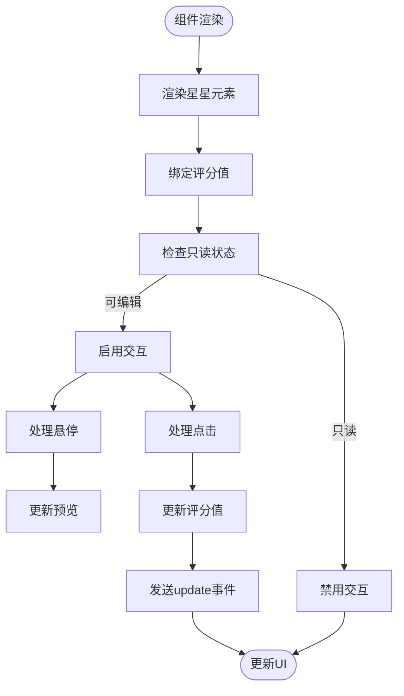

**组件源码**
- [StarRating.vue](file://src/components/ui/StarRating.vue#L1-L220)

**组件源码**
- [StarRating.vue](file://src/components/ui/StarRating.vue#L1-L220)