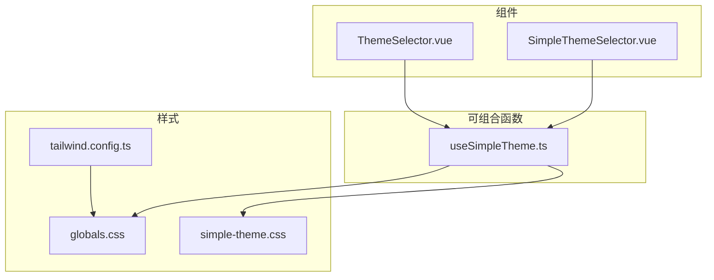
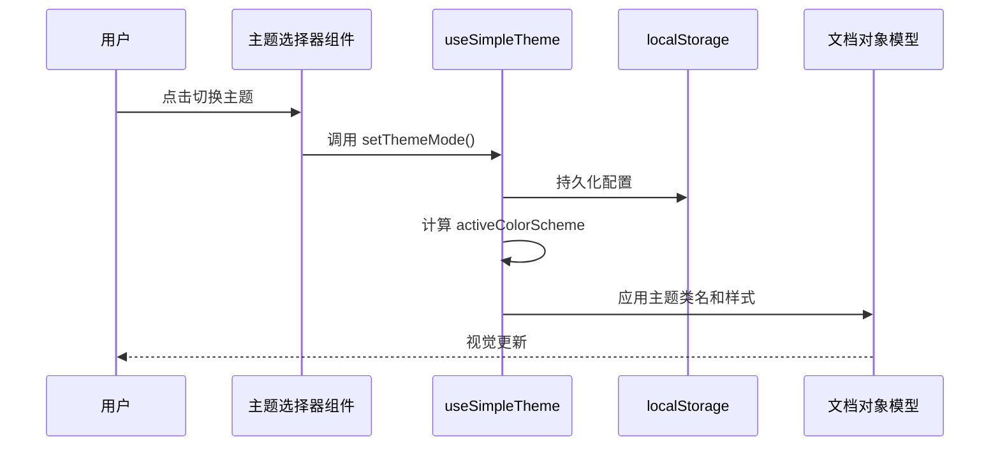
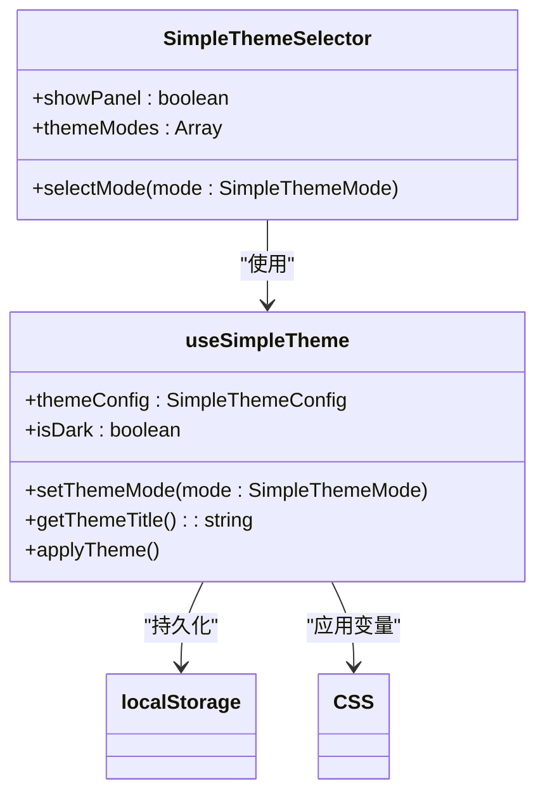
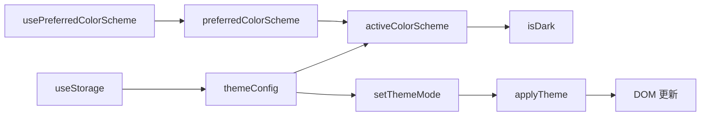
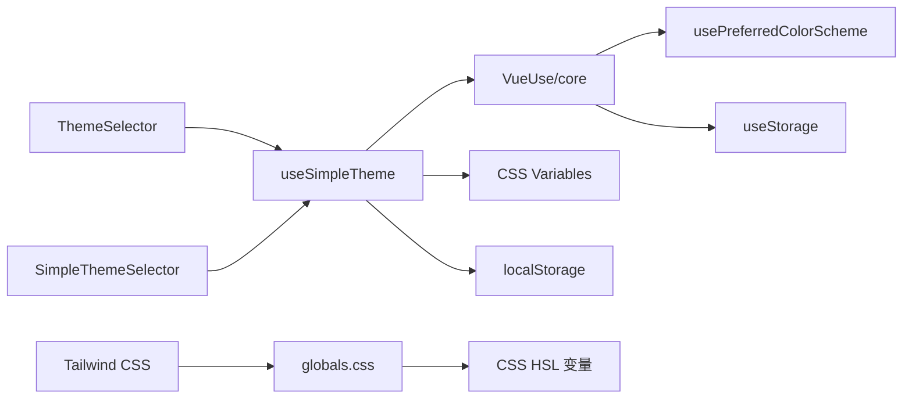

# 主题组件

<cite>
**本文档中引用的文件**  
- [ThemeSelector.vue](file://src/components/theme/ThemeSelector.vue)
- [SimpleThemeSelector.vue](file://src/components/theme/SimpleThemeSelector.vue)
- [useSimpleTheme.ts](file://src/composables/useSimpleTheme.ts)
- [globals.css](file://src/styles/globals.css)
- [simple-theme.css](file://src/styles/simple-theme.css)
- [tailwind.config.ts](file://config/build/tailwind.config.ts)
- [postcss.config.mjs](file://config/build/postcss.config.mjs)
- [style.css](file://src/style.css)
</cite>

## 目录
1. [简介](#简介)
2. [项目结构](#项目结构)
3. [核心组件](#核心组件)
4. [架构概述](#架构概述)
5. [详细组件分析](#详细组件分析)
6. [依赖分析](#依赖分析)
7. [性能考虑](#性能考虑)
8. [故障排除指南](#故障排除指南)
9. [结论](#结论)

## 简介
本文档全面阐述了主题选择器的样式切换机制与可访问性设计。重点解析 `ThemeSelector` 和 `SimpleThemeSelector` 组件如何通过 CSS 变量动态切换深色/浅色模式，并将用户偏好持久化至 `localStorage`；说明其与 `useSimpleTheme` 可组合函数的响应式数据绑定机制，包括主题状态监听与广播；提供自定义主题扩展的配置方法及与 Tailwind CSS JIT 模式的兼容性处理方案。同时涵盖无障碍支持、动画过渡效果和第三方库冲突排查。

## 项目结构
主题系统由组件、可组合函数和样式文件三部分构成，采用模块化设计，便于维护和扩展。



**Diagram sources**
- [ThemeSelector.vue](file://src/components/theme/ThemeSelector.vue)
- [SimpleThemeSelector.vue](file://src/components/theme/SimpleThemeSelector.vue)
- [useSimpleTheme.ts](file://src/composables/useSimpleTheme.ts)
- [globals.css](file://src/styles/globals.css)
- [simple-theme.css](file://src/styles/simple-theme.css)
- [tailwind.config.ts](file://config/build/tailwind.config.ts)

**Section sources**
- [src/components/theme](file://src/components/theme)
- [src/composables](file://src/composables)
- [src/styles](file://src/styles)

## 核心组件
主题系统包含两个核心 UI 组件：`ThemeSelector` 和 `SimpleThemeSelector`，分别用于桌面端和移动端的适配。两者均通过 `useSimpleTheme` 可组合函数实现响应式主题状态管理。

**Section sources**
- [ThemeSelector.vue](file://src/components/theme/ThemeSelector.vue)
- [SimpleThemeSelector.vue](file://src/components/theme/SimpleThemeSelector.vue)
- [useSimpleTheme.ts](file://src/composables/useSimpleTheme.ts)

## 架构概述
主题系统采用“可组合函数 + 组件 + CSS 变量”的三层架构，实现主题状态的集中管理与高效更新。



**Diagram sources**
- [useSimpleTheme.ts](file://src/composables/useSimpleTheme.ts)
- [ThemeSelector.vue](file://src/components/theme/ThemeSelector.vue)

## 详细组件分析

### ThemeSelector 分析
`ThemeSelector` 是功能完整的主题选择器，支持多种主题模式和高级设置。

#### 组件交互流程
```mermaid
flowchart TD
A[用户点击按钮] --> B{面板是否显示?}
B --> |否| C[显示主题面板]
B --> |是| D[关闭面板]
C --> E[用户选择模式]
E --> F[调用 setThemeMode()]
F --> G[更新 localStorage]
G --> H[触发 DOM 更新]
H --> I[应用新主题]
```

**Diagram sources**
- [ThemeSelector.vue](file://src/components/theme/ThemeSelector.vue#L1-L485)
- [useSimpleTheme.ts](file://src/composables/useSimpleTheme.ts#L1-L110)

**Section sources**
- [ThemeSelector.vue](file://src/components/theme/ThemeSelector.vue)

### SimpleThemeSelector 分析
`SimpleThemeSelector` 是为移动端优化的简化版本，具有更小的体积和更简洁的 UI。

#### 移动端适配策略


**Diagram sources**
- [SimpleThemeSelector.vue](file://src/components/theme/SimpleThemeSelector.vue#L1-L302)
- [useSimpleTheme.ts](file://src/composables/useSimpleTheme.ts#L1-L110)

**Section sources**
- [SimpleThemeSelector.vue](file://src/components/theme/SimpleThemeSelector.vue)

### useSimpleTheme 可组合函数分析
`useSimpleTheme` 是主题系统的核心逻辑层，负责状态管理、持久化和 DOM 更新。

#### 响应式数据绑定机制


**Diagram sources**
- [useSimpleTheme.ts](file://src/composables/useSimpleTheme.ts#L1-L110)

**Section sources**
- [useSimpleTheme.ts](file://src/composables/useSimpleTheme.ts)

## 依赖分析
主题系统依赖 VueUse 库的核心功能，并与 Tailwind CSS 紧密集成。



**Diagram sources**
- [useSimpleTheme.ts](file://src/composables/useSimpleTheme.ts)
- [tailwind.config.ts](file://config/build/tailwind.config.ts)
- [globals.css](file://src/styles/globals.css)

**Section sources**
- [useSimpleTheme.ts](file://src/composables/useSimpleTheme.ts)
- [tailwind.config.ts](file://config/build/tailwind.config.ts)

## 性能考虑
主题切换采用 CSS 变量和类名切换，避免了频繁的 DOM 操作，确保了流畅的用户体验。`useStorage` 提供了高效的本地存储访问，`watch` 监听器使用 `deep: true` 确保配置变化能及时响应。

## 故障排除指南

### 自定义主题扩展
要添加新的主题模式（如“暗黑红”），需执行以下步骤：
1. 在 `useSimpleTheme.ts` 中扩展 `SimpleThemeMode` 类型
2. 在 `themeModes` 数组中添加新模式配置
3. 在 CSS 文件中定义对应的变量集
4. 更新 `applyTheme` 函数以处理新模式

### Tailwind CSS JIT 兼容性
为确保与 Tailwind JIT 模式兼容：
- 在 `tailwind.config.ts` 的 `content` 字段中正确配置源文件路径
- 使用 `@apply` 指令时避免动态类名
- 确保 `postcss.config.mjs` 正确引入 Tailwind 插件

### 第三方库冲突
若与其他主题库冲突：
1. 检查 CSS 变量命名空间是否冲突
2. 确保 `useSimpleTheme` 是唯一主题管理入口
3. 使用 `:global()` 作用域包装器隔离样式
4. 在 `main.ts` 中确保主题初始化顺序正确

**Section sources**
- [useSimpleTheme.ts](file://src/composables/useSimpleTheme.ts)
- [tailwind.config.ts](file://config/build/tailwind.config.ts)
- [postcss.config.mjs](file://config/build/postcss.config.mjs)

## 结论
主题组件通过 `useSimpleTheme` 可组合函数实现了高效的响应式主题管理，结合 CSS 变量和 `localStorage` 实现了持久化和无障碍支持。`ThemeSelector` 和 `SimpleThemeSelector` 分别满足了桌面端和移动端的使用需求，系统设计具有良好的扩展性和维护性。