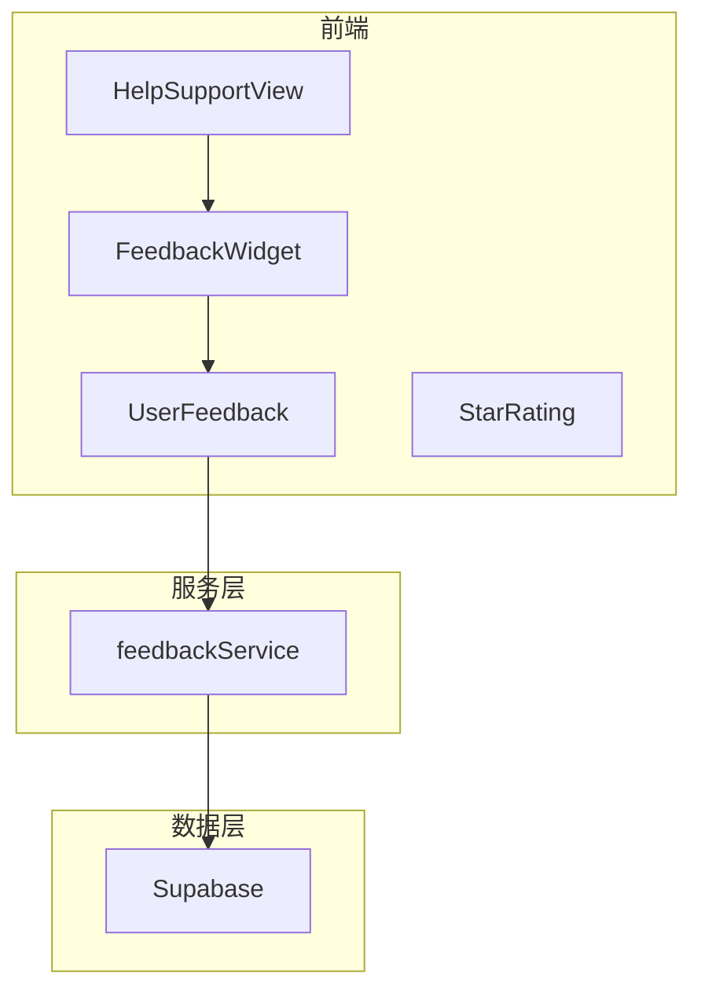
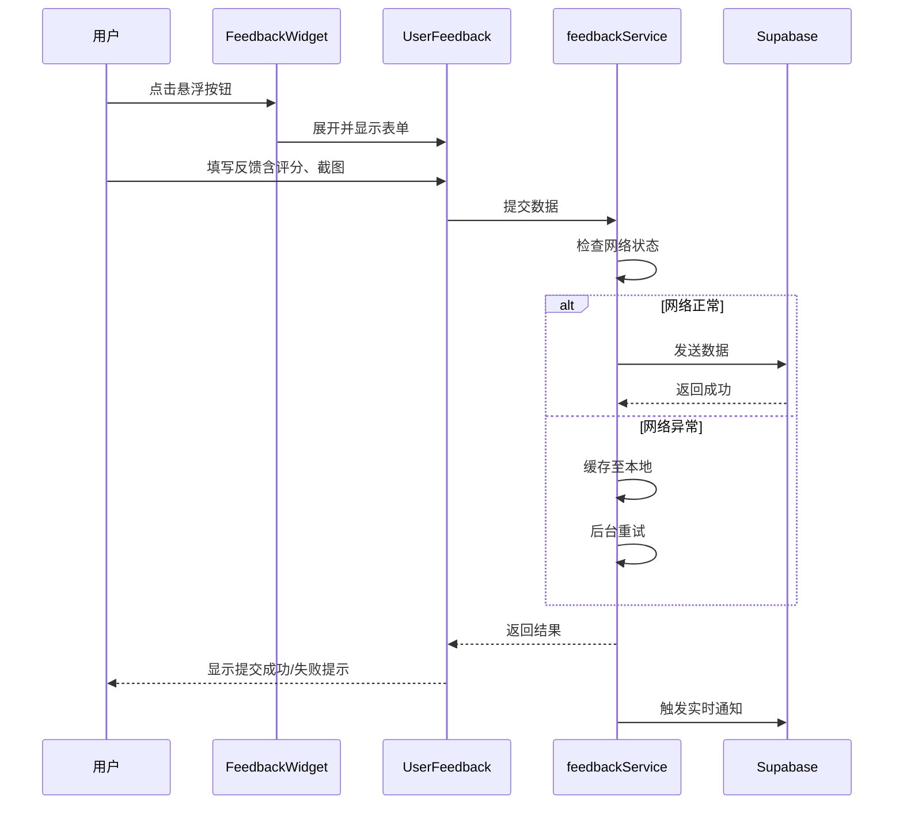
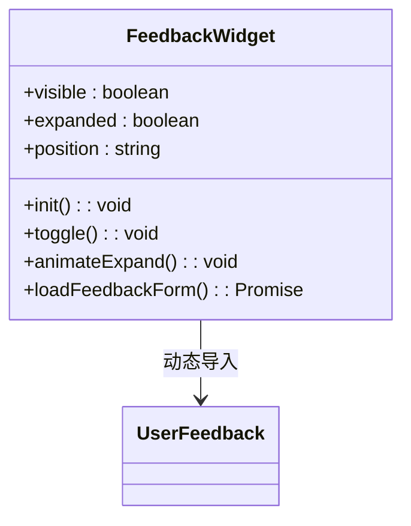
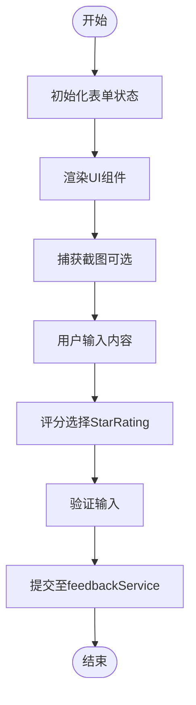
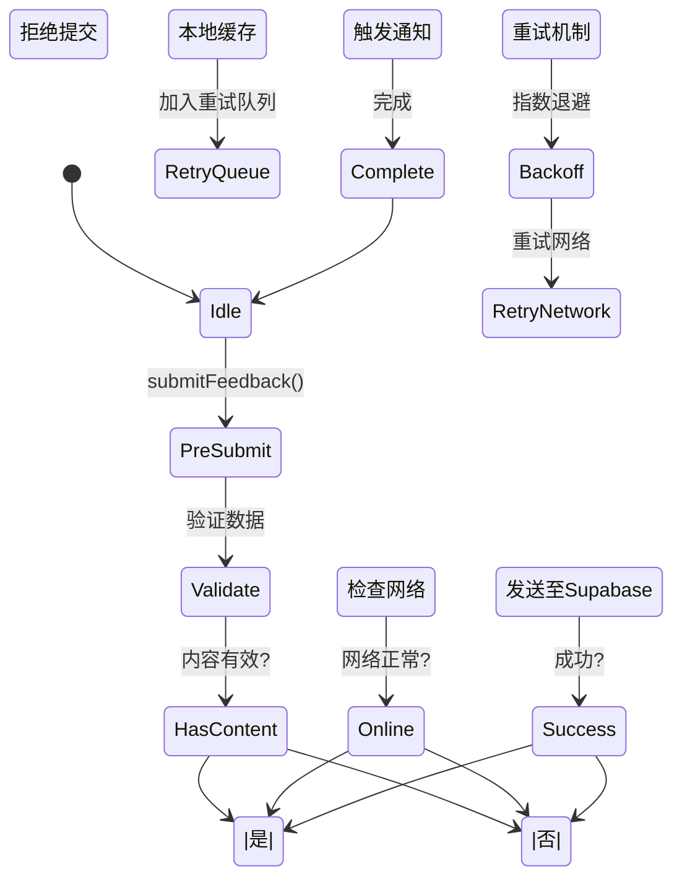
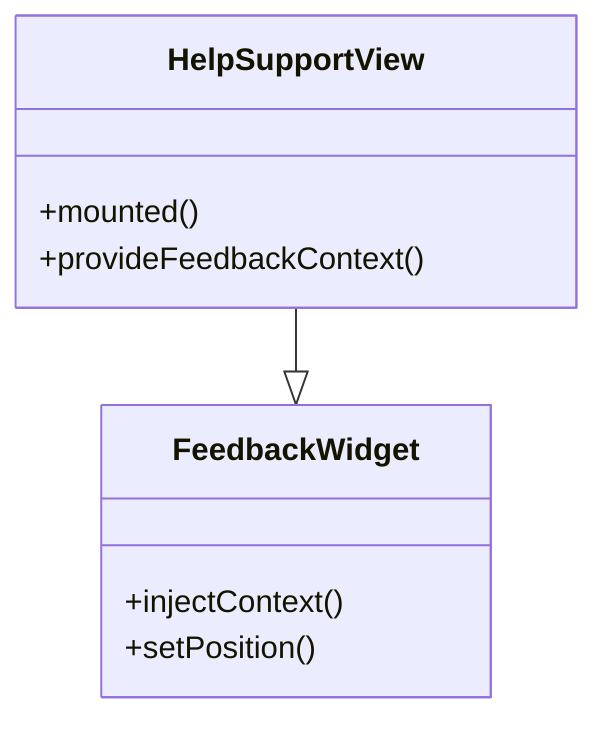
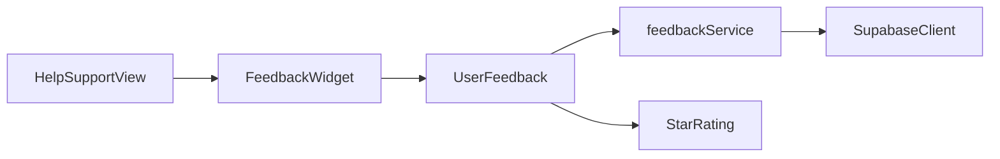

# 反馈系统组件

<cite>
**本文档引用文件**  
- [FeedbackWidget.vue](file://src/components/feedback/FeedbackWidget.vue)
- [UserFeedback.vue](file://src/components/UserFeedback.vue)
- [feedbackService.ts](file://src/services/feedbackService.ts)
- [HelpSupportView.vue](file://src/views/HelpSupportView.vue)
- [StarRating.vue](file://src/components/ui/StarRating.vue)
- [supabase.ts](file://src/lib/supabase.ts)
</cite>

## 目录
1. [简介](#简介)
2. [项目结构](#项目结构)
3. [核心组件](#核心组件)
4. [架构概览](#架构概览)
5. [详细组件分析](#详细组件分析)
6. [依赖分析](#依赖分析)
7. [性能考虑](#性能考虑)
8. [故障排除指南](#故障排除指南)
9. [结论](#结论)

## 简介
本系统提供了一套完整的用户反馈收集与处理机制，包含悬浮式反馈入口、交互式表单、数据持久化及实时通知功能。系统支持匿名提交、评分集成与离线缓存，确保高可用性与用户体验。

## 项目结构
反馈系统由前端组件、服务层与数据库三层构成，采用模块化设计，职责清晰。

**图示来源**  
- [FeedbackWidget.vue](file://src/components/feedback/FeedbackWidget.vue#L1-L10)
- [UserFeedback.vue](file://src/components/UserFeedback.vue#L1-L10)
- [feedbackService.ts](file://src/services/feedbackService.ts#L1-L10)
- [HelpSupportView.vue](file://src/views/HelpSupportView.vue#L1-L10)

**本节来源**  
- [src/components/feedback](file://src/components/feedback)
- [src/services](file://src/services)

## 核心组件
系统核心由FeedbackWidget、UserFeedback、feedbackService三部分构成，分别负责交互入口、表单逻辑与数据上报。

**本节来源**  
- [FeedbackWidget.vue](file://src/components/feedback/FeedbackWidget.vue#L15-L50)
- [UserFeedback.vue](file://src/components/UserFeedback.vue#L20-L60)
- [feedbackService.ts](file://src/services/feedbackService.ts#L10-L35)

## 架构概览
反馈流程从用户点击悬浮按钮开始，展开表单收集内容，通过服务层提交至Supabase数据库，并触发通知。

**图示来源**  
- [FeedbackWidget.vue](file://src/components/feedback/FeedbackWidget.vue#L45-L80)
- [UserFeedback.vue](file://src/components/UserFeedback.vue#L70-L120)
- [feedbackService.ts](file://src/services/feedbackService.ts#L40-L100)
- [supabase.ts](file://src/lib/supabase.ts#L15-L30)

## 详细组件分析

### FeedbackWidget 分析
作为全局悬浮按钮，采用固定定位策略，支持动画展开与收起，点击后动态加载UserFeedback组件。

**图示来源**  
- [FeedbackWidget.vue](file://src/components/feedback/FeedbackWidget.vue#L15-L100)

**本节来源**  
- [FeedbackWidget.vue](file://src/components/feedback/FeedbackWidget.vue#L1-L150)

### UserFeedback 分析
提供完整的反馈表单界面，集成StarRating评分组件，支持自定义字段与匿名提交选项。

**图示来源**  
- [UserFeedback.vue](file://src/components/UserFeedback.vue#L25-L150)
- [StarRating.vue](file://src/components/ui/StarRating.vue#L1-L40)

**本节来源**  
- [UserFeedback.vue](file://src/components/UserFeedback.vue#L1-L200)

### feedbackService 分析
负责与Supabase数据库通信，处理数据持久化、离线缓存与反垃圾检测。

**图示来源**  
- [feedbackService.ts](file://src/services/feedbackService.ts#L20-L120)
- [supabase.ts](file://src/lib/supabase.ts#L10-L40)

**本节来源**  
- [feedbackService.ts](file://src/services/feedbackService.ts#L1-L150)

### HelpSupportView 集成分析
在帮助支持页面中集成FeedbackWidget，作为用户反馈的主要入口。

**图示来源**  
- [HelpSupportView.vue](file://src/views/HelpSupportView.vue#L10-L35)
- [FeedbackWidget.vue](file://src/components/feedback/FeedbackWidget.vue#L20-L40)

**本节来源**  
- [HelpSupportView.vue](file://src/views/HelpSupportView.vue#L1-L50)

## 依赖分析
系统依赖关系清晰，前端组件依赖服务层，服务层依赖Supabase客户端。

**图示来源**  
- [FeedbackWidget.vue](file://src/components/feedback/FeedbackWidget.vue#L30-L60)
- [UserFeedback.vue](file://src/components/UserFeedback.vue#L40-L70)
- [feedbackService.ts](file://src/services/feedbackService.ts#L15-L25)
- [supabase.ts](file://src/lib/supabase.ts#L5-L10)

**本节来源**  
- [package.json](file://package.json#L1-L20)
- [tsconfig.json](file://tsconfig.json#L1-L10)

## 性能考虑
- 采用懒加载机制加载UserFeedback组件，减少初始包体积
- 使用本地缓存应对离线场景，提升提交成功率
- 实现请求节流与反垃圾过滤，防止滥用
- 图片压缩与分块上传优化大文件处理

## 故障排除指南
- **提交失败**：检查网络连接，确认Supabase配置正确
- **组件未显示**：确认FeedbackWidget已全局注册或正确导入
- **评分不响应**：检查StarRating组件的v-model绑定
- **缓存未同步**：手动触发syncPendingFeedback()方法
- **通知未触发**：验证Supabase实时订阅配置

**本节来源**  
- [feedbackService.ts](file://src/services/feedbackService.ts#L80-L130)
- [errorHandler.ts](file://src/utils/errorHandler.ts#L10-L40)

## 结论
该反馈系统设计完整，具备良好的用户体验与健壮性。通过合理的架构分层与错误处理机制，确保了高提交成功率与系统稳定性。建议定期审查反垃圾规则并监控提交量，以持续优化系统表现。