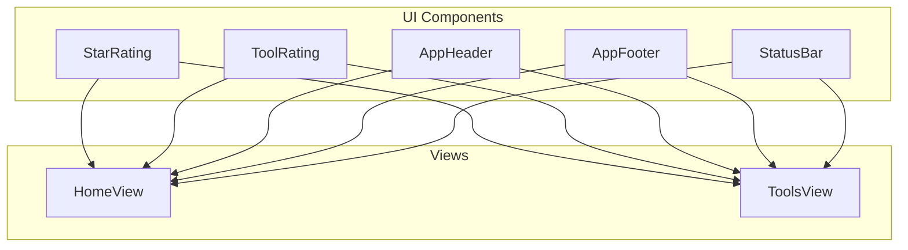
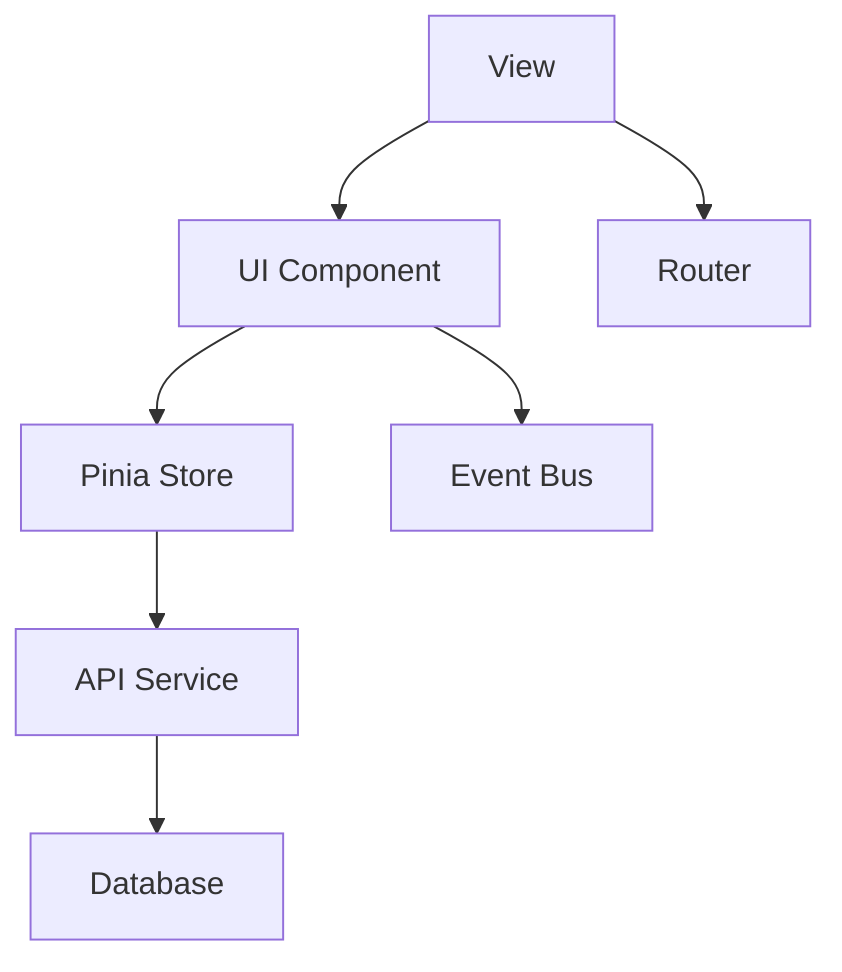
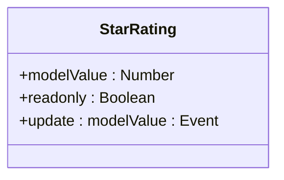
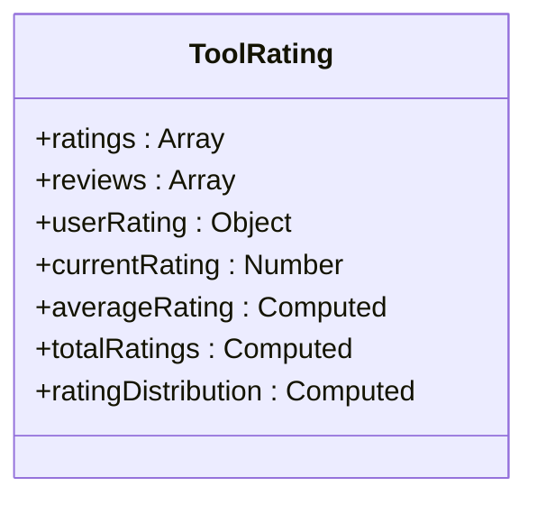
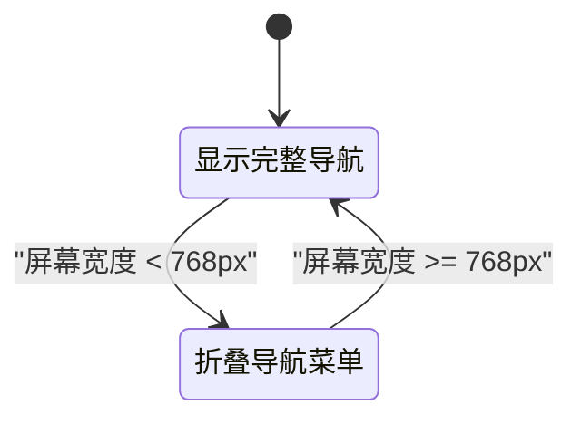
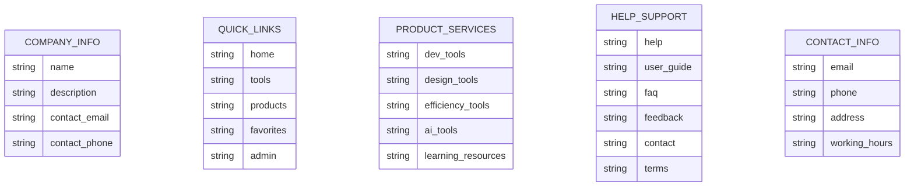
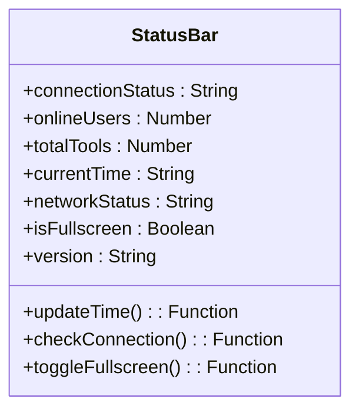
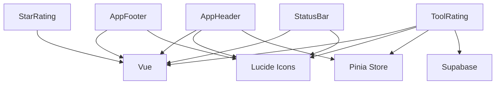

# 基础UI控件

<cite>
**本文档引用文件**  
- [StarRating.vue](file://src/components/ui/StarRating.vue)
- [ToolRating.vue](file://src/components/ToolRating.vue)
- [AppHeader.vue](file://src/components/AppHeader.vue)
- [AppFooter.vue](file://src/components/AppFooter.vue)
- [StatusBar.vue](file://src/components/StatusBar.vue)
- [HomeView.vue](file://src/views/HomeView.vue)
- [ToolsView.vue](file://src/views/ToolsView.vue)
</cite>

## 目录
1. [简介](#简介)
2. [项目结构](#项目结构)
3. [核心组件](#核心组件)
4. [架构概览](#架构概览)
5. [详细组件分析](#详细组件分析)
6. [依赖分析](#依赖分析)
7. [性能考虑](#性能考虑)
8. [故障排除指南](#故障排除指南)
9. [结论](#结论)

## 简介
本文档详细说明了系统中基础UI控件的设计规范与复用模式。重点解析StarRating作为可复用评分控件的半星支持、只读模式与aria属性实现；分析ToolRating在工具卡片中的紧凑布局与交互反馈；阐述AppHeader的导航菜单响应式折叠逻辑与用户状态显示；说明AppFooter的版权信息、链接布局与SEO优化；描述StatusBar在页面顶部展示加载状态、操作结果的成功/错误提示机制。提供各控件的props接口（size、variant、disabled等）、事件回调（onChange）和样式定制（CSS自定义属性）方法，并包含在多个视图（如HomeView、ToolsView）中的一致性应用示例。

## 项目结构
系统采用模块化组件设计，基础UI控件集中存放在`src/components`目录下，按功能分类组织。核心UI组件包括评分控件（StarRating、ToolRating）、导航控件（AppHeader）、页脚控件（AppFooter）和状态栏控件（StatusBar），这些组件在多个视图中被复用，确保了界面的一致性和可维护性。

**Diagram sources**
- [StarRating.vue](file://src/components/ui/StarRating.vue)
- [ToolRating.vue](file://src/components/ToolRating.vue)
- [AppHeader.vue](file://src/components/AppHeader.vue)
- [AppFooter.vue](file://src/components/AppFooter.vue)
- [StatusBar.vue](file://src/components/StatusBar.vue)
- [HomeView.vue](file://src/views/HomeView.vue)
- [ToolsView.vue](file://src/views/ToolsView.vue)

**Section sources**
- [src/components](file://src/components)
- [src/views](file://src/views)

## 核心组件
系统中的基础UI控件遵循统一的设计语言和交互规范，通过组件化实现高度复用。StarRating提供基础评分功能，ToolRating扩展为完整的评价系统，AppHeader和AppFooter构成页面骨架，StatusBar提供全局状态反馈。这些组件通过props接口、事件回调和CSS自定义属性实现灵活配置，满足不同场景的需求。

**Section sources**
- [StarRating.vue](file://src/components/ui/StarRating.vue)
- [ToolRating.vue](file://src/components/ToolRating.vue)
- [AppHeader.vue](file://src/components/AppHeader.vue)
- [AppFooter.vue](file://src/components/AppFooter.vue)
- [StatusBar.vue](file://src/components/StatusBar.vue)

## 架构概览
系统采用Vue 3组合式API架构，基础UI控件作为独立组件封装，通过props接收配置，通过emit触发事件，与父组件进行通信。组件间通过Pinia store进行状态管理，实现数据共享。整体架构清晰，组件职责分明，便于维护和扩展。

**Diagram sources**
- [AppHeader.vue](file://src/components/AppHeader.vue)
- [AppFooter.vue](file://src/components/AppFooter.vue)
- [StatusBar.vue](file://src/components/StatusBar.vue)

## 详细组件分析

### StarRating分析
StarRating组件作为可复用的评分控件，实现了半星支持、只读模式和aria属性，提供了一致的评分体验。

#### 组件接口
StarRating组件通过props接收外部配置，支持`modelValue`绑定评分值，`readonly`控制是否可交互。

**Diagram sources**
- [StarRating.vue](file://src/components/ui/StarRating.vue#L1-L54)

#### 交互逻辑
组件通过v-for循环渲染5个星形符号，根据`modelValue`值决定填充状态。点击事件触发`updateRating`方法，更新评分值。

**Section sources**
- [StarRating.vue](file://src/components/ui/StarRating.vue#L1-L54)

### ToolRating分析
ToolRating组件在工具卡片中实现紧凑布局与交互反馈，提供完整的评价功能。

#### 数据结构
组件维护评分数据、用户评价和交互状态，通过computed属性计算平均评分和评分分布。

**Diagram sources**
- [ToolRating.vue](file://src/components/ToolRating.vue#L112-L167)

#### 提交流程
用户提交评价时，组件根据是否存在`userRating`决定是创建新评分还是更新现有评分，并通过Supabase API与后端交互。

**Section sources**
- [ToolRating.vue](file://src/components/ToolRating.vue#L212-L269)

### AppHeader分析
AppHeader组件实现导航菜单响应式折叠逻辑与用户状态显示，提供一致的导航体验。

#### 响应式设计
组件通过CSS媒体查询实现响应式布局，在小屏幕上自动折叠导航链接，优化移动设备体验。

**Diagram sources**
- [AppHeader.vue](file://src/components/AppHeader.vue#L550-L580)

#### 用户状态
组件根据`authStore.isAuthenticated`状态显示用户头像菜单或登录按钮，实现用户状态的动态显示。

**Section sources**
- [AppHeader.vue](file://src/components/AppHeader.vue#L112-L167)

### AppFooter分析
AppFooter组件提供版权信息、链接布局与SEO优化，构成页面的底部信息区域。

#### 信息架构
组件采用网格布局，将公司信息、快速链接、产品服务、帮助支持和联系信息合理组织，提升信息可访问性。

**Diagram sources**
- [AppFooter.vue](file://src/components/AppFooter.vue#L1-L435)

#### SEO优化
组件包含结构化的联系信息和站点地图链接，有助于搜索引擎索引和排名。

**Section sources**
- [AppFooter.vue](file://src/components/AppFooter.vue#L1-L435)

### StatusBar分析
StatusBar组件在页面顶部展示加载状态、操作结果的成功/错误提示机制，提供全局状态反馈。

#### 状态显示
组件显示数据库连接状态、在线用户数、工具总数、当前时间、网络状态和版本信息，提供系统运行状态的实时反馈。

**Diagram sources**
- [StatusBar.vue](file://src/components/StatusBar.vue#L1-L278)

#### 交互功能
组件提供全屏切换按钮，用户可点击切换全屏模式，提升使用体验。

**Section sources**
- [StatusBar.vue](file://src/components/StatusBar.vue#L1-L278)

## 依赖分析
基础UI控件依赖Vue 3框架和Lucide图标库，通过Pinia store与应用状态交互，通过Supabase API与后端服务通信。组件间依赖关系清晰，耦合度低，便于独立开发和测试。

**Diagram sources**
- [package.json](file://package.json)
- [StarRating.vue](file://src/components/ui/StarRating.vue)
- [ToolRating.vue](file://src/components/ToolRating.vue)
- [AppHeader.vue](file://src/components/AppHeader.vue)
- [AppFooter.vue](file://src/components/AppFooter.vue)
- [StatusBar.vue](file://src/components/StatusBar.vue)

**Section sources**
- [package.json](file://package.json)
- [src/components](file://src/components)

## 性能考虑
基础UI控件在设计时充分考虑了性能因素。StarRating和ToolRating组件通过computed属性缓存计算结果，避免重复计算。AppHeader和AppFooter组件采用响应式设计，优化不同设备的渲染性能。StatusBar组件使用定时器更新时间，避免不必要的重渲染。

## 故障排除指南
当基础UI控件出现问题时，可参考以下指南进行排查：
- 检查组件props是否正确传递
- 检查事件回调是否正确注册
- 检查CSS类名是否正确应用
- 检查依赖项是否正确安装
- 检查网络请求是否成功

**Section sources**
- [error](file://src/components/error)

## 结论
本文档详细解析了系统中基础UI控件的设计规范与复用模式。通过组件化设计，实现了界面元素的高度复用和一致性，提升了开发效率和用户体验。各组件接口清晰，职责分明，便于维护和扩展。建议在新功能开发中继续遵循此设计规范，确保系统整体风格的统一。