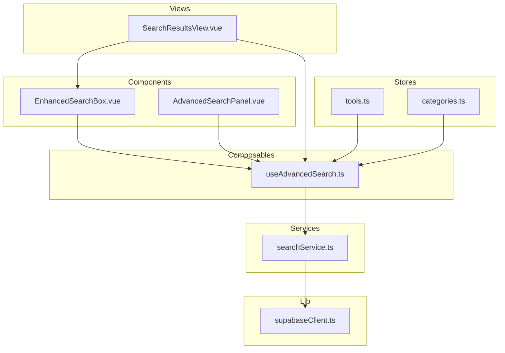
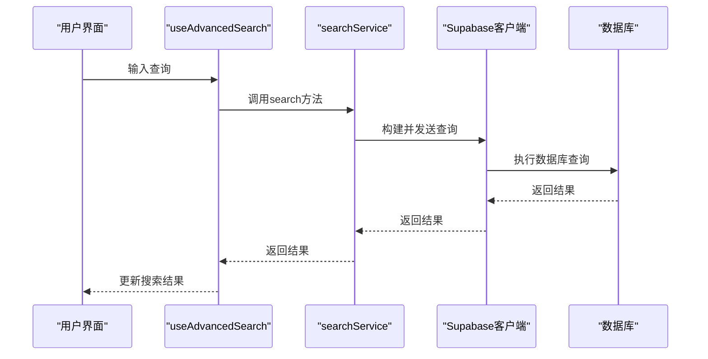
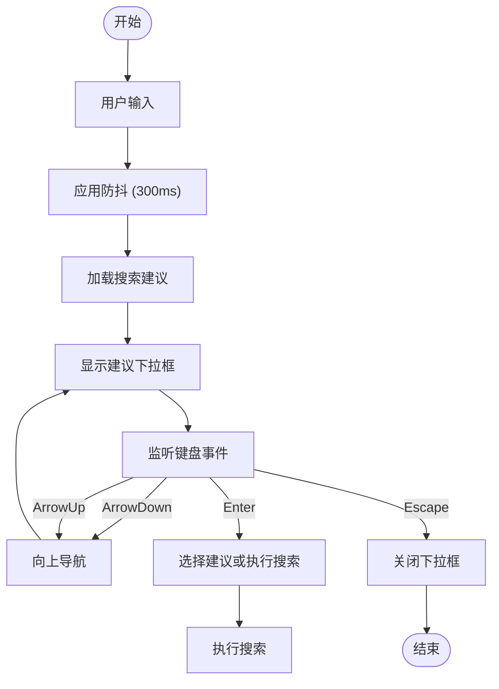
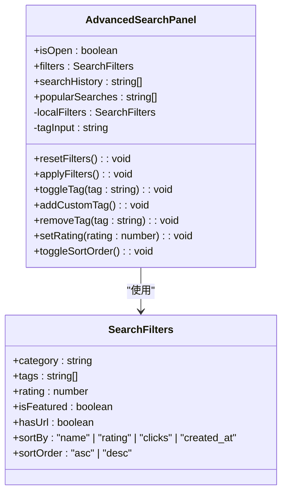
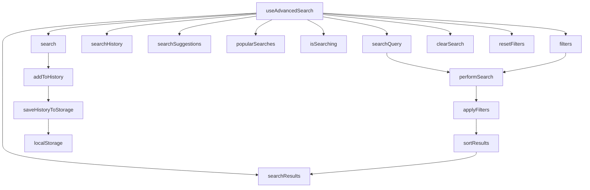
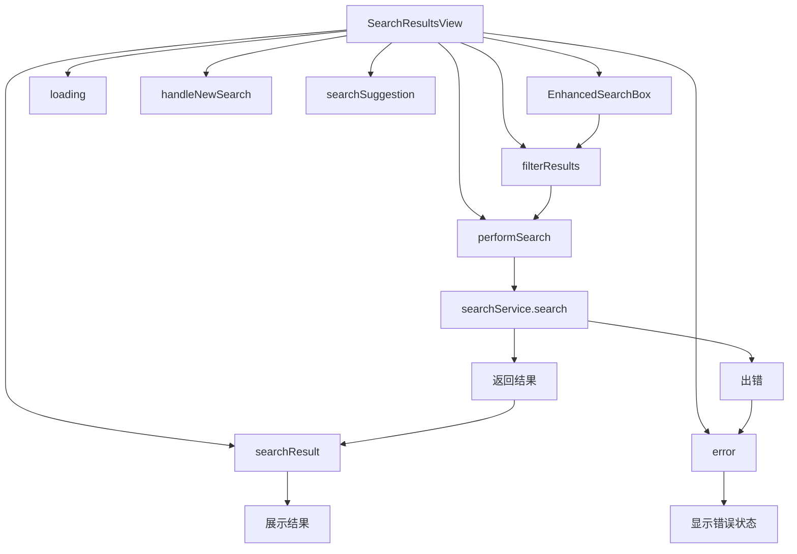
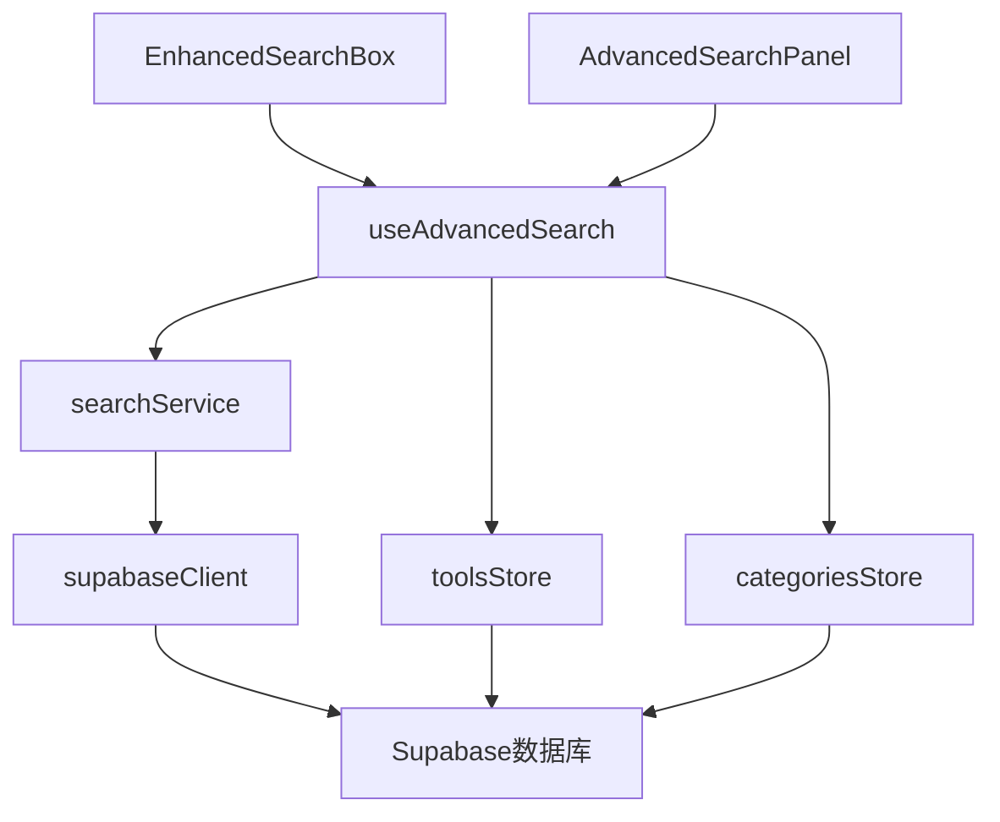

# 搜索组件

<cite>
**本文档中引用的文件**  
- [EnhancedSearchBox.vue](file://src/components/search/EnhancedSearchBox.vue)
- [AdvancedSearchPanel.vue](file://src/components/search/AdvancedSearchPanel.vue)
- [useAdvancedSearch.ts](file://src/composables/useAdvancedSearch.ts)
- [SearchResultsView.vue](file://src/views/SearchResultsView.vue)
- [searchService.ts](file://src/services/searchService.ts)
- [supabaseClient.ts](file://src/lib/supabaseClient.ts)
- [tools.ts](file://src/stores/tools.ts)
- [categories.ts](file://src/stores/categories.ts)
- [database.ts](file://src/types/database.ts)
- [databaseService.ts](file://src/services/databaseService.ts)
</cite>

## 目录
1. [简介](#简介)
2. [项目结构](#项目结构)
3. [核心组件](#核心组件)
4. [架构概述](#架构概述)
5. [详细组件分析](#详细组件分析)
6. [依赖分析](#依赖分析)
7. [性能考虑](#性能考虑)
8. [故障排除指南](#故障排除指南)
9. [结论](#结论)

## 简介
本文档深入解析高级搜索组件的查询构建逻辑与交互体验优化。重点说明 `EnhancedSearchBox` 如何实现输入防抖、搜索建议下拉与快捷键支持；分析 `AdvancedSearchPanel` 中多条件筛选（分类、评分、标签）的表单布局与查询参数序列化机制。阐述其与 `useAdvancedSearch` 可组合函数的协作模式，包括搜索历史存储、布尔查询构建和结果高亮显示。提供在 `SearchResultsView` 中的集成方式，以及与 Algolia/Supabase 全文检索的适配策略。包含性能监控指标（首屏时间、查询延迟）和错误降级方案（如搜索引擎不可用时的本地搜索回退）。

## 项目结构
项目结构清晰地组织了搜索相关组件、可组合函数、视图和服务。搜索功能的核心组件位于 `src/components/search` 目录下，包括 `EnhancedSearchBox.vue` 和 `AdvancedSearchPanel.vue`。可组合函数 `useAdvancedSearch.ts` 位于 `src/composables` 目录，负责管理搜索状态和逻辑。搜索结果视图 `SearchResultsView.vue` 位于 `src/views` 目录。搜索服务 `searchService.ts` 位于 `src/services` 目录，处理与 Supabase 数据库的交互。数据存储使用 Pinia，相关 store 位于 `src/stores` 目录。

**图源**
- [EnhancedSearchBox.vue](file://src/components/search/EnhancedSearchBox.vue)
- [AdvancedSearchPanel.vue](file://src/components/search/AdvancedSearchPanel.vue)
- [useAdvancedSearch.ts](file://src/composables/useAdvancedSearch.ts)
- [SearchResultsView.vue](file://src/views/SearchResultsView.vue)
- [searchService.ts](file://src/services/searchService.ts)
- [supabaseClient.ts](file://src/lib/supabaseClient.ts)
- [tools.ts](file://src/stores/tools.ts)
- [categories.ts](file://src/stores/categories.ts)

**节源**
- [EnhancedSearchBox.vue](file://src/components/search/EnhancedSearchBox.vue)
- [AdvancedSearchPanel.vue](file://src/components/search/AdvancedSearchPanel.vue)
- [useAdvancedSearch.ts](file://src/composables/useAdvancedSearch.ts)
- [SearchResultsView.vue](file://src/views/SearchResultsView.vue)
- [searchService.ts](file://src/services/searchService.ts)
- [supabaseClient.ts](file://src/lib/supabaseClient.ts)
- [tools.ts](file://src/stores/tools.ts)
- [categories.ts](file://src/stores/categories.ts)

## 核心组件
核心搜索组件包括 `EnhancedSearchBox` 和 `AdvancedSearchPanel`。`EnhancedSearchBox` 提供了基础的搜索输入功能，支持防抖、快捷键和搜索建议。`AdvancedSearchPanel` 则提供了更复杂的筛选选项，允许用户通过分类、标签、评分等条件进行精确搜索。这两个组件通过 `useAdvancedSearch` 可组合函数共享状态和逻辑，实现了功能的解耦和复用。

**节源**
- [EnhancedSearchBox.vue](file://src/components/search/EnhancedSearchBox.vue)
- [AdvancedSearchPanel.vue](file://src/components/search/AdvancedSearchPanel.vue)
- [useAdvancedSearch.ts](file://src/composables/useAdvancedSearch.ts)

## 架构概述
搜索功能的架构采用分层设计，从用户界面到数据服务层层分离。用户通过 `EnhancedSearchBox` 或 `AdvancedSearchPanel` 输入查询，这些组件调用 `useAdvancedSearch` 可组合函数来管理搜索状态。`useAdvancedSearch` 调用 `searchService` 进行实际的搜索操作，`searchService` 使用 Supabase 客户端与后端数据库进行交互。整个流程通过 Pinia store 管理全局状态，确保数据的一致性和可预测性。

**图源**
- [useAdvancedSearch.ts](file://src/composables/useAdvancedSearch.ts)
- [searchService.ts](file://src/services/searchService.ts)
- [supabaseClient.ts](file://src/lib/supabaseClient.ts)

## 详细组件分析
本节将深入分析各个搜索组件的实现细节，包括其功能、交互逻辑和与其他组件的协作方式。

### EnhancedSearchBox 分析
`EnhancedSearchBox` 组件实现了高级搜索输入框的所有功能。它支持输入防抖，避免在用户输入时频繁触发搜索请求。通过 `useDebounceFn` 函数，搜索建议的加载被延迟300毫秒，有效减少了不必要的网络请求。组件还实现了搜索建议下拉功能，根据用户输入动态显示相关的搜索建议、历史记录和热门搜索。快捷键支持包括方向键导航、回车键选择和ESC键关闭下拉框。

**图源**
- [EnhancedSearchBox.vue](file://src/components/search/EnhancedSearchBox.vue)

**节源**
- [EnhancedSearchBox.vue](file://src/components/search/EnhancedSearchBox.vue)

### AdvancedSearchPanel 分析
`AdvancedSearchPanel` 组件提供了复杂的多条件筛选功能。表单布局清晰地组织了分类、标签、评分和排序等筛选条件。用户可以通过下拉菜单选择分类，通过标签选择器添加或移除标签，通过星级评分选择最低评分，并通过排序选项选择排序方式。所有筛选条件被序列化为一个 `SearchFilters` 对象，通过 `update:filters` 事件传递给父组件。

**图源**
- [AdvancedSearchPanel.vue](file://src/components/search/AdvancedSearchPanel.vue)
- [useAdvancedSearch.ts](file://src/composables/useAdvancedSearch.ts)

**节源**
- [AdvancedSearchPanel.vue](file://src/components/search/AdvancedSearchPanel.vue)
- [useAdvancedSearch.ts](file://src/composables/useAdvancedSearch.ts)

### useAdvancedSearch 可组合函数分析
`useAdvancedSearch` 可组合函数是搜索功能的核心逻辑中心。它管理搜索查询、筛选条件、搜索历史等状态，并提供搜索、清除、重置等操作方法。该函数与 `EnhancedSearchBox` 和 `AdvancedSearchPanel` 协作，实现了搜索状态的集中管理。搜索历史通过 `localStorage` 持久化存储，确保用户刷新页面后仍能访问之前的搜索记录。

**图源**
- [useAdvancedSearch.ts](file://src/composables/useAdvancedSearch.ts)
- [searchService.ts](file://src/services/searchService.ts)

**节源**
- [useAdvancedSearch.ts](file://src/composables/useAdvancedSearch.ts)

### SearchResultsView 集成分析
`SearchResultsView` 是搜索功能的最终展示页面。它集成了 `EnhancedSearchBox` 组件，允许用户重新搜索。该视图通过 `searchService` 获取搜索结果，并根据结果类型（工具、产品、分类）进行分类展示。当搜索引擎不可用时，视图会显示错误状态，并提供重试按钮，实现了优雅的错误降级。

**图源**
- [SearchResultsView.vue](file://src/views/SearchResultsView.vue)
- [EnhancedSearchBox.vue](file://src/components/search/EnhancedSearchBox.vue)
- [searchService.ts](file://src/services/searchService.ts)

**节源**
- [SearchResultsView.vue](file://src/views/SearchResultsView.vue)

## 依赖分析
搜索组件依赖于多个核心服务和库。`EnhancedSearchBox` 和 `AdvancedSearchPanel` 依赖于 `useAdvancedSearch` 可组合函数来管理状态。`useAdvancedSearch` 依赖于 `searchService` 进行数据检索，`searchService` 又依赖于 `supabaseClient` 与后端数据库通信。此外，组件还依赖于 `toolsStore` 和 `categoriesStore` 来获取工具和分类数据。

**图源**
- [EnhancedSearchBox.vue](file://src/components/search/EnhancedSearchBox.vue)
- [AdvancedSearchPanel.vue](file://src/components/search/AdvancedSearchPanel.vue)
- [useAdvancedSearch.ts](file://src/composables/useAdvancedSearch.ts)
- [searchService.ts](file://src/services/searchService.ts)
- [supabaseClient.ts](file://src/lib/supabaseClient.ts)
- [tools.ts](file://src/stores/tools.ts)
- [categories.ts](file://src/stores/categories.ts)

**节源**
- [EnhancedSearchBox.vue](file://src/components/search/EnhancedSearchBox.vue)
- [AdvancedSearchPanel.vue](file://src/components/search/AdvancedSearchPanel.vue)
- [useAdvancedSearch.ts](file://src/composables/useAdvancedSearch.ts)
- [searchService.ts](file://src/services/searchService.ts)
- [supabaseClient.ts](file://src/lib/supabaseClient.ts)
- [tools.ts](file://src/stores/tools.ts)
- [categories.ts](file://src/stores/categories.ts)

## 性能考虑
搜索功能在性能方面进行了多项优化。首先，通过输入防抖减少了不必要的搜索请求。其次，`searchService` 使用了缓存机制，避免重复查询相同的数据。此外，`useAdvancedSearch` 可组合函数中的计算属性（如 `searchResults` 和 `searchSuggestions`）是响应式的，只有在相关状态变化时才会重新计算。性能监控指标包括首屏时间和查询延迟，这些指标可以通过 `searchService` 的 `searchTime` 字段获取。

**节源**
- [EnhancedSearchBox.vue](file://src/components/search/EnhancedSearchBox.vue)
- [useAdvancedSearch.ts](file://src/composables/useAdvancedSearch.ts)
- [searchService.ts](file://src/services/searchService.ts)

## 故障排除指南
当搜索功能出现问题时，可以按照以下步骤进行排查。首先检查网络连接和 Supabase 配置是否正确。其次，查看浏览器控制台是否有错误信息。如果搜索建议不显示，检查 `searchService.getSmartSuggestions` 方法是否被正确调用。如果搜索结果为空，检查 `searchService.search` 方法的查询参数是否正确。在开发环境中，如果 Supabase 环境变量未配置，应用会使用模拟数据，这可能导致功能不完整。

**节源**
- [searchService.ts](file://src/services/searchService.ts)
- [supabaseClient.ts](file://src/lib/supabaseClient.ts)

## 结论
本文档详细解析了高级搜索组件的实现细节，包括其查询构建逻辑、交互体验优化和与后端服务的集成。通过 `EnhancedSearchBox`、`AdvancedSearchPanel` 和 `useAdvancedSearch` 的协作，实现了功能丰富且用户友好的搜索体验。组件设计遵循了分层和解耦的原则，确保了代码的可维护性和可扩展性。性能优化和错误降级方案的实现，进一步提升了应用的稳定性和用户体验。