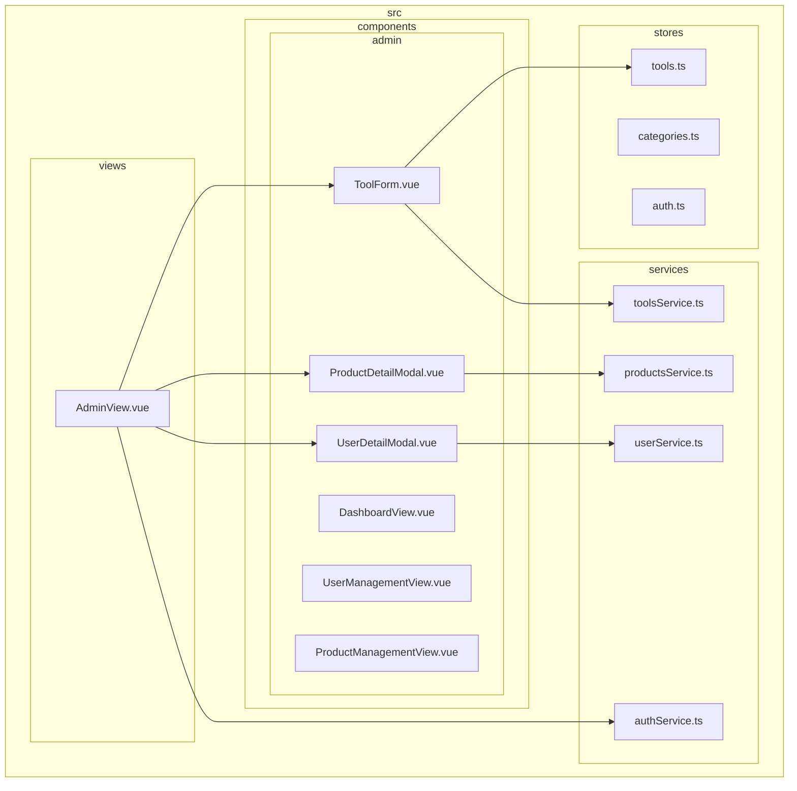
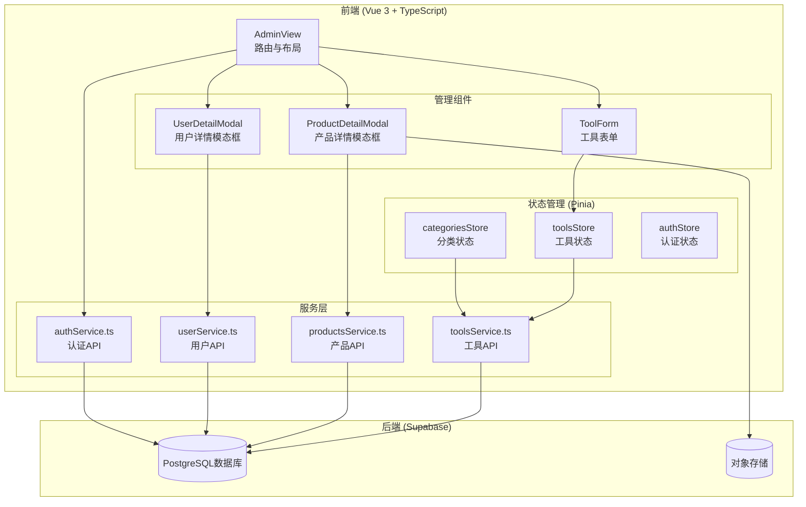
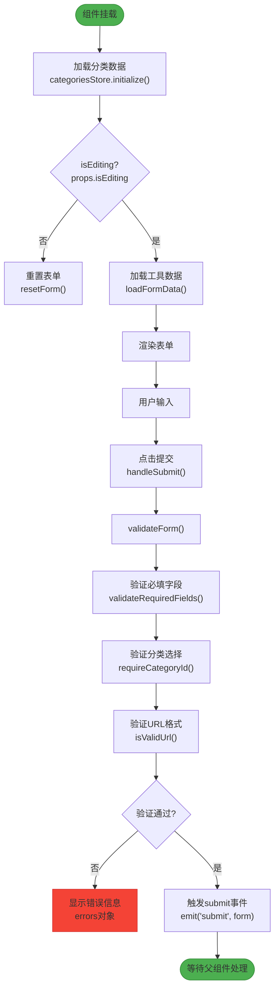
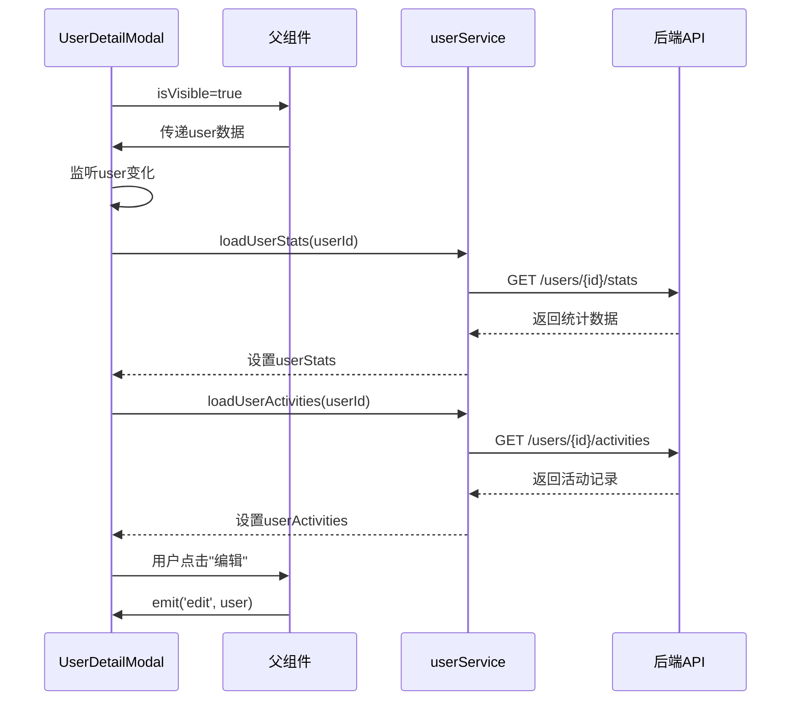
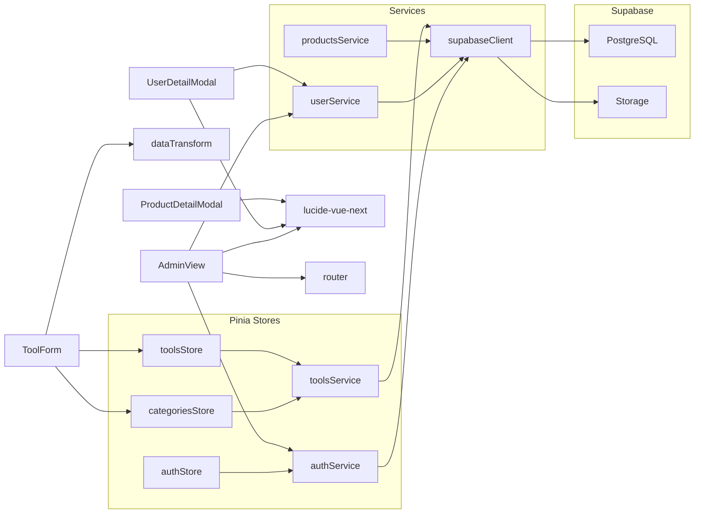

# 管理组件

<cite>
**本文档中引用的文件**  
- [ToolForm.vue](file://src/components/admin/ToolForm.vue)
- [ProductDetailModal.vue](file://src/components/admin/ProductDetailModal.vue)
- [UserDetailModal.vue](file://src/components/admin/UserDetailModal.vue)
- [AdminView.vue](file://src/views/AdminView.vue)
- [toolsService.ts](file://src/services/toolsService.ts)
- [productsService.ts](file://src/services/productsService.ts)
- [userService.ts](file://src/services/userService.ts)
- [authService.ts](file://src/services/authService.ts)
</cite>

## 目录
1. [简介](#简介)
2. [项目结构](#项目结构)
3. [核心组件](#核心组件)
4. [架构概览](#架构概览)
5. [详细组件分析](#详细组件分析)
6. [依赖分析](#依赖分析)
7. [性能考虑](#性能考虑)
8. [故障排除指南](#故障排除指南)
9. [结论](#结论)

## 简介
本文档深入解析管理后台专用UI组件的设计与实现，重点分析`ToolForm`、`ProductDetailModal`和`UserDetailModal`三个核心组件。文档详细说明各组件的表单验证机制、动态字段绑定、数据同步策略、编辑逻辑、图片上传集成、富文本处理、权限校验及实时提交流程。同时阐述这些组件在`AdminView`中的集成方式及其与后端服务的交互模式，并提供错误处理、权限控制和加载状态管理的最佳实践。

## 项目结构



**图示来源**  
- [ToolForm.vue](file://src/components/admin/ToolForm.vue)
- [ProductDetailModal.vue](file://src/components/admin/ProductDetailModal.vue)
- [UserDetailModal.vue](file://src/components/admin/UserDetailModal.vue)
- [AdminView.vue](file://src/views/AdminView.vue)
- [toolsService.ts](file://src/services/toolsService.ts)
- [productsService.ts](file://src/services/productsService.ts)
- [userService.ts](file://src/services/userService.ts)

**本节来源**  
- [src/components/admin](file://src/components/admin)
- [src/views](file://src/views)

## 核心组件

本文档深入分析管理后台中的三个核心UI组件：`ToolForm`用于工具信息的创建与编辑，实现完整的表单验证与数据提交；`ProductDetailModal`展示产品详情并支持审核、发布等管理操作；`UserDetailModal`呈现用户详细信息、统计指标与活动历史，支持用户状态管理。这些组件均采用Vue 3组合式API与TypeScript构建，通过Pinia进行状态管理，并与后端服务进行异步通信。

**本节来源**  
- [ToolForm.vue](file://src/components/admin/ToolForm.vue#L1-L512)
- [ProductDetailModal.vue](file://src/components/admin/ProductDetailModal.vue#L1-L397)
- [UserDetailModal.vue](file://src/components/admin/UserDetailModal.vue#L1-L742)

## 架构概览



**图示来源**  
- [AdminView.vue](file://src/views/AdminView.vue#L1-L288)
- [ToolForm.vue](file://src/components/admin/ToolForm.vue#L1-L512)
- [ProductDetailModal.vue](file://src/components/admin/ProductDetailModal.vue#L1-L397)
- [UserDetailModal.vue](file://src/components/admin/UserDetailModal.vue#L1-L742)
- [toolsService.ts](file://src/services/toolsService.ts)
- [productsService.ts](file://src/services/productsService.ts)
- [userService.ts](file://src/services/userService.ts)
- [authService.ts](file://src/services/authService.ts)

## 详细组件分析

### ToolForm 组件分析

`ToolForm`组件实现了工具信息的创建与编辑功能，采用响应式表单设计，支持必填字段验证、URL格式校验和分类选择。



**图示来源**  
- [ToolForm.vue](file://src/components/admin/ToolForm.vue#L150-L300)

#### 表单验证机制
`ToolForm`组件实现了多层次的表单验证机制。首先通过`validateRequiredFields`和`requireCategoryId`函数进行业务逻辑验证，然后通过`isValidUrl`函数进行URL格式验证。验证错误信息通过`errors`响应式对象统一管理，并在模板中动态显示。验证过程在提交时触发，确保数据完整性。

**本节来源**  
- [ToolForm.vue](file://src/components/admin/ToolForm.vue#L150-L200)

#### 动态字段绑定与数据同步
组件使用`v-model`实现表单字段的双向绑定，所有表单数据集中存储在`form`响应式对象中。通过`watch`监听`props.tool`的变化，实现编辑模式下的数据动态加载。表单数据通过`emit('submit')`事件提交给父组件，实现与Pinia store的数据同步。

**本节来源**  
- [ToolForm.vue](file://src/components/admin/ToolForm.vue#L100-L150)

### ProductDetailModal 组件分析

`ProductDetailModal`组件用于展示产品详细信息，支持审核、发布、编辑和删除等管理操作。

```mermaid
classDiagram
class ProductDetailModal {
+product : Product
+isVisible : boolean
-categories : Array
+getCategoryName(id) : string
+getStatusClass(status) : string
+getStatusText(status) : string
+formatDate(date) : string
+handleApprove() : void
+handleReject() : void
+handleEdit() : void
+handlePublish() : void
+handleUnpublish() : void
+handleDelete() : void
}
class Product {
+id : string
+name : string
+description : string
+content? : string
+price : number
+category_id : string
+status : "pending"|"approved"|"rejected"|"published"
+image_url? : string
+url? : string
+tags? : string[]
+created_at : string
+updated_at : string
+submitted_by : string
}
ProductDetailModal --> Product : "显示"
ProductDetailModal ..> "approve, reject, edit, publish, unpublish, delete" : emit
```

**图示来源**  
- [ProductDetailModal.vue](file://src/components/admin/ProductDetailModal.vue#L1-L397)

#### 产品信息编辑逻辑
虽然`ProductDetailModal`本身不直接提供编辑界面，但它通过`edit`事件将编辑请求传递给父组件。当用户点击"编辑产品"按钮时，组件触发`edit`事件并携带当前产品数据，由父组件（如`ProductManagementView`）负责打开编辑表单。

**本节来源**  
- [ProductDetailModal.vue](file://src/components/admin/ProductDetailModal.vue#L350-L360)

#### 图片上传集成与富文本处理
组件通过`image_url`属性显示产品图片，支持外部URL链接。详细介绍区域通过`content`字段展示富文本内容，使用`whitespace-pre-wrap`样式保留原始换行格式。虽然当前实现未包含图片上传功能，但为未来集成提供了基础结构。

**本节来源**  
- [ProductDetailModal.vue](file://src/components/admin/ProductDetailModal.vue#L60-L80)

### UserDetailModal 组件分析

`UserDetailModal`组件展示用户详细信息、统计指标和活动历史，支持用户状态管理和权限查看。



**图示来源**  
- [UserDetailModal.vue](file://src/components/admin/UserDetailModal.vue#L1-L742)
- [userService.ts](file://src/services/userService.ts)

#### 双向数据绑定与实时提交
组件通过`props`接收`isVisible`和`user`数据，实现与父组件的单向数据流。用户信息展示采用单向绑定，不直接修改用户数据。当用户点击"编辑"按钮时，通过`emit('edit')`事件通知父组件，由父组件决定如何处理编辑操作，确保数据流的清晰和可预测性。

**本节来源**  
- [UserDetailModal.vue](file://src/components/admin/UserDetailModal.vue#L50-L100)

## 依赖分析



**图示来源**  
- [ToolForm.vue](file://src/components/admin/ToolForm.vue#L20-L30)
- [UserDetailModal.vue](file://src/components/admin/UserDetailModal.vue#L20-L30)
- [AdminView.vue](file://src/views/AdminView.vue#L20-L30)
- [toolsService.ts](file://src/services/toolsService.ts)
- [supabaseClient.ts](file://src/lib/supabaseClient.ts)

**本节来源**  
- [package.json](file://package.json)
- [src/services](file://src/services)
- [src/stores](file://src/stores)

## 性能考虑

管理后台组件在性能方面进行了多项优化。`ToolForm`组件通过`onMounted`生命周期钩子延迟加载分类数据，避免不必要的网络请求。`UserDetailModal`组件使用`watch`监听用户变化，仅在用户数据更新时加载统计信息和活动记录，减少重复请求。所有组件均采用响应式设计，确保UI与数据状态保持同步，同时通过`v-if`和`v-show`合理控制DOM元素的渲染，优化页面性能。

## 故障排除指南

### 表单验证失败
当`ToolForm`表单验证失败时，检查`errors`对象中的具体错误信息。常见问题包括：必填字段为空、URL格式不正确、未选择分类。确保`props.tool`数据结构正确，特别是编辑模式下的数据映射。

### 模态框数据未更新
若`ProductDetailModal`或`UserDetailModal`显示的数据未及时更新，检查父组件传递的`product`或`user`属性是否正确更新。对于`UserDetailModal`，确认`user`对象包含所有必需字段，如`id`、`email`等。

### 权限访问被拒绝
在`AdminView`中出现权限被拒绝的情况，检查用户角色是否为`admin`或`super_admin`。确保`AuthService`和`UserService`的会话状态正常，必要时重新登录。

### 服务调用失败
当组件与后端服务通信失败时，检查网络连接和Supabase配置。查看浏览器开发者工具中的网络请求，确认API端点和认证令牌是否正确。

**本节来源**  
- [ToolForm.vue](file://src/components/admin/ToolForm.vue#L250-L300)
- [UserDetailModal.vue](file://src/components/admin/UserDetailModal.vue#L200-L250)
- [AdminView.vue](file://src/views/AdminView.vue#L50-L100)

## 结论
本文档详细分析了管理后台的三个核心UI组件：`ToolForm`、`ProductDetailModal`和`UserDetailModal`。这些组件采用现代化的Vue 3组合式API和TypeScript构建，通过清晰的props、emit和slot设计实现高内聚、低耦合的组件化架构。组件与Pinia store和服务层紧密协作，实现了完整的数据流管理。通过合理的验证机制、状态管理和错误处理，确保了管理后台的稳定性和用户体验。建议在实际使用中遵循文档中的最佳实践，确保组件的正确集成和高效运行。