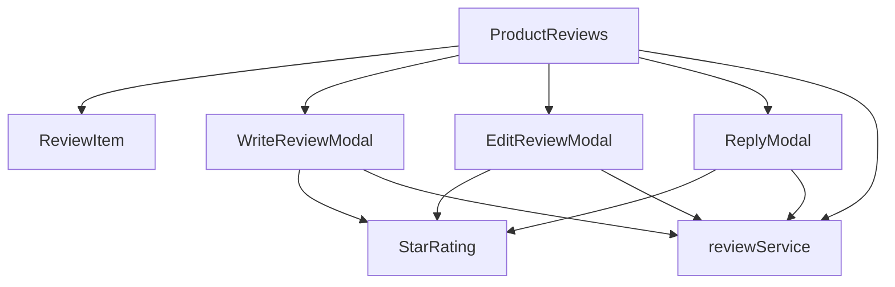
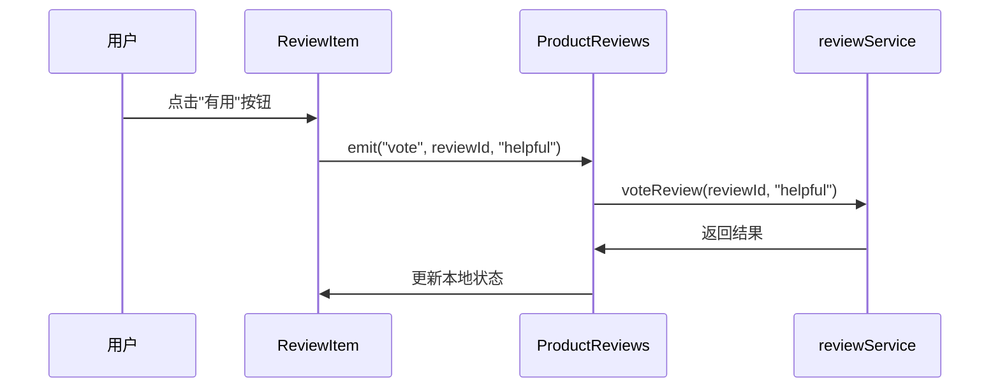
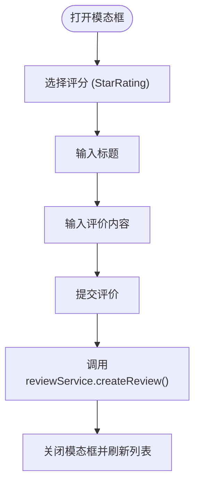
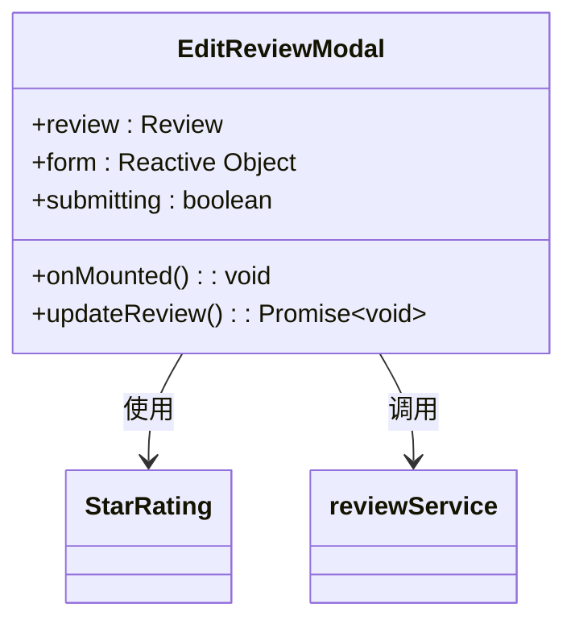
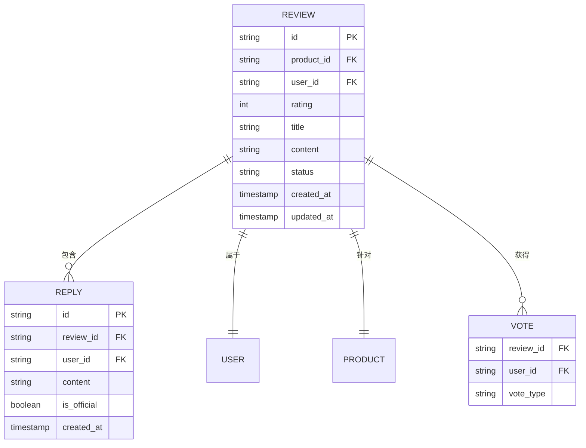
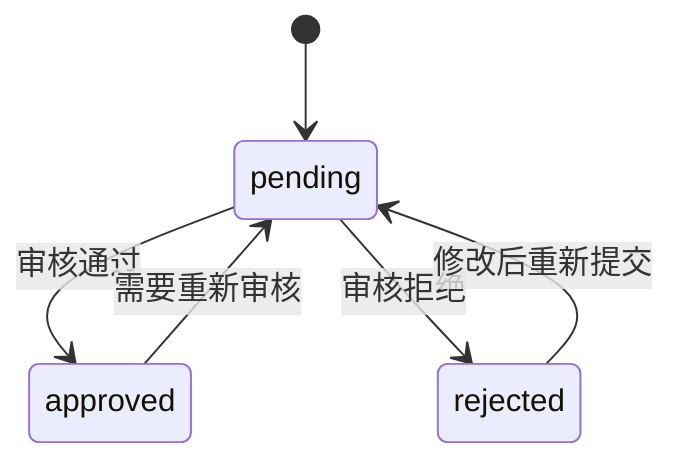
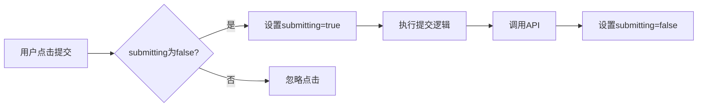

# 评价系统组件

<cite>
**本文档中引用的文件**  
- [ReviewItem.vue](file://src/components/reviews/ReviewItem.vue)
- [ProductReviews.vue](file://src/components/reviews/ProductReviews.vue)
- [WriteReviewModal.vue](file://src/components/reviews/WriteReviewModal.vue)
- [ReplyModal.vue](file://src/components/reviews/ReplyModal.vue)
- [EditReviewModal.vue](file://src/components/reviews/EditReviewModal.vue)
- [reviewService.ts](file://src/services/reviewService.ts)
- [StarRating.vue](file://src/components/ui/StarRating.vue)
</cite>

## 目录
1. [介绍](#介绍)
2. [核心组件结构](#核心组件结构)
3. [事件流与通信机制](#事件流与通信机制)
4. [模态框组件分析](#模态框组件分析)
5. [服务接口与数据交互](#服务接口与数据交互)
6. [功能特性实现](#功能特性实现)
7. [结论](#结论)

## 介绍
本系统实现了一套完整的用户评价功能，支持评分展示、内容交互、回复与编辑等核心功能。通过组件化设计和清晰的事件流管理，实现了高内聚、低耦合的前端架构。系统与后端通过`reviewService`进行数据交互，支持分页加载、筛选排序、权限控制等企业级特性。

## 核心组件结构



**图示来源**  
- [ProductReviews.vue](file://src/components/reviews/ProductReviews.vue#L1-L611)
- [ReviewItem.vue](file://src/components/reviews/ReviewItem.vue#L1-L152)

**本节来源**  
- [ProductReviews.vue](file://src/components/reviews/ProductReviews.vue#L1-L611)
- [ReviewItem.vue](file://src/components/reviews/ReviewItem.vue#L1-L152)

## 事件流与通信机制

### ReviewItem 组件通信机制

`ReviewItem`作为评价展示的基本单元，通过事件冒泡机制与父级`ProductReviews`组件通信。当用户进行投票、回复、编辑或删除操作时，子组件通过`$emit`触发相应事件，由父组件统一处理业务逻辑。



**图示来源**  
- [ReviewItem.vue](file://src/components/reviews/ReviewItem.vue#L75-L95)
- [ProductReviews.vue](file://src/components/reviews/ProductReviews.vue#L220-L260)

**本节来源**  
- [ReviewItem.vue](file://src/components/reviews/ReviewItem.vue#L1-L152)
- [ProductReviews.vue](file://src/components/reviews/ProductReviews.vue#L1-L611)

## 模态框组件分析

### 写评价模态框 (WriteReviewModal)

该组件集成星级评分、内容输入等核心功能，通过`v-model:rating`与`StarRating`组件双向绑定，实现评分选择。



**图示来源**  
- [WriteReviewModal.vue](file://src/components/reviews/WriteReviewModal.vue#L1-L181)
- [StarRating.vue](file://src/components/ui/StarRating.vue)

### 回复模态框 (ReplyModal)

实现评论回复功能，展示原评价内容并提供回复输入框。虽未实现@提及功能和富文本编辑器，但架构上预留了扩展空间。

```mermaid
flowchart TD
A[打开回复模态框] --> B[显示原评价信息]
B --> C[输入回复内容]
C --> D[提交回复]
D --> E[调用reviewService.replyToReview()]
E --> F[关闭模态框]
```

**图示来源**  
- [ReplyModal.vue](file://src/components/reviews/ReplyModal.vue#L1-L192)

### 编辑评价模态框 (EditReviewModal)

实现评价修改功能，初始化时将原评价数据填充到表单，并在提交时调用更新接口。



**图示来源**  
- [EditReviewModal.vue](file://src/components/reviews/EditReviewModal.vue#L1-L187)
- [reviewService.ts](file://src/services/reviewService.ts#L200-L250)

**本节来源**  
- [WriteReviewModal.vue](file://src/components/reviews/WriteReviewModal.vue#L1-L181)
- [ReplyModal.vue](file://src/components/reviews/ReplyModal.vue#L1-L192)
- [EditReviewModal.vue](file://src/components/reviews/EditReviewModal.vue#L1-L187)

## 服务接口与数据交互

### reviewService 接口调用示例

`reviewService`提供了一套完整的评价管理API，支持以下核心功能：



#### 分页加载示例
```typescript
const result = await reviewService.getProductReviews(productId, {
  page: currentPage,
  limit: 10,
  sort_by: "newest"
});
```

#### 敏感词过滤与审核状态
系统通过`status`字段管理审核状态，支持"pending"（待审核）、"approved"（已通过）、"rejected"（已拒绝）三种状态。



**图示来源**  
- [reviewService.ts](file://src/services/reviewService.ts#L1-L611)

**本节来源**  
- [reviewService.ts](file://src/services/reviewService.ts#L1-L611)

## 功能特性实现

### 防重复提交机制
所有表单提交操作均通过`submitting`状态变量控制，防止用户重复点击导致的重复请求。



### 实时预览与Markdown支持
虽然当前实现中未包含实时预览和Markdown解析功能，但在`textarea`组件的基础上，可通过集成第三方库（如marked.js）轻松实现。

### 版本对比与修改记录
当前系统未实现版本对比功能，但`updated_at`字段为后续实现修改记录提供了数据基础。可通过扩展数据库表结构来保存历史版本。

**本节来源**  
- [WriteReviewModal.vue](file://src/components/reviews/WriteReviewModal.vue#L130-L150)
- [EditReviewModal.vue](file://src/components/reviews/EditReviewModal.vue#L130-L150)
- [reviewService.ts](file://src/services/reviewService.ts#L200-L250)

## 结论
评价系统通过组件化设计实现了良好的可维护性和扩展性。`ProductReviews`作为容器组件统一管理状态和数据流，各子组件职责分明。`reviewService`提供了完整的业务逻辑封装，与UI层解耦。系统已具备企业级应用所需的核心功能，包括权限控制、状态管理、错误处理等。未来可在此基础上扩展@提及、富文本编辑、版本对比等高级功能。