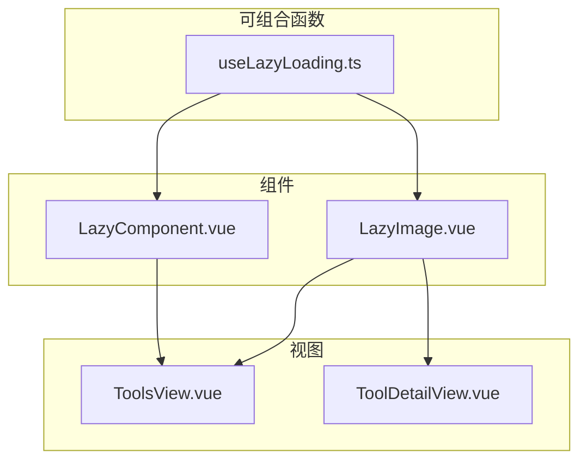
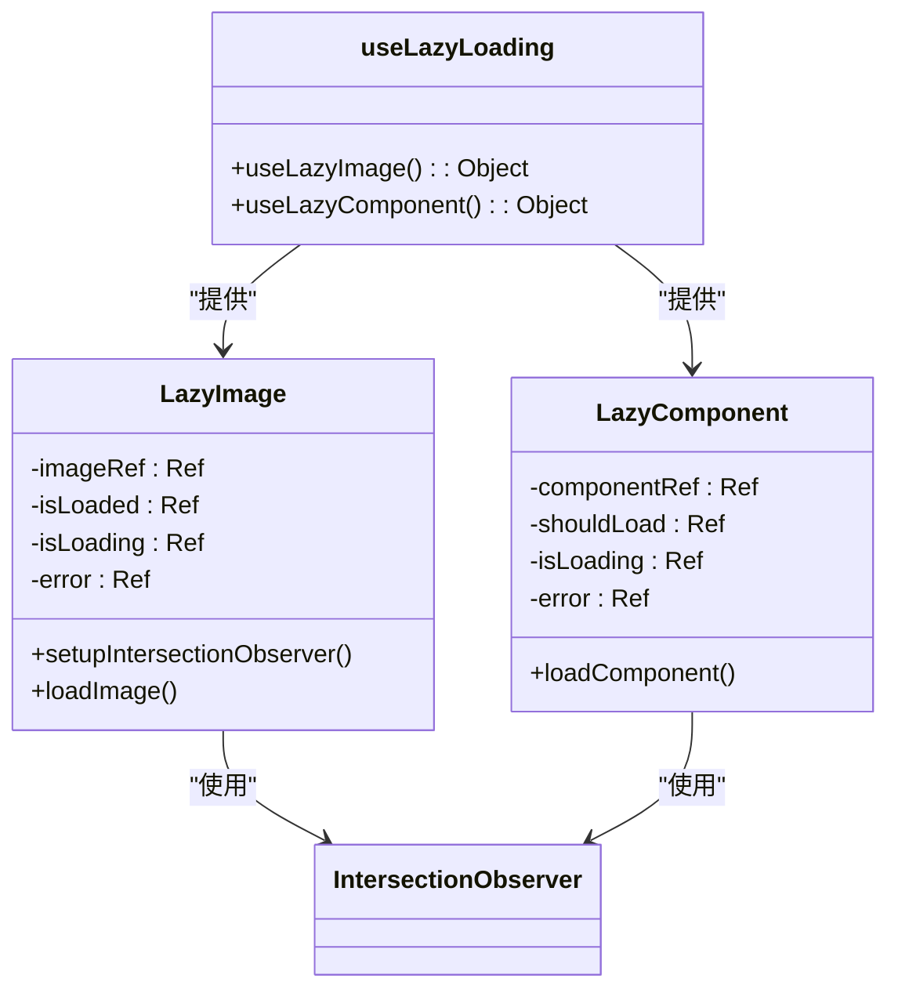
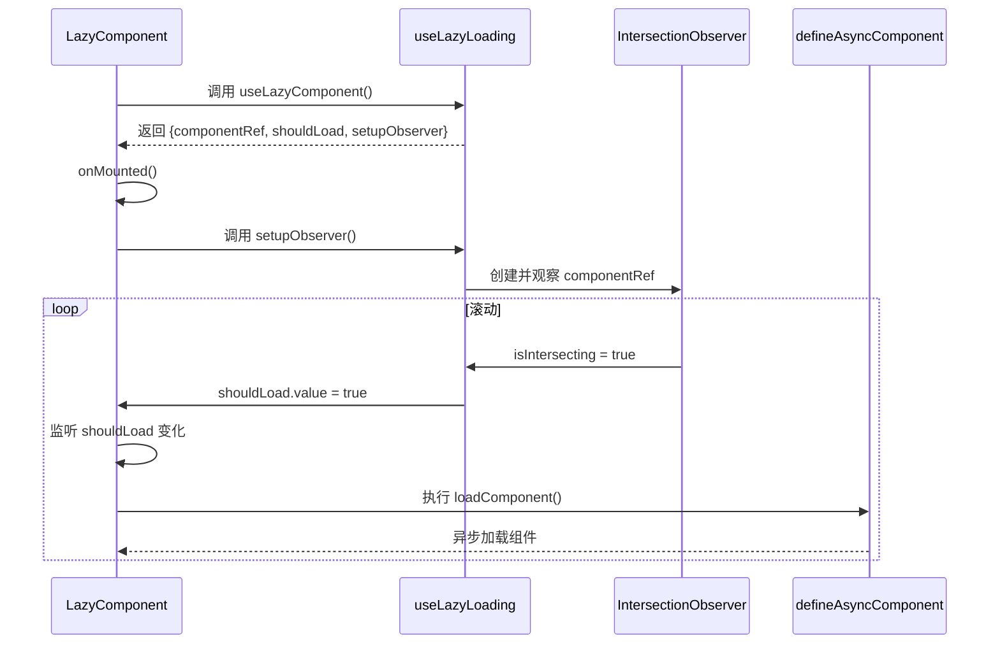
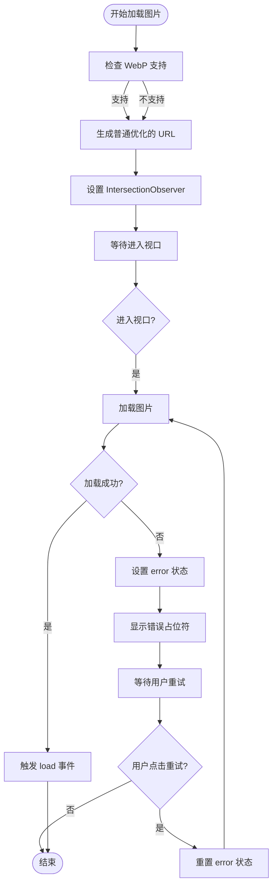
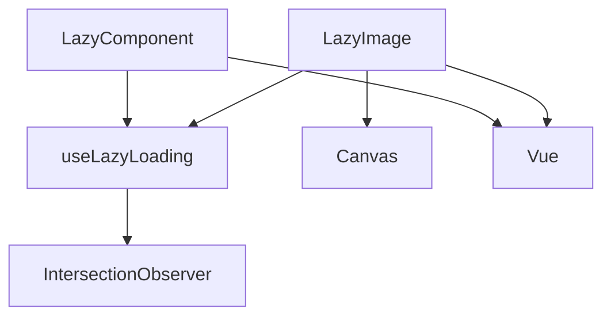

# 通用组件

<cite>
**本文档引用的文件**  
- [LazyComponent.vue](file://src/components/common/LazyComponent.vue)
- [LazyImage.vue](file://src/components/common/LazyImage.vue)
- [useLazyLoading.ts](file://src/composables/useLazyLoading.ts)
- [ToolsView.vue](file://src/views/ToolsView.vue)
- [ToolDetailView.vue](file://src/views/ToolDetailView.vue)
</cite>

## 目录
1. [简介](#简介)
2. [项目结构](#项目结构)
3. [核心组件](#核心组件)
4. [架构概述](#架构概述)
5. [详细组件分析](#详细组件分析)
6. [依赖分析](#依赖分析)
7. [性能考虑](#性能考虑)
8. [故障排除指南](#故障排除指南)
9. [结论](#结论)

## 简介
本文档详细说明了通用懒加载组件的设计原理与性能优化价值。重点解析 `LazyComponent` 和 `LazyImage` 组件如何利用 Intersection Observer 实现组件级和图片级的懒加载，从而减少初始渲染负担，提升页面加载性能。同时分析这些组件在列表页（如 ToolsView）和详情页中的实际应用方式，阐述其与 `useLazyLoading` 可组合函数的协作关系，并提供性能监控建议和常见问题的排查方法。

## 项目结构
项目采用典型的 Vue 3 + TypeScript 架构，组件按功能分类组织。核心的懒加载功能位于 `src/components/common` 目录下，相关的可组合逻辑则封装在 `src/composables` 目录中。视图层（`src/views`）通过导入这些通用组件来实现具体的业务功能。

**图示来源**
- [LazyComponent.vue](file://src/components/common/LazyComponent.vue)
- [LazyImage.vue](file://src/components/common/LazyImage.vue)
- [useLazyLoading.ts](file://src/composables/useLazyLoading.ts)
- [ToolsView.vue](file://src/views/ToolsView.vue)
- [ToolDetailView.vue](file://src/views/ToolDetailView.vue)

**本节来源**
- [src/components/common](file://src/components/common)
- [src/composables](file://src/composables)
- [src/views](file://src/views)

## 核心组件
核心的懒加载功能由 `LazyComponent` 和 `LazyImage` 两个通用组件实现。它们均基于 `IntersectionObserver` API 来检测元素是否进入视口，从而决定是否加载其内容。`LazyComponent` 用于延迟加载整个 Vue 组件，而 `LazyImage` 则专注于图片的延迟加载。两者都提供了占位符、错误处理和重试机制，以优化用户体验。

**本节来源**
- [LazyComponent.vue](file://src/components/common/LazyComponent.vue)
- [LazyImage.vue](file://src/components/common/LazyImage.vue)

## 架构概述
整个懒加载系统的架构围绕 `useLazyLoading` 可组合函数构建。该函数提供了 `useLazyImage` 和 `useLazyComponent` 两个核心功能，它们封装了 `IntersectionObserver` 的创建、监听和销毁逻辑。`LazyImage` 和 `LazyComponent` 组件通过调用这些可组合函数来获取响应式状态（如 `isLoaded`, `shouldLoad`）和操作方法（如 `setupIntersectionObserver`），从而实现了关注点分离和逻辑复用。

**图示来源**
- [useLazyLoading.ts](file://src/composables/useLazyLoading.ts)
- [LazyImage.vue](file://src/components/common/LazyImage.vue)
- [LazyComponent.vue](file://src/components/common/LazyComponent.vue)

## 详细组件分析

### LazyComponent 分析
`LazyComponent` 是一个高阶组件，用于实现 Vue 组件的懒加载。它通过 `defineAsyncComponent` 动态导入组件，并利用 `IntersectionObserver` 控制加载时机。

#### 设计原理与性能优化价值
`LazyComponent` 的核心价值在于减少初始渲染负担。当一个页面包含多个重量级组件时，一次性加载所有组件会导致首屏加载时间过长。`LazyComponent` 通过将非首屏组件的加载推迟到用户滚动到其附近时才进行，显著降低了初始包的大小和解析时间，提升了首屏性能。

#### 与 useLazyLoading 的协作关系
`LazyComponent` 在 `setup` 阶段调用 `useLazyComponent()` 可组合函数，获取 `componentRef`（用于绑定 DOM 元素）、`isVisible`（元素是否可见）和 `shouldLoad`（是否应该加载）等响应式状态。在 `onMounted` 钩子中，它会调用 `setupObserver` 方法来初始化 `IntersectionObserver`。

**图示来源**
- [LazyComponent.vue](file://src/components/common/LazyComponent.vue#L47-L215)
- [useLazyLoading.ts](file://src/composables/useLazyLoading.ts#L101-L157)

#### 在列表页和详情页中的使用
在 `ToolsView.vue` 中，虽然没有直接使用 `LazyComponent`，但其设计模式适用于加载非首屏的复杂模块，例如高级搜索面板（`AdvancedSearchPanel`）或用户反馈组件（`FeedbackWidget`）。在 `ToolDetailView.vue` 中，可以将“相关工具推荐”区域或“视频教程”嵌入的 iframe 包裹在 `LazyComponent` 中，当用户滚动到该区域时再加载，避免不必要的资源请求。

**本节来源**
- [LazyComponent.vue](file://src/components/common/LazyComponent.vue)
- [useLazyLoading.ts](file://src/composables/useLazyLoading.ts)
- [ToolsView.vue](file://src/views/ToolsView.vue)
- [ToolDetailView.vue](file://src/views/ToolDetailView.vue)

### LazyImage 分析
`LazyImage` 专注于图片资源的延迟加载，是优化页面性能的关键组件。

#### 占位符策略
`LazyImage` 提供了灵活的占位符策略。在图片加载完成前，它会显示一个带有骨架屏动画的占位符 (`lazy-image-placeholder`)，给用户以内容正在加载的视觉反馈，避免页面布局跳动。占位符的样式（如尺寸）会继承自图片本身，确保布局稳定。

#### 错误回退机制
当图片加载失败时，`LazyImage` 会触发 `onerror` 事件，将 `error` 状态置为 `true`，并显示错误占位符 (`lazy-image-error`)。该占位符包含一个错误图标和“重试”按钮。用户点击“重试”按钮后，组件会重新尝试加载图片，最多可重试三次（由 `maxRetries` 控制）。

#### WebP 格式自动适配逻辑
`LazyImage` 内置了对 WebP 格式的支持。它通过 `checkWebPSupport` 方法（利用 `canvas.toDataURL` 检测）判断浏览器是否支持 WebP。如果支持，则会在图片 URL 后添加 `f_webp` 参数，请求 WebP 格式的图片，从而获得更小的文件体积和更快的加载速度。

**图示来源**
- [LazyImage.vue](file://src/components/common/LazyImage.vue#L96-L203)
- [useLazyLoading.ts](file://src/composables/useLazyLoading.ts#L48-L104)

#### 在列表页和详情页中的使用
在 `ToolsView.vue` 的工具卡片中，每个工具的图标都可以使用 `LazyImage` 组件进行加载。这对于包含大量工具的长列表页尤其重要，可以避免一次性发起数百个图片请求。在 `ToolDetailView.vue` 中，教程图片或产品截图也可以使用 `LazyImage`，确保只有当用户滚动到相关内容时才加载这些图片。

**本节来源**
- [LazyImage.vue](file://src/components/common/LazyImage.vue)
- [ToolsView.vue](file://src/views/ToolsView.vue)
- [ToolDetailView.vue](file://src/views/ToolDetailView.vue)

## 依赖分析
懒加载组件的核心依赖是浏览器的 `IntersectionObserver` API。`useLazyLoading.ts` 在初始化时会检查该 API 的可用性，如果不支持，则会降级为立即加载，保证功能的可用性。此外，`LazyImage` 还依赖 `canvas` API 来检测 WebP 支持。这些组件与 Vue 3 的响应式系统深度集成，通过 `ref` 和 `watch` 实现状态的自动更新。

**图示来源**
- [LazyComponent.vue](file://src/components/common/LazyComponent.vue)
- [LazyImage.vue](file://src/components/common/LazyImage.vue)
- [useLazyLoading.ts](file://src/composables/useLazyLoading.ts)

**本节来源**
- [useLazyLoading.ts](file://src/composables/useLazyLoading.ts)

## 性能考虑
使用懒加载组件能显著提升用户体验，尤其是在低网速环境下。通过减少初始请求的数量和大小，页面可以更快地呈现核心内容。对于图片，结合 WebP 优化和质量参数（`quality` prop），可以进一步减少带宽消耗。建议通过 Lighthouse 等工具监控 `Largest Contentful Paint (LCP)` 和 `Cumulative Layout Shift (CLS)` 指标，以量化懒加载带来的性能提升。

## 故障排除指南
#### 交叉观察器不触发
*   **原因**: `IntersectionObserver` 未正确绑定到 DOM 元素。
*   **排查**: 确保 `LazyComponent` 的根元素被 `containerRef` 正确引用，且该元素在页面上是可见的。检查 `useLazyComponent` 中 `componentRef.value` 是否为 `null`。

#### 图片加载失败且不显示占位图
*   **原因**: `placeholder` 属性未设置，或 `showErrorPlaceholder` 被设为 `false`。
*   **排查**: 检查 `LazyImage` 组件的 `placeholder` 和 `showErrorPlaceholder` 属性是否已正确配置。

#### 组件加载后样式错乱
*   **原因**: 懒加载的组件可能依赖于某些全局样式或脚本，而这些资源在组件加载时还未就绪。
*   **排查**: 确保所有必要的全局样式和脚本在应用初始化时已加载，或在懒加载组件内部处理好样式依赖。

**本节来源**
- [LazyComponent.vue](file://src/components/common/LazyComponent.vue)
- [LazyImage.vue](file://src/components/common/LazyImage.vue)

## 结论
`LazyComponent` 和 `LazyImage` 是一套高效、健壮的通用懒加载解决方案。它们通过 `IntersectionObserver` 实现了精准的加载时机控制，结合占位符、错误处理和格式优化等特性，极大地提升了应用的性能和用户体验。通过与 `useLazyLoading` 可组合函数的协作，实现了逻辑的复用和代码的解耦。在 `ToolsView` 和 `ToolDetailView` 等场景中合理应用这些组件，可以有效优化长列表和富媒体页面的加载性能。