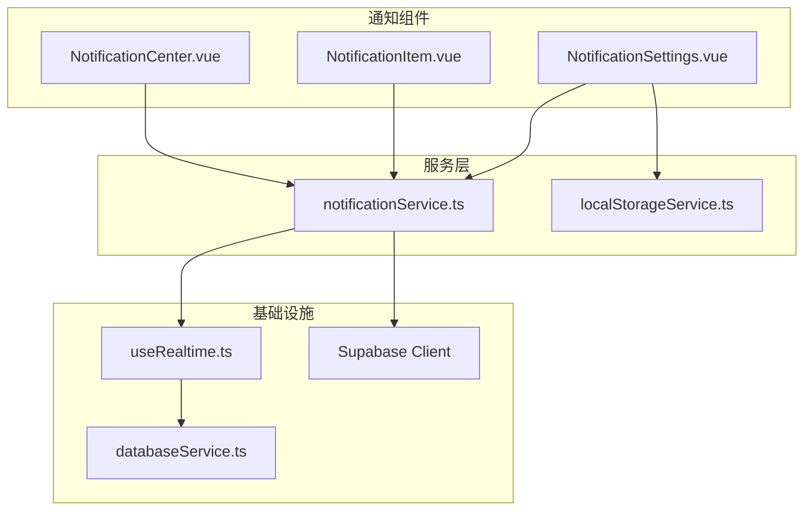
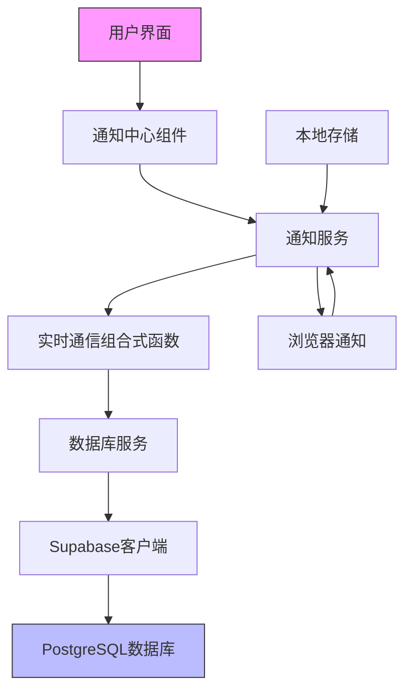
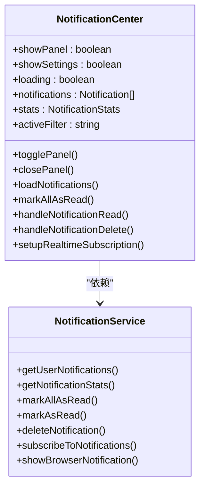
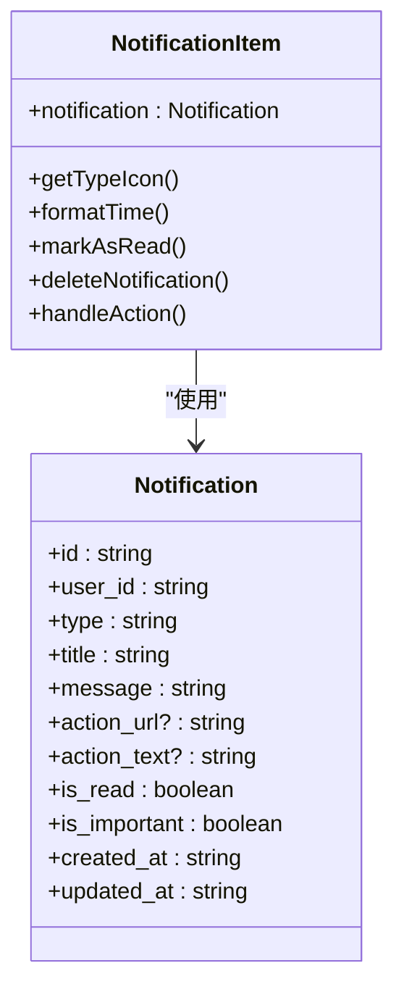
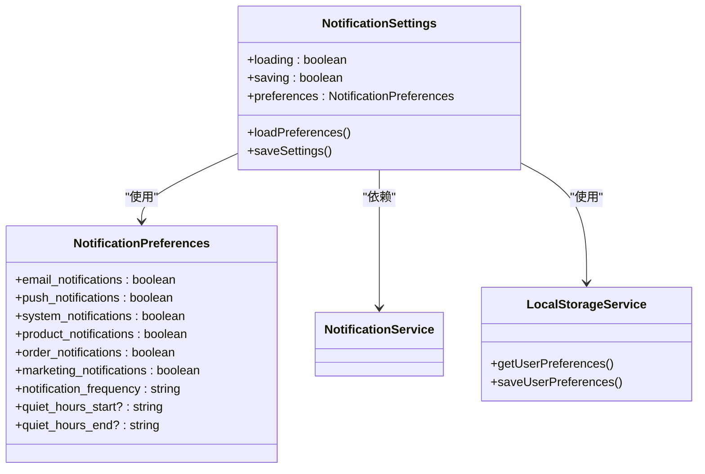
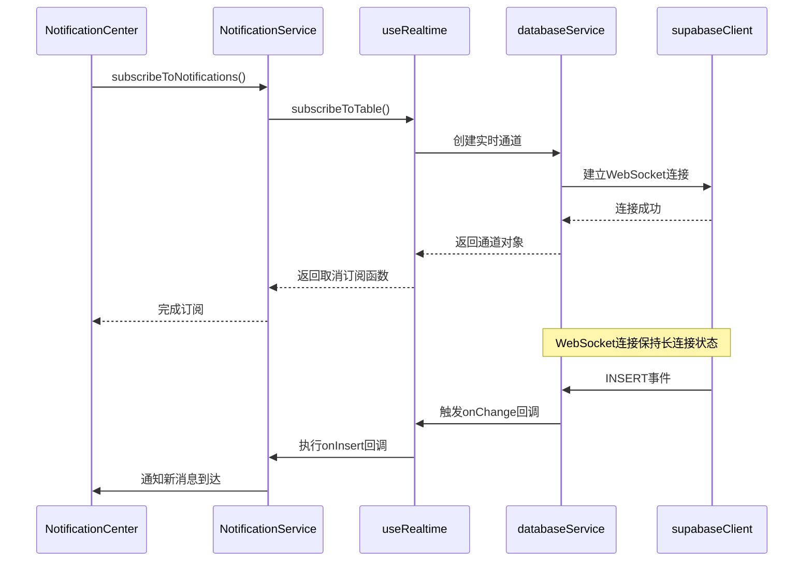
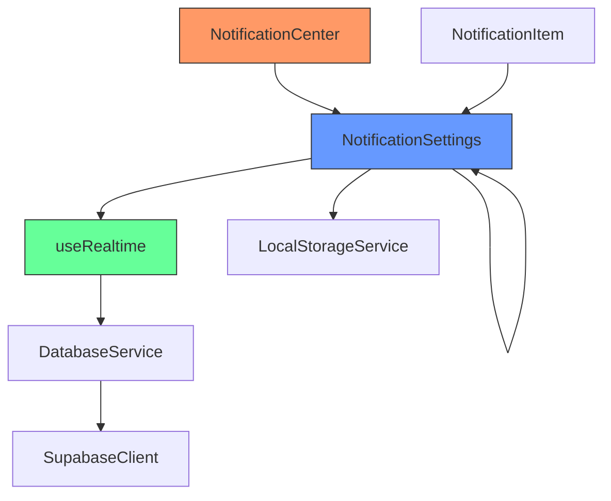

# 通知系统组件

<cite>
**本文档引用的文件**
- [NotificationCenter.vue](file://src/components/notifications/NotificationCenter.vue)
- [NotificationItem.vue](file://src/components/notifications/NotificationItem.vue)
- [NotificationSettings.vue](file://src/components/notifications/NotificationSettings.vue)
- [notificationService.ts](file://src/services/notificationService.ts)
- [useRealtime.ts](file://src/composables/useRealtime.ts)
- [localStorageService.ts](file://src/services/localStorageService.ts)
- [supabaseClient.ts](file://src/lib/supabaseClient.ts)
- [databaseService.ts](file://src/services/databaseService.ts)
</cite>

## 目录
1. [简介](#简介)
2. [项目结构](#项目结构)
3. [核心组件](#核心组件)
4. [架构概述](#架构概述)
5. [详细组件分析](#详细组件分析)
6. [依赖分析](#依赖分析)
7. [性能考虑](#性能考虑)
8. [故障排除指南](#故障排除指南)
9. [结论](#结论)

## 简介
本文档系统阐述了通知中心组件群的实时通信架构与用户交互逻辑。重点解析了`NotificationCenter`如何通过实时通信机制订阅通知通道，实现消息的即时推送与未读计数更新；分析了`NotificationItem`在不同类型通知（如评论回复、订单状态变更）下的模板渲染机制；说明了`NotificationSettings`中用户偏好配置的本地存储与服务端同步策略。同时提供了WebSocket连接状态管理、消息去重逻辑和批量操作（标记已读、删除）的实现细节。

## 项目结构
通知系统组件位于`src/components/notifications`目录下，包含三个核心Vue组件和相关服务模块。组件通过`src/services/notificationService.ts`与Supabase后端进行数据交互，并利用`src/composables/useRealtime.ts`实现实时通信功能。

**图示来源**
- [NotificationCenter.vue](file://src/components/notifications/NotificationCenter.vue)
- [NotificationItem.vue](file://src/components/notifications/NotificationItem.vue)
- [NotificationSettings.vue](file://src/components/notifications/NotificationSettings.vue)
- [notificationService.ts](file://src/services/notificationService.ts)
- [useRealtime.ts](file://src/composables/useRealtime.ts)
- [supabaseClient.ts](file://src/lib/supabaseClient.ts)
- [databaseService.ts](file://src/services/databaseService.ts)

**本节来源**
- [src/components/notifications](file://src/components/notifications)
- [src/services/notificationService.ts](file://src/services/notificationService.ts)
- [src/composables/useRealtime.ts](file://src/composables/useRealtime.ts)

## 核心组件
通知系统由三个核心组件构成：`NotificationCenter`负责整体通知管理与展示，`NotificationItem`处理单个通知的渲染与交互，`NotificationSettings`管理用户通知偏好设置。这些组件通过`notificationService`服务与后端进行数据交互，并利用实时通信功能实现即时更新。

**本节来源**
- [NotificationCenter.vue](file://src/components/notifications/NotificationCenter.vue)
- [NotificationItem.vue](file://src/components/notifications/NotificationItem.vue)
- [NotificationSettings.vue](file://src/components/notifications/NotificationSettings.vue)

## 架构概述
通知系统采用分层架构设计，前端组件层、服务层和数据访问层各司其职。实时通信通过Supabase的PostgREST API和实时通道实现，确保通知的即时性。用户偏好设置采用本地存储与服务端同步的混合策略，保证用户体验的连续性。

**图示来源**
- [NotificationCenter.vue](file://src/components/notifications/NotificationCenter.vue)
- [notificationService.ts](file://src/services/notificationService.ts)
- [useRealtime.ts](file://src/composables/useRealtime.ts)
- [databaseService.ts](file://src/services/databaseService.ts)
- [supabaseClient.ts](file://src/lib/supabaseClient.ts)

## 详细组件分析

### 通知中心分析
`NotificationCenter`组件实现了通知系统的主界面，包含通知按钮、面板、筛选器和列表等功能。通过实时订阅机制，当新通知到达时能够即时更新界面状态。

**图示来源**
- [NotificationCenter.vue](file://src/components/notifications/NotificationCenter.vue#L1-L715)
- [notificationService.ts](file://src/services/notificationService.ts#L1-L513)

**本节来源**
- [NotificationCenter.vue](file://src/components/notifications/NotificationCenter.vue)
- [notificationService.ts](file://src/services/notificationService.ts)

### 通知项目分析
`NotificationItem`组件负责单个通知的渲染，根据通知类型显示不同的图标和样式，并提供标记已读、删除等操作功能。

**图示来源**
- [NotificationItem.vue](file://src/components/notifications/NotificationItem.vue#L1-L363)
- [notificationService.ts](file://src/services/notificationService.ts#L1-L513)

**本节来源**
- [NotificationItem.vue](file://src/components/notifications/NotificationItem.vue)
- [notificationService.ts](file://src/services/notificationService.ts)

### 通知设置分析
`NotificationSettings`组件管理用户的通知偏好，包括通知类型、频率和免打扰时间等设置，并通过服务层与后端同步。

**图示来源**
- [NotificationSettings.vue](file://src/components/notifications/NotificationSettings.vue#L1-L580)
- [notificationService.ts](file://src/services/notificationService.ts#L1-L513)
- [localStorageService.ts](file://src/services/localStorageService.ts#L1-L338)

**本节来源**
- [NotificationSettings.vue](file://src/components/notifications/NotificationSettings.vue)
- [notificationService.ts](file://src/services/notificationService.ts)
- [localStorageService.ts](file://src/services/localStorageService.ts)

### 实时通信分析
实时通信功能通过`useRealtime`组合式函数实现，封装了WebSocket连接管理、消息订阅和错误处理等复杂逻辑。

**图示来源**
- [NotificationCenter.vue](file://src/components/notifications/NotificationCenter.vue#L1-L715)
- [notificationService.ts](file://src/services/notificationService.ts#L1-L513)
- [useRealtime.ts](file://src/composables/useRealtime.ts#L1-L402)
- [databaseService.ts](file://src/services/databaseService.ts#L1-L404)
- [supabaseClient.ts](file://src/lib/supabaseClient.ts#L1-L266)

**本节来源**
- [useRealtime.ts](file://src/composables/useRealtime.ts)
- [databaseService.ts](file://src/services/databaseService.ts)
- [supabaseClient.ts](file://src/lib/supabaseClient.ts)

## 依赖分析
通知系统组件之间存在明确的依赖关系，上层组件依赖下层服务，形成清晰的调用链路。这种分层设计有利于代码维护和功能扩展。

**图示来源**
- [NotificationCenter.vue](file://src/components/notifications/NotificationCenter.vue)
- [NotificationItem.vue](file://src/components/notifications/NotificationItem.vue)
- [NotificationSettings.vue](file://src/components/notifications/NotificationSettings.vue)
- [notificationService.ts](file://src/services/notificationService.ts)
- [useRealtime.ts](file://src/composables/useRealtime.ts)
- [localStorageService.ts](file://src/services/localStorageService.ts)
- [databaseService.ts](file://src/services/databaseService.ts)
- [supabaseClient.ts](file://src/lib/supabaseClient.ts)

**本节来源**
- [src/components/notifications](file://src/components/notifications)
- [src/services](file://src/services)
- [src/composables](file://src/composables)
- [src/lib](file://src/lib)

## 性能考虑
通知系统在性能方面进行了多项优化，包括分页加载、本地缓存、批量操作等。对于大量通知的场景，建议采用虚拟滚动技术以提升渲染性能。同时，合理设置实时通信的心跳间隔和重连策略，避免对服务器造成过大压力。

## 故障排除指南
当通知系统出现问题时，可按照以下步骤进行排查：检查网络连接状态、验证Supabase配置、确认WebSocket连接是否正常、检查浏览器通知权限设置。对于同步问题，可尝试清除本地存储并重新同步数据。

**本节来源**
- [notificationService.ts](file://src/services/notificationService.ts)
- [useRealtime.ts](file://src/composables/useRealtime.ts)
- [databaseService.ts](file://src/services/databaseService.ts)
- [supabaseClient.ts](file://src/lib/supabaseClient.ts)

## 结论
通知系统组件群通过合理的架构设计和高效的实时通信机制，实现了流畅的用户通知体验。系统具备良好的可扩展性和维护性，为后续功能迭代奠定了坚实基础。建议持续关注性能优化和用户体验改进，确保系统在各种使用场景下都能稳定运行。