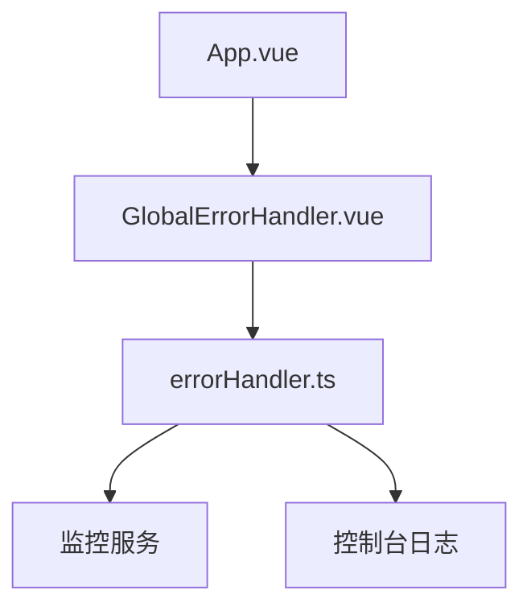
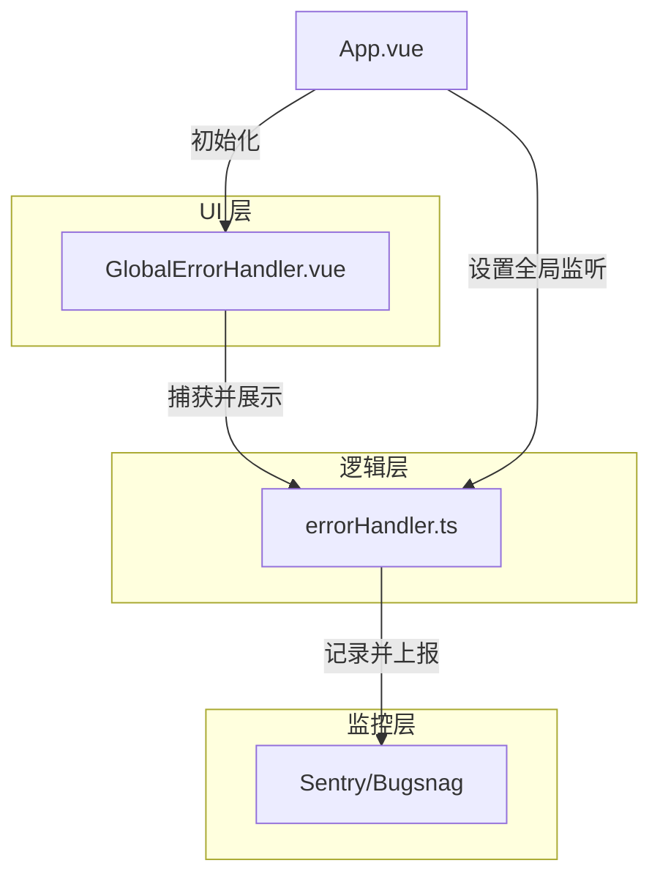
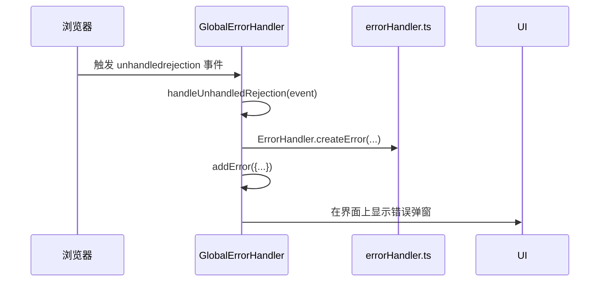
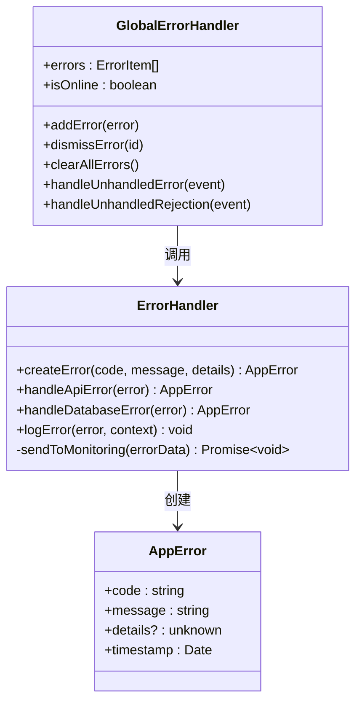
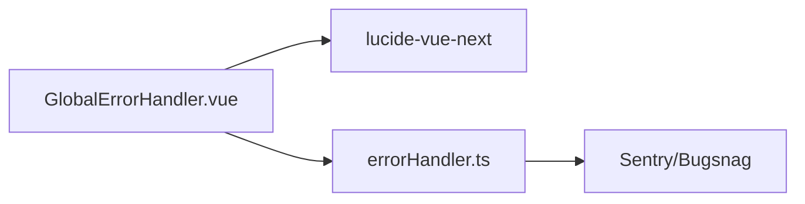

# 错误处理组件

<cite>
**本文档中引用的文件**  
- [GlobalErrorHandler.vue](file://src/components/error/GlobalErrorHandler.vue)
- [errorHandler.ts](file://src/utils/errorHandler.ts)
- [App.vue](file://src/App.vue)
</cite>

## 目录
1. [简介](#简介)
2. [项目结构](#项目结构)
3. [核心组件](#核心组件)
4. [架构概述](#架构概述)
5. [详细组件分析](#详细组件分析)
6. [依赖分析](#依赖分析)
7. [性能考虑](#性能考虑)
8. [故障排除指南](#故障排除指南)
9. [结论](#结论)

## 简介
本文档全面解析全局错误处理器的异常捕获机制与降级渲染策略。重点说明 `GlobalErrorHandler` 组件如何通过 Vue 的 `errorCaptured` 生命周期钩子拦截子组件运行时异常，记录错误日志并展示友好提示界面。同时阐述其与 `errorHandler.ts` 工具类的集成方式，包括错误分类、上下文信息收集及监控上报流程。提供在 `App.vue` 中全局注册的配置方法，以及自定义错误界面的插槽替换方案，并涵盖边界情况处理、错误堆栈追踪和开发/生产环境行为差异。

## 项目结构
项目中错误处理相关的核心文件位于 `src/components/error/` 和 `src/utils/` 目录下。`GlobalErrorHandler.vue` 是负责 UI 层错误展示的组件，而 `errorHandler.ts` 提供了底层错误处理逻辑。该组件在 `App.vue` 的根模板中被直接引入，实现了全局错误处理的统一入口。

**Diagram sources**
- [App.vue](file://src/App.vue#L1-L10)
- [GlobalErrorHandler.vue](file://src/components/error/GlobalErrorHandler.vue#L1-L20)
- [errorHandler.ts](file://src/utils/errorHandler.ts#L1-L10)

**Section sources**
- [App.vue](file://src/App.vue#L1-L70)
- [src/components/error](file://src/components/error)
- [src/utils](file://src/utils)

## 核心组件
`GlobalErrorHandler` 组件是整个应用的错误处理中心，它通过监听全局事件（如 `error` 和 `unhandledrejection`）来捕获未处理的 JavaScript 错误和 Promise 拒绝。同时，它也作为 Vue 错误边界的容器，通过 `errorCaptured` 钩子捕获组件内部的渲染错误。该组件维护一个响应式的错误队列，以非阻塞的方式向用户展示错误信息，并提供重试或刷新等操作按钮。

**Section sources**
- [GlobalErrorHandler.vue](file://src/components/error/GlobalErrorHandler.vue#L1-L336)
- [errorHandler.ts](file://src/utils/errorHandler.ts#L1-L326)

## 架构概述
全局错误处理系统采用分层架构，上层为 `GlobalErrorHandler.vue` 组件，负责错误的可视化展示和用户交互；下层为 `errorHandler.ts` 工具类，负责错误的分类、标准化和日志记录。两者通过事件监听和函数调用紧密协作。`App.vue` 作为应用的根组件，负责初始化这一处理链。

**Diagram sources**
- [GlobalErrorHandler.vue](file://src/components/error/GlobalErrorHandler.vue#L1-L336)
- [errorHandler.ts](file://src/utils/errorHandler.ts#L1-L326)
- [App.vue](file://src/App.vue#L1-L70)

## 详细组件分析

### GlobalErrorHandler 组件分析
`GlobalErrorHandler` 是一个 Vue 3 的组合式 API 组件，它使用 `teleport` 将错误提示弹窗渲染到 `body` 下，确保其在所有内容之上。组件内部定义了 `errors` 响应式数组来管理当前显示的错误列表，并通过 `addError`、`dismissError` 和 `clearAllErrors` 方法进行操作。

#### 生命周期与事件监听
组件在 `onMounted` 钩子中注册了多个全局事件监听器，包括 `online`、`offline`、`error` 和 `unhandledrejection`。这些监听器能捕获网络状态变化和未处理的异常，并将其转换为统一的错误对象添加到队列中。在 `onUnmounted` 钩子中，组件会正确地移除这些监听器，防止内存泄漏。

**Diagram sources**
- [GlobalErrorHandler.vue](file://src/components/error/GlobalErrorHandler.vue#L145-L206)
- [errorHandler.ts](file://src/utils/errorHandler.ts#L222-L270)

#### 错误分类与降级渲染
组件本身不直接进行错误分类，而是依赖 `errorHandler.ts` 提供的 `createError` 方法来生成标准化的 `AppError` 对象。对于不同类型的错误（如网络、解析、权限等），`errorHandler.ts` 中的 `handleApiError` 和 `handleDatabaseError` 等方法会创建带有特定 `code` 的错误实例。`GlobalErrorHandler` 则根据这些 `code` 或错误类型（`type`）来渲染不同样式的提示（如红色错误、黄色警告、绿色成功）。

#### 与 errorHandler.ts 的集成
`GlobalErrorHandler` 与 `errorHandler.ts` 的集成主要体现在错误的创建和记录上。当捕获到一个原生 `ErrorEvent` 或 `PromiseRejectionEvent` 时，`GlobalErrorHandler` 会调用 `ErrorHandler.createError` 来创建一个结构化的 `AppError` 对象，并通过 `ErrorHandler.logError` 将其记录到控制台。`logError` 方法还负责收集上下文信息，如 `userAgent` 和当前 `url`。

**Diagram sources**
- [errorHandler.ts](file://src/utils/errorHandler.ts#L0-L326)
- [GlobalErrorHandler.vue](file://src/components/error/GlobalErrorHandler.vue#L1-L336)

#### 全局注册与自定义插槽
`GlobalErrorHandler` 组件在 `App.vue` 的模板中被直接作为根组件的子组件使用，这确保了它在整个应用生命周期内都处于激活状态。虽然当前实现中没有使用插槽（slot）来完全替换错误界面，但其 `addError` 方法通过 `defineExpose` 暴露给了全局，允许应用的其他部分（如业务组件或服务）主动触发错误提示，从而实现了一定程度上的自定义。

**Section sources**
- [GlobalErrorHandler.vue](file://src/components/error/GlobalErrorHandler.vue#L1-L336)
- [App.vue](file://src/App.vue#L1-L70)
- [errorHandler.ts](file://src/utils/errorHandler.ts#L1-L326)

## 依赖分析
`GlobalErrorHandler` 组件依赖于 `lucide-vue-next` 图标库来渲染不同类型的错误图标。`errorHandler.ts` 工具类是独立的，不依赖于外部库，但其设计为可扩展，预留了 `sendToMonitoring` 方法用于集成 Sentry 或 Bugsnag 等第三方监控服务。

**Diagram sources**
- [GlobalErrorHandler.vue](file://src/components/error/GlobalErrorHandler.vue#L36-L95)
- [errorHandler.ts](file://src/utils/errorHandler.ts#L179-L224)

**Section sources**
- [package.json](file://package.json#L1-L10)

## 性能考虑
错误处理机制对性能的影响极小。事件监听器的开销可以忽略不计。错误提示的展示使用了 Vue 的过渡动画，但这些动画是轻量级的 CSS 转换。错误日志的记录主要通过 `console.error` 进行，在生产环境中，如果集成了远程监控服务，网络请求的开销需要考虑，但通常这类上报是异步且非阻塞的。

## 故障排除指南
- **问题：错误提示未显示**
  - 检查 `GlobalErrorHandler` 是否已在 `App.vue` 中正确引入。
  - 确认 `onMounted` 钩子是否执行，事件监听器是否成功注册。
- **问题：重复的错误提示**
  - 检查 `addError` 方法是否被意外多次调用。
  - 确保在 `onUnmounted` 钩子中正确移除了事件监听器。
- **问题：生产环境错误未上报**
  - 检查 `errorHandler.ts` 中的 `sendToMonitoring` 方法是否已实现。
  - 确认监控服务的 API 密钥和配置是否正确。

**Section sources**
- [GlobalErrorHandler.vue](file://src/components/error/GlobalErrorHandler.vue#L145-L206)
- [errorHandler.ts](file://src/utils/errorHandler.ts#L179-L224)

## 结论
`GlobalErrorHandler` 与 `errorHandler.ts` 共同构建了一个健壮、用户友好的全局错误处理系统。该系统有效地隔离了运行时异常，防止了应用崩溃，并通过清晰的界面反馈提升了用户体验。其分层设计使得错误处理逻辑清晰、易于维护和扩展。通过在 `App.vue` 中的简单集成，即可为整个应用提供统一的错误处理能力。