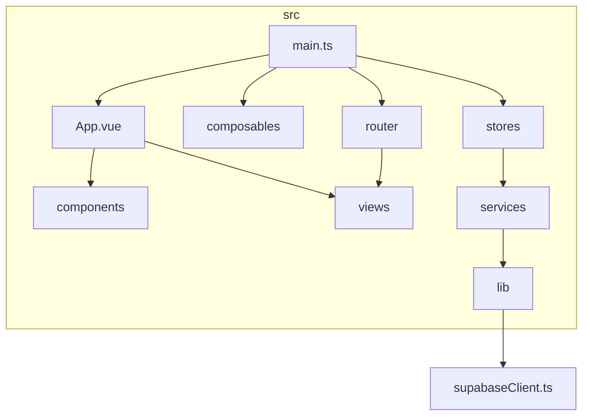
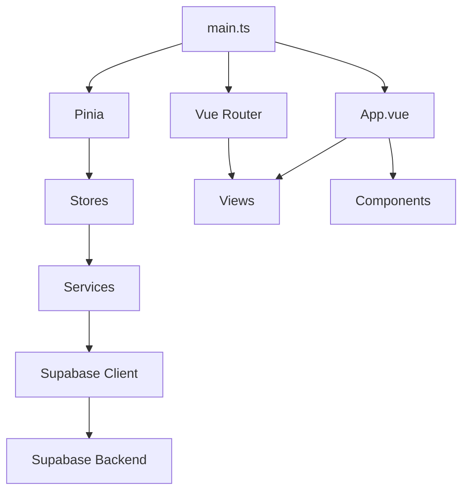
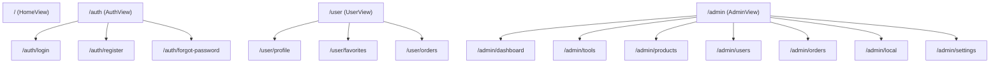
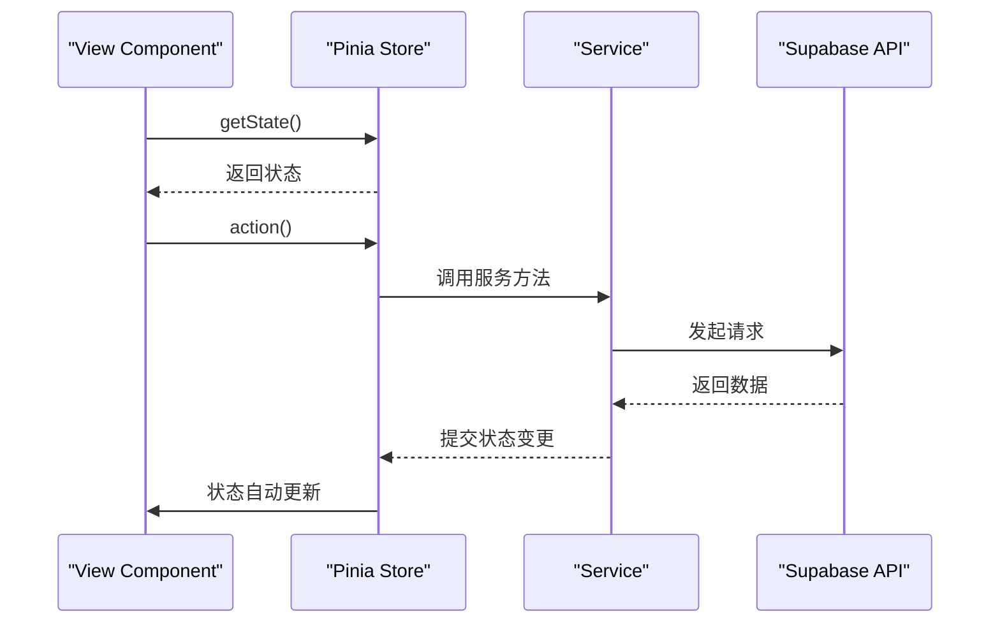
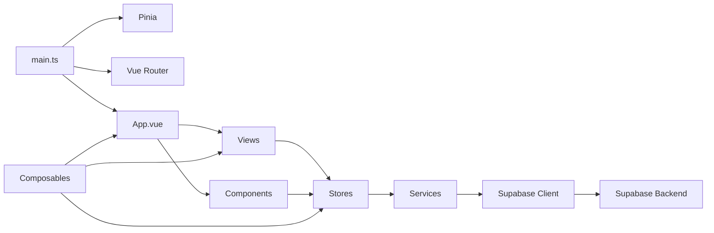

# 前端源码结构

<cite>
**本文档引用的文件**  
- [src/components](file://src/components)
- [src/views](file://src/views)
- [src/stores](file://src/stores)
- [src/services](file://src/services)
- [src/composables](file://src/composables)
- [src/lib/supabaseClient.ts](file://src/lib/supabaseClient.ts)
- [src/router/index.ts](file://src/router/index.ts)
- [src/main.ts](file://src/main.ts)
</cite>

## 目录

1. [简介](#简介)
2. [项目结构](#项目结构)
3. [核心组件](#核心组件)
4. [架构概览](#架构概览)
5. [详细组件分析](#详细组件分析)
6. [依赖分析](#依赖分析)
7. [性能考虑](#性能考虑)
8. [故障排除指南](#故障排除指南)
9. [结论](#结论)

## 简介
本文档深入解析 `src` 目录下的前端源码组织结构，涵盖组件分类、状态管理、服务封装、可组合函数设计、Supabase 客户端初始化、路由权限控制及应用启动流程。旨在为开发者提供清晰的代码导航路径，帮助理解前端架构的整体协作关系。

## 项目结构
项目采用模块化分层结构，按功能划分目录，便于维护和扩展。

**图示来源**  
- [src](file://src)
- [src/components](file://src/components)
- [src/views](file://src/views)
- [src/stores](file://src/stores)
- [src/services](file://src/services)
- [src/composables](file://src/composables)
- [src/lib](file://src/lib)
- [src/router/index.ts](file://src/router/index.ts)
- [src/main.ts](file://src/main.ts)

**本节来源**  
- [src](file://src)

## 核心组件
`components` 目录按功能分类组织 UI 组件，支持高复用性和职责分离。

### 分类原则
- **admin**：管理后台专用模态框组件
- **common**：通用懒加载组件
- **error**：全局错误处理组件
- **feedback**：用户反馈交互组件
- **notifications**：通知中心相关组件
- **reviews**：产品评价管理组件
- **search**：搜索功能增强组件
- **theme**：主题切换选择器
- **ui**：基础 UI 元素
- 根级组件：布局与状态展示组件

### 复用机制
通过 `defineProps` 和 `emits` 实现组件接口标准化，结合 `v-model` 和插槽机制提升灵活性。`LazyComponent` 和 `LazyImage` 提供通用懒加载能力，`StarRating` 和 `ToolRating` 封装评分逻辑。

**本节来源**  
- [src/components](file://src/components)

## 架构概览
系统采用 Vue 3 + Pinia + Vue Router + Supabase 技术栈，实现响应式、模块化、可维护的前端架构。

**图示来源**  
- [src/main.ts](file://src/main.ts)
- [src/stores](file://src/stores)
- [src/services](file://src/services)
- [src/lib/supabaseClient.ts](file://src/lib/supabaseClient.ts)
- [src/router/index.ts](file://src/router/index.ts)

## 详细组件分析

### 视图与路由映射
`views` 目录与路由配置一一对应，采用嵌套路由实现模块化页面组织。

**图示来源**  
- [src/router/index.ts](file://src/router/index.ts#L15-L350)
- [src/views](file://src/views)

**本节来源**  
- [src/router/index.ts](file://src/router/index.ts)
- [src/views](file://src/views)

### 状态管理交互
`stores` 模块使用 Pinia 管理全局状态，各 store 职责分明：

- **auth.ts**：用户认证状态
- **categories.ts**：分类数据缓存
- **localManagement.ts**：本地管理状态
- **products.ts**：产品数据状态
- **tools.ts**：工具数据状态

视图组件通过 `useStore()` 订阅状态变化，结合 `services` 异步更新数据，实现单向数据流。

**图示来源**  
- [src/stores](file://src/stores)
- [src/services](file://src/services)
- [src/lib/supabaseClient.ts](file://src/lib/supabaseClient.ts)

**本节来源**  
- [src/stores](file://src/stores)
- [src/services](file://src/services)

### 服务层职责划分
`services` 目录封装业务逻辑与 Supabase API 调用：

- **authService.ts**：认证相关操作
- **categoriesService.ts**：分类管理
- **databaseService.ts**：通用数据库操作
- **favoritesService.ts**：收藏功能
- **feedbackService.ts**：反馈提交
- **localStorageService.ts**：本地存储
- **notificationService.ts**：通知处理
- **orderService.ts**：订单管理
- **performanceService.ts**：性能监控
- **productsService.ts**：产品操作
- **reviewService.ts**：评价管理
- **searchService.ts**：搜索功能
- **toolsService.ts**：工具管理
- **userService.ts**：用户信息

各服务通过 `supabaseClient` 统一访问后端，封装错误处理和数据转换逻辑。

**本节来源**  
- [src/services](file://src/services)
- [src/lib/supabaseClient.ts](file://src/lib/supabaseClient.ts)

### 可组合函数设计
`composables` 提供响应式逻辑抽象：

- **useAdvancedSearch.ts**：高级搜索状态与逻辑
- **useLazyLoading.ts**：懒加载控制
- **usePerformance.ts**：性能监控钩子
- **useRealtime.ts**：实时数据订阅
- **useSimpleTheme.ts**：主题切换逻辑

遵循 Vue 组合式 API 规范，返回响应式数据和方法，支持跨组件复用。

**本节来源**  
- [src/composables](file://src/composables)

### Supabase 客户端管理
`lib/supabaseClient.ts` 封装 Supabase 客户端实例与工具函数：

- 导出 `supabase` 实例
- 定义表名与存储桶常量
- 提供实时频道配置
- 封装错误处理、认证检查、文件上传等通用方法

通过 `supabase.ts` 统一导出，实现全局实例管理。

**本节来源**  
- [src/lib/supabaseClient.ts](file://src/lib/supabaseClient.ts#L1-L266)
- [src/lib/supabase.ts](file://src/lib/supabase.ts#L1-L1)

## 依赖分析
系统模块间依赖关系清晰，遵循分层架构原则。

**图示来源**  
- [src/main.ts](file://src/main.ts#L1-L58)
- [src/stores](file://src/stores)
- [src/services](file://src/services)
- [src/lib/supabaseClient.ts](file://src/lib/supabaseClient.ts)
- [src/router/index.ts](file://src/router/index.ts)

**本节来源**  
- [src/main.ts](file://src/main.ts)
- [src/stores](file://src/stores)
- [src/services](file://src/services)
- [src/lib](file://src/lib)
- [src/router/index.ts](file://src/router/index.ts)

## 性能考虑
- 路由懒加载：所有视图组件使用 `import()` 动态导入
- 图片懒加载：通过 `LazyImage` 组件实现
- 状态初始化：`initializeCoreStores` 并发加载多个 store
- 数据缓存：Pinia store 提供内存缓存
- 错误降级：Supabase 配置检查提供开发提示

## 故障排除指南
常见问题及解决方案：

- **Supabase 环境变量未设置**：检查 `.env.local` 或 Netlify 环境变量
- **路由跳转失败**：确认 `meta.requiresAuth` 权限配置
- **状态未更新**：检查 store 的 `initialize()` 是否完成
- **文件上传失败**：验证存储桶权限策略
- **实时订阅无效**：确认频道名称与 RLS 策略

**本节来源**  
- [src/lib/supabaseClient.ts](file://src/lib/supabaseClient.ts#L5-L20)
- [src/router/index.ts](file://src/router/index.ts)
- [src/main.ts](file://src/main.ts)

## 结论
本项目采用现代化 Vue 生态架构，通过清晰的目录划分和模块化设计，实现了高内聚、低耦合的前端代码结构。Pinia 状态管理、Vue Router 路由控制、Supabase 后端集成与组合式 API 的深度应用，为开发者提供了高效、可维护的开发体验。建议新功能开发遵循现有模式，保持架构一致性。