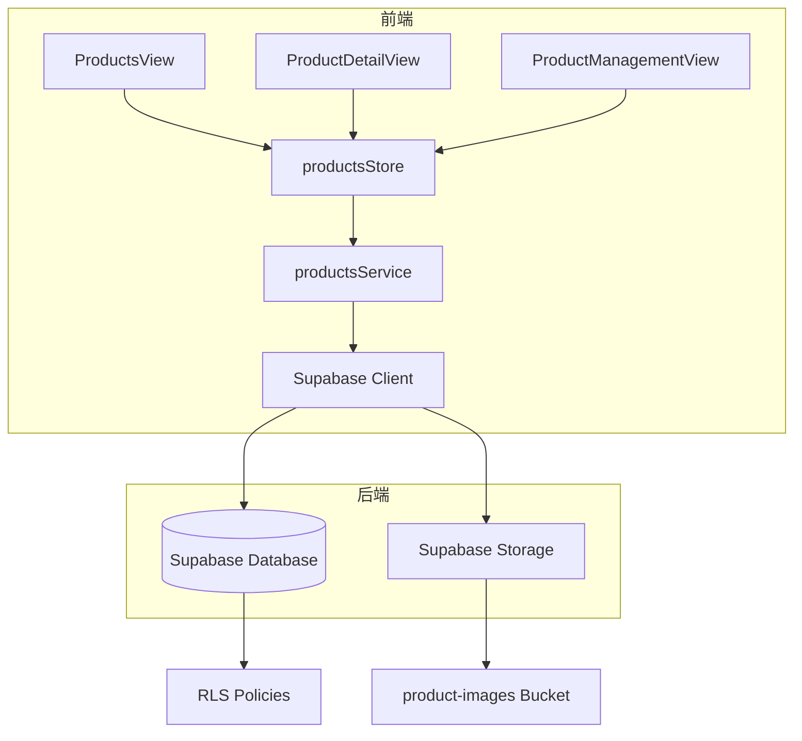
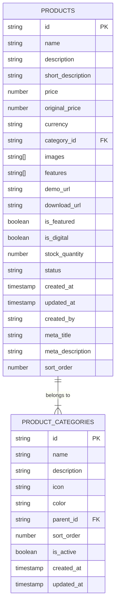
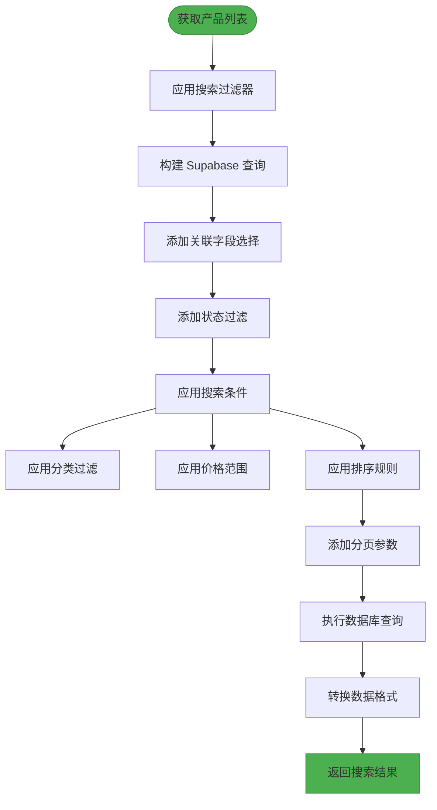
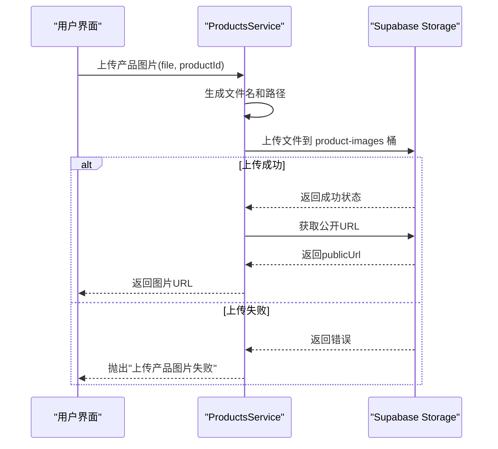
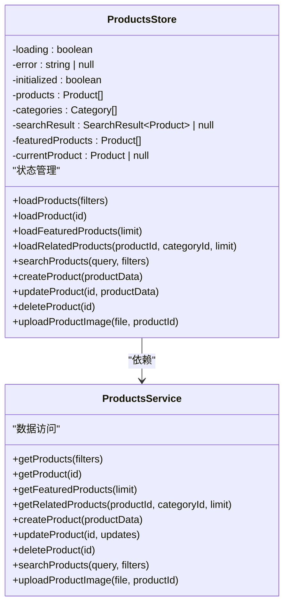
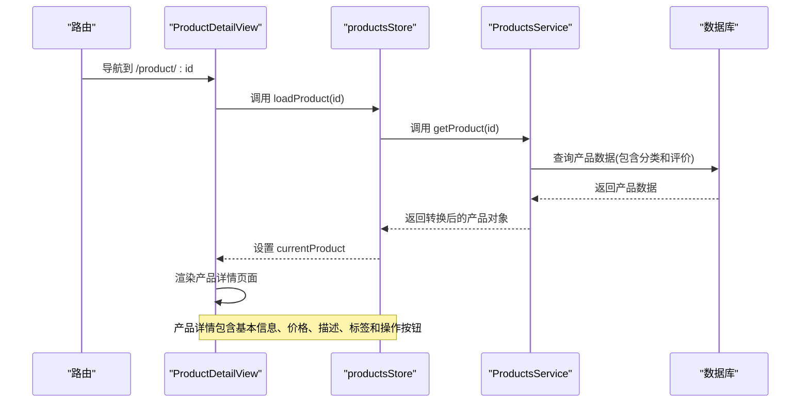
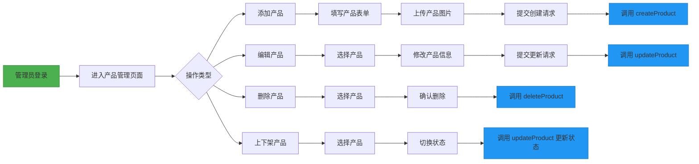
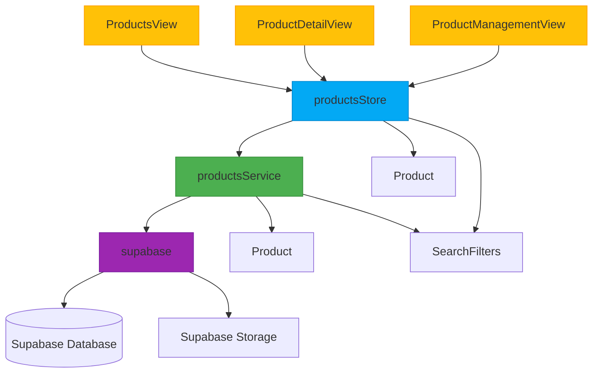

# 产品服务

<cite>
**本文档引用文件**  
- [productsService.ts](file://src/services/productsService.ts)
- [database.ts](file://src/types/database.ts)
- [index.ts](file://src/types/index.ts)
- [products.ts](file://src/stores/products.ts)
- [ProductsView.vue](file://src/views/ProductsView.vue)
- [ProductDetailView.vue](file://src/views/ProductDetailView.vue)
- [ProductManagementView.vue](file://src/views/admin/ProductManagementView.vue)
</cite>

## 目录
1. [简介](#简介)
2. [项目结构](#项目结构)
3. [核心组件](#核心组件)
4. [架构概览](#架构概览)
5. [详细组件分析](#详细组件分析)
6. [依赖分析](#依赖分析)
7. [性能考虑](#性能考虑)
8. [故障排除指南](#故障排除指南)
9. [结论](#结论)

## 简介
本文档全面解析 `productsService` 对产品数据的全生命周期管理，涵盖产品列表获取、详情查询、库存检查、上下架状态管理等操作。说明其与 Pinia store 的数据同步机制及在 `ProductsView` 和 `ProductDetailView` 中的使用模式。结合管理后台 `ProductManagementView`，描述管理员对产品的增删改查权限与流程。文档包含产品数据结构定义、图片存储集成（Supabase Storage）、搜索与过滤支持、缓存策略、权限控制（RLS）以及与订单、评价服务的关联关系。

## 项目结构
项目采用模块化结构，主要分为以下几个部分：
- `src/components`：存放通用组件和管理后台专用组件
- `src/services`：业务逻辑服务层，包括 `productsService.ts`
- `src/stores`：Pinia 状态管理模块
- `src/views`：页面视图组件
- `src/types`：类型定义文件
- `supabase/migrations`：数据库迁移脚本

产品相关功能集中在 `src/services/productsService.ts`，通过 Pinia store 与前端视图进行数据交互。

**Section sources**
- [productsService.ts](file://src/services/productsService.ts)
- [products.ts](file://src/stores/products.ts)

## 核心组件
`productsService` 是产品数据管理的核心服务，提供以下主要功能：
- 产品列表获取（支持分页、排序、过滤）
- 产品详情查询
- 特色产品获取
- 相关产品推荐
- 产品创建、更新、删除
- 产品图片上传
- 搜索功能

该服务通过 Supabase 客户端与后端数据库进行交互，实现了完整的 CRUD 操作。

**Section sources**
- [productsService.ts](file://src/services/productsService.ts)

## 架构概览
系统采用前后端分离架构，前端通过 Vue 3 + Pinia 实现响应式 UI 和状态管理，后端使用 Supabase 提供数据库和存储服务。



**Diagram sources**
- [productsService.ts](file://src/services/productsService.ts)
- [products.ts](file://src/stores/products.ts)
- [ProductsView.vue](file://src/views/ProductsView.vue)
- [ProductDetailView.vue](file://src/views/ProductDetailView.vue)
- [ProductManagementView.vue](file://src/views/admin/ProductManagementView.vue)

## 详细组件分析

### 产品数据结构
产品数据结构定义了产品实体的完整属性，包括基本信息、价格、分类、状态等。



**Diagram sources**
- [database.ts](file://src/types/database.ts)
- [index.ts](file://src/types/index.ts)

### 产品服务分析
`ProductsService` 类提供了完整的产品管理功能，所有方法均为静态方法，便于在不同组件中调用。

#### 产品查询流程


**Diagram sources**
- [productsService.ts](file://src/services/productsService.ts)

#### 产品图片上传流程


**Diagram sources**
- [productsService.ts](file://src/services/productsService.ts)

### Pinia Store 数据同步机制
`productsStore` 作为中间层，实现了本地状态管理与服务层的同步。



**Diagram sources**
- [productsService.ts](file://src/services/productsService.ts)
- [products.ts](file://src/stores/products.ts)

### 视图组件使用模式
#### ProductsView 使用流程
```mermaid
flowchart TD
A[ProductsView 初始化] --> B[调用 productsStore.initialize()]
B --> C[加载产品列表]
C --> D[显示产品网格]
D --> E{用户操作}
E --> F[搜索产品]
E --> G[筛选分类]
E --> H[排序产品]
F --> I[调用 searchProducts]
G --> J[更新 selectedCategory]
H --> K[更新 sortBy/sortOrder]
I --> C
J --> C
K --> C
style A fill:#2196F3,stroke:#1976D2
style D fill:#4CAF50,stroke:#388E3C
```

**Diagram sources**
- [ProductsView.vue](file://src/views/ProductsView.vue)
- [products.ts](file://src/stores/products.ts)

#### ProductDetailView 使用流程


**Diagram sources**
- [ProductDetailView.vue](file://src/views/ProductDetailView.vue)
- [products.ts](file://src/stores/products.ts)

### 管理后台权限与流程
管理员通过 `ProductManagementView` 对产品进行增删改查操作。



**Diagram sources**
- [ProductManagementView.vue](file://src/views/admin/ProductManagementView.vue)
- [productsService.ts](file://src/services/productsService.ts)

## 依赖分析
系统依赖关系清晰，各层职责分明。



**Diagram sources**
- [productsService.ts](file://src/services/productsService.ts)
- [products.ts](file://src/stores/products.ts)
- [ProductsView.vue](file://src/views/ProductsView.vue)
- [ProductDetailView.vue](file://src/views/ProductDetailView.vue)
- [ProductManagementView.vue](file://src/views/admin/ProductManagementView.vue)

## 性能考虑
系统在性能方面做了多项优化：

1. **分页加载**：产品列表采用分页机制，默认每页12条数据
2. **懒加载**：图片资源采用懒加载策略
3. **缓存策略**：Pinia store 缓存已加载的产品数据
4. **批量操作**：相关查询使用单次数据库查询获取关联数据
5. **索引优化**：数据库关键字段（如status、category_id）应建立索引

搜索功能支持全文检索，通过 `ilike` 操作符实现模糊匹配，同时支持多条件组合过滤。

## 故障排除指南
常见问题及解决方案：

**Section sources**
- [productsService.ts](file://src/services/productsService.ts)
- [products.ts](file://src/stores/products.ts)

### 产品列表无法加载
- 检查网络连接是否正常
- 确认 Supabase 服务是否可用
- 查看浏览器控制台是否有错误信息
- 验证 RLS 策略是否正确配置

### 产品图片上传失败
- 检查文件大小是否超过限制
- 确认 `product-images` 存储桶是否存在
- 验证存储策略是否允许上传
- 检查文件类型是否被允许

### 搜索功能不生效
- 确认搜索查询是否包含有效关键字
- 检查过滤条件是否过于严格
- 验证数据库文本搜索配置
- 查看是否需要重建全文索引

## 结论
`productsService` 提供了完整的产品数据管理解决方案，通过与 Pinia store 的紧密配合，实现了高效的数据同步和状态管理。系统架构清晰，职责分明，支持产品全生命周期管理，包括增删改查、上下架、图片管理等功能。通过 Supabase 的 RLS 策略实现了细粒度的权限控制，确保数据安全。整体设计考虑了性能优化和用户体验，为产品管理提供了可靠的技术基础。