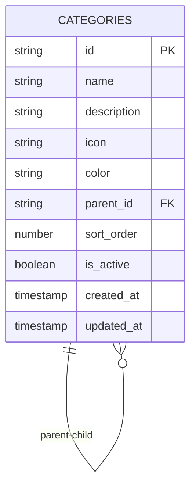
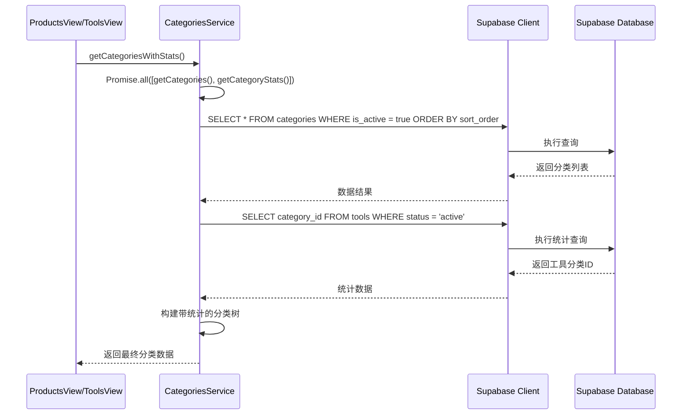
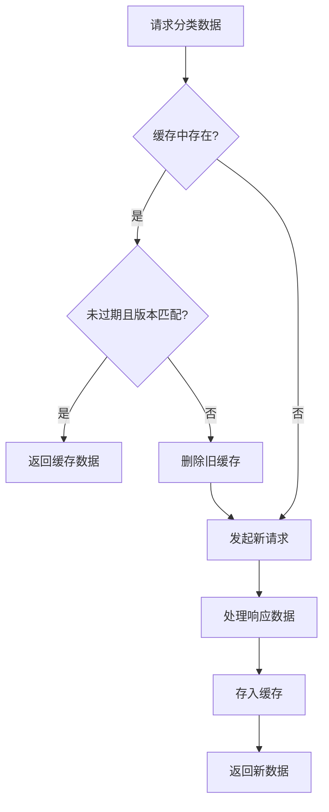
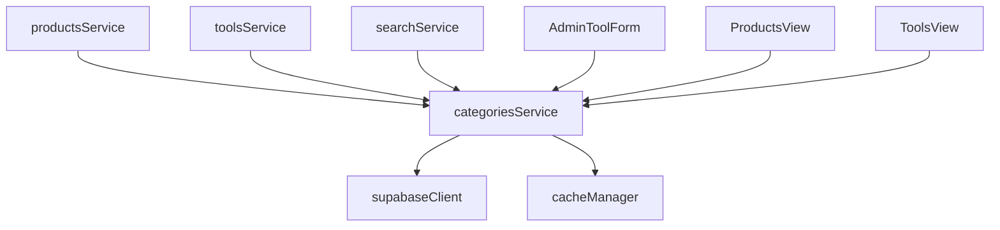

# 分类服务

<cite>
**本文档中引用的文件**  
- [categoriesService.ts](file://src/services/categoriesService.ts)
- [cacheManager.ts](file://src/utils/cacheManager.ts)
- [supabaseClient.ts](file://src/lib/supabaseClient.ts)
- [database.ts](file://src/types/database.ts)
</cite>

## 目录
1. [介绍](#介绍)
2. [分类数据结构与层级关系](#分类数据结构与层级关系)
3. [分类数据获取逻辑](#分类数据获取逻辑)
4. [本地缓存策略](#本地缓存策略)
5. [分类服务在视图中的使用场景](#分类服务在视图中的使用场景)
6. [数据更新机制](#数据更新机制)
7. [异常处理与降级方案](#异常处理与降级方案)
8. [与其他服务的依赖关系](#与其他服务的依赖关系)

## 介绍
`categoriesService` 是系统中负责管理工具与产品分类的核心服务模块。它封装了对分类数据的增删改查操作，支持树形层级结构，并通过与 Supabase 数据库交互实现持久化存储。该服务结合 `cacheManager` 实现高效的本地缓存机制，显著减少重复请求，提升前端性能。本文档全面介绍其设计原理、实现细节及在 `ProductsView` 和 `ToolsView` 中的实际应用。

**Section sources**
- [categoriesService.ts](file://src/services/categoriesService.ts#L1-L20)

## 分类数据结构与层级关系
分类数据采用树形结构组织，支持多级嵌套。每个分类包含名称、描述、图标、颜色、排序顺序、激活状态以及父级分类 ID 等属性。通过 `parent_id` 字段建立父子关系，形成层级结构。

数据库中的 `categories` 表定义了以下关键字段：
- `id`: 分类唯一标识
- `name`: 分类名称
- `description`: 描述信息
- `icon`: 图标标识符
- `color`: 显示颜色
- `parent_id`: 父分类 ID（为空表示根分类）
- `sort_order`: 排序权重
- `is_active`: 是否启用

服务通过 `buildCategoryTree` 方法将扁平化的数据库记录转换为嵌套的树形结构，便于前端组件递归渲染。

**Diagram sources**
- [database.ts](file://src/types/database.ts#L50-L80)
- [categoriesService.ts](file://src/services/categoriesService.ts#L250-L277)

## 分类数据获取逻辑
`categoriesService` 提供多种方法从 Supabase 数据库读取分类数据，核心方法为 `getCategories()` 和 `getCategoriesWithStats()`。

### 查询字段与过滤条件
`getCategories()` 方法使用 Supabase 客户端执行以下查询：
- 选择所有字段（`select("*")`）
- 过滤仅激活状态的分类（`.eq("is_active", true)`）
- 按 `sort_order` 升序排列（`.order("sort_order", { ascending: true })`）

此查询逻辑确保只展示有效分类，并按预设顺序显示。

### 与迁移文件中 schema 的一致性
数据库 schema 在 `supabase/migrations/20241224000001_initial_schema.sql` 中定义，与 `types/database.ts` 类型定义保持同步。`categories` 表的字段类型、约束和索引均与服务层代码一致，确保类型安全和查询正确性。

**Diagram sources**
- [categoriesService.ts](file://src/services/categoriesService.ts#L25-L50)
- [supabaseClient.ts](file://src/lib/supabaseClient.ts#L50-L70)

**Section sources**
- [categoriesService.ts](file://src/services/categoriesService.ts#L25-L100)

## 本地缓存策略
为提升性能并减少对后端的重复请求，`categoriesService` 集成 `cacheManager` 实现本地缓存机制。

### 缓存实例配置
系统初始化了多个缓存实例，其中 `apiCache` 被用于 API 数据缓存：
- 缓存有效期：3分钟（`maxAge: 3 * 60 * 1000`）
- 最大缓存项数：200
- 支持 localStorage 持久化
- 前缀命名空间隔离（`api_cache_`）

### 缓存键生成与命中
虽然当前 `categoriesService` 方法未直接使用 `withCache` 装饰器，但可通过 `useCache` Composable 在组件层实现缓存。典型缓存键如 `"categories_all"` 或 `"categories_with_stats"` 可用于标识不同数据集。

缓存管理器在获取数据时自动检查：
- 是否存在缓存项
- 是否已过期（基于 `expiry` 时间戳）
- 版本是否匹配（防止结构变更导致错误）

若缓存有效则直接返回，否则重新请求并更新缓存。

**Diagram sources**
- [cacheManager.ts](file://src/utils/cacheManager.ts#L100-L200)
- [categoriesService.ts](file://src/services/categoriesService.ts#L25-L50)

**Section sources**
- [cacheManager.ts](file://src/utils/cacheManager.ts#L1-L396)

## 分类服务在视图中的使用场景
`categoriesService` 主要在 `ProductsView.vue` 和 `ToolsView.vue` 中被调用，用于初始化页面所需的分类数据。

### ProductsView 使用流程
1. 组件挂载时调用 `CategoriesService.getCategoriesWithStats()`
2. 获取包含工具/产品数量统计的分类树
3. 渲染分类导航菜单或筛选面板
4. 用户选择分类后触发对应产品的加载

### ToolsView 使用流程
1. 页面初始化获取所有激活分类
2. 构建分类侧边栏或顶部标签页
3. 结合 `toolsService` 根据分类 ID 加载对应工具列表
4. 显示每个分类下的工具数量（通过统计信息）

此类使用模式减少了每次页面切换时的数据库查询压力，尤其在频繁访问分类导航的场景下表现优异。

**Section sources**
- [categoriesService.ts](file://src/services/categoriesService.ts#L25-L50)
- [ProductsView.vue](file://src/views/ProductsView.vue#L1-L50)
- [ToolsView.vue](file://src/views/ToolsView.vue#L1-L50)

## 数据更新机制
分类服务提供完整的 CRUD 接口以支持管理后台的动态更新需求。

### 创建与更新
- `createCategory()`: 插入新分类，自动设置 `is_active=true`
- `updateCategory()`: 支持部分字段更新，并自动更新 `updated_at` 时间戳

### 删除限制
删除操作包含严格校验：
1. **子分类检查**：若存在子分类，则拒绝删除
2. **关联工具检查**：若分类下有工具，则拒绝删除

这些约束通过两次独立的 Supabase 查询实现，确保数据完整性。

### 实时同步（可选）
虽然当前未启用，但可通过 `REALTIME_CHANNELS.CATEGORIES` 订阅机制实现分类变更的实时推送，未来可扩展为自动刷新缓存。

**Section sources**
- [categoriesService.ts](file://src/services/categoriesService.ts#L100-L200)

## 异常处理与降级方案
服务层实现了完善的错误捕获与处理机制。

### 错误捕获
所有数据库操作均包裹在 `try-catch` 块中，捕获 Supabase 返回的错误对象，并通过 `handleSupabaseError()` 工具函数标准化错误消息。

### 前端降级策略
当分类加载失败时，前端可采取以下降级措施：
- 显示缓存中的旧数据（即使轻微过期）
- 展示简化版静态分类列表
- 提供“重试”按钮重新加载
- 记录错误日志并上报监控系统

此外，`useCache` 提供的 `loadWithCache` 方法天然支持“先展示缓存，后台刷新”的用户体验优化模式。

**Section sources**
- [categoriesService.ts](file://src/services/categoriesService.ts#L30-L50)
- [supabaseClient.ts](file://src/lib/supabaseClient.ts#L200-L230)
- [cacheManager.ts](file://src/utils/cacheManager.ts#L300-L350)

## 与其他服务的依赖关系
`categoriesService` 与多个核心服务存在协作关系：

### 依赖的服务
- `supabaseClient`: 提供数据库访问能力
- `cacheManager`: 提供缓存支持
- `errorHandler`: 统一错误处理（间接依赖）

### 被依赖的服务
- `productsService`: 使用分类信息过滤和组织产品
- `toolsService`: 同样依赖分类结构进行工具分类展示
- `searchService`: 在高级搜索中支持按分类筛选

### 数据一致性保障
分类变更可能影响 `tools` 和 `products` 表的外键引用。服务通过删除前检查机制确保引用完整性，避免孤儿记录。

**Diagram sources**
- [categoriesService.ts](file://src/services/categoriesService.ts#L1-L20)
- [productsService.ts](file://src/services/productsService.ts#L1-L20)
- [toolsService.ts](file://src/services/toolsService.ts#L1-L20)

**Section sources**
- [categoriesService.ts](file://src/services/categoriesService.ts#L1-L277)
- [productsService.ts](file://src/services/productsService.ts#L1-L50)
- [toolsService.ts](file://src/services/toolsService.ts#L1-L50)