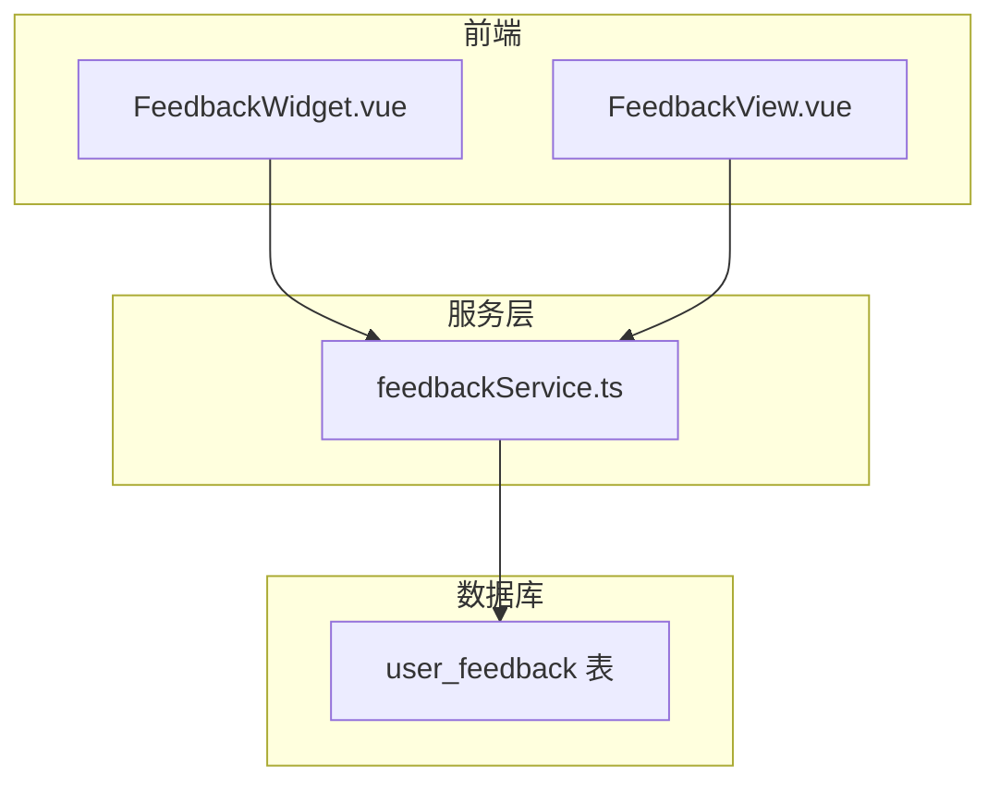
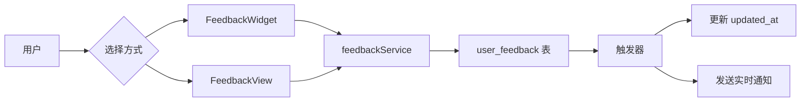
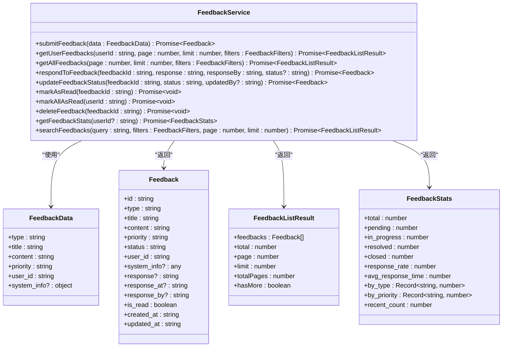
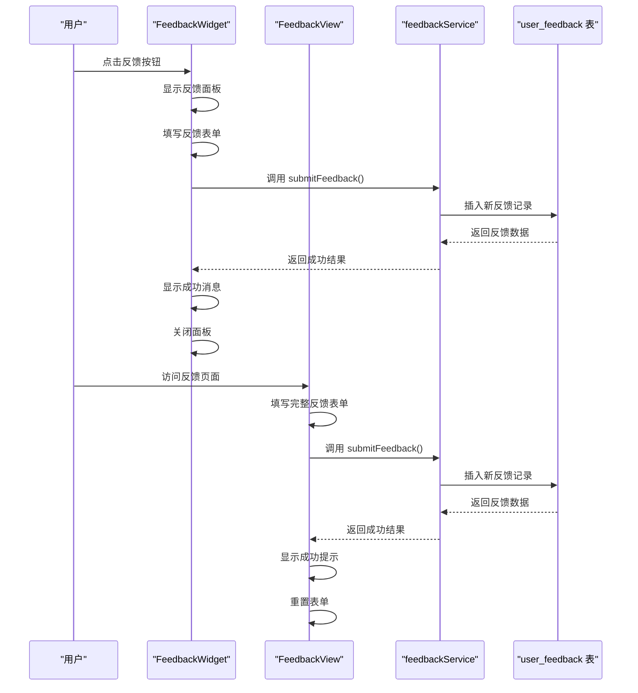
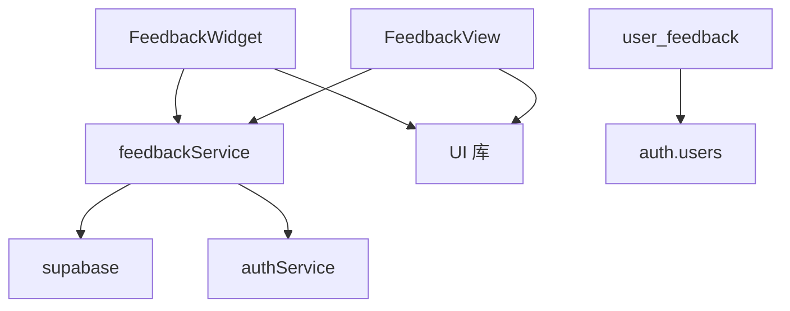

# 反馈服务

<cite>
**本文档引用的文件**  
- [feedbackService.ts](file://src/services/feedbackService.ts)
- [user_feedback.sql](file://supabase/migrations/20241227000001_user_feedback.sql)
- [FeedbackWidget.vue](file://src/components/feedback/FeedbackWidget.vue)
- [FeedbackView.vue](file://src/views/FeedbackView.vue)
</cite>

## 目录
1. [简介](#简介)
2. [项目结构](#项目结构)
3. [核心组件](#核心组件)
4. [架构概述](#架构概述)
5. [详细组件分析](#详细组件分析)
6. [依赖分析](#依赖分析)
7. [性能考虑](#性能考虑)
8. [故障排除指南](#故障排除指南)
9. [结论](#结论)

## 简介
本文档深入解析 `feedbackService` 如何处理用户提交的反馈信息。说明其与 Supabase 数据库 `user_feedback` 表的交互逻辑，包括数据插入、字段验证（如内容长度、敏感词过滤）及关联用户 ID 的自动绑定。结合 `FeedbackWidget` 和 `FeedbackView` 组件，展示前端调用方式与响应处理。文档涵盖反馈状态管理、提交成功/失败的 UI 反馈机制、数据安全与隐私保护措施（如内容加密存储）、后台审核流程支持以及与通知系统集成的待办提醒功能。

## 项目结构
反馈服务相关文件分布在多个目录中，主要包括服务层、数据库迁移、前端组件和视图。服务逻辑集中在 `src/services/feedbackService.ts`，数据库结构定义在 `supabase/migrations/20241227000001_user_feedback.sql`，前端交互组件位于 `src/components/feedback/FeedbackWidget.vue` 和 `src/views/FeedbackView.vue`。

**图示来源**  
- [feedbackService.ts](file://src/services/feedbackService.ts)
- [user_feedback.sql](file://supabase/migrations/20241227000001_user_feedback.sql)
- [FeedbackWidget.vue](file://src/components/feedback/FeedbackWidget.vue)
- [FeedbackView.vue](file://src/views/FeedbackView.vue)

**本节来源**  
- [src/components/feedback/FeedbackWidget.vue](file://src/components/feedback/FeedbackWidget.vue)
- [src/views/FeedbackView.vue](file://src/views/FeedbackView.vue)
- [src/services/feedbackService.ts](file://src/services/feedbackService.ts)
- [supabase/migrations/20241227000001_user_feedback.sql](file://supabase/migrations/20241227000001_user_feedback.sql)

## 核心组件
`feedbackService` 是处理用户反馈的核心服务，提供提交、查询、更新和删除反馈的接口。`FeedbackWidget` 是一个浮动组件，允许用户快速提交反馈并查看历史记录。`FeedbackView` 是完整的反馈提交页面，提供更详细的表单和指南。数据库通过 `user_feedback` 表持久化存储所有反馈数据，并通过行级安全策略（RLS）确保数据访问安全。

**本节来源**  
- [feedbackService.ts](file://src/services/feedbackService.ts#L1-L507)
- [FeedbackWidget.vue](file://src/components/feedback/FeedbackWidget.vue#L1-L799)
- [FeedbackView.vue](file://src/views/FeedbackView.vue#L1-L343)
- [user_feedback.sql](file://supabase/migrations/20241227000001_user_feedback.sql#L1-L283)

## 架构概述
系统采用前后端分离架构。前端组件通过 `feedbackService` 与 Supabase 数据库交互。`FeedbackWidget` 提供轻量级的反馈入口，而 `FeedbackView` 提供完整的反馈表单。所有反馈数据存储在 `user_feedback` 表中，通过 RLS 策略控制访问权限。系统通过触发器实现自动更新时间和实时通知。

**图示来源**  
- [feedbackService.ts](file://src/services/feedbackService.ts)
- [user_feedback.sql](file://supabase/migrations/20241227000001_user_feedback.sql)
- [FeedbackWidget.vue](file://src/components/feedback/FeedbackWidget.vue)
- [FeedbackView.vue](file://src/views/FeedbackView.vue)

## 详细组件分析

### 反馈服务分析
`feedbackService` 类封装了所有与反馈相关的业务逻辑。它提供 `submitFeedback` 方法处理用户提交，`getUserFeedbacks` 和 `getAllFeedbacks` 方法查询反馈列表，`respondToFeedback` 和 `updateFeedbackStatus` 方法处理反馈回复和状态更新。

#### 类图

**图示来源**  
- [feedbackService.ts](file://src/services/feedbackService.ts#L1-L507)

**本节来源**  
- [feedbackService.ts](file://src/services/feedbackService.ts#L1-L507)

### 反馈组件分析
`FeedbackWidget` 和 `FeedbackView` 是用户提交反馈的主要界面。`FeedbackWidget` 作为浮动按钮集成在应用中，提供快速访问。`FeedbackView` 是独立页面，提供更完整的反馈表单和指南。

#### 序列图

**图示来源**  
- [FeedbackWidget.vue](file://src/components/feedback/FeedbackWidget.vue)
- [FeedbackView.vue](file://src/views/FeedbackView.vue)
- [feedbackService.ts](file://src/services/feedbackService.ts)
- [user_feedback.sql](file://supabase/migrations/20241227000001_user_feedback.sql)

**本节来源**  
- [FeedbackWidget.vue](file://src/components/feedback/FeedbackWidget.vue#L1-L799)
- [FeedbackView.vue](file://src/views/FeedbackView.vue#L1-L343)

## 依赖分析
反馈服务依赖 Supabase 客户端进行数据库操作，依赖认证服务获取用户信息。前端组件依赖 `feedbackService` 进行数据交互，依赖 UI 库（如 lucide-vue-next）提供图标。数据库表通过外键约束与 `auth.users` 表关联，确保用户 ID 的有效性。

**图示来源**  
- [feedbackService.ts](file://src/services/feedbackService.ts)
- [FeedbackWidget.vue](file://src/components/feedback/FeedbackWidget.vue)
- [FeedbackView.vue](file://src/views/FeedbackView.vue)
- [user_feedback.sql](file://supabase/migrations/20241227000001_user_feedback.sql)

**本节来源**  
- [feedbackService.ts](file://src/services/feedbackService.ts#L1-L507)
- [FeedbackWidget.vue](file://src/components/feedback/FeedbackWidget.vue#L1-L799)
- [FeedbackView.vue](file://src/views/FeedbackView.vue#L1-L343)
- [user_feedback.sql](file://supabase/migrations/20241227000001_user_feedback.sql#L1-L283)

## 性能考虑
服务端通过数据库索引优化查询性能，包括 `user_id`、`status`、`type` 和 `created_at` 字段的索引。前端实现分页加载，避免一次性加载过多数据。`getAllFeedbacks` 方法支持筛选条件，减少不必要的数据传输。数据库触发器轻量高效，不影响主要业务流程。

## 故障排除指南
常见问题包括反馈提交失败、无法加载反馈历史、权限错误等。检查网络连接，确保用户已登录。验证数据库 RLS 策略配置正确。检查 `supabase` 客户端初始化状态。查看浏览器控制台和服务器日志获取详细错误信息。确保数据库表结构与迁移文件一致。

**本节来源**  
- [feedbackService.ts](file://src/services/feedbackService.ts#L54-L109)
- [feedbackService.ts](file://src/services/feedbackService.ts#L105-L156)
- [user_feedback.sql](file://supabase/migrations/20241227000001_user_feedback.sql#L1-L283)

## 结论
反馈服务提供了一套完整的用户反馈处理机制，从前端交互到后端存储，再到权限控制和实时通知。系统设计合理，代码结构清晰，易于维护和扩展。通过 RLS 策略确保数据安全，通过索引和分页优化性能。未来可考虑增加敏感词过滤、内容加密存储等安全特性，以及更智能的分类和优先级分配算法。