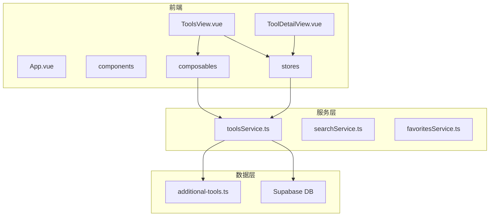
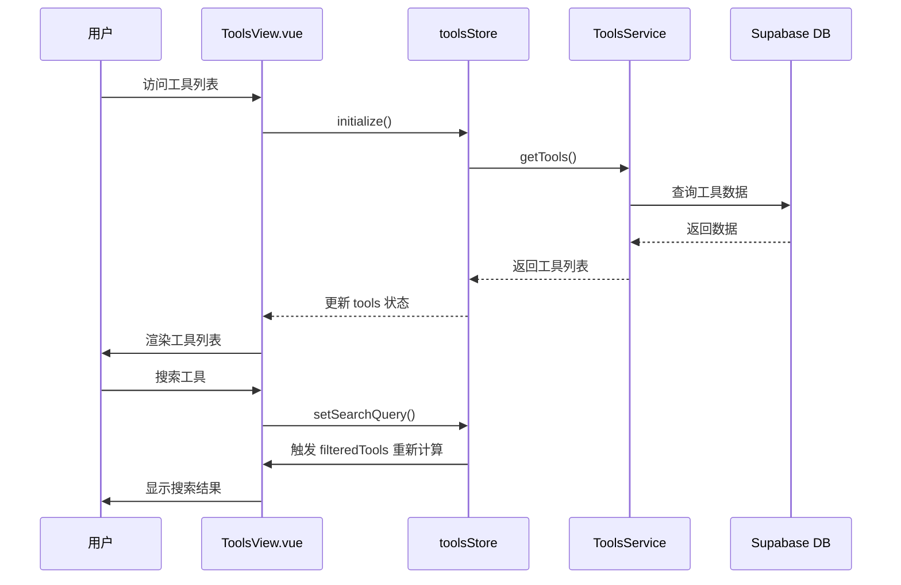
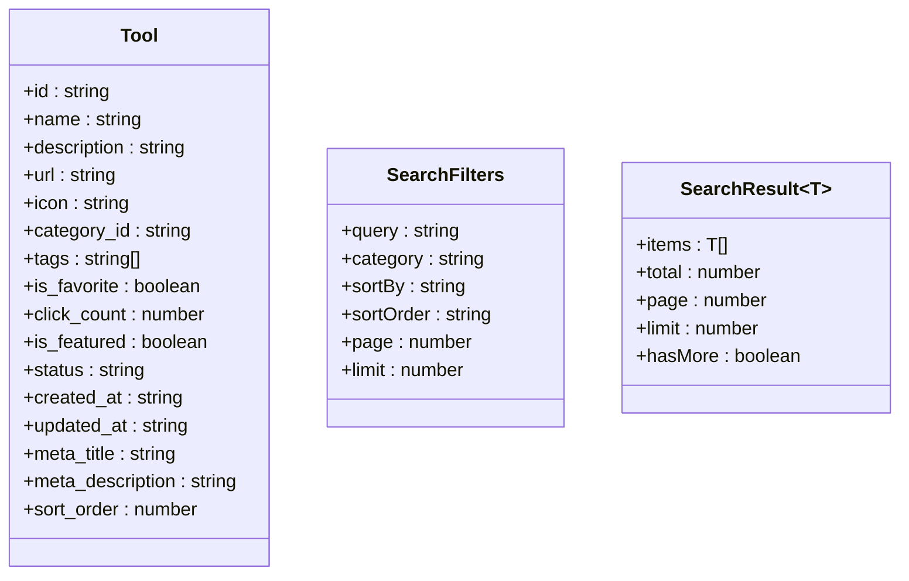
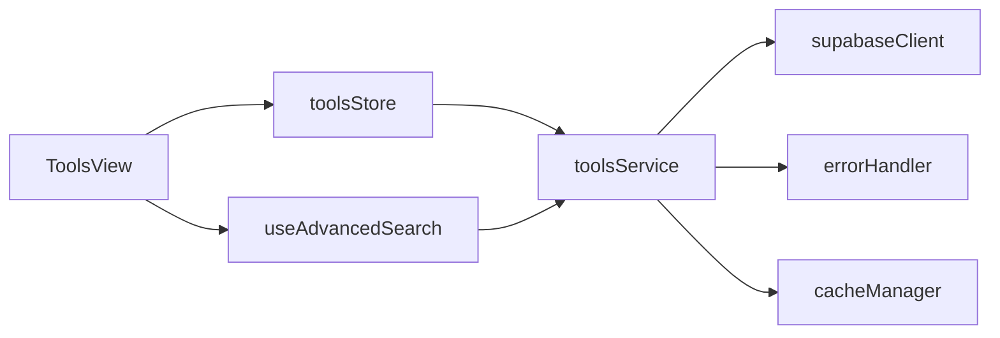

# 工具服务

<cite>
**本文档中引用的文件**  
- [toolsService.ts](file://src/services/toolsService.ts)
- [additional-tools.ts](file://src/data/additional-tools.ts)
- [tools.ts](file://src/stores/tools.ts)
- [ToolsView.vue](file://src/views/ToolsView.vue)
- [ToolDetailView.vue](file://src/views/ToolDetailView.vue)
</cite>

## 目录
1. [简介](#简介)
2. [项目结构](#项目结构)
3. [核心组件](#核心组件)
4. [架构概览](#架构概览)
5. [详细组件分析](#详细组件分析)
6. [依赖分析](#依赖分析)
7. [性能考虑](#性能考虑)
8. [故障排除指南](#故障排除指南)
9. [结论](#结论)

## 简介
本项目是一个高级工具导航系统，旨在为用户提供高效、直观的工具发现与管理体验。系统通过集成 Supabase 作为后端服务，结合 Vue 3 和 Pinia 构建响应式前端界面，实现了工具列表展示、详情查看、分类筛选、排序、收藏等功能。核心功能由 `toolsService` 提供，配合 Pinia store 管理状态，并在 `ToolsView` 和 `ToolDetailView` 中实现数据供给与用户交互。系统还引入了静态数据 `additional-tools.ts` 作为补充数据源，支持混合数据处理策略。

## 项目结构
项目采用典型的 Vue 3 + Vite 架构，结合 Pinia 进行状态管理，Supabase 实现后端服务。主要目录包括：
- `src/components`：通用与业务组件
- `src/composables`：可组合函数，如搜索、懒加载
- `src/data`：静态数据文件
- `src/lib`：Supabase 客户端配置
- `src/router`：路由配置
- `src/services`：各类业务服务，如工具、分类、收藏服务
- `src/stores`：Pinia 状态管理
- `src/types`：类型定义
- `src/utils`：工具函数，如缓存、错误处理
- `src/views`：页面视图组件



**Diagram sources**
- [ToolsView.vue](file://src/views/ToolsView.vue)
- [ToolDetailView.vue](file://src/views/ToolDetailView.vue)
- [toolsService.ts](file://src/services/toolsService.ts)
- [additional-tools.ts](file://src/data/additional-tools.ts)

**Section sources**
- [ToolsView.vue](file://src/views/ToolsView.vue)
- [ToolDetailView.vue](file://src/views/ToolDetailView.vue)
- [toolsService.ts](file://src/services/toolsService.ts)
- [additional-tools.ts](file://src/data/additional-tools.ts)

## 核心组件
`toolsService` 是系统的核心服务，负责工具数据的获取、查询、筛选、排序及收藏状态管理。它通过 Supabase 客户端与数据库交互，支持缓存机制以提升性能。`toolsStore` 使用 Pinia 管理工具状态，提供响应式数据流。`ToolsView` 和 `ToolDetailView` 作为主要视图组件，消费 store 中的数据并提供用户交互界面。

**Section sources**
- [toolsService.ts](file://src/services/toolsService.ts)
- [tools.ts](file://src/stores/tools.ts)
- [ToolsView.vue](file://src/views/ToolsView.vue)
- [ToolDetailView.vue](file://src/views/ToolDetailView.vue)

## 架构概览
系统采用分层架构，前端通过 Pinia store 管理状态，服务层提供业务逻辑，数据层包括 Supabase 数据库和静态数据文件。`toolsService` 封装了所有工具相关的 API 调用，支持缓存和错误处理。`toolsStore` 初始化时调用 `fetchTools`，从 Supabase 获取数据或回退到模拟数据。视图组件通过计算属性 `filteredTools` 实现动态过滤和排序。



**Diagram sources**
- [ToolsView.vue](file://src/views/ToolsView.vue)
- [tools.ts](file://src/stores/tools.ts)
- [toolsService.ts](file://src/services/toolsService.ts)

## 详细组件分析

### 工具服务分析
`toolsService` 提供了完整的工具管理功能，包括获取工具列表、详情查询、分类筛选、排序（按热度、评分）、收藏状态更新等。所有读取操作均使用缓存机制，写操作后清除相关缓存以保证数据一致性。

#### 工具数据结构


**Diagram sources**
- [toolsService.ts](file://src/services/toolsService.ts)

#### 缓存机制
`toolsService` 使用 `withCache` 装饰器实现缓存，不同接口设置不同缓存时间：
- 工具列表：2分钟
- 单个工具：5分钟
- 热门工具：5分钟
- 推荐工具：10分钟

写操作（创建、更新、删除）后调用 `clearRelatedCache` 清除相关缓存。

**Section sources**
- [toolsService.ts](file://src/services/toolsService.ts)

### 工具视图分析
`ToolsView.vue` 是工具列表的主视图，支持搜索、分类筛选、排序、视图模式切换（网格/列表）等功能。它通过 `useToolsStore` 获取工具数据，并使用计算属性 `filteredTools` 实现动态过滤。

#### 数据供给流程
```mermaid
flowchart TD
A[onMounted] --> B{initialized?}
B --> |No| C[initialize()]
C --> D[fetchTools()]
D --> E{Supabase配置?}
E --> |Yes| F[从Supabase获取数据]
E --> |No| G[使用模拟数据]
F --> H[处理标签数据]
H --> I[更新tools状态]
G --> I
I --> J[渲染工具列表]
K[用户交互] --> L[更新searchQuery/sortBy等]
L --> M[触发filteredTools重新计算]
M --> J
```

**Diagram sources**
- [ToolsView.vue](file://src/views/ToolsView.vue)

**Section sources**
- [ToolsView.vue](file://src/views/ToolsView.vue)

## 依赖分析
系统依赖关系清晰，前端组件依赖 Pinia store，store 依赖 services，services 依赖 Supabase 客户端和工具函数。`toolsService` 依赖 `supabaseClient`、`errorHandler` 和 `cacheManager`。`toolsStore` 依赖 `supabase` 客户端和 `toolsService`。视图组件依赖 store 和可组合函数。



**Diagram sources**
- [go.mod](file://package.json)
- [toolsService.ts](file://src/services/toolsService.ts)
- [tools.ts](file://src/stores/tools.ts)
- [ToolsView.vue](file://src/views/ToolsView.vue)

**Section sources**
- [package.json](file://package.json)
- [toolsService.ts](file://src/services/toolsService.ts)
- [tools.ts](file://src/stores/tools.ts)
- [ToolsView.vue](file://src/views/ToolsView.vue)

## 性能考虑
系统在多个层面进行了性能优化：
1. **缓存机制**：`toolsService` 对读取操作进行缓存，减少数据库查询次数。
2. **虚拟滚动**：虽未在当前代码中实现，但可通过 `LazyComponent` 和 `LazyImage` 组件支持。
3. **按需加载**：使用 `defineAsyncComponent` 实现组件懒加载。
4. **高效渲染**：`filteredTools` 使用计算属性，仅在依赖变化时重新计算。
5. **原子操作**：点击次数通过 Supabase RPC 函数 `increment_click_count` 原子更新。

## 故障排除指南
常见问题及解决方案：
- **Supabase 配置错误**：检查 `.env` 文件中的 `VITE_SUPABASE_URL` 和 `VITE_SUPABASE_ANON_KEY`。
- **数据加载失败**：`toolsStore.fetchTools` 会自动回退到模拟数据，确保网络连接正常。
- **缓存问题**：写操作后调用 `clearRelatedCache` 清除缓存。
- **收藏功能未实现**：`toggleFavorite` 方法目前仅打印日志，需集成 `favoritesService`。

**Section sources**
- [tools.ts](file://src/stores/tools.ts)
- [toolsService.ts](file://src/services/toolsService.ts)

## 结论
本系统通过 `toolsService` 实现了对导航工具数据的全面管理，结合 Pinia store 提供响应式状态管理，在 `ToolsView` 和 `ToolDetailView` 中实现高效的数据供给。系统支持混合数据源（Supabase + 静态数据），具备完善的缓存机制和错误处理策略。未来可进一步完善收藏功能，优化搜索性能，实现虚拟滚动以支持大量工具数据的流畅展示。