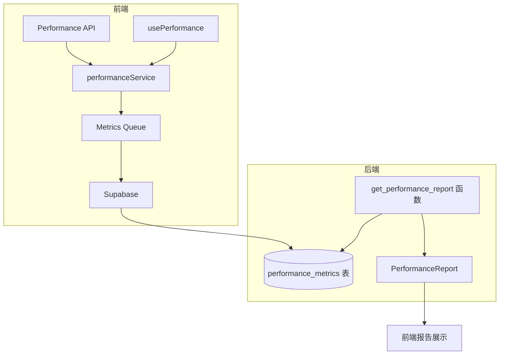
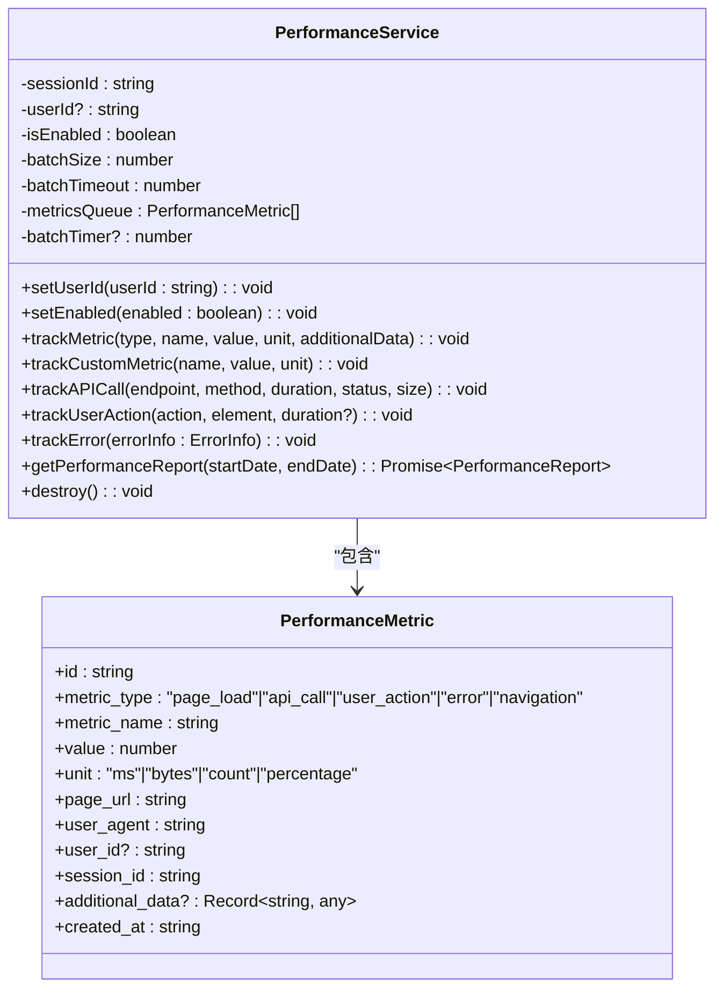
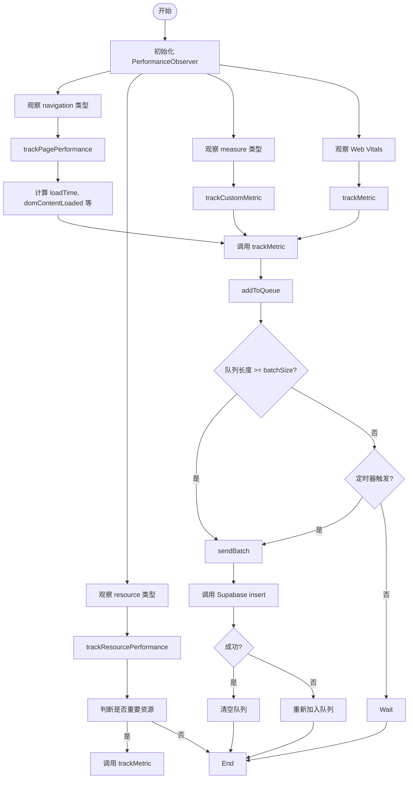
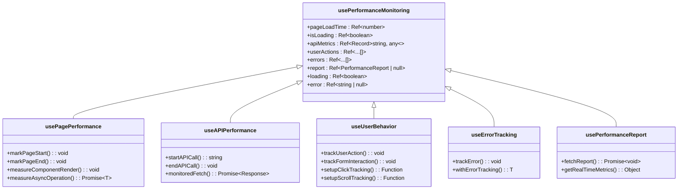
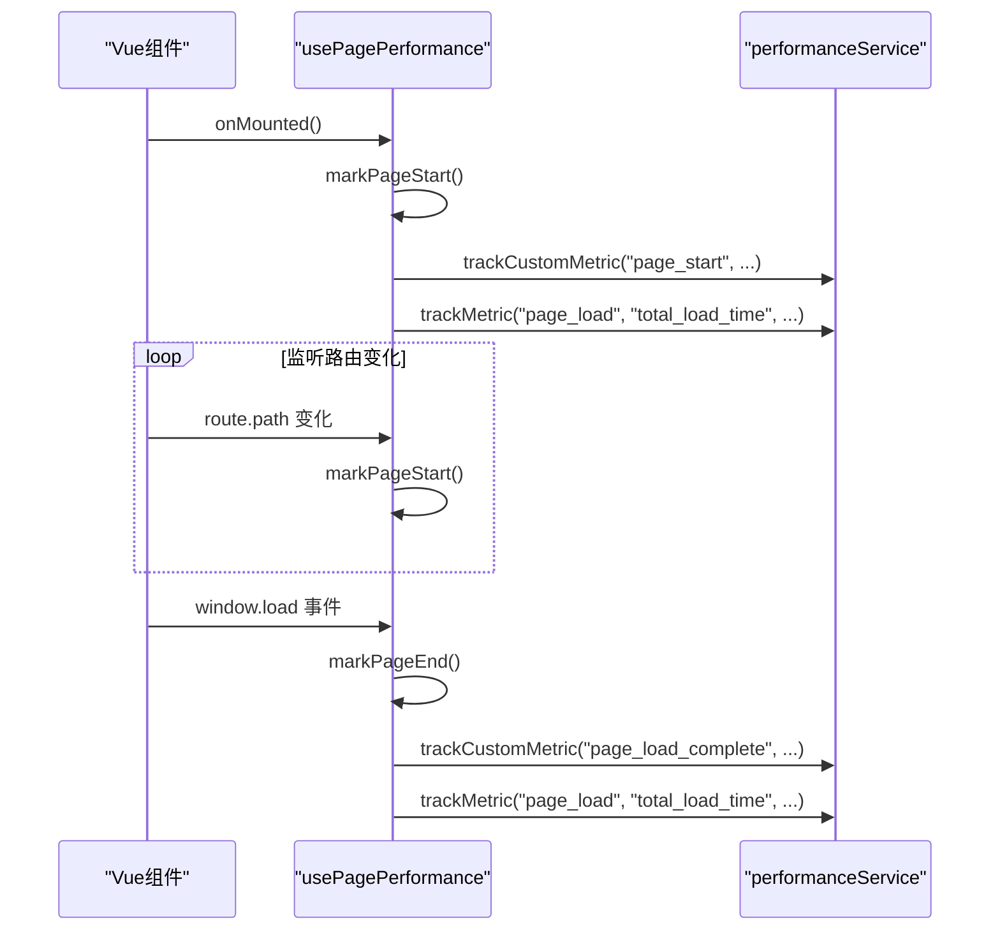
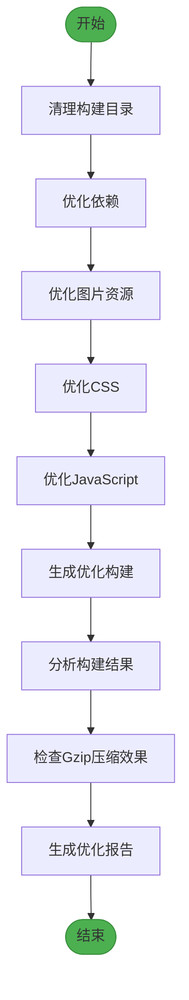
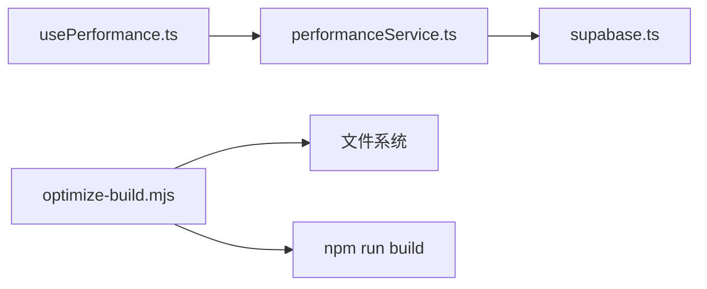

# 性能服务

<cite>
**本文档引用的文件**   
- [performanceService.ts](file://src/services/performanceService.ts)
- [usePerformance.ts](file://src/composables/usePerformance.ts)
- [optimize-build.mjs](file://scripts/performance/optimize-build.mjs)
</cite>

## 目录
1. [简介](#简介)
2. [项目结构](#项目结构)
3. [核心组件](#核心组件)
4. [架构概述](#架构概述)
5. [详细组件分析](#详细组件分析)
6. [依赖分析](#依赖分析)
7. [性能考虑](#性能考虑)
8. [故障排除指南](#故障排除指南)
9. [结论](#结论)

## 简介
本文档深入介绍了`performanceService`在前端性能指标收集与上报方面的技术实现。重点说明了其监控的关键性能指标（如首屏加载时间、组件渲染耗时、API响应延迟）及其采集时机，详细描述了数据上报机制（如批量发送、节流控制）与后端存储方案。通过`usePerformance`组合式函数，展示了在关键路径中埋点的使用方法。文档还涵盖了性能数据模型、隐私合规处理、异常性能告警机制、与构建优化脚本(optimize-build.mjs)的联动策略，以及基于数据的性能优化建议闭环。

## 项目结构
项目结构清晰地划分了不同功能模块。性能监控的核心逻辑位于`src/services/performanceService.ts`，组合式函数封装在`src/composables/usePerformance.ts`，而构建优化脚本则位于`scripts/performance/optimize-build.mjs`。这种分层设计确保了关注点分离，便于维护和扩展。

**Section sources**
- [performanceService.ts](file://src/services/performanceService.ts)
- [usePerformance.ts](file://src/composables/usePerformance.ts)
- [optimize-build.mjs](file://scripts/performance/optimize-build.mjs)

## 核心组件
本系统的核心组件包括`performanceService`，负责性能数据的收集、队列管理和上报；`usePerformance`组合式函数，为Vue组件提供便捷的性能监控API；以及`optimize-build.mjs`构建脚本，用于在构建阶段进行性能优化分析。

**Section sources**
- [performanceService.ts](file://src/services/performanceService.ts#L1-L50)
- [usePerformance.ts](file://src/composables/usePerformance.ts#L1-L50)
- [optimize-build.mjs](file://scripts/performance/optimize-build.mjs#L1-L50)

## 架构概述
系统采用客户端-服务端架构。前端通过`performanceService`实例化一个单例，利用浏览器的Performance API和自定义埋点来收集性能数据。数据被暂存在内存队列中，并通过批量和定时机制上报至Supabase后端。后端使用`get_performance_report`函数生成聚合报告，供前端查询。

**Diagram sources **
- [performanceService.ts](file://src/services/performanceService.ts#L1-L50)
- [usePerformance.ts](file://src/composables/usePerformance.ts#L1-L50)

## 详细组件分析

### performanceService 分析
`performanceService`是性能监控的核心服务，采用单例模式实现，确保全局唯一实例。

#### 类图

**Diagram sources **
- [performanceService.ts](file://src/services/performanceService.ts#L1-L500)

#### 关键指标采集流程

**Diagram sources **
- [performanceService.ts](file://src/services/performanceService.ts#L150-L456)

**Section sources**
- [performanceService.ts](file://src/services/performanceService.ts#L1-L500)

### usePerformance 分析
`usePerformance`是一组组合式函数，为Vue组件提供了更高层次的抽象，简化了性能监控的集成。

#### 组合式函数关系

**Diagram sources **
- [usePerformance.ts](file://src/composables/usePerformance.ts#L1-L489)

#### 页面性能监控序列图

**Diagram sources **
- [usePerformance.ts](file://src/composables/usePerformance.ts#L1-L150)

**Section sources**
- [usePerformance.ts](file://src/composables/usePerformance.ts#L1-L489)

### 构建优化脚本分析
`optimize-build.mjs`是一个Node.js脚本，用于在构建前执行一系列性能优化检查。

#### 构建优化流程

**Diagram sources **
- [optimize-build.mjs](file://scripts/performance/optimize-build.mjs#L1-L437)

**Section sources**
- [optimize-build.mjs](file://scripts/performance/optimize-build.mjs#L1-L437)

## 依赖分析
系统依赖关系清晰。`usePerformance`组合式函数依赖于`performanceService`来上报数据。`performanceService`依赖于`supabase`客户端与后端数据库交互。构建脚本`optimize-build.mjs`独立于前端代码，直接操作文件系统和执行构建命令。

**Diagram sources **
- [usePerformance.ts](file://src/composables/usePerformance.ts#L1-L10)
- [performanceService.ts](file://src/services/performanceService.ts#L1-L10)

**Section sources**
- [usePerformance.ts](file://src/composables/usePerformance.ts#L1-L50)
- [performanceService.ts](file://src/services/performanceService.ts#L1-L50)

## 性能考虑
系统在性能方面进行了精心设计。数据上报采用批量（batchSize=10）和定时（batchTimeout=5000ms）双重机制，有效减少了网络请求次数。内存队列在发送失败时会重新入队，保证了数据不丢失。`usePerformance`中的`measureAsyncOperation`等函数提供了对异步操作的精确监控，有助于定位性能瓶颈。

## 故障排除指南
当性能数据上报出现问题时，可按以下步骤排查：
1.  检查`performanceService.isEnabled`是否为`true`。
2.  查看浏览器控制台是否有"发送性能数据失败"或"发送性能数据异常"的错误日志。
3.  确认Supabase客户端配置正确，且`performance_metrics`表存在。
4.  检查网络连接是否正常。
5.  验证`get_performance_report`数据库函数是否已正确部署。

**Section sources**
- [performanceService.ts](file://src/services/performanceService.ts#L404-L456)

## 结论
`performanceService`及其配套的`usePerformance`组合式函数，构建了一套完整、健壮的前端性能监控体系。它不仅能自动采集关键性能指标，还支持灵活的自定义埋点。与构建优化脚本的结合，形成了从开发、构建到运行时的全链路性能保障闭环。通过持续分析上报的数据，团队可以做出数据驱动的决策，不断优化用户体验。