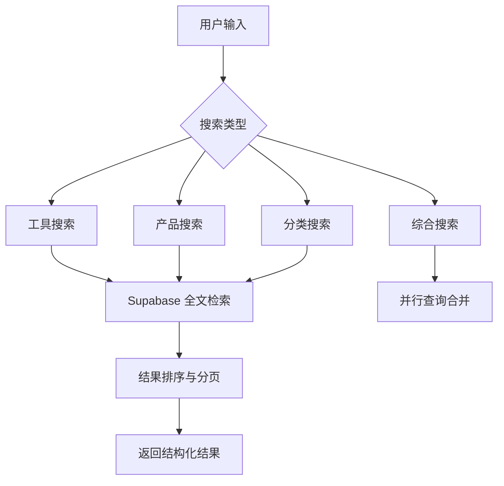
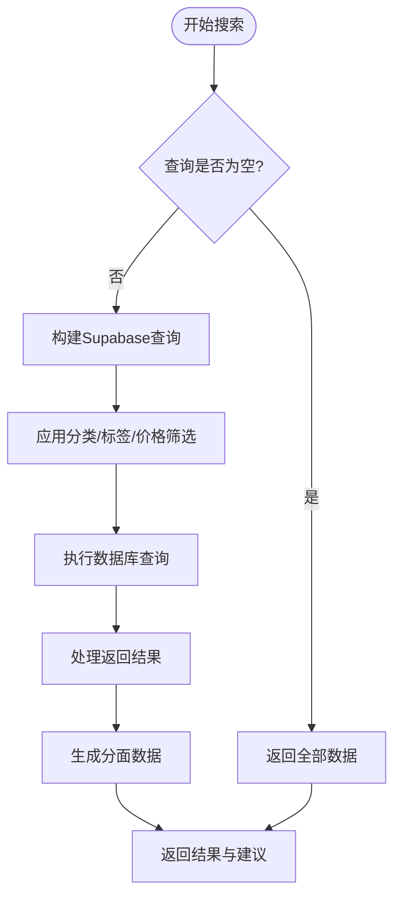
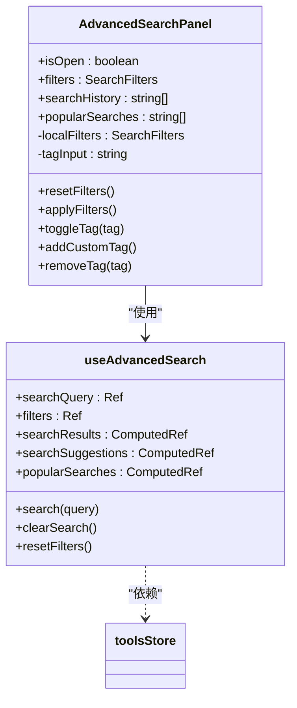
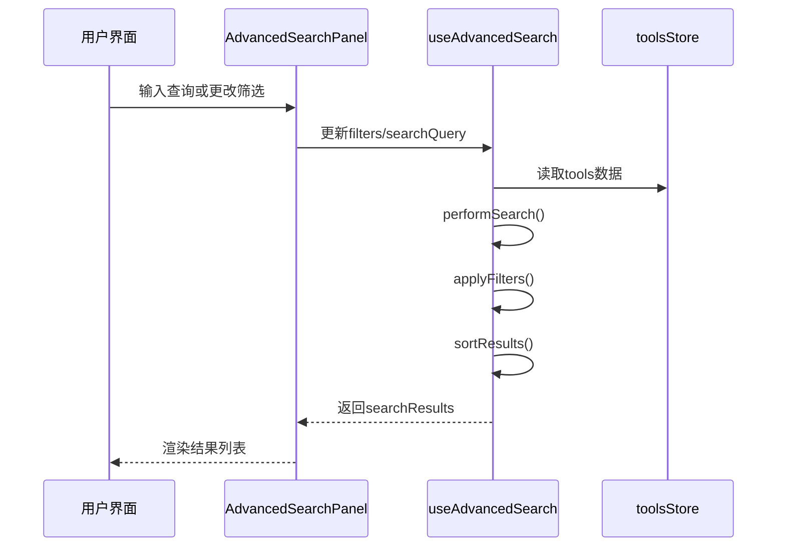
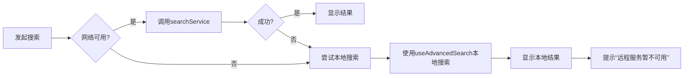

# 搜索服务

<cite>
**本文档中引用的文件**  
- [searchService.ts](file://src/services/searchService.ts)
- [useAdvancedSearch.ts](file://src/composables/useAdvancedSearch.ts)
- [AdvancedSearchPanel.vue](file://src/components/search/AdvancedSearchPanel.vue)
- [supabaseClient.ts](file://src/lib/supabaseClient.ts)
</cite>

## 目录
1. [简介](#简介)
2. [核心功能概述](#核心功能概述)
3. [搜索算法与实现机制](#搜索算法与实现机制)
4. [高级搜索面板组件分析](#高级搜索面板组件分析)
5. [复杂查询构建与执行流程](#复杂查询构建与执行流程)
6. [性能优化策略](#性能优化策略)
7. [结果排序逻辑](#结果排序逻辑)
8. [分页处理机制](#分页处理机制)
9. [错误降级方案](#错误降级方案)
10. [与UI组件的响应式集成模式](#与ui组件的响应式集成模式)
11. [总结](#总结)

## 简介

本系统提供了一套完整的全文搜索与高级过滤功能，基于 Supabase 实现后端数据检索，并结合前端组合式 API 和 UI 组件实现复杂的搜索交互。系统支持按名称、描述、分类、标签、价格范围等多维度筛选，具备智能建议、分面导航、历史记录和热门搜索等功能。

**Section sources**  
- [searchService.ts](file://src/services/searchService.ts#L1-L650)
- [useAdvancedSearch.ts](file://src/composables/useAdvancedSearch.ts#L1-L309)

## 核心功能概述

搜索系统由三个核心部分构成：`searchService` 提供后端数据查询能力，`useAdvancedSearch` 实现本地智能搜索逻辑，`AdvancedSearchPanel` 提供可视化高级筛选界面。系统支持多种搜索类型（工具、产品、分类、综合），并可通过模糊匹配、字段加权、相关性排序等方式提升用户体验。



**Diagram sources**  
- [searchService.ts](file://src/services/searchService.ts#L47-L647)

**Section sources**  
- [searchService.ts](file://src/services/searchService.ts#L1-L650)

## 搜索算法与实现机制

系统采用基于 Supabase 的全文检索（Fuzzy Search）策略，通过 `ilike` 操作符实现不区分大小写的模糊匹配。对于工具和产品的搜索，系统在 `name`、`description`、`meta_title` 和 `meta_description` 字段上进行 OR 查询，确保高召回率。

当查询包含关键词时，系统优先使用相关性排序：首先按 `is_featured` 特色标识降序排列，其次按 `click_count` 使用次数降序排列，从而提升高质量内容的曝光率。



**Diagram sources**  
- [searchService.ts](file://src/services/searchService.ts#L100-L200)

**Section sources**  
- [searchService.ts](file://src/services/searchService.ts#L47-L647)

## 高级搜索面板组件分析

`AdvancedSearchPanel.vue` 是一个模态式高级搜索界面，提供分类选择、标签筛选、评分过滤、特色工具标识、URL可用性判断等多种条件设置。组件通过 `v-model` 双向绑定筛选条件，并实时向父组件同步状态。

面板还集成了搜索历史和热门搜索功能，用户可快速重用过往查询。标签筛选支持从工具数据中自动提取高频标签作为推荐项，并允许用户添加自定义标签。



**Diagram sources**  
- [AdvancedSearchPanel.vue](file://src/components/search/AdvancedSearchPanel.vue#L1-L593)
- [useAdvancedSearch.ts](file://src/composables/useAdvancedSearch.ts#L1-L309)

**Section sources**  
- [AdvancedSearchPanel.vue](file://src/components/search/AdvancedSearchPanel.vue#L1-L593)

## 复杂查询构建与执行

系统通过 `useAdvancedSearch` 组合式函数实现复杂查询条件的构建。该函数暴露 `filters` 响应式对象，包含分类、标签、评分、是否特色、是否有URL及排序方式等字段。

搜索执行分为三步：  
1. **基础搜索**：基于关键词对所有字段进行加权匹配  
2. **条件过滤**：根据筛选器进一步缩小结果集  
3. **结果排序**：依据用户选择的排序字段和方向重新排列

权重分配如下：
- 名称匹配：权重10
- 描述匹配：权重5
- 标签匹配：权重3
- 分类匹配：权重2
- 模糊匹配：额外+2
- 特色工具：额外+1
- 高评分（>4星）：额外+1



**Diagram sources**  
- [useAdvancedSearch.ts](file://src/composables/useAdvancedSearch.ts#L1-L309)
- [AdvancedSearchPanel.vue](file://src/components/search/AdvancedSearchPanel.vue#L1-L593)

**Section sources**  
- [useAdvancedSearch.ts](file://src/composables/useAdvancedSearch.ts#L1-L309)

## 性能优化策略

系统在多个层面实施性能优化：

### 索引优化
虽然代码中未直接定义数据库索引，但 Supabase 表设计应为以下字段创建索引以支持高效查询：
- `tools.name` (GIN 索引用于 ilike)
- `tools.description`
- `products.name`
- `categories.name`
- `tools.status`, `products.status` (状态过滤)
- `tools.category_id`, `products.category_id` (外键索引)

### 查询缓存
系统通过本地状态管理减少重复请求：
- 搜索历史存储于 `localStorage`
- 热门搜索通过内存 `Map` 缓存频率统计
- 分面数据随每次搜索动态生成，反映当前上下文

### 数据加载优化
- 使用 `select` 指定必要字段，避免全表传输
- 分页参数 `range(offset, limit)` 控制数据量
- 并行查询 `Promise.all()` 加速综合搜索

**Section sources**  
- [searchService.ts](file://src/services/searchService.ts#L1-L650)
- [supabaseClient.ts](file://src/lib/supabaseClient.ts#L1-L266)

## 结果排序逻辑

系统支持多种排序方式，具体逻辑如下：

| 排序方式 | 升序逻辑 | 降序逻辑 |
|---------|--------|--------|
| 相关性 | 不适用 | 特色+点击量优先 |
| 名称 | A-Z | Z-A |
| 评分 | 低→高 | 高→低 |
| 使用次数 | 少→多 | 多→少 |
| 创建时间 | 旧→新 | 新→旧 |

当选择“相关性”排序且存在查询词时，系统优先展示特色工具和高点击量项目；否则按指定字段排序。

**Section sources**  
- [searchService.ts](file://src/services/searchService.ts#L150-L160)
- [useAdvancedSearch.ts](file://src/composables/useAdvancedSearch.ts#L200-L230)

## 分页处理机制

系统采用偏移量（Offset-based）分页机制，通过 Supabase 的 `range()` 方法实现：

```typescript
queryBuilder.range(offset, offset + limit - 1);
```

默认每页显示20条记录，支持自定义 `limit` 和 `offset` 参数。总数量通过 `{ count: "exact" }` 获取，确保分页控件准确显示总数。

综合搜索中，系统将总 `limit` 按比例分配给各类型（各占1/3），再合并结果，保证多样性。

**Section sources**  
- [searchService.ts](file://src/services/searchService.ts#L180-L190)

## 错误降级方案

当远程搜索服务不可用时，系统具备本地降级能力：

1. **前端本地搜索**：`useAdvancedSearch` 可直接在 `toolsStore` 数据上执行全文搜索，无需依赖网络
2. **内存缓存**：搜索历史和热门搜索持久化至 `localStorage`
3. **优雅降级提示**：捕获异常并记录日志，不影响主流程

此外，Supabase 客户端配置了自动刷新令牌和会话持久化，增强连接稳定性。



**Diagram sources**  
- [searchService.ts](file://src/services/searchService.ts#L60-L80)
- [useAdvancedSearch.ts](file://src/composables/useAdvancedSearch.ts#L1-L309)

**Section sources**  
- [searchService.ts](file://src/services/searchService.ts#L60-L90)
- [useAdvancedSearch.ts](file://src/composables/useAdvancedSearch.ts#L1-L309)

## 与UI组件的响应式集成模式

系统采用 Vue 3 Composition API 实现响应式集成：

- `useAdvancedSearch` 返回 `ref` 和 `computed` 响应式数据
- `AdvancedSearchPanel` 通过 `props` 接收状态，`emit` 触发事件
- 工具商店 `toolsStore` 作为单一数据源供搜索使用
- 筛选条件变更自动触发重新计算，无需手动刷新

这种模式实现了数据驱动的视图更新，确保搜索结果与用户操作实时同步。

**Section sources**  
- [AdvancedSearchPanel.vue](file://src/components/search/AdvancedSearchPanel.vue#L1-L593)
- [useAdvancedSearch.ts](file://src/composables/useAdvancedSearch.ts#L1-L309)

## 总结

本搜索系统通过前后端协同设计，实现了功能丰富且性能优良的全文检索体验。后端基于 Supabase 提供稳定的数据访问能力，前端通过组合式函数和响应式组件实现灵活的交互逻辑。系统支持多维度筛选、智能建议、分面导航和本地降级，具备良好的可维护性和扩展性。

**Section sources**  
- [searchService.ts](file://src/services/searchService.ts#L1-L650)
- [useAdvancedSearch.ts](file://src/composables/useAdvancedSearch.ts#L1-L309)
- [AdvancedSearchPanel.vue](file://src/components/search/AdvancedSearchPanel.vue#L1-L593)