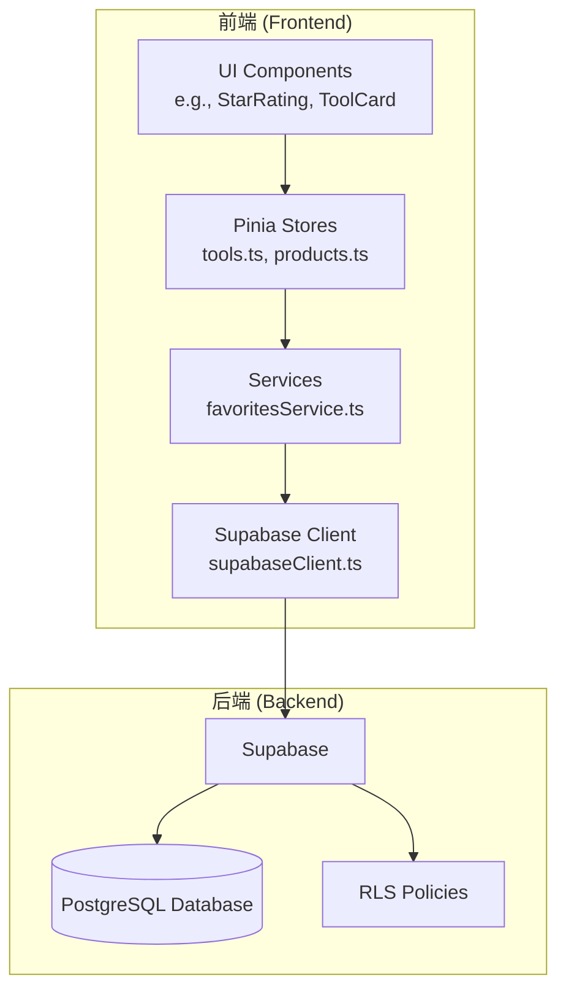
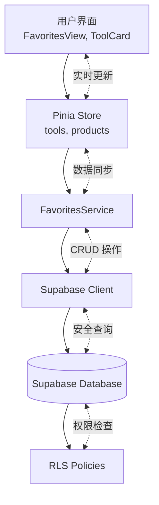
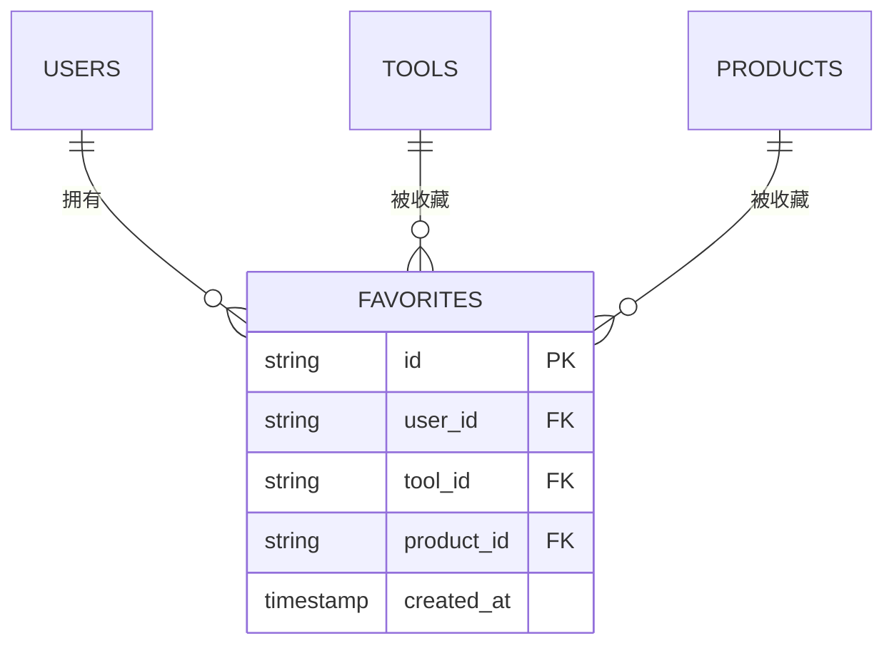
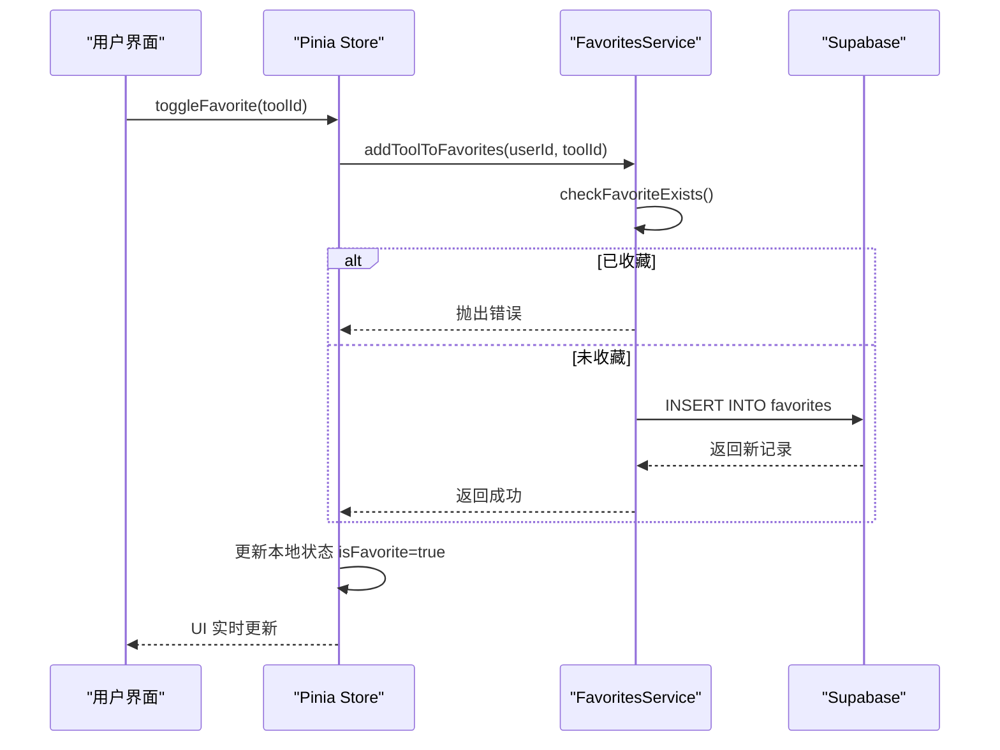
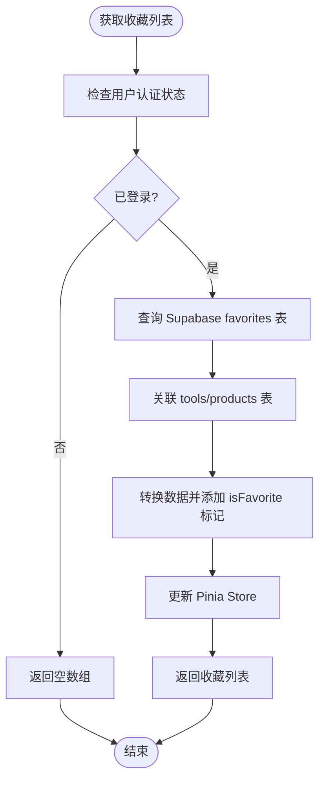
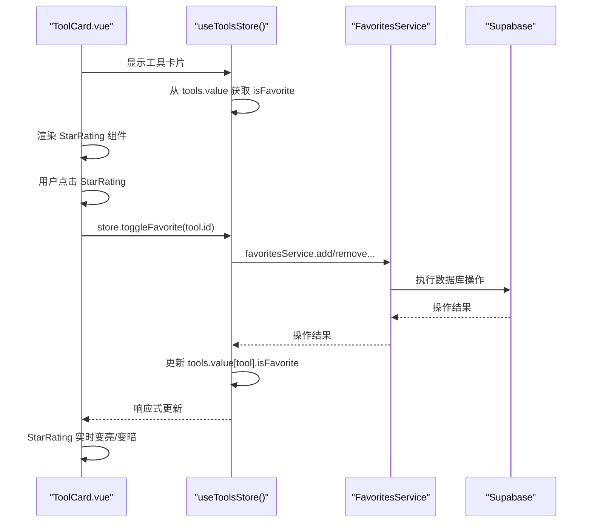
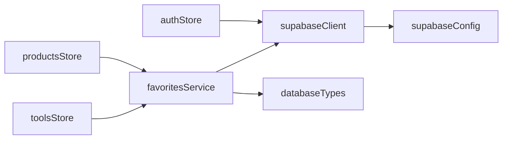

# 收藏服务

<cite>
**本文档引用的文件**  
- [favoritesService.ts](file://src/services/favoritesService.ts)
- [database.ts](file://src/types/database.ts)
- [auth.ts](file://src/stores/auth.ts)
- [tools.ts](file://src/stores/tools.ts)
- [products.ts](file://src/stores/products.ts)
- [supabaseClient.ts](file://src/lib/supabaseClient.ts)
- [create-rls-policies-optimized.sql](file://scripts/database/create-rls-policies-optimized.sql)
</cite>

## 目录
1. [简介](#简介)
2. [项目结构](#项目结构)
3. [核心组件](#核心组件)
4. [架构概览](#架构概览)
5. [详细组件分析](#详细组件分析)
6. [依赖分析](#依赖分析)
7. [性能考虑](#性能考虑)
8. [故障排除指南](#故障排除指南)
9. [结论](#结论)

## 简介
本技术文档系统阐述了 `favoritesService` 服务在实现用户收藏功能方面的技术方案。该服务通过 Supabase 接口管理用户对工具和产品的收藏状态，支持添加、删除和批量查询收藏项。文档详细描述了服务与 Pinia Store（`tools`、`products`）的数据同步机制，确保用户界面（UI）能实时反映收藏状态。结合 `StarRating` 等组件的使用场景，展示了完整的服务调用流程。内容涵盖收藏数据模型定义、权限控制策略（RLS）、性能优化（如批量操作）、并发冲突处理以及离线收藏的本地暂存与后续同步方案。

## 项目结构
项目采用典型的 Vue 3 + Vite + Pinia + TypeScript 架构，`favoritesService` 位于 `src/services` 目录下，与数据访问层紧密集成。Pinia Store 管理应用状态，`favoritesService` 提供业务逻辑，通过 Supabase 客户端与后端数据库交互。

**图示来源**
- [favoritesService.ts](file://src/services/favoritesService.ts)
- [tools.ts](file://src/stores/tools.ts)
- [supabaseClient.ts](file://src/lib/supabaseClient.ts)

**本节来源**
- [favoritesService.ts](file://src/services/favoritesService.ts)
- [tools.ts](file://src/stores/tools.ts)

## 核心组件
`favoritesService` 是实现收藏功能的核心服务类，提供静态方法用于管理用户的收藏数据。它直接与 Supabase 数据库交互，并与 `tools` 和 `products` Pinia Store 协同工作，确保 UI 状态的同步。

**本节来源**
- [favoritesService.ts](file://src/services/favoritesService.ts)

## 架构概览
整个收藏功能的架构围绕 Supabase 的实时数据库和 RLS（行级安全）策略构建。前端通过 `favoritesService` 发起请求，该服务利用 `supabaseClient` 执行数据库操作。所有操作都受到 RLS 策略的约束，确保用户只能访问自己的数据。Pinia Store 负责缓存和响应式更新 UI。

**图示来源**
- [favoritesService.ts](file://src/services/favoritesService.ts)
- [tools.ts](file://src/stores/tools.ts)
- [auth.ts](file://src/stores/auth.ts)
- [database.ts](file://src/types/database.ts)

## 详细组件分析

### FavoritesService 分析
`FavoritesService` 类封装了所有与收藏相关的业务逻辑，是连接前端 UI 和后端数据库的桥梁。

#### 数据模型与类型定义
服务依赖于 `types/database.ts` 中定义的数据库类型，特别是 `favorites` 表的结构。

**图示来源**
- [database.ts](file://src/types/database.ts#L300-L320)

#### 核心功能方法
服务提供了全面的 CRUD 操作和查询功能。

##### 添加与移除收藏

**图示来源**
- [favoritesService.ts](file://src/services/favoritesService.ts#L100-L150)
- [tools.ts](file://src/stores/tools.ts#L200-L220)

##### 批量查询与统计

**图示来源**
- [favoritesService.ts](file://src/services/favoritesService.ts#L10-L90)
- [tools.ts](file://src/stores/tools.ts)

### 使用场景分析
`StarRating` 组件等 UI 元素通过 Pinia Store 间接与 `favoritesService` 交互，形成完整的数据流。

**图示来源**
- [favoritesService.ts](file://src/services/favoritesService.ts)
- [tools.ts](file://src/stores/tools.ts)
- [components/ui/StarRating.vue](file://src/components/ui/StarRating.vue)

**本节来源**
- [favoritesService.ts](file://src/services/favoritesService.ts#L1-L342)
- [tools.ts](file://src/stores/tools.ts#L1-L342)
- [database.ts](file://src/types/database.ts#L300-L320)

## 依赖分析
`favoritesService` 依赖于多个核心模块，形成了清晰的依赖链。

**图示来源**
- [favoritesService.ts](file://src/services/favoritesService.ts)
- [supabaseClient.ts](file://src/lib/supabaseClient.ts)
- [auth.ts](file://src/stores/auth.ts)
- [tools.ts](file://src/stores/tools.ts)

**本节来源**
- [favoritesService.ts](file://src/services/favoritesService.ts)
- [supabaseClient.ts](file://src/lib/supabaseClient.ts)
- [auth.ts](file://src/stores/auth.ts)

## 性能考虑
`favoritesService` 在设计上考虑了性能优化，特别是在数据查询和批量操作方面。

- **批量操作**：`addBatchFavorites` 方法允许一次性插入多条收藏记录，减少了网络往返次数，显著提升了性能。
- **高效查询**：`getFavoriteTools` 和 `getFavoriteProducts` 方法使用 `SELECT` 语句的关联查询（JOIN），通过一次数据库请求获取工具/产品及其分类的完整信息，避免了 N+1 查询问题。
- **本地缓存**：Pinia Store 作为客户端缓存，减少了对 `favoritesService` 的重复调用，UI 更新无需每次都访问数据库。

## 故障排除指南
当收藏功能出现问题时，可参考以下步骤进行排查：

1.  **检查认证状态**：确保用户已登录，`useAuthStore().isAuthenticated` 为 `true`。
2.  **验证 RLS 策略**：确认 Supabase 中 `favorites` 表的 RLS 策略已启用且配置正确，允许用户 `INSERT`, `DELETE`, `SELECT` 自己的数据。
3.  **检查网络请求**：使用浏览器开发者工具，查看 `favoritesService` 发出的 API 请求是否成功，关注返回的 HTTP 状态码和错误信息。
4.  **查看服务日志**：`favoritesService` 内部有 `console.error` 日志，可在浏览器控制台中查看具体的错误堆栈。
5.  **验证数据模型**：确认 `types/database.ts` 中的类型定义与 Supabase 数据库的实际表结构保持一致。

**本节来源**
- [favoritesService.ts](file://src/services/favoritesService.ts)
- [create-rls-policies-optimized.sql](file://scripts/database/create-rls-policies-optimized.sql)

## 结论
`favoritesService` 是一个设计良好、功能完整的前端服务，它有效地利用了 Supabase 的强大功能，实现了安全、高效的用户收藏管理。通过与 Pinia Store 的紧密结合，它确保了数据的一致性和 UI 的实时响应。该服务的模块化设计和清晰的依赖关系使其易于维护和扩展，为应用的收藏功能提供了坚实的技术基础。