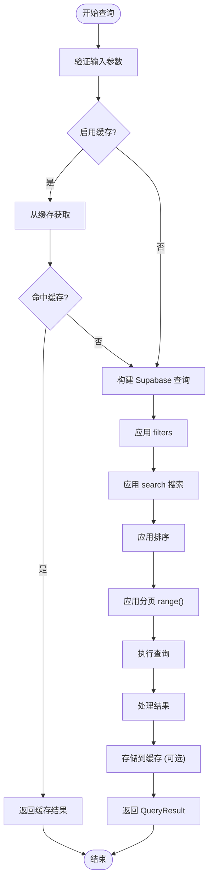
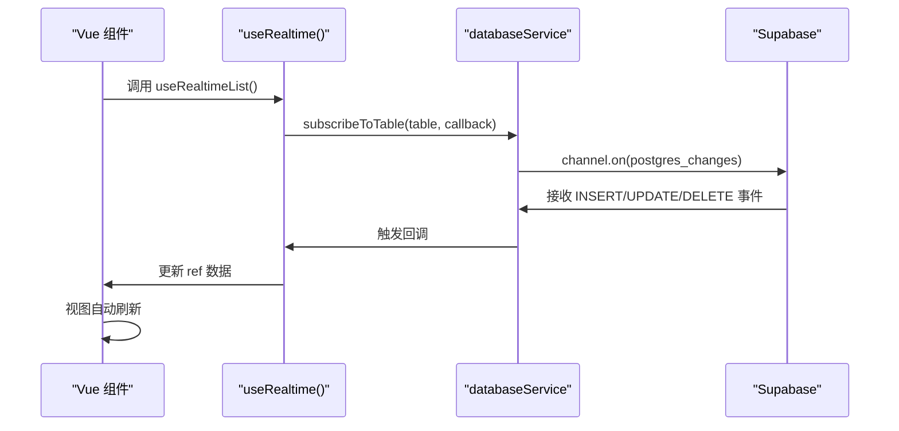

# 数据库服务

<cite>
**本文档中引用的文件**  
- [databaseService.ts](file://src/services/databaseService.ts)
- [useRealtime.ts](file://src/composables/useRealtime.ts)
- [supabaseClient.ts](file://src/lib/supabaseClient.ts)
</cite>

## 目录
1. [简介](#简介)
2. [核心设计与架构](#核心设计与架构)
3. [CRUD操作封装](#crud操作封装)
4. [查询构建器与分页支持](#查询构建器与分页支持)
5. [实时订阅功能](#实时订阅功能)
6. [缓存管理机制](#缓存管理机制)
7. [连接与健康检查](#连接与健康检查)
8. [性能优化与安全防护](#性能优化与安全防护)
9. [事务处理与错误重试](#事务处理与错误重试)
10. [复用实践与集成案例](#复用实践与集成案例)
11. [复杂查询示例](#复杂查询示例)
12. [结论](#结论)

## 简介
`databaseService` 是本项目中用于抽象底层数据访问的核心服务模块，封装了对 Supabase 数据库的通用操作。该服务提供了一套统一、安全且高效的接口，支持增删改查（CRUD）、分页查询、实时数据同步、缓存管理和健康检查等功能。通过组合式函数 `useRealtime`，实现了前端组件对数据变更的实时响应，提升了用户体验和系统响应性。

**Section sources**
- [databaseService.ts](file://src/services/databaseService.ts#L1-L404)
- [useRealtime.ts](file://src/composables/useRealtime.ts#L1-L402)

## 核心设计与架构
`databaseService` 采用单例模式实现，确保在整个应用生命周期内仅存在一个实例，便于状态管理和资源复用。其核心职责包括：
- 封装 Supabase 客户端的原始 API 调用
- 提供结构化的查询选项（`QueryOptions`）和结果格式（`QueryResult<T>`）
- 集成客户端缓存以减少重复请求
- 支持实时数据订阅与自动更新
- 实现表级统计信息获取与健康检查

该服务依赖于 `supabaseClient` 提供的 Supabase 连接实例，并通过 `TABLES` 常量统一管理数据库表名，增强代码可维护性。

```mermaid
classDiagram
class DatabaseService {
+cache : Map~string, {data, timestamp, ttl}~
+realtimeChannels : Map~string, RealtimeChannel~
+query~T~(table : string, options : QueryOptions, cacheOptions? : CacheOptions) : Promise~QueryResult~T~~
+create~T~(table : string, data : Partial~T~) : Promise~T~
+update~T~(table : string, id : string, data : Partial~T~) : Promise~T~
+delete(table : string, id : string) : Promise~void~
+batchCreate~T~(table : string, data : Partial~T~[]) : Promise~T[]~
+batchDelete(table : string, ids : string[]) : Promise~void~
+subscribeToTable(table : string, callback : (payload : any) => void, filter? : string) : RealtimeChannel
+unsubscribe(channel : RealtimeChannel | string) : void
+unsubscribeAll() : void
+clearAllCache() : void
+getCacheStats() : {size : number, keys : string[]}
+healthCheck() : Promise~{status, latency}~
+getTableStats(table : string) : Promise~{totalCount, recentCount, lastUpdated}~
}
class QueryOptions {
+page? : number
+limit? : number
+sortBy? : string
+sortOrder? : "asc" | "desc"
+filters? : Record~string, any~
+search? : string
+searchFields? : string[]
}
class QueryResult~T~ {
+data : T[]
+count : number
+page : number
+limit : number
+totalPages : number
+hasMore : boolean
}
class CacheOptions {
+ttl? : number
+key? : string
}
DatabaseService --> QueryOptions
DatabaseService --> QueryResult~T~
DatabaseService --> CacheOptions
```

**Diagram sources**  
- [databaseService.ts](file://src/services/databaseService.ts#L1-L404)

**Section sources**
- [databaseService.ts](file://src/services/databaseService.ts#L1-L404)
- [supabaseClient.ts](file://src/lib/supabaseClient.ts#L1-L266)

## CRUD操作封装
`databaseService` 提供了完整的 CRUD 方法集，屏蔽了 Supabase SDK 的复杂性，使业务层调用更加简洁安全。

### 创建记录
`create<T>(table, data)` 方法用于插入单条记录。成功后自动清除对应表的缓存，确保后续查询获取最新数据。

### 更新记录
`update<T>(table, id, data)` 方法根据 ID 更新指定记录，同样在操作完成后清理缓存。

### 删除记录
`delete(table, id)` 方法执行软删除或硬删除操作（取决于数据库策略），并触发缓存清理。

### 批量操作
支持 `batchCreate` 和 `batchUpdate` 等批量方法，提升数据处理效率。

**Section sources**
- [databaseService.ts](file://src/services/databaseService.ts#L100-L180)

## 查询构建器与分页支持
`query<T>` 方法是核心查询入口，支持灵活的查询构建和分页功能。

### 查询选项
通过 `QueryOptions` 接口定义查询参数：
- `filters`: 键值对形式的精确匹配或数组包含查询
- `search`: 全文模糊搜索，支持多字段（`searchFields`）
- `sortBy` / `sortOrder`: 排序控制
- `page` / `limit`: 分页参数

### 分页逻辑
基于 `page` 和 `limit` 自动计算 `range(from, to)`，返回标准化的 `QueryResult<T>` 结构，包含总页数、是否有更多数据等元信息。



**Diagram sources**  
- [databaseService.ts](file://src/services/databaseService.ts#L40-L98)

**Section sources**
- [databaseService.ts](file://src/services/databaseService.ts#L40-L98)

## 实时订阅功能
通过 `subscribeToTable` 方法实现对数据库变更的实时监听，结合 `useRealtime` 组合式函数，在前端实现数据自动同步。

### 实时通道管理
- 使用 `realtimeChannels` Map 存储活动通道
- 支持带过滤条件的订阅（如 `status=eq.active`）
- 提供 `unsubscribe` 和 `unsubscribeAll` 清理资源

### 组合式函数集成
`useRealtime` 封装了连接状态管理、错误处理和自动重连逻辑，开发者可轻松实现：
- `useRealtimeList`: 实时同步数据列表（自动增删改）
- `useRealtimeRecord`: 实时同步单条记录
- `useRealtimeStats`: 实时统计仪表盘



**Diagram sources**  
- [useRealtime.ts](file://src/composables/useRealtime.ts#L1-L402)
- [databaseService.ts](file://src/services/databaseService.ts#L200-L240)

**Section sources**
- [useRealtime.ts](file://src/composables/useRealtime.ts#L1-L402)
- [databaseService.ts](file://src/services/databaseService.ts#L200-L240)

## 缓存管理机制
内置内存缓存系统，提升性能并减少数据库负载。

### 缓存策略
- 基于 `cacheOptions.ttl` 控制缓存有效期
- 使用 `generateCacheKey` 生成唯一键（表名 + 查询参数）
- 写操作（create/update/delete）后自动清除相关表缓存

### 缓存接口
- `getFromCache` / `setCache`: 读写缓存
- `clearCacheByPattern`: 按表名清除缓存
- `getCacheStats`: 获取缓存统计信息

**Section sources**
- [databaseService.ts](file://src/services/databaseService.ts#L242-L320)

## 连接与健康检查
### 连接管理
通过 `supabaseClient.ts` 中的 `createClient` 初始化连接，配置自动刷新令牌和会话持久化。

### 健康检查
`healthCheck()` 方法通过执行轻量查询检测数据库连通性和延迟，返回 `{status, latency}`，可用于监控系统状态。

**Section sources**
- [supabaseClient.ts](file://src/lib/supabaseClient.ts#L1-L266)
- [databaseService.ts](file://src/services/databaseService.ts#L360-L380)

## 性能优化与安全防护
### 性能优化
- **索引建议**：在 `created_at`、`updated_at`、外键及常用查询字段上创建数据库索引
- **分页优化**：避免大偏移量分页，推荐使用游标分页（本实现为范围分页）
- **缓存利用**：合理设置 `ttl`，平衡数据新鲜度与性能

### 安全防护
- **SQL注入防护**：Supabase SDK 自动参数化查询，`eq`、`in`、`or` 等方法均安全
- **RLS策略**：依赖 Supabase 行级安全（RLS）控制数据访问权限
- **环境变量校验**：启动时检查 `.env` 配置，防止密钥泄露

**Section sources**
- [databaseService.ts](file://src/services/databaseService.ts#L40-L98)
- [supabaseClient.ts](file://src/lib/supabaseClient.ts#L1-L266)

## 事务处理与错误重试
### 事务处理
当前 `databaseService` 未直接暴露事务接口，但可通过 Supabase 的 `rpc` 调用数据库函数实现复杂事务逻辑。

### 错误重试机制
- 未内置自动重试，依赖 Supabase SDK 的底层重试
- 业务层可通过 `try-catch` 捕获错误并实现自定义重试逻辑
- `useRealtimeConnection` 提供网络状态监控，辅助重连策略

**Section sources**
- [databaseService.ts](file://src/services/databaseService.ts#L100-L180)
- [useRealtime.ts](file://src/composables/useRealtime.ts#L300-L402)

## 复用实践与集成案例
### 服务间复用
多个业务服务（如 `productsService`、`toolsService`）均依赖 `databaseService` 进行数据操作，实现逻辑解耦。

### 组件集成
- `ProductManagementView` 使用 `useRealtimeList` 实时展示商品列表
- `DashboardView` 使用 `useRealtimeStats` 实时更新统计卡片
- `UserDetailModal` 使用 `useRealtimeRecord` 监听用户信息变更

**Section sources**
- [databaseService.ts](file://src/services/databaseService.ts#L1-L404)
- [useRealtime.ts](file://src/composables/useRealtime.ts#L150-L250)

## 复杂查询示例
### 多条件组合查询
```typescript
const result = await databaseService.query<Product>(
  TABLES.PRODUCTS,
  {
    filters: {
      category_id: "cat-123",
      status: "active",
      tags: ["popular", "new"]
    },
    search: "高性能",
    searchFields: ["name", "description"],
    sortBy: "created_at",
    sortOrder: "desc",
    page: 1,
    limit: 10
  },
  { ttl: 60000 } // 缓存1分钟
);
```

### 实时列表同步
```typescript
const { data, subscribe, unsubscribe } = useRealtimeList<Product>(
  TABLES.PRODUCTS,
  [],
  {
    filter: "status=eq.active",
    autoSync: true
  }
);
```

**Section sources**
- [databaseService.ts](file://src/services/databaseService.ts#L40-L98)
- [useRealtime.ts](file://src/composables/useRealtime.ts#L150-L250)

## 结论
`databaseService` 作为数据访问抽象层，成功封装了 Supabase 的复杂性，提供了安全、高效、实时的数据操作能力。其设计充分考虑了性能、可维护性和可扩展性，通过缓存、分页、实时同步等机制显著提升了应用体验。结合 `useRealtime` 组合式函数，实现了声明式的实时数据流，是现代 Vue + Supabase 架构中的典范实践。