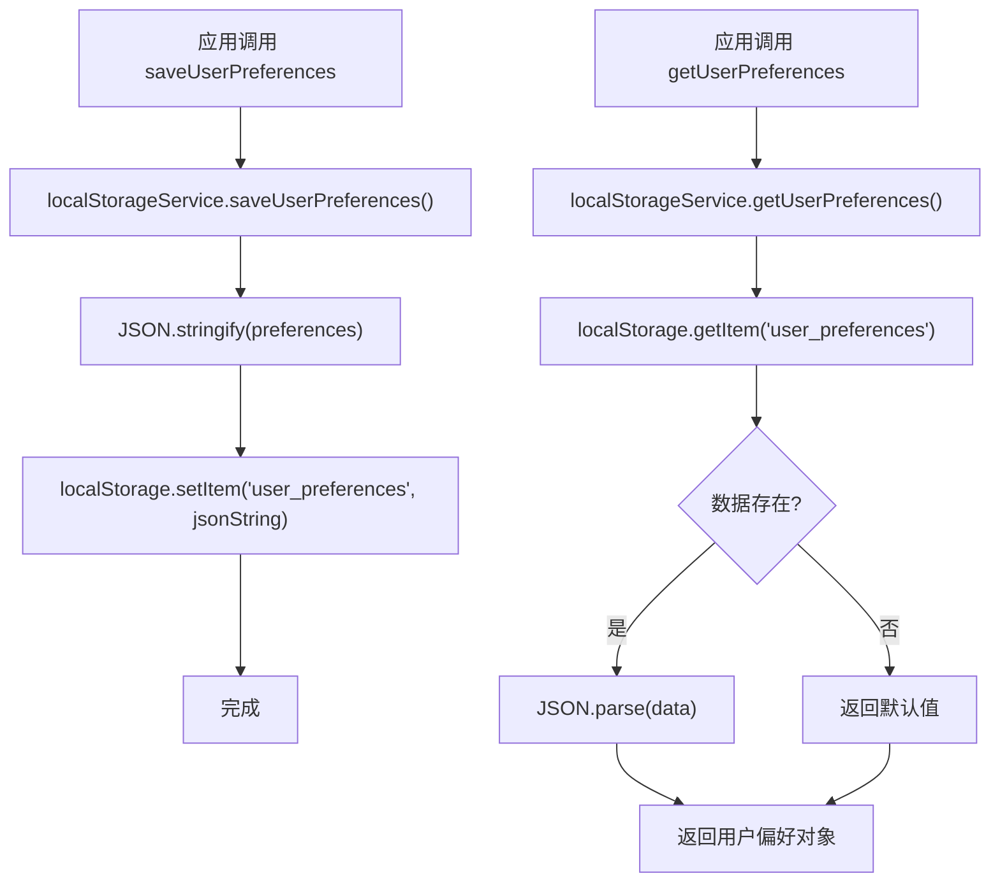
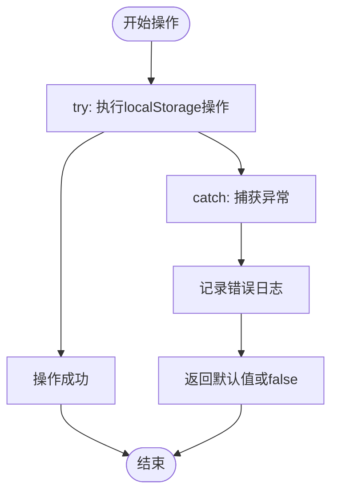
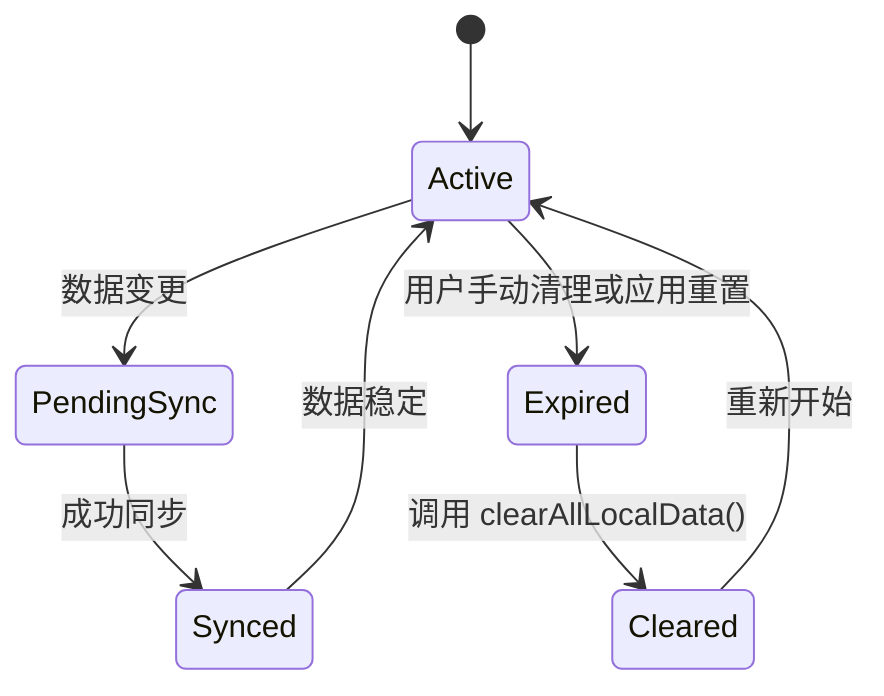
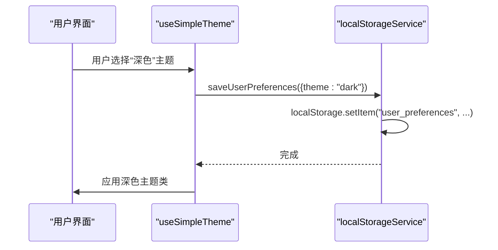
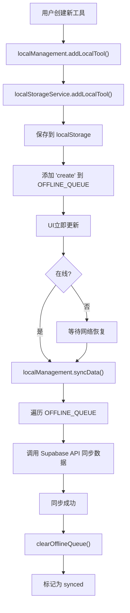

# 本地存储服务

<cite>
**本文档中引用的文件**   
- [localStorageService.ts](file://src/services/localStorageService.ts)
- [useSimpleTheme.ts](file://src/composables/useSimpleTheme.ts)
- [localManagement.ts](file://src/stores/localManagement.ts)
- [supabaseClient.ts](file://src/lib/supabaseClient.ts)
</cite>

## 目录
1. [简介](#简介)
2. [核心功能与API封装](#核心功能与api封装)
3. [存储键名规范](#存储键名规范)
4. [数据生命周期管理](#数据生命周期管理)
5. [实际应用场景](#实际应用场景)
6. [安全注意事项](#安全注意事项)
7. [与远程状态协调策略](#与远程状态协调策略)
8. [性能与异常处理](#性能与异常处理)
9. [总结](#总结)

## 简介

本地存储服务（`localStorageService`）为应用程序提供了对浏览器本地存储的统一、增强型封装。该服务不仅简化了对字符串、对象等复杂数据类型的存取操作，还内置了序列化/反序列化处理、异常捕获（如存储空间不足）以及跨浏览器兼容性适配等关键功能。通过结合主题切换（`useSimpleTheme`）和本地状态管理（`localManagement` store），该服务在实际应用中展现了强大的离线支持和数据同步能力。本文档将详细介绍其设计、实现和最佳实践。

## 核心功能与API封装

`localStorageService` 类提供了一套静态方法，用于安全地与 `localStorage` 进行交互。它通过 `try-catch` 块捕获所有潜在的异常，确保在存储空间不足或浏览器禁用 `localStorage` 时，应用不会崩溃，而是优雅地降级。

### 统一数据存取

服务为不同类型的数据提供了专用的存取方法，这些方法自动处理JSON的序列化和反序列化。



**Section sources**
- [localStorageService.ts](file://src/services/localStorageService.ts#L100-L130)

### 异常捕获与降级

所有对 `localStorage` 的操作都被包裹在 `try-catch` 语句中。如果操作失败（例如，`QuotaExceededError`），服务会记录错误日志并返回一个安全的默认值或布尔值 `false`，从而保证应用的稳定性。



**Section sources**
- [localStorageService.ts](file://src/services/localStorageService.ts#L55-L60)

## 存储键名规范

为了确保代码的可维护性和避免键名冲突，服务定义了一个名为 `LOCAL_STORAGE_KEYS` 的常量对象，集中管理所有使用的键名。

| 键名常量 | 存储内容 | 用途 |
| :--- | :--- | :--- |
| `TOOLS` | `LocalTool[]` | 存储用户添加的本地工具 |
| `CATEGORIES` | `LocalCategory[]` | 存储本地分类 |
| `USER_PREFERENCES` | `UserPreferences` | 存储用户界面偏好设置 |
| `THEME_CONFIG` | `SimpleThemeConfig` | 存储主题配置（由`useSimpleTheme`使用） |
| `OFFLINE_QUEUE` | `OfflineAction[]` | 存储待同步的离线操作队列 |
| `LAST_SYNC` | `string` | 记录最后一次成功同步的时间戳 |
| `APP_CONFIG` | `string` | 存储应用配置 |

**Section sources**
- [localStorageService.ts](file://src/services/localStorageService.ts#L8-L16)

## 数据生命周期管理

服务通过多种机制来管理数据的生命周期，确保数据的时效性和存储空间的有效利用。

### 过期策略

虽然 `localStorage` 本身没有内置的过期机制，但 `localStorageService` 提供了 `getStorageInfo` 方法来监控存储使用情况。结合 `localManagement` store 中的 `clearAllLocalData` 方法，可以实现手动或基于策略的清理。



**Section sources**
- [localStorageService.ts](file://src/services/localStorageService.ts#L320-L337)

## 实际应用场景

### 主题切换 (useSimpleTheme)

`useSimpleTheme` 组合式函数利用 `@vueuse/core` 的 `useStorage` 函数，将主题配置持久化到 `localStorage` 中。它通过 `localStorageService` 的底层能力，实现了主题设置的跨会话保存。



**Diagram sources**
- [useSimpleTheme.ts](file://src/composables/useSimpleTheme.ts#L20-L25)
- [localStorageService.ts](file://src/services/localStorageService.ts#L110-L130)

### 本地状态管理 (localManagement store)

`localManagement` store 是 `localStorageService` 的核心消费者。它在应用启动时从 `localStorage` 加载数据，并在状态变更时将其保存回去。它还管理一个离线操作队列，确保在网络恢复时能将本地变更同步到远程。

```mermaid
classDiagram
class LocalStorageService {
+getLocalTools() : LocalTool[]
+saveLocalTools(tools : LocalTool[]) : void
+getUserPreferences() : UserPreferences
+saveUserPreferences(prefs : Partial~UserPreferences~) : void
+getOfflineQueue() : OfflineAction[]
+addOfflineAction(action : Omit~OfflineAction~) : void
+clearOfflineQueue() : void
+setLastSyncTime(time : string) : void
+getStorageInfo() : {used, total, percentage}
}
class localManagementStore {
-localTools : Ref~LocalTool[]~
-userPreferences : Ref~UserPreferences~
-offlineQueue : Ref~OfflineAction[]~
+initialize() : Promise~void~
+addLocalTool(data : Tool) : LocalTool
+updateUserPreferences(prefs : Partial~UserPreferences~) : void
+syncData() : Promise~void~
}
localManagementStore --> LocalStorageService : "依赖"
```

**Diagram sources**
- [localManagement.ts](file://src/stores/localManagement.ts#L10-L50)
- [localStorageService.ts](file://src/services/localStorageService.ts#L50-L337)

## 安全注意事项

### XSS防护

`localStorage` 中的数据与页面的JavaScript上下文共享，因此容易受到跨站脚本攻击（XSS）的影响。如果攻击者能注入恶意脚本，他们就能读取或篡改存储在 `localStorage` 中的所有数据。

**最佳实践**:
- **避免存储敏感信息**: 绝对不要在 `localStorage` 中存储密码、令牌或任何个人身份信息（PII）。
- **输入验证**: 在将数据存入 `localStorage` 之前，应进行严格的验证和清理。
- **内容安全策略 (CSP)**: 实施严格的CSP来防止XSS攻击，这是保护 `localStorage` 数据的最有效方法。

## 与远程状态协调策略

应用使用 Supabase 作为远程数据库。`localStorageService` 和 `localManagement` store 共同实现了一套协调策略，以处理本地与远程状态的关系。

### 优先级规则

1.  **读取优先级**: 当应用启动时，`localManagement` store 会优先从 `localStorage` 加载数据，以提供即时的用户体验。随后，它会尝试从 Supabase 同步最新数据。
2.  **写入优先级**: 用户的任何变更首先写入 `localStorage`，并立即反映在UI上（提供即时反馈）。同时，该操作被添加到 `OFFLINE_QUEUE` 中。
3.  **同步机制**: `localManagement` store 监听网络状态。当检测到网络连接时，它会自动执行 `syncData` 流程，将 `OFFLINE_QUEUE` 中的操作逐一发送到 Supabase API。同步成功后，队列被清空，本地数据的 `syncStatus` 被标记为 "synced"。



**Section sources**
- [localManagement.ts](file://src/stores/localManagement.ts#L121-L170)
- [supabaseClient.ts](file://src/lib/supabaseClient.ts#L200-L250)

## 性能与异常处理

### 存储使用监控

`getStorageInfo` 方法通过遍历 `localStorage` 的所有键来估算已使用的存储空间。它假设总容量为5MB，并计算使用百分比。这有助于开发者和用户了解存储使用情况，避免达到浏览器的存储限制。

**Section sources**
- [localStorageService.ts](file://src/services/localStorageService.ts#L300-L337)

### 异常处理策略

服务对所有 `localStorage` 操作都进行了防御性编程。任何错误都会被捕获，记录到控制台，并返回一个安全的默认值。这确保了即使在 `localStorage` 不可用的极端情况下，应用的核心功能仍然可以运行（尽管会失去持久化能力）。

## 总结

`localStorageService` 是一个功能完备、健壮的本地存储封装层。它通过提供统一的API、处理序列化、捕获异常和定义清晰的键名规范，极大地简化了本地数据管理。结合 `useSimpleTheme` 和 `localManagement` store，它成功实现了主题持久化和强大的离线优先体验。通过与 Supabase 的协调策略，它确保了本地与远程数据的一致性。在使用时，应牢记其安全限制，避免存储敏感信息，并利用其提供的监控和清理功能来维护应用的健康状态。