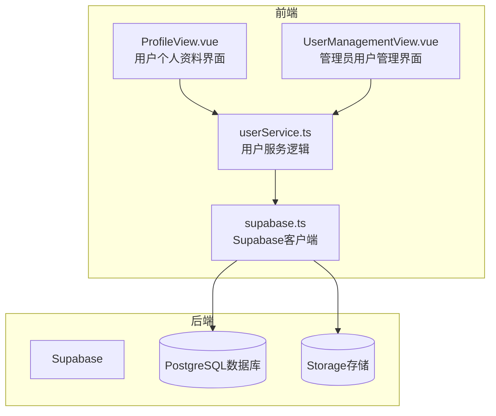
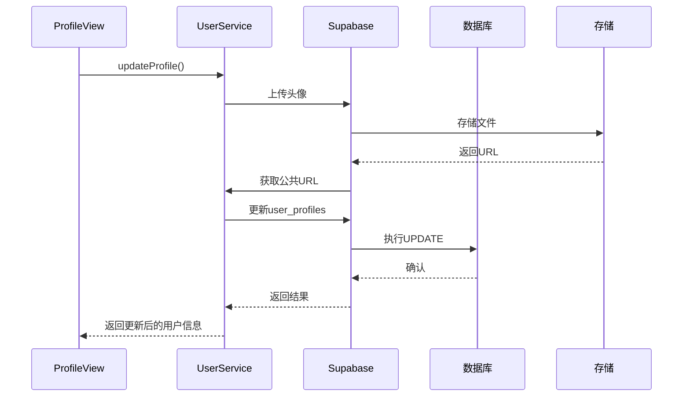
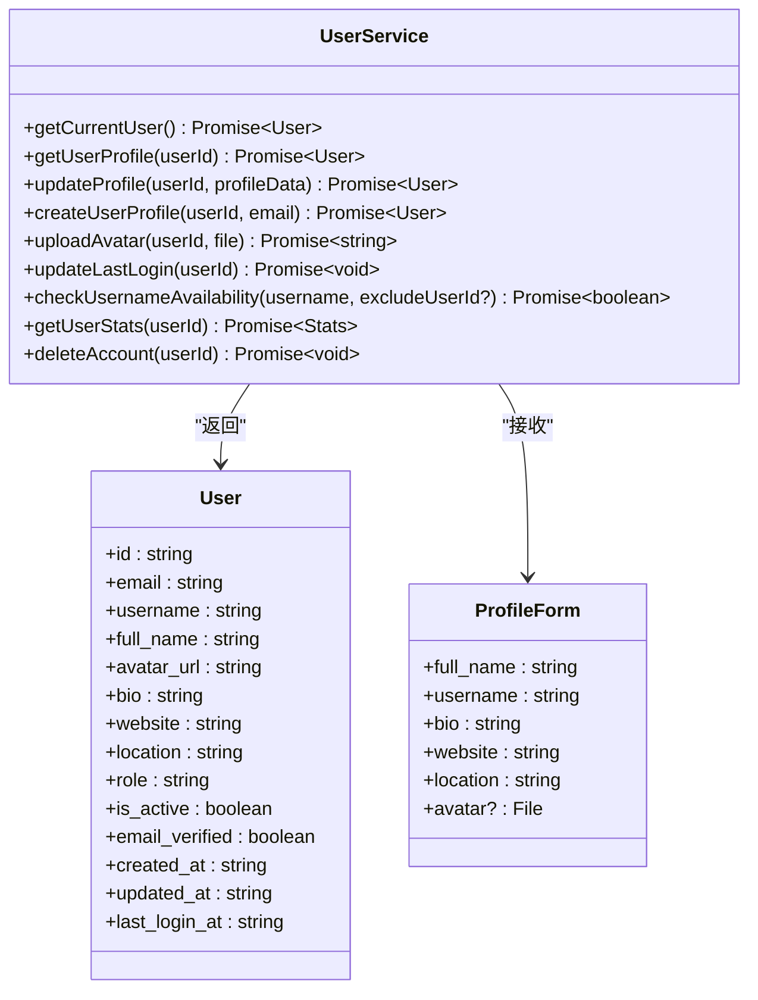
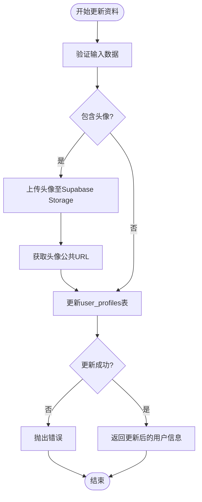
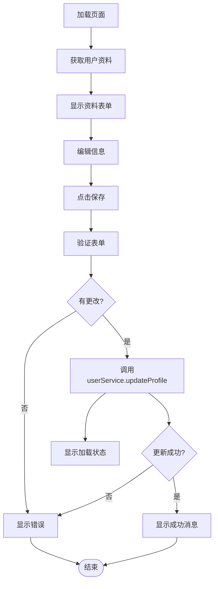
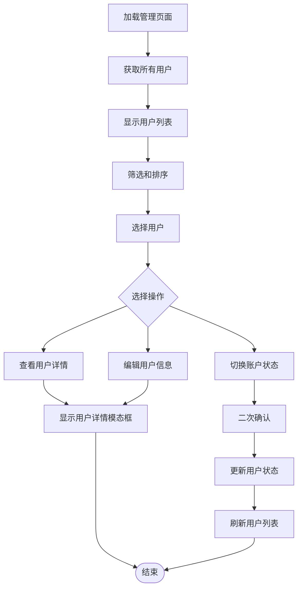
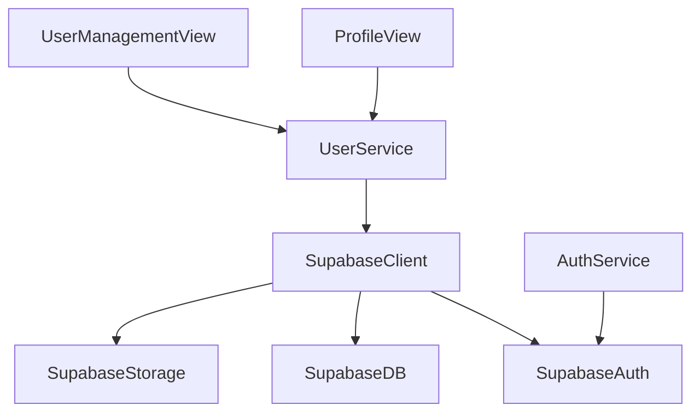

# 用户服务

<cite>
**本文档引用的文件**  
- [userService.ts](file://src/services/userService.ts)
- [ProfileView.vue](file://src/views/user/ProfileView.vue)
- [UserManagementView.vue](file://src/views/admin/UserManagementView.vue)
- [authService.ts](file://src/services/authService.ts)
- [supabase.ts](file://src/lib/supabase.ts)
- [database.ts](file://src/types/database.ts)
</cite>

## 目录
1. [简介](#简介)
2. [项目结构](#项目结构)
3. [核心组件](#核心组件)
4. [架构概览](#架构概览)
5. [详细组件分析](#详细组件分析)
6. [依赖分析](#依赖分析)
7. [性能考虑](#性能考虑)
8. [故障排除指南](#故障排除指南)
9. [结论](#结论)

## 简介
本文档全面介绍 `userService` 模块如何处理用户信息的读取、更新与管理操作。涵盖用户资料获取、头像/昵称等个人信息更新的API封装，以及在 `ProfileView` 中的应用。同时结合管理后台 `UserManagementView`，说明管理员对用户账户的禁用、权限调整等高级操作。文档还涉及用户数据模型设计、隐私字段访问控制、头像存储集成（Supabase Storage）、数据验证规则、与认证服务的协同机制及安全最佳实践（如敏感操作的二次验证）。

## 项目结构
项目采用典型的Vue 3 + TypeScript + Vite架构，结合Supabase作为后端服务。用户相关功能集中在 `src/services/userService.ts`，视图组件分布于 `src/views/user/` 和 `src/views/admin/` 目录下。数据模型定义在 `src/types/database.ts`，Supabase客户端配置位于 `src/lib/supabase.ts`。

**图示来源**  
- [userService.ts](file://src/services/userService.ts#L1-L288)
- [ProfileView.vue](file://src/views/user/ProfileView.vue#L1-L554)
- [UserManagementView.vue](file://src/views/admin/UserManagementView.vue#L1-L807)

**本节来源**  
- [src/services/userService.ts](file://src/services/userService.ts)
- [src/views/user/ProfileView.vue](file://src/views/user/ProfileView.vue)
- [src/views/admin/UserManagementView.vue](file://src/views/admin/UserManagementView.vue)

## 核心组件
`UserService` 类是用户管理的核心，提供静态方法用于获取、更新和管理用户信息。`ProfileView` 是普通用户编辑个人资料的界面，而 `UserManagementView` 为管理员提供用户账户的全面管理功能。这些组件通过Supabase客户端与后端数据库和存储服务交互。

**本节来源**  
- [userService.ts](file://src/services/userService.ts#L1-L288)
- [ProfileView.vue](file://src/views/user/ProfileView.vue#L1-L554)
- [UserManagementView.vue](file://src/views/admin/UserManagementView.vue#L1-L807)

## 架构概览
系统采用分层架构，前端组件通过服务层与Supabase后端通信。`UserService` 封装了所有用户相关的业务逻辑，包括资料读取、更新、头像上传、用户名检查等。认证由Supabase Auth处理，用户资料存储在 `user_profiles` 表中，头像文件存储在Supabase Storage的 `avatars` bucket中。

**图示来源**  
- [userService.ts](file://src/services/userService.ts#L1-L288)
- [ProfileView.vue](file://src/views/user/ProfileView.vue#L1-L554)

## 详细组件分析

### 用户服务分析
`UserService` 提供了完整的用户生命周期管理功能。

#### 核心功能类图

**图示来源**  
- [userService.ts](file://src/services/userService.ts#L1-L288)
- [database.ts](file://src/types/database.ts#L1-L100)

#### 用户资料更新流程

**图示来源**  
- [userService.ts](file://src/services/userService.ts#L1-L288)

**本节来源**  
- [userService.ts](file://src/services/userService.ts#L1-L288)

### 个人资料视图分析
`ProfileView` 允许用户查看和编辑其个人资料。

#### 用户资料界面流程

**图示来源**  
- [ProfileView.vue](file://src/views/user/ProfileView.vue#L1-L554)

**本节来源**  
- [ProfileView.vue](file://src/views/user/ProfileView.vue#L1-L554)

### 用户管理视图分析
`UserManagementView` 为管理员提供用户账户管理功能。

#### 管理员用户管理流程

**图示来源**  
- [UserManagementView.vue](file://src/views/admin/UserManagementView.vue#L1-L807)

**本节来源**  
- [UserManagementView.vue](file://src/views/admin/UserManagementView.vue#L1-L807)

## 依赖分析
系统依赖Supabase作为后端服务，通过 `supabase.ts` 提供的客户端实例进行通信。`userService` 依赖Supabase的Auth、Database和Storage服务。前端组件通过Pinia store（如auth store）与服务层交互。

**图示来源**  
- [userService.ts](file://src/services/userService.ts#L1-L288)
- [supabase.ts](file://src/lib/supabase.ts#L1-L50)
- [authService.ts](file://src/services/authService.ts#L1-L100)

**本节来源**  
- [userService.ts](file://src/services/userService.ts#L1-L288)
- [supabase.ts](file://src/lib/supabase.ts#L1-L50)
- [authService.ts](file://src/services/authService.ts#L1-L100)

## 性能考虑
- **头像上传**：上传前会自动删除用户旧头像，避免存储空间浪费。
- **数据获取**：`getUserStats` 方法使用 `Promise.all` 并行获取收藏和订单数据，减少请求延迟。
- **缓存机制**：虽然当前代码未实现，但建议在客户端缓存用户资料以减少重复请求。
- **分页处理**：`UserManagementView` 实现了前端分页，避免一次性加载过多用户数据。

## 故障排除指南
- **无法获取用户资料**：检查Supabase连接状态和用户认证状态。
- **头像上传失败**：确认Supabase Storage的 `avatars` bucket存在且RSL策略正确配置。
- **用户名检查不工作**：确保数据库中 `user_profiles.username` 字段有唯一索引。
- **用户状态无法更新**：检查RSL策略是否允许管理员更新其他用户的状态字段。

**本节来源**  
- [userService.ts](file://src/services/userService.ts#L1-L288)
- [supabase.ts](file://src/lib/supabase.ts#L1-L50)

## 结论
`userService` 模块提供了完整的用户信息管理功能，从个人资料编辑到管理员级别的账户管理。系统通过Supabase实现了安全的用户数据存储和访问控制。建议未来增加敏感操作的二次验证机制，并实现更完善的错误处理和用户反馈。