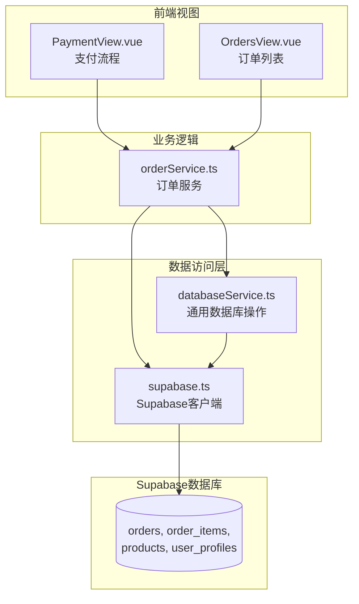
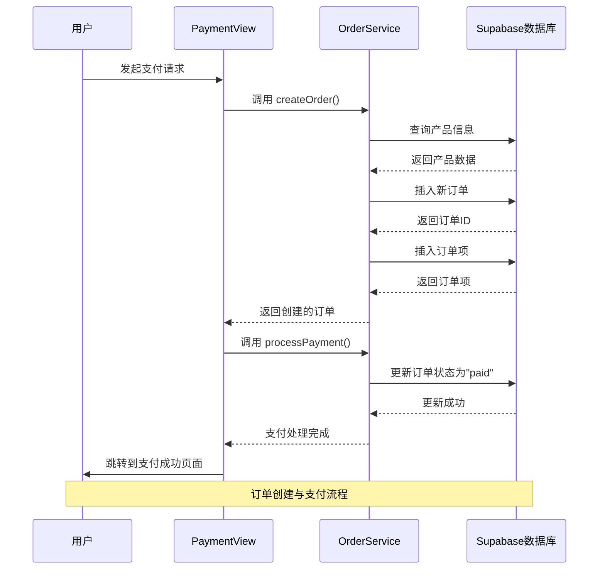
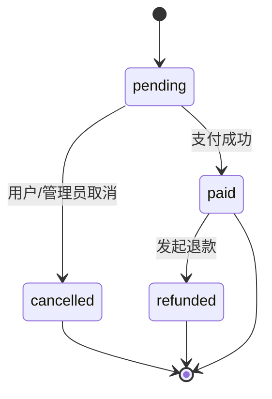
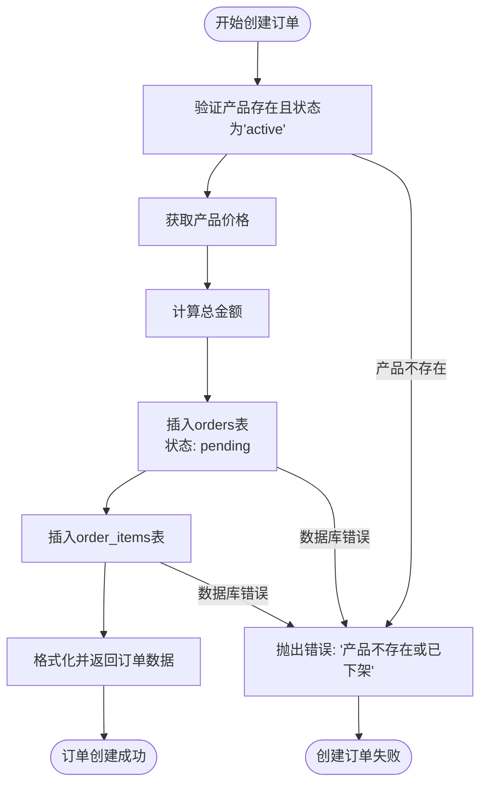
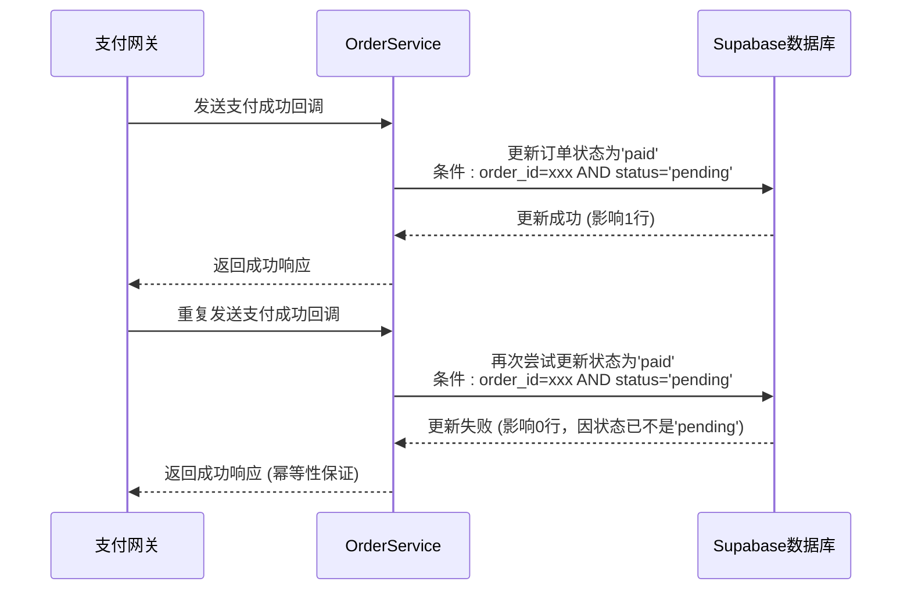
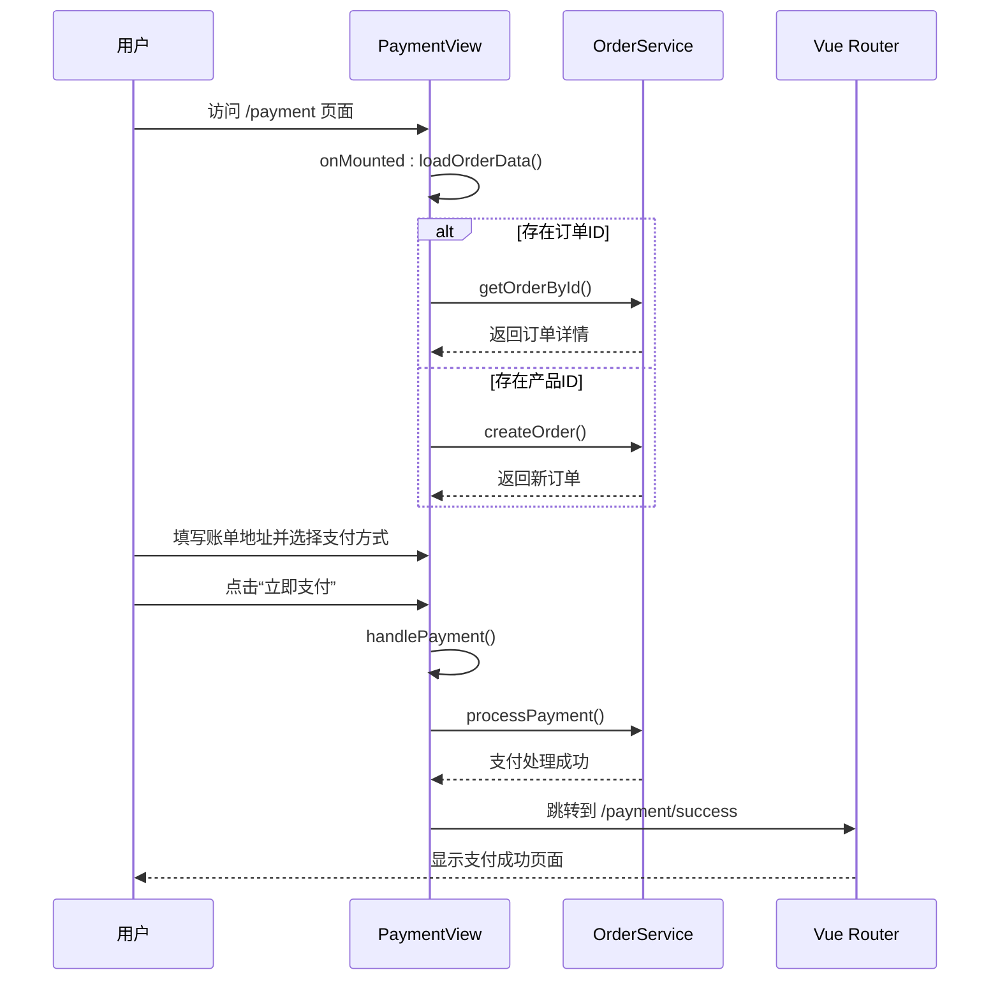
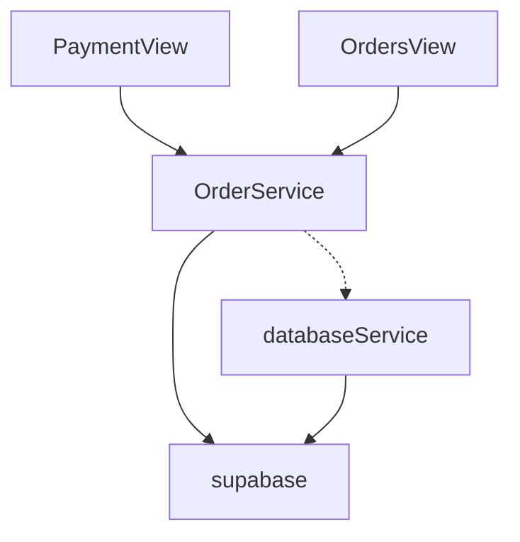

# 订单服务

<cite>
**本文档中引用的文件**  
- [orderService.ts](file://src/services/orderService.ts)
- [PaymentView.vue](file://src/views/PaymentView.vue)
- [OrdersView.vue](file://src/views/user/OrdersView.vue)
- [supabase.ts](file://src/lib/supabase.ts)
- [databaseService.ts](file://src/services/databaseService.ts)
</cite>

## 目录
1. [简介](#简介)
2. [项目结构](#项目结构)
3. [核心组件](#核心组件)
4. [架构概览](#架构概览)
5. [详细组件分析](#详细组件分析)
6. [依赖分析](#依赖分析)
7. [性能考虑](#性能考虑)
8. [故障排除指南](#故障排除指南)
9. [结论](#结论)

## 简介
本文档系统解析 `orderService` 处理产品购买订单的全流程，涵盖从订单创建、支付状态更新到订单历史查询等关键操作。重点说明服务与 Supabase 数据库的交互细节，结合 `PaymentView` 支付流程和 `OrdersView` 订单列表，展示服务调用时序。文档深入探讨订单状态机设计、库存扣减逻辑、幂等性处理、支付结果回调验证、数据一致性保障机制以及与外部支付网关的集成模式。

## 项目结构
项目采用典型的 Vue 3 + TypeScript 前端架构，结合 Supabase 作为后端服务。核心业务逻辑（如订单处理）位于 `src/services` 目录下，视图组件位于 `src/views` 目录，数据库交互通过 `src/lib/supabase` 和 `src/services/databaseService.ts` 封装。



**图示来源**
- [orderService.ts](file://src/services/orderService.ts#L1-L590)
- [PaymentView.vue](file://src/views/PaymentView.vue#L1-L682)
- [OrdersView.vue](file://src/views/user/OrdersView.vue#L1-L742)
- [databaseService.ts](file://src/services/databaseService.ts#L1-L404)

**本节来源**
- [src/services/orderService.ts](file://src/services/orderService.ts)
- [src/views/PaymentView.vue](file://src/views/PaymentView.vue)
- [src/views/user/OrdersView.vue](file://src/views/user/OrdersView.vue)

## 核心组件
`orderService` 是处理订单生命周期的核心服务，提供了创建订单、处理支付、查询订单列表、取消订单等关键方法。它直接与 Supabase 数据库交互，确保数据的一致性和安全性。`PaymentView` 和 `OrdersView` 是用户交互的主要界面，分别负责支付流程和订单历史管理。

**本节来源**
- [orderService.ts](file://src/services/orderService.ts#L1-L590)
- [PaymentView.vue](file://src/views/PaymentView.vue#L1-L682)
- [OrdersView.vue](file://src/views/user/OrdersView.vue#L1-L742)

## 架构概览
系统采用分层架构，前端视图层通过调用业务逻辑层的 `OrderService` 来执行订单操作。`OrderService` 内部使用 `supabase` 客户端直接与数据库交互，或通过 `databaseService` 进行更复杂的操作。所有数据库操作都遵循 RLS（行级安全）策略，确保数据安全。



**图示来源**
- [orderService.ts](file://src/services/orderService.ts#L1-L590)
- [PaymentView.vue](file://src/views/PaymentView.vue#L1-L682)

## 详细组件分析

### 订单服务分析
`OrderService` 类封装了所有与订单相关的业务逻辑，是整个订单处理流程的核心。

#### 订单状态机设计
订单服务实现了清晰的状态机，定义了订单的生命周期。主要状态包括：
- **待支付 (pending)**：订单已创建，等待用户支付。
- **已支付 (paid)**：支付成功，订单完成。
- **已取消 (cancelled)**：用户或管理员取消的订单。
- **已退款 (refunded)**：已支付后发生退款的订单。

状态转换受到严格控制，例如只有 `pending` 状态的订单才能被取消或更新为 `paid`。



**图示来源**
- [orderService.ts](file://src/services/orderService.ts#L1-L590)

#### 订单创建流程
创建订单是一个原子性操作，涉及多个数据库表的写入。



**图示来源**
- [orderService.ts](file://src/services/orderService.ts#L1-L590)

#### 支付处理与幂等性
`processPayment` 方法设计为幂等操作，确保即使支付网关重复回调，订单状态也不会被错误地多次更新。



**图示来源**
- [orderService.ts](file://src/services/orderService.ts#L1-L590)

#### 订单查询与数据一致性
`getUserOrders` 方法通过 Supabase 的 `select` 关联查询，一次性获取订单及其关联的订单项和产品信息，保证了数据的一致性视图。

```mermaid
flowchart LR
A[客户端] --> B[OrderService.getUserOrders]
B --> C["Supabase: SELECT * FROM orders<br>JOIN order_items ON ...<br>JOIN products ON ..."]
C --> D[数据库返回关联数据]
D --> E[OrderService: 映射为Order[]对象]
E --> F[返回给客户端]
```

**图示来源**
- [orderService.ts](file://src/services/orderService.ts#L1-L590)

### 支付视图分析
`PaymentView` 是用户完成支付的交互界面，负责收集支付信息并协调订单创建与支付处理。



**图示来源**
- [PaymentView.vue](file://src/views/PaymentView.vue#L1-L682)

### 订单列表视图分析
`OrdersView` 展示用户的订单历史，支持按状态过滤，并提供支付、取消、下载等操作入口。

```mermaid
flowchart TD
A[OrdersView] --> B[onMounted: loadOrders]
B --> C[调用 OrderService.getUserOrders]
C --> D[获取订单列表]
D --> E[渲染订单列表]
E --> F{用户操作}
F --> |点击“立即支付"| G[调用 payOrder -> 跳转 PaymentView]
F --> |点击“取消订单"| H[调用 cancelOrder -> 调用 OrderService.cancelOrder]
F --> |点击“下载产品"| I[调用 downloadOrder -> 验证权限并下载]
F --> |点击“查看详情"| J[调用 viewOrderDetail]
```

**图示来源**
- [OrdersView.vue](file://src/views/user/OrdersView.vue#L1-L742)

**本节来源**
- [orderService.ts](file://src/services/orderService.ts#L1-L590)
- [PaymentView.vue](file://src/views/PaymentView.vue#L1-L682)
- [OrdersView.vue](file://src/views/user/OrdersView.vue#L1-L742)

## 依赖分析
`orderService` 的核心依赖是 `supabase` 客户端，用于直接与数据库交互。`PaymentView` 和 `OrdersView` 依赖 `orderService` 来执行业务操作。`databaseService` 提供了更通用的数据库操作，但 `orderService` 选择直接使用 `supabase` 以获得对复杂查询和事务的更精细控制。



**图示来源**
- [orderService.ts](file://src/services/orderService.ts#L1-L590)
- [PaymentView.vue](file://src/views/PaymentView.vue#L1-L682)
- [OrdersView.vue](file://src/views/user/OrdersView.vue#L1-L742)
- [databaseService.ts](file://src/services/databaseService.ts#L1-L404)

**本节来源**
- [orderService.ts](file://src/services/orderService.ts#L1-L590)
- [PaymentView.vue](file://src/views/PaymentView.vue#L1-L682)
- [OrdersView.vue](file://src/views/user/OrdersView.vue#L1-L742)
- [databaseService.ts](file://src/services/databaseService.ts#L1-L404)

## 性能考虑
- **查询优化**：`getUserOrders` 使用了关联查询（JOIN），减少了网络往返次数，但需注意数据量大时的性能。
- **缓存**：`databaseService` 实现了内存缓存，但 `orderService` 的关键操作（如创建、支付）未使用缓存以保证数据新鲜度。
- **错误处理**：所有数据库操作都包含完善的错误处理和日志记录，便于监控和调试。

## 故障排除指南
- **创建订单失败**：检查产品ID是否存在、状态是否为`active`，以及用户是否已登录。
- **支付处理失败**：确认订单ID正确且状态为`pending`，检查支付回调的幂等性处理。
- **无法下载产品**：验证订单状态是否为`paid`，并确认产品记录中存在`download_url`。
- **订单列表为空**：确认用户ID正确，并检查数据库中是否存在该用户的订单记录。

**本节来源**
- [orderService.ts](file://src/services/orderService.ts#L1-L590)
- [PaymentView.vue](file://src/views/PaymentView.vue#L1-L682)
- [OrdersView.vue](file://src/views/user/OrdersView.vue#L1-L742)

## 结论
`orderService` 实现了一个健壮、安全的订单处理系统。它通过直接与 Supabase 交互，有效地管理了订单的整个生命周期。状态机设计确保了业务流程的严谨性，幂等性处理保障了支付场景的可靠性。前端视图 `PaymentView` 和 `OrdersView` 提供了清晰的用户体验。系统整体设计合理，但在高并发场景下，库存扣减逻辑（当前未在代码中体现）可能需要进一步强化，例如通过数据库事务或锁机制来防止超卖。