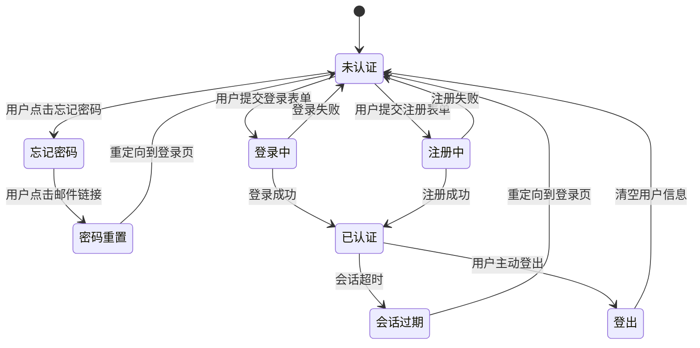

# 认证服务

<cite>
**本文档中引用的文件**
- [authService.ts](file://src/services/authService.ts)
- [auth.ts](file://src/stores/auth.ts)
- [permission.ts](file://src/permission.ts)
- [LoginView.vue](file://src/views/auth/LoginView.vue)
- [RegisterView.vue](file://src/views/auth/RegisterView.vue)
- [supabaseClient.ts](file://src/lib/supabaseClient.ts)
- [userService.ts](file://src/services/userService.ts)
- [errorHandler.ts](file://src/utils/errorHandler.ts)
- [index.ts](file://src/types/index.ts)
</cite>

## 目录
1. [简介](#简介)
2. [核心功能实现](#核心功能实现)
3. [认证状态管理](#认证状态管理)
4. [与前端组件的集成](#与前端组件的集成)
5. [认证流程状态转换图](#认证流程状态转换图)
6. [错误处理机制](#错误处理机制)
7. [安全最佳实践](#安全最佳实践)
8. [与路由守卫的集成](#与路由守卫的集成)
9. [常见问题排查](#常见问题排查)
10. [附录](#附录)

## 简介
本文档深入解析 `authService` 模块的实现细节，涵盖用户注册、登录、登出、密码重置及会话管理等核心功能。详细说明其对 Supabase Auth API 的封装方式，包括请求参数构造、响应数据解析与错误码处理机制。结合 Pinia store 中的 auth 状态管理，阐述服务层与状态的交互流程。提供实际调用示例，展示在 LoginView、RegisterView 等组件中的使用方式。

**Section sources**
- [authService.ts](file://src/services/authService.ts#L1-L292)
- [auth.ts](file://src/stores/auth.ts#L1-L151)

## 核心功能实现

### 用户注册
`AuthService.register` 方法封装了 Supabase 的注册流程。首先检查用户名是否可用，然后调用 `supabase.auth.signUp` 进行注册。注册成功后，会创建用户资料并更新用户信息。该方法返回包含用户信息和会话的 Promise。

**Section sources**
- [authService.ts](file://src/services/authService.ts#L45-L86)
- [userService.ts](file://src/services/userService.ts#L1-L287)

### 用户登录
`AuthService.login` 方法处理用户登录逻辑。通过 `supabase.auth.signInWithPassword` 验证凭据，登录成功后更新用户的最后登录时间，并获取完整的用户资料。该方法返回包含用户信息和会话的 Promise。

**Section sources**
- [authService.ts](file://src/services/authService.ts#L8-L44)
- [userService.ts](file://src/services/userService.ts#L1-L287)

### 用户登出
`AuthService.logout` 方法调用 `supabase.auth.signOut` 实现用户登出功能。该方法封装了错误处理，确保登出过程的可靠性。

**Section sources**
- [authService.ts](file://src/services/authService.ts#L87-L97)
- [auth.ts](file://src/stores/auth.ts#L130-L145)

### 密码重置
`AuthService.forgotPassword` 和 `AuthService.resetPassword` 方法共同实现密码重置功能。前者发送重置密码邮件，后者在用户点击邮件链接后更新密码。`AuthService.changePassword` 用于已登录用户更改密码。

**Section sources**
- [authService.ts](file://src/services/authService.ts#L99-L132)
- [authService.ts](file://src/services/authService.ts#L134-L145)

### 会话管理
`AuthService` 提供了完整的会话管理功能，包括 `getSession` 获取当前会话、`refreshSession` 刷新会话、`isAuthenticated` 检查认证状态，以及 `onAuthStateChange` 监听认证状态变化。

**Section sources**
- [authService.ts](file://src/services/authService.ts#L178-L218)
- [supabaseClient.ts](file://src/lib/supabaseClient.ts#L1-L266)

### 第三方登录
支持 Google 和 GitHub 第三方登录，通过 `signInWithGoogle` 和 `signInWithGitHub` 方法实现。这些方法使用 OAuth 流程，重定向到相应的登录页面。

**Section sources**
- [authService.ts](file://src/services/authService.ts#L220-L258)

### 账户管理
提供 `updateEmail` 更新邮箱、`verifyEmail` 验证邮箱、`resendVerificationEmail` 重新发送验证邮件，以及 `deleteAccount` 删除账户等功能。

**Section sources**
- [authService.ts](file://src/services/authService.ts#L147-L176)
- [userService.ts](file://src/services/userService.ts#L258-L287)

## 认证状态管理

### Pinia Store 结构
`useAuthStore` 使用 Pinia 管理认证状态，包含用户信息、加载状态、初始化状态和错误信息。通过 `isAuthenticated` 和 `isAdmin` 计算属性提供便捷的访问方式。

**Section sources**
- [auth.ts](file://src/stores/auth.ts#L1-L151)

### 状态初始化
`initialize` 方法是认证状态管理的核心，它监听 Supabase 的认证状态变化。当会话存在时，获取用户资料并组合 Supabase 用户信息和自定义用户资料；当会话不存在时，清空用户信息。

**Section sources**
- [auth.ts](file://src/stores/auth.ts#L80-L118)

### 用户资料获取
`fetchUserProfile` 方法从 `user_profiles` 表中获取用户的详细信息，包括用户名、头像 URL 和角色。如果获取失败，会设置错误状态，避免应用卡死。

**Section sources**
- [auth.ts](file://src/stores/auth.ts#L58-L78)
- [userService.ts](file://src/services/userService.ts#L1-L287)

### 登出处理
`logout` 方法处理用户登出逻辑，设置加载状态，调用 Supabase 的登出方法，并在 `onAuthStateChange` 回调中自动清空用户信息。

**Section sources**
- [auth.ts](file://src/stores/auth.ts#L130-L145)
- [authService.ts](file://src/services/authService.ts#L87-L97)

## 与前端组件的集成

### LoginView 组件
`LoginView.vue` 组件实现了用户登录界面。通过 `handleLogin` 方法调用认证服务，处理登录逻辑。组件包含邮箱、密码输入框，以及记住我、忘记密码等选项。

**Section sources**
- [LoginView.vue](file://src/views/auth/LoginView.vue#L1-L324)
- [authService.ts](file://src/services/authService.ts#L8-L44)

### RegisterView 组件
`RegisterView.vue` 组件实现了用户注册界面。包含姓名、邮箱、密码、确认密码等字段，以及密码强度指示器和用户协议同意选项。通过 `handleRegister` 方法处理注册逻辑。

**Section sources**
- [RegisterView.vue](file://src/views/auth/RegisterView.vue#L1-L440)
- [authService.ts](file://src/services/authService.ts#L45-L86)

### 错误处理
两个组件都实现了统一的错误处理机制，通过 `error` 响应式变量显示错误信息。在提交表单时，设置加载状态，捕获并显示错误。

**Section sources**
- [LoginView.vue](file://src/views/auth/LoginView.vue#L44-L97)
- [RegisterView.vue](file://src/views/auth/RegisterView.vue#L320-L360)

## 认证流程状态转换图

**Diagram sources**
- [authService.ts](file://src/services/authService.ts#L8-L258)
- [auth.ts](file://src/stores/auth.ts#L1-L151)

## 错误处理机制

### 错误处理流程
`authService` 中的每个方法都使用统一的错误处理模式：捕获异常，使用 `ErrorHandler.handleApiError` 处理 API 错误，记录错误日志，然后抛出自定义错误。

**Section sources**
- [authService.ts](file://src/services/authService.ts#L15-L25)
- [errorHandler.ts](file://src/utils/errorHandler.ts#L1-L326)

### 错误码处理
`ErrorHandler` 类根据 HTTP 状态码和数据库错误码创建相应的应用错误。例如，401 状态码对应 "UNAUTHORIZED" 错误，PGRST116 数据库错误码对应 "NOT_FOUND" 错误。

**Section sources**
- [errorHandler.ts](file://src/utils/errorHandler.ts#L50-L150)

### 错误日志记录
`ErrorHandler.logError` 方法记录错误的详细信息，包括错误码、消息、上下文、用户代理和当前 URL，便于问题排查和监控。

**Section sources**
- [errorHandler.ts](file://src/utils/errorHandler.ts#L240-L260)

## 安全最佳实践

### 密码策略
在 `RegisterView` 组件中实现了密码强度检查，要求密码至少 8 位，并根据包含的字符类型（小写字母、大写字母、数字、特殊字符）显示强度等级。

**Section sources**
- [RegisterView.vue](file://src/views/auth/RegisterView.vue#L120-L150)

### 防止暴力破解
通过 Supabase 的内置机制防止暴力破解攻击。`AuthService` 中的错误处理不会泄露具体错误信息，避免攻击者利用错误信息进行猜测。

**Section sources**
- [authService.ts](file://src/services/authService.ts#L15-L25)
- [errorHandler.ts](file://src/utils/errorHandler.ts#L50-L150)

### 会话安全
使用 Supabase 的会话管理机制，自动刷新令牌，持久化会话，并在 URL 中检测会话。敏感操作需要重新验证用户身份。

**Section sources**
- [supabaseClient.ts](file://src/lib/supabaseClient.ts#L20-L25)
- [authService.ts](file://src/services/authService.ts#L178-L218)

### 邮箱验证
新用户注册后需要验证邮箱，通过 `resendVerificationEmail` 方法可以重新发送验证邮件。`verifyEmail` 方法处理邮箱验证逻辑。

**Section sources**
- [authService.ts](file://src/services/authService.ts#L159-L176)

## 与路由守卫的集成

### 路由守卫配置
`setupRouterGuard` 函数配置了全局前置守卫，根据路由的元信息决定是否需要认证或管理员权限。公开页面直接通过，需要认证的页面会初始化认证状态。

**Section sources**
- [permission.ts](file://src/permission.ts#L1-L90)
- [auth.ts](file://src/stores/auth.ts#L80-L118)

### 认证检查
对于需要认证的路由，检查 `authStore.isAuthenticated` 状态，未认证则重定向到登录页。对于需要管理员权限的路由，检查 `authStore.isAdmin` 状态。

**Section sources**
- [permission.ts](file://src/permission.ts#L40-L55)
- [auth.ts](file://src/stores/auth.ts#L30-L38)

### 初始化优化
路由守卫只在需要时初始化认证状态，避免不必要的性能开销。同时，初始化工具数据，确保关键数据加载。

**Section sources**
- [permission.ts](file://src/permission.ts#L35-L70)

## 常见问题排查

### 会话过期
当会话过期时，`isAuthenticated` 返回 false，路由守卫会自动重定向到登录页。建议在关键操作前检查会话状态，必要时调用 `refreshSession`。

**Section sources**
- [authService.ts](file://src/services/authService.ts#L200-L218)
- [permission.ts](file://src/permission.ts#L40-L55)

### 邮箱验证失败
邮箱验证失败可能由于链接过期或已被使用。建议检查链接的有效期，或使用 `resendVerificationEmail` 重新发送验证邮件。

**Section sources**
- [authService.ts](file://src/services/authService.ts#L159-L176)

### 第三方登录失败
第三方登录失败可能由于重定向 URL 配置错误或网络问题。检查 `supabaseClient.ts` 中的 `redirectTo` 配置，确保与 Supabase 项目设置一致。

**Section sources**
- [authService.ts](file://src/services/authService.ts#L220-L258)
- [supabaseClient.ts](file://src/lib/supabaseClient.ts#L20-L25)

### 用户资料获取失败
用户资料获取失败可能由于 `user_profiles` 表中缺少对应记录。`UserService.getCurrentUser` 会自动创建缺失的用户资料。

**Section sources**
- [userService.ts](file://src/services/userService.ts#L1-L287)
- [auth.ts](file://src/stores/auth.ts#L58-L78)

## 附录

### 核心类型定义
`LoginForm` 和 `RegisterForm` 类型定义了登录和注册表单的数据结构，包括邮箱、密码、用户名等字段。

**Section sources**
- [index.ts](file://src/types/index.ts#L300-L350)

### Supabase 客户端配置
`supabaseClient.ts` 文件配置了 Supabase 客户端，包括自动刷新令牌、持久化会话和 URL 中检测会话等选项。

**Section sources**
- [supabaseClient.ts](file://src/lib/supabaseClient.ts#L1-L266)

### 环境变量
认证服务依赖 `VITE_SUPABASE_URL` 和 `VITE_SUPABASE_ANON_KEY` 环境变量，需要在 `.env.local` 文件或部署环境中正确配置。

**Section sources**
- [supabaseClient.ts](file://src/lib/supabaseClient.ts#L3-L18)