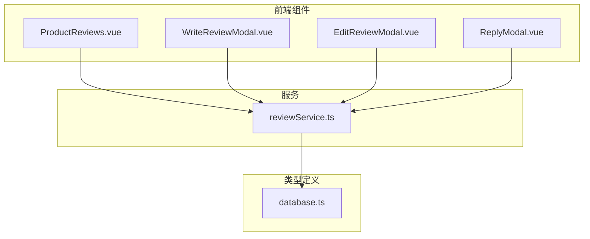
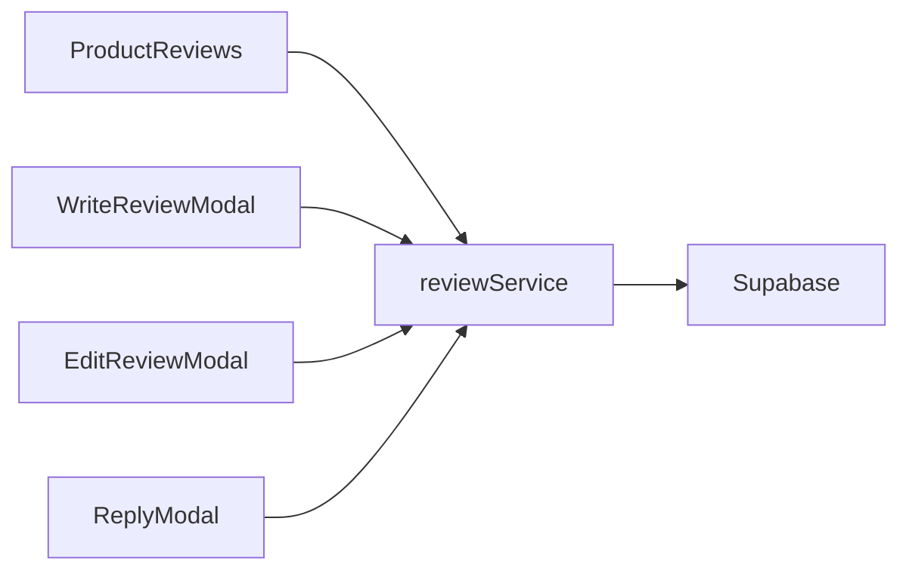
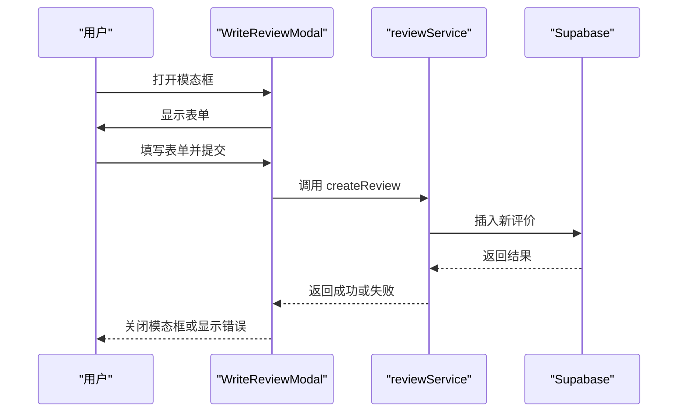
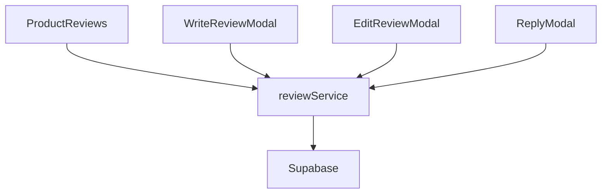

# 评价服务

<cite>
**本文档引用的文件**
- [reviewService.ts](file://src/services/reviewService.ts)
- [ProductReviews.vue](file://src/components/reviews/ProductReviews.vue)
- [WriteReviewModal.vue](file://src/components/reviews/WriteReviewModal.vue)
- [database.ts](file://src/types/database.ts)
</cite>

## 目录
1. [介绍](#介绍)
2. [项目结构](#项目结构)
3. [核心组件](#核心组件)
4. [架构概述](#架构概述)
5. [详细组件分析](#详细组件分析)
6. [依赖分析](#依赖分析)
7. [性能考虑](#性能考虑)
8. [故障排除指南](#故障排除指南)
9. [结论](#结论)

## 介绍
本文件详细说明了 `reviewService` 如何实现用户评价的提交、审核、展示与管理功能。文档涵盖评价数据模型、权限控制、审核流程、防刷评机制、分页查询优化以及评分统计集成方式。

## 项目结构
项目结构清晰地组织了前端组件和服务，确保代码的可维护性和扩展性。



**图示来源**
- [ProductReviews.vue](file://src/components/reviews/ProductReviews.vue)
- [WriteReviewModal.vue](file://src/components/reviews/WriteReviewModal.vue)
- [reviewService.ts](file://src/services/reviewService.ts)
- [database.ts](file://src/types/database.ts)

**本节来源**
- [ProductReviews.vue](file://src/components/reviews/ProductReviews.vue)
- [WriteReviewModal.vue](file://src/components/reviews/WriteReviewModal.vue)
- [reviewService.ts](file://src/services/reviewService.ts)
- [database.ts](file://src/types/database.ts)

## 核心组件
核心组件包括 `ProductReviews` 和 `WriteReviewModal`，它们负责用户界面的展示和交互。

**本节来源**
- [ProductReviews.vue](file://src/components/reviews/ProductReviews.vue)
- [WriteReviewModal.vue](file://src/components/reviews/WriteReviewModal.vue)

## 架构概述
系统架构通过 `reviewService` 提供统一的接口，前端组件通过这些接口与后端进行通信。



**图示来源**
- [reviewService.ts](file://src/services/reviewService.ts)
- [ProductReviews.vue](file://src/components/reviews/ProductReviews.vue)
- [WriteReviewModal.vue](file://src/components/reviews/WriteReviewModal.vue)

## 详细组件分析
### ProductReviews 分析
`ProductReviews` 组件展示了产品的评价列表和统计信息。

#### 类图
```mermaid
classDiagram
class ProductReviews {
+loading : boolean
+reviews : Review[]
+stats : ReviewStats
+loadReviews()
+handleVote()
+handleReply()
+handleEdit()
+handleDelete()
}
class Review {
+id : string
+product_id : string
+user_id : string
+rating : number
+title : string
+content : string
+pros : string[]
+cons : string[]
+is_verified_purchase : boolean
+is_anonymous : boolean
+status : "pending" | "approved" | "rejected"
+helpful_count : number
+unhelpful_count : number
+reply_count : number
+created_at : string
+updated_at : string
}
class ReviewStats {
+total_reviews : number
+average_rating : number
+rating_distribution : {1 : number, 2 : number, 3 : number, 4 : number, 5 : number}
+verified_purchase_percentage : number
+recent_reviews_count : number
}
ProductReviews --> Review
ProductReviews --> ReviewStats
```

**图示来源**
- [ProductReviews.vue](file://src/components/reviews/ProductReviews.vue)
- [reviewService.ts](file://src/services/reviewService.ts)

### WriteReviewModal 分析
`WriteReviewModal` 组件允许用户提交新的评价。

#### 序列图


**图示来源**
- [WriteReviewModal.vue](file://src/components/reviews/WriteReviewModal.vue)
- [reviewService.ts](file://src/services/reviewService.ts)

## 依赖分析
组件之间的依赖关系清晰，确保了系统的模块化和可维护性。



**图示来源**
- [ProductReviews.vue](file://src/components/reviews/ProductReviews.vue)
- [WriteReviewModal.vue](file://src/components/reviews/WriteReviewModal.vue)
- [reviewService.ts](file://src/services/reviewService.ts)

**本节来源**
- [ProductReviews.vue](file://src/components/reviews/ProductReviews.vue)
- [WriteReviewModal.vue](file://src/components/reviews/WriteReviewModal.vue)
- [reviewService.ts](file://src/services/reviewService.ts)

## 性能考虑
- **分页查询**：使用 `page` 和 `limit` 参数优化查询性能。
- **缓存**：前端组件缓存评价数据，减少重复请求。
- **异步加载**：评价列表和统计信息异步加载，提升用户体验。

## 故障排除指南
- **无法提交评价**：检查网络连接和用户权限。
- **评价未显示**：确认评价状态是否为 `approved`。
- **统计信息不准确**：检查数据库中的评价数据是否完整。

**本节来源**
- [reviewService.ts](file://src/services/reviewService.ts)
- [ProductReviews.vue](file://src/components/reviews/ProductReviews.vue)

## 结论
`reviewService` 实现了完整的用户评价功能，从前端组件到后端服务，每个部分都设计得当，确保了系统的稳定性和可扩展性。