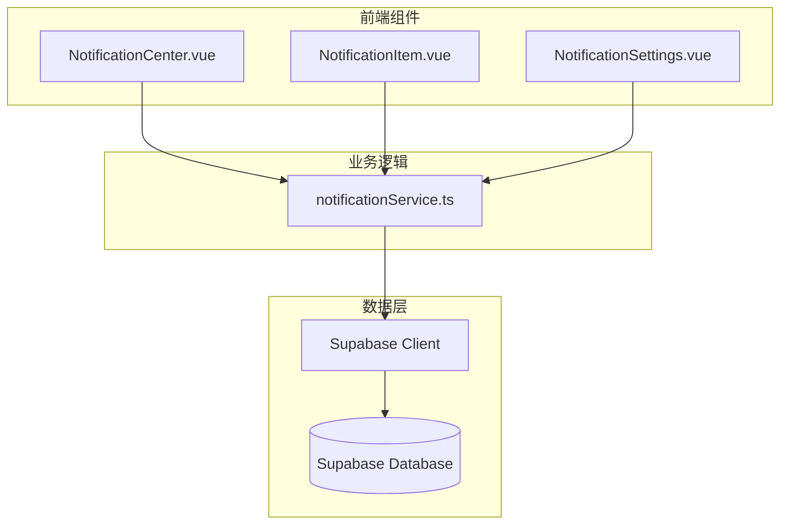
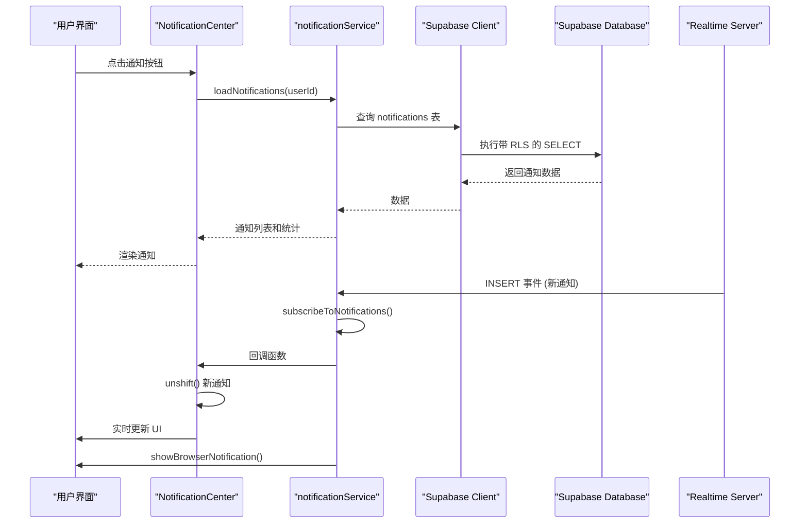
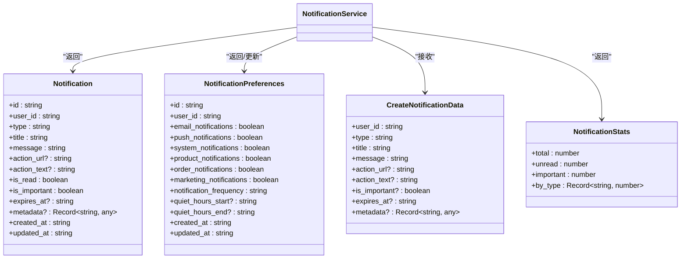
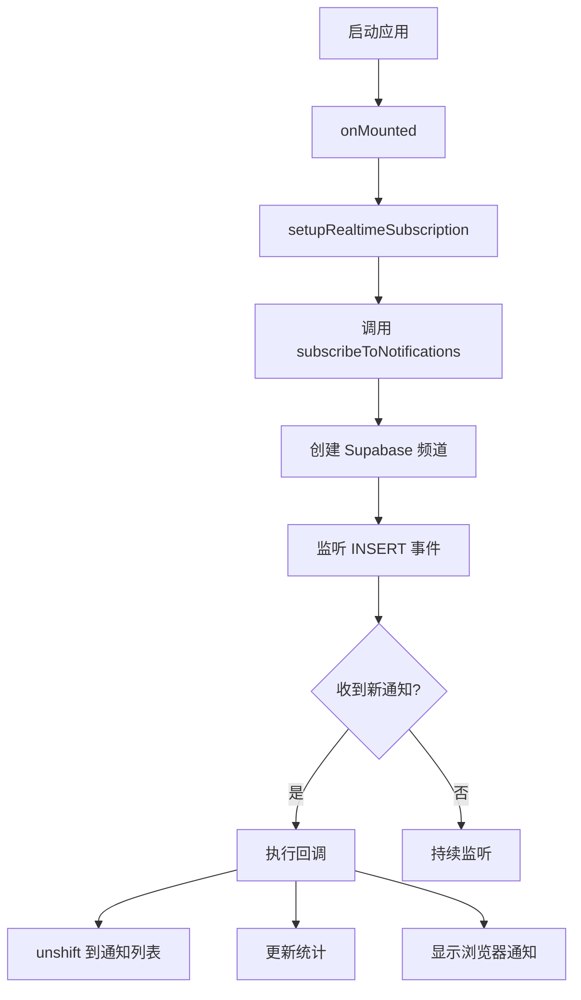
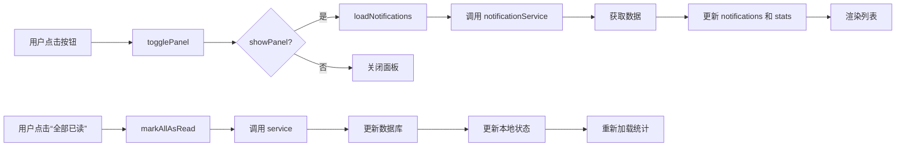
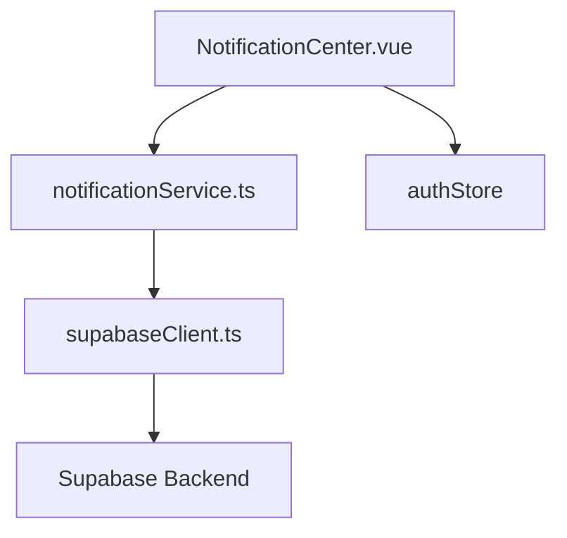

# 通知服务

<cite>
**本文档引用的文件**
- [notificationService.ts](file://src/services/notificationService.ts)
- [NotificationCenter.vue](file://src/components/notifications/NotificationCenter.vue)
- [supabaseClient.ts](file://src/lib/supabaseClient.ts)
</cite>

## 目录
1. [简介](#简介)
2. [项目结构](#项目结构)
3. [核心组件](#核心组件)
4. [架构概述](#架构概述)
5. [详细组件分析](#详细组件分析)
6. [依赖分析](#依赖分析)
7. [性能考虑](#性能考虑)
8. [故障排除指南](#故障排除指南)
9. [结论](#结论)

## 简介
本文件全面阐述了 `notificationService` 如何实现用户通知的推送、读取与状态管理机制。重点说明通过 Supabase Realtime 订阅用户专属通知频道，实时接收新通知并更新 UI 的完整流程。同时涵盖历史通知查询、标记已读、批量删除等操作的实现方式。结合 `NotificationCenter` 组件，展示数据绑定与交互逻辑。文档还包含通知类型定义、消息结构设计、离线消息处理、分页加载等性能优化策略、实时连接稳定性保障（重连机制）以及与数据库 RLS 策略的安全集成。

## 项目结构
项目采用典型的 Vue 3 + TypeScript 架构，通知相关功能集中于 `src/services` 和 `src/components/notifications` 目录。`notificationService.ts` 提供核心业务逻辑，`NotificationCenter.vue` 实现用户界面，两者通过事件驱动和状态管理紧密协作。Supabase 客户端 (`supabaseClient.ts`) 作为统一的数据访问层，确保与后端的安全通信。

**Diagram sources**
- [notificationService.ts](file://src/services/notificationService.ts#L1-L514)
- [NotificationCenter.vue](file://src/components/notifications/NotificationCenter.vue#L1-L716)
- [supabaseClient.ts](file://src/lib/supabaseClient.ts#L1-L267)

**Section sources**
- [notificationService.ts](file://src/services/notificationService.ts#L1-L514)
- [NotificationCenter.vue](file://src/components/notifications/NotificationCenter.vue#L1-L716)

## 核心组件
核心组件包括 `notificationService` 类和 `NotificationCenter` 组件。`notificationService` 封装了所有与通知相关的 CRUD 操作、实时订阅和偏好管理。`NotificationCenter` 是一个复合组件，集成了通知列表、筛选器、设置面板和状态指示器，为用户提供完整的通知管理体验。

**Section sources**
- [notificationService.ts](file://src/services/notificationService.ts#L1-L514)
- [NotificationCenter.vue](file://src/components/notifications/NotificationCenter.vue#L1-L716)

## 架构概述
系统采用分层架构，前端通过 `notificationService` 与 Supabase 交互。通知的实时性由 Supabase 的 Realtime 功能保障，前端订阅特定于用户的频道。数据安全通过数据库的 RLS（行级安全）策略实现，确保用户只能访问自己的通知。`NotificationCenter` 组件通过 Composable API 与服务层解耦，便于维护和测试。

**Diagram sources**
- [notificationService.ts](file://src/services/notificationService.ts#L1-L514)
- [NotificationCenter.vue](file://src/components/notifications/NotificationCenter.vue#L1-L716)

## 详细组件分析

### NotificationService 分析
`NotificationService` 是通知功能的核心，提供全面的 API。

#### 通知类型与数据结构
服务定义了清晰的 `Notification` 和 `NotificationPreferences` 接口，确保类型安全。

**Diagram sources**
- [notificationService.ts](file://src/services/notificationService.ts#L1-L514)

#### 实时通知推送与订阅
服务通过 `subscribeToNotifications` 方法建立实时连接。它创建一个基于用户 ID 命名的频道，并监听 `notifications` 表的 `INSERT` 事件。当有新通知插入数据库时，回调函数会立即执行，将新通知推送到前端。

**Diagram sources**
- [notificationService.ts](file://src/services/notificationService.ts#L380-L410)
- [NotificationCenter.vue](file://src/components/notifications/NotificationCenter.vue#L290-L320)

#### 通知的查询与状态管理
服务提供分页查询 (`getUserNotifications`)、统计获取 (`getNotificationStats`)、标记已读 (`markAsRead`, `markAllAsRead`) 和删除 (`deleteNotification`) 等方法。所有数据库操作都通过 `supabaseClient` 执行，并应用了 RLS 策略，确保操作的安全性。

**Section sources**
- [notificationService.ts](file://src/services/notificationService.ts#L50-L380)

### NotificationCenter 分析
`NotificationCenter` 是用户与通知系统交互的入口。

#### 数据绑定与交互逻辑
组件通过 `ref` 和 `computed` 属性管理状态，并利用 `watch` 监听用户登录状态和筛选器变化，自动触发数据加载。`filteredNotifications` 计算属性根据 `activeFilter` 动态过滤通知列表。

**Diagram sources**
- [NotificationCenter.vue](file://src/components/notifications/NotificationCenter.vue#L150-L280)

#### 性能优化
组件实现了分页加载 (`loadMore`)，避免一次性加载过多数据。`loading` 和 `loadingMore` 状态提供了良好的用户体验。`setupRealtimeSubscription` 确保了通知的实时性，无需轮询。

**Section sources**
- [NotificationCenter.vue](file://src/components/notifications/NotificationCenter.vue#L1-L716)

## 依赖分析
`notificationService` 依赖于 `supabaseClient` 进行数据持久化和实时通信。`NotificationCenter` 依赖于 `notificationService` 获取数据和执行操作，同时依赖于 `authStore` 获取当前用户信息。这种依赖关系清晰，通过依赖注入（import）实现，易于维护。

**Diagram sources**
- [notificationService.ts](file://src/services/notificationService.ts#L1-L514)
- [NotificationCenter.vue](file://src/components/notifications/NotificationCenter.vue#L1-L716)
- [supabaseClient.ts](file://src/lib/supabaseClient.ts#L1-L267)

## 性能考虑
系统在性能方面进行了多项优化：
- **分页加载**：`getUserNotifications` 支持 `page` 和 `limit` 参数，有效控制单次请求的数据量。
- **实时更新**：使用 Supabase Realtime，避免了定时轮询带来的性能开销。
- **本地状态管理**：在执行 `markAsRead` 或 `deleteNotification` 后，先更新本地状态，再异步更新数据库，提供即时的 UI 反馈。
- **统计信息缓存**：`stats` 对象在组件内缓存，减少不必要的重复计算。

## 故障排除指南
- **无法接收实时通知**：检查 `subscribeToNotifications` 是否成功执行，确认用户已登录，检查 Supabase 项目是否启用了 Realtime 功能。
- **通知列表为空**：确认数据库中存在该用户 ID 的通知，检查 RLS 策略是否正确。
- **标记已读无效**：检查 `markAsRead` 方法的 `userId` 参数是否与当前用户匹配，确认数据库更新成功。
- **浏览器通知不显示**：检查浏览器是否授予了通知权限，确认 `requestNotificationPermission` 调用成功。

**Section sources**
- [notificationService.ts](file://src/services/notificationService.ts#L50-L380)
- [NotificationCenter.vue](file://src/components/notifications/NotificationCenter.vue#L1-L716)

## 结论
`notificationService` 和 `NotificationCenter` 共同构建了一个高效、安全且用户体验良好的通知系统。通过集成 Supabase 的强大功能，实现了从数据存储、实时推送、安全控制到前端交互的完整闭环。代码结构清晰，职责分离明确，为系统的可维护性和可扩展性奠定了坚实基础。