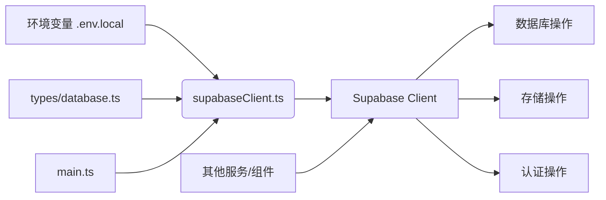
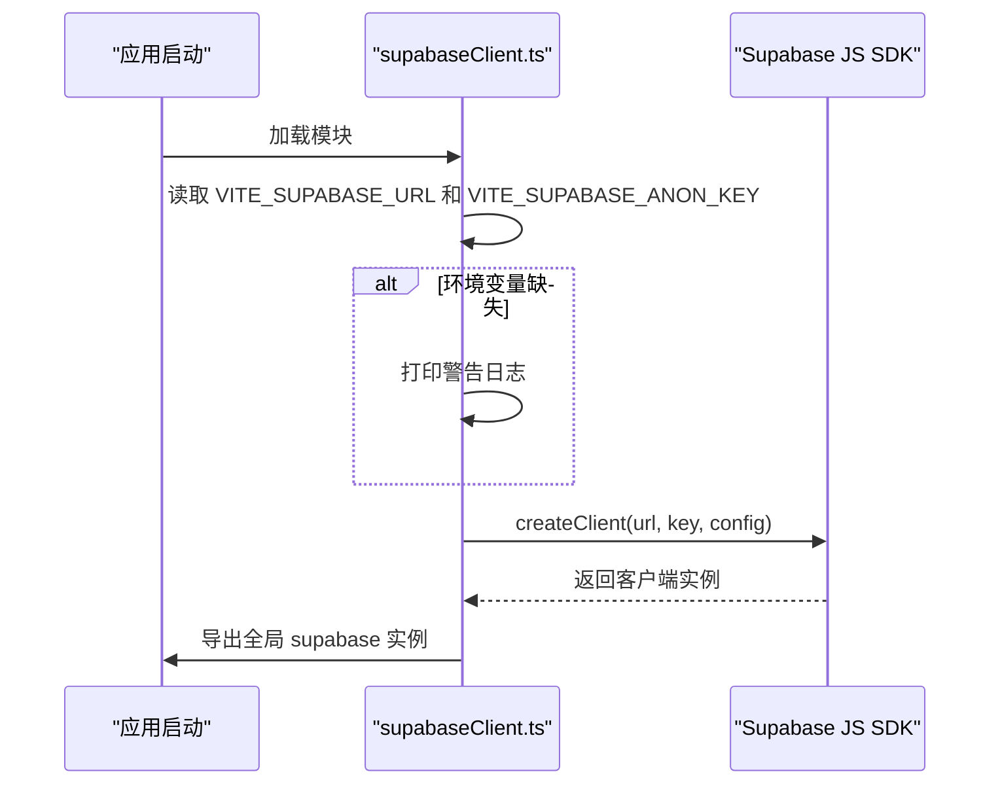
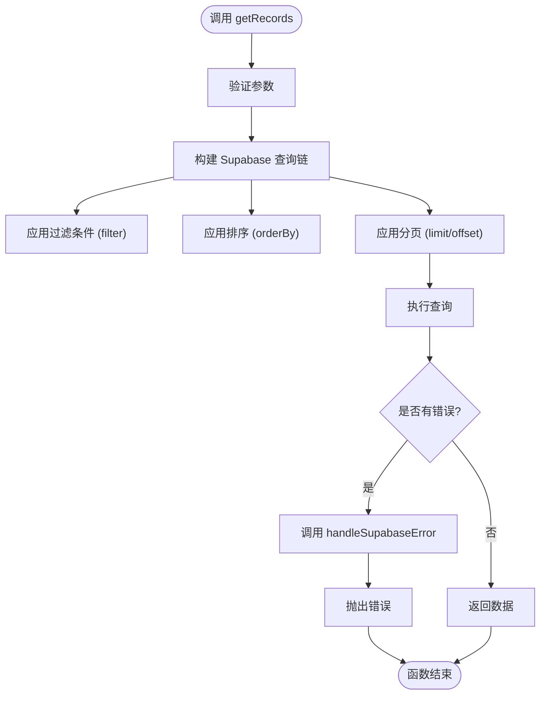
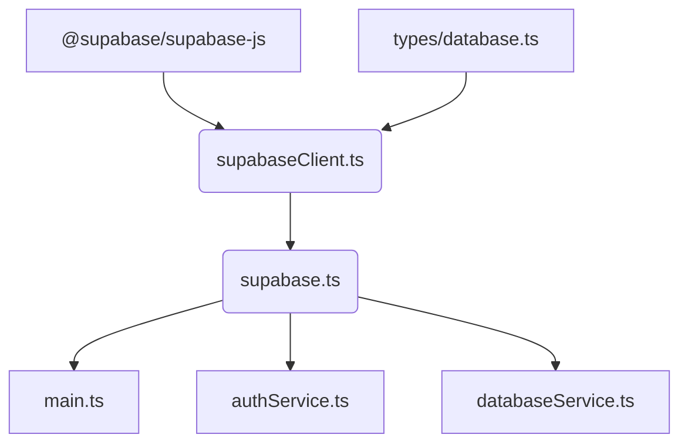

# 核心库结构

<cite>
**本文档中引用的文件**  
- [supabaseClient.ts](file://src/lib/supabaseClient.ts)
- [supabase.ts](file://src/lib/supabase.ts)
- [database.ts](file://src/types/database.ts)
- [main.ts](file://src/main.ts)
</cite>

## 目录
1. [介绍](#介绍)
2. [项目结构](#项目结构)
3. [核心组件](#核心组件)
4. [架构概述](#架构概述)
5. [详细组件分析](#详细组件分析)
6. [依赖分析](#依赖分析)
7. [性能考虑](#性能考虑)
8. [故障排除指南](#故障排除指南)
9. [结论](#结论)

## 介绍
本文件旨在全面解析 `src/lib` 目录下的核心库实现，重点阐述 Supabase 客户端的单例模式、API 封装策略、类型安全查询、认证与实时功能集成等关键机制。通过深入分析 `supabaseClient.ts` 和 `database.ts` 等核心文件，为开发者提供安全高效使用后端服务的指导。

## 项目结构
`src/lib` 目录是项目的核心基础设施所在，主要包含与 Supabase 交互的客户端和服务层。该目录通过 `supabaseClient.ts` 提供全局唯一的 Supabase 客户端实例，并通过 `supabase.ts` 进行统一导出，实现了模块化和解耦。

```mermaid
graph TB
subgraph "src/lib"
supabase["supabase.ts"]
supabaseClient["supabaseClient.ts"]
types["types/database.ts"]
end
supabase --> supabaseClient : "重新导出"
supabaseClient --> types : "类型导入"
```

**Diagram sources**
- [supabase.ts](file://src/lib/supabase.ts)
- [supabaseClient.ts](file://src/lib/supabaseClient.ts)
- [database.ts](file://src/types/database.ts)

**Section sources**
- [supabase.ts](file://src/lib/supabase.ts)
- [supabaseClient.ts](file://src/lib/supabaseClient.ts)

## 核心组件
`src/lib` 的核心组件是 `supabaseClient.ts`，它实现了 Supabase 客户端的单例模式。该文件负责环境变量的读取与验证、客户端的初始化、以及提供一系列封装好的工具函数，用于数据库操作、文件存储和用户认证。

**Section sources**
- [supabaseClient.ts](file://src/lib/supabaseClient.ts#L1-L266)

## 架构概述
整个核心库的架构围绕 `supabase` 全局实例展开。`supabaseClient.ts` 是唯一创建和配置此实例的地方，确保了应用中所有模块都使用同一个连接。`types/database.ts` 提供了与数据库模式完全匹配的 TypeScript 类型，实现了端到端的类型安全。其他服务（如 `authService.ts`）和组件通过导入 `supabase` 实例来执行具体操作。



**Diagram sources**
- [supabaseClient.ts](file://src/lib/supabaseClient.ts)
- [database.ts](file://src/types/database.ts)
- [main.ts](file://src/main.ts)

## 详细组件分析

### Supabase 客户端单例模式分析
`supabaseClient.ts` 通过 `createClient` 函数创建一个全局的 `supabase` 实例。该实例在模块加载时初始化，并通过 `export` 关键字导出，供整个应用使用。这种单例模式避免了重复创建客户端连接，提高了资源利用率。



**Diagram sources**
- [supabaseClient.ts](file://src/lib/supabaseClient.ts#L1-L20)

**Section sources**
- [supabaseClient.ts](file://src/lib/supabaseClient.ts#L1-L50)

### API 封装策略分析
`supabaseClient.ts` 提供了一系列工具函数来封装常见的数据库操作，如 `createRecord`、`updateRecord`、`getRecords` 等。这些函数统一处理了错误（通过 `handleSupabaseError`），并返回标准化的数据，简化了上层调用。同时，它定义了 `TABLES` 和 `STORAGE_BUCKETS` 常量，避免了硬编码。



**Diagram sources**
- [supabaseClient.ts](file://src/lib/supabaseClient.ts#L150-L200)

**Section sources**
- [supabaseClient.ts](file://src/lib/supabaseClient.ts#L100-L250)

### 数据库类型映射分析
`types/database.ts` 文件是类型安全的核心。它定义了一个 `Database` 接口，精确映射了 Supabase 数据库的表结构。每个表都有 `Row`、`Insert` 和 `Update` 三种类型，分别对应查询结果、插入数据和更新数据的结构。`supabaseClient.ts` 在创建客户端时使用了这个泛型 `<Database>`，使得所有数据库操作都具备了编译时的类型检查。

**Section sources**
- [database.ts](file://src/types/database.ts#L1-L395)

### 主入口初始化流程分析
`main.ts` 文件是应用的入口点。它通过 `import { supabase } from "@/lib/supabase"` 间接引入了全局的 Supabase 客户端实例。虽然 `main.ts` 本身不直接初始化 `supabase`，但它在应用启动时，通过初始化 Pinia stores（如 `authStore`），间接触发了对 `supabase` 实例的使用，例如监听认证状态变化。

**Section sources**
- [main.ts](file://src/main.ts#L1-L58)

## 依赖分析
`src/lib` 内部的依赖关系清晰。`supabaseClient.ts` 依赖于外部的 `@supabase/supabase-js` SDK 和内部的 `types/database.ts`。`supabase.ts` 仅依赖于 `supabaseClient.ts`，起到了一个聚合导出的作用。外部模块（如 `main.ts` 和各种 `services`）都依赖于 `supabase.ts` 或直接依赖 `supabaseClient.ts` 来获取客户端实例。



**Diagram sources**
- [supabaseClient.ts](file://src/lib/supabaseClient.ts)
- [supabase.ts](file://src/lib/supabase.ts)
- [database.ts](file://src/types/database.ts)
- [main.ts](file://src/main.ts)

**Section sources**
- [supabaseClient.ts](file://src/lib/supabaseClient.ts)
- [supabase.ts](file://src/lib/supabase.ts)

## 性能考虑
- **连接池**：Supabase JS SDK 内部管理连接，单例模式确保了连接的复用。
- **查询优化**：`getRecords` 等函数支持分页和过滤，避免了全表扫描。
- **实时订阅**：通过 `REALTIME_CHANNELS` 常量和 `useRealtime` 组合式函数，实现了高效的实时数据同步，减少了轮询开销。

## 故障排除指南
- **环境变量未配置**：检查 `.env.local` 文件或 Netlify 环境变量中是否设置了 `VITE_SUPABASE_URL` 和 `VITE_SUPABASE_ANON_KEY`。
- **数据库操作失败**：查看控制台错误日志，`handleSupabaseError` 函数会提供具体的错误信息。
- **实时订阅无效**：确认数据库表的 RLS（行级安全）策略是否允许订阅，以及 `useRealtime` 的 `table` 参数是否正确。

**Section sources**
- [supabaseClient.ts](file://src/lib/supabaseClient.ts#L10-L30)
- [supabaseClient.ts](file://src/lib/supabaseClient.ts#L250-L260)

## 结论
`src/lib` 目录下的核心库设计良好，通过单例模式、类型安全和 API 封装，为整个应用提供了稳定、高效且易于使用的后端服务接口。开发者应遵循此模式进行开发，确保代码的可维护性和健壮性。