# 产品状态管理

<cite>
**本文档引用文件**  
- [products.ts](file://src/stores/products.ts)
- [productsService.ts](file://src/services/productsService.ts)
- [usePerformance.ts](file://src/composables/usePerformance.ts)
- [ProductsView.vue](file://src/views/ProductsView.vue)
- [ProductDetailView.vue](file://src/views/ProductDetailView.vue)
</cite>

## 目录
1. [产品状态管理架构](#产品状态管理架构)
2. [核心状态设计](#核心状态设计)
3. [数据加载与筛选机制](#数据加载与筛选机制)
4. [详情缓存策略](#详情缓存策略)
5. [性能优化方案](#性能优化方案)
6. [计算属性实现](#计算属性实现)
7. [视图消费模式](#视图消费模式)
8. [状态同步与冲突解决](#状态同步与冲突解决)

## 产品状态管理架构

本系统采用Pinia作为状态管理解决方案，通过`useProductsStore`定义产品相关的全局状态。该store集中管理产品列表、详情、筛选条件等核心数据，确保应用各组件间的数据一致性。

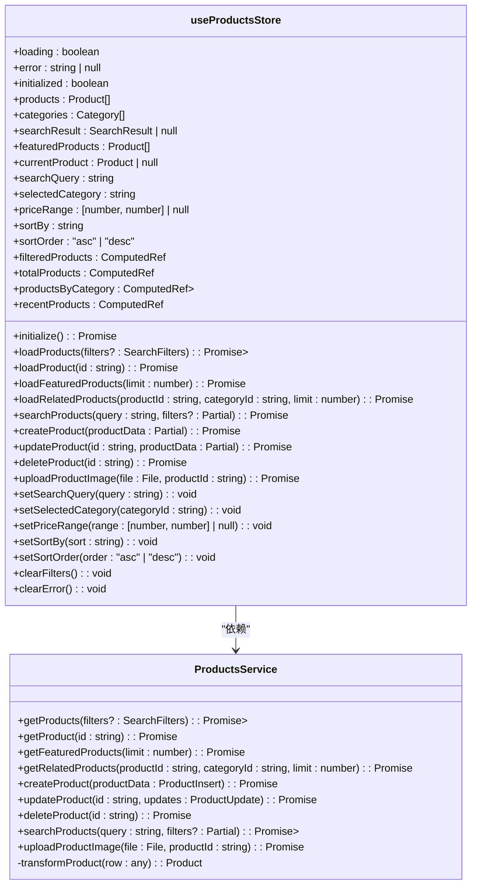

**图表来源**  
- [products.ts](file://src/stores/products.ts#L1-L362)
- [productsService.ts](file://src/services/productsService.ts#L0-L339)

**本节来源**  
- [products.ts](file://src/stores/products.ts#L1-L362)

## 核心状态设计

产品状态管理器定义了多个响应式状态字段，用于存储不同类型的产品数据：

- **products**: 存储所有产品的数组，用于展示产品列表
- **productDetail**: 通过`currentProduct`字段存储当前查看的产品详情
- **pagination**: 通过`SearchResult`接口中的`page`、`limit`、`total`等字段实现分页管理
- **filters**: 包含`searchQuery`、`selectedCategory`、`priceRange`、`sortBy`、`sortOrder`等多个筛选条件

这些状态字段的设计遵循单一数据源原则，确保数据的一致性和可预测性。

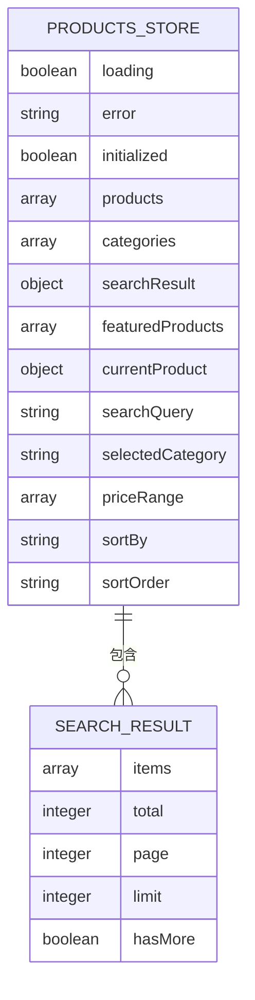

**图表来源**  
- [products.ts](file://src/stores/products.ts#L26-L41)
- [types/index.ts](file://src/types/index.ts#L156-L198)

**本节来源**  
- [products.ts](file://src/stores/products.ts#L26-L41)

## 数据加载与筛选机制

### fetchProducts Action 分析

`loadProducts` action负责加载产品数据，其核心逻辑包括分页加载、筛选条件处理和缓存管理：

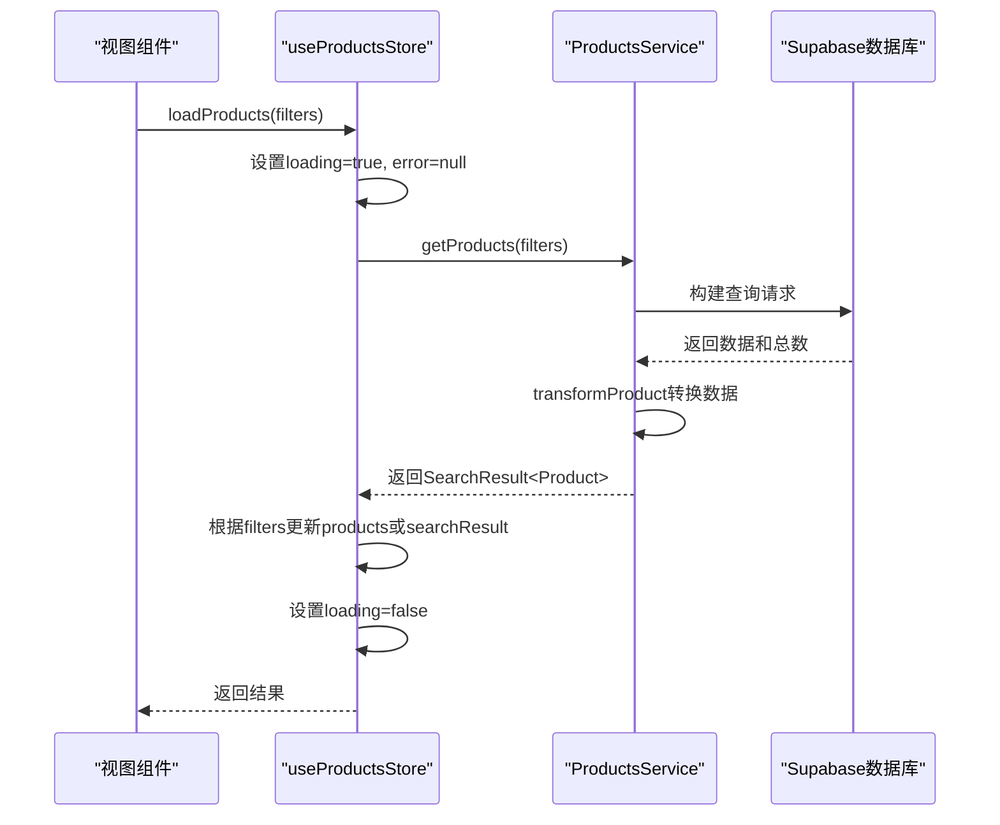

**图表来源**  
- [products.ts](file://src/stores/products.ts#L133-L182)
- [productsService.ts](file://src/services/productsService.ts#L43-L89)

**本节来源**  
- [products.ts](file://src/stores/products.ts#L133-L182)
- [productsService.ts](file://src/services/productsService.ts#L43-L89)

### 与productsService的协作机制

`useProductsStore`通过`ProductsService`类与后端数据库进行交互，实现了关注点分离：

1. **查询构建**: 根据传入的`SearchFilters`参数动态构建Supabase查询
2. **条件过滤**: 支持名称、描述、分类、价格范围等多维度筛选
3. **排序支持**: 提供按名称、价格、创建时间等多种排序方式
4. **分页处理**: 使用`range()`方法实现分页，避免一次性加载过多数据

当筛选条件变化时，相关setter方法会自动触发搜索：

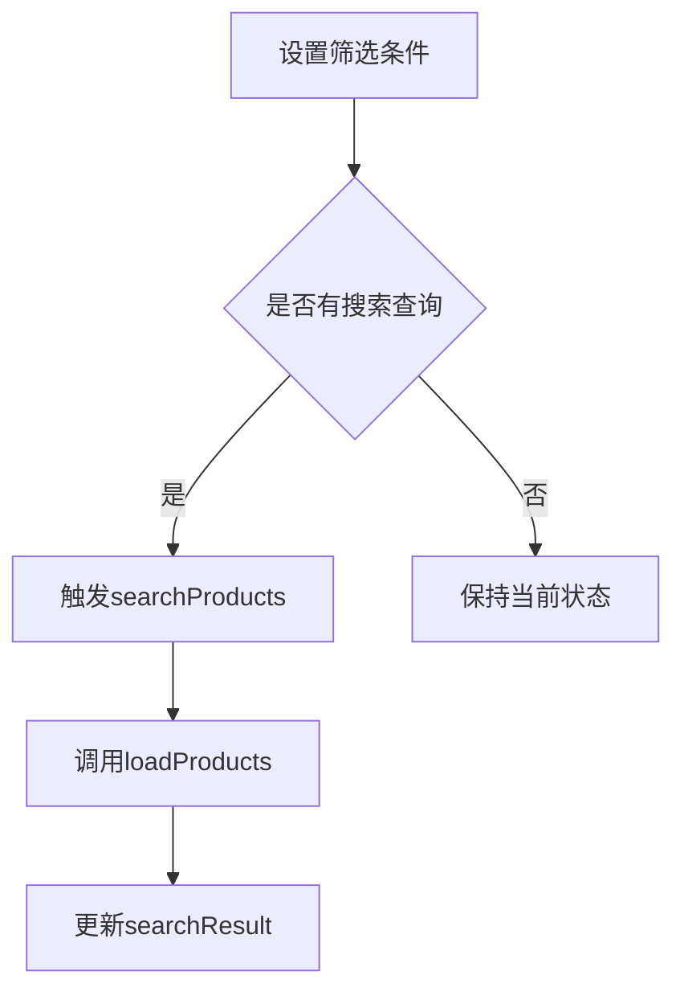

**图表来源**  
- [products.ts](file://src/stores/products.ts#L269-L331)
- [productsService.ts](file://src/services/productsService.ts#L43-L89)

**本节来源**  
- [products.ts](file://src/stores/products.ts#L269-L331)

## 详情缓存策略

### fetchProductDetail Action 分析

`loadProduct` action负责加载单个产品详情，实现了简单的内存缓存机制：

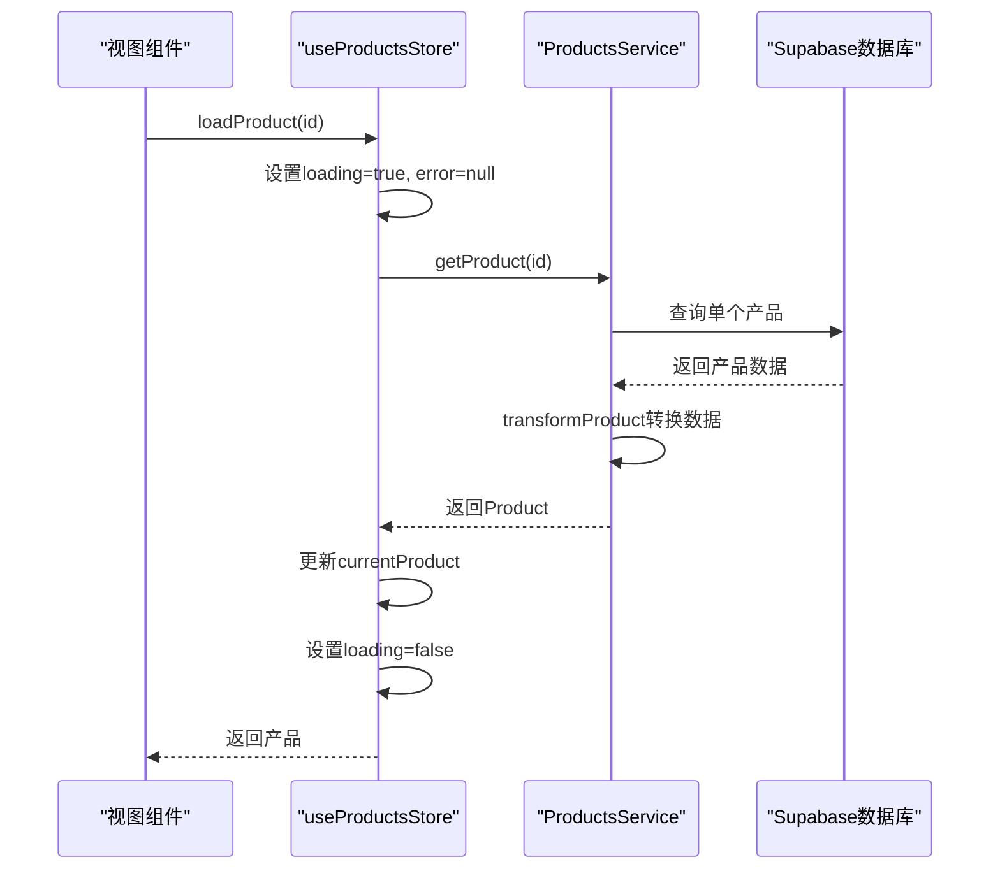

**图表来源**  
- [products.ts](file://src/stores/products.ts#L82-L138)
- [productsService.ts](file://src/services/productsService.ts#L85-L138)

**本节来源**  
- [products.ts](file://src/stores/products.ts#L82-L138)

### 缓存过期时间管理

当前实现中，产品详情缓存存储在`currentProduct` ref中，其生命周期与组件实例绑定：

- **缓存位置**: Pinia store的`currentProduct`字段
- **缓存有效期**: 直到用户导航到其他产品或页面刷新
- **缓存更新**: 当产品被更新时，`updateProduct` action会同步更新缓存

虽然当前没有实现基于时间的缓存过期机制，但可以通过监听产品更新事件来实现更智能的缓存管理。

**本节来源**  
- [products.ts](file://src/stores/products.ts#L82-L138)

## 性能优化方案

### 大数据量下的内存管理

结合`usePerformance.ts`中的性能优化工具，系统在处理大量产品数据时采取了以下策略：

1. **分页加载**: 每次只加载有限数量的产品（默认12个）
2. **懒加载**: 在需要时才加载产品详情
3. **内存监控**: 使用`usePagePerformance`监控页面性能指标

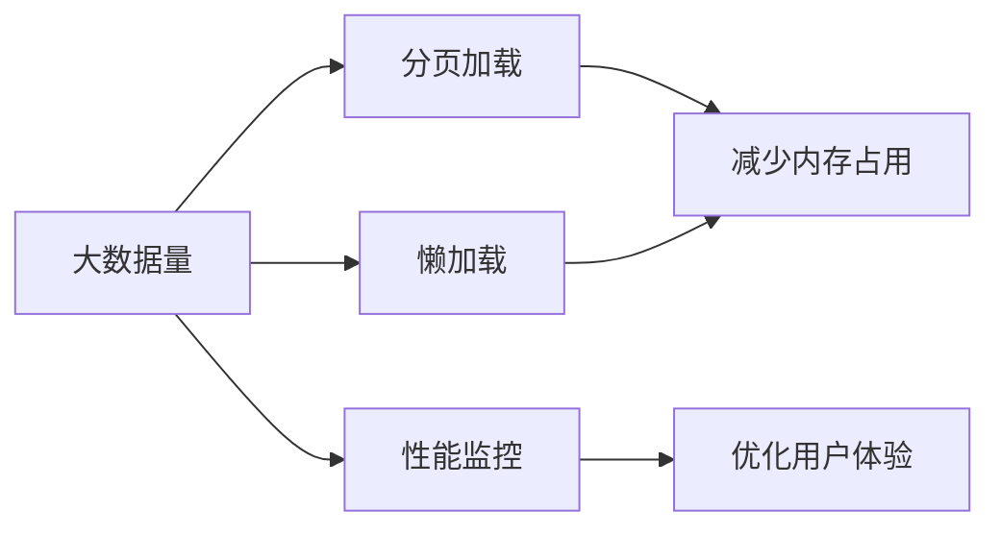

**图表来源**  
- [usePerformance.ts](file://src/composables/usePerformance.ts#L0-L488)
- [productsService.ts](file://src/services/productsService.ts#L43-L89)

**本节来源**  
- [usePerformance.ts](file://src/composables/usePerformance.ts#L0-L488)

## 计算属性实现

### filteredProducts 计算属性

`filteredProducts`是一个关键的计算属性，用于根据当前状态返回适当的产品列表：

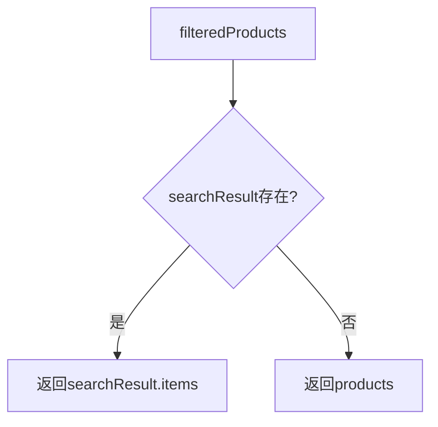

该计算属性的性能考量包括：

- **响应式更新**: 自动响应`searchResult`、`products`等依赖的变化
- **无额外开销**: 仅在依赖变化时重新计算，避免不必要的性能损耗
- **简洁逻辑**: 通过简单的条件判断实现复杂的数据展示逻辑

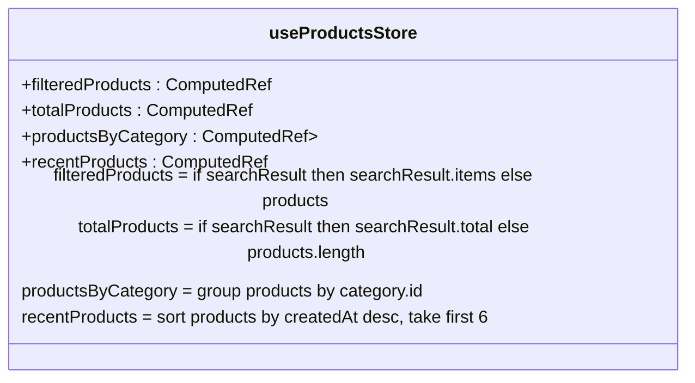

**图表来源**  
- [products.ts](file://src/stores/products.ts#L46-L78)
- [types/index.ts](file://src/types/index.ts#L156-L198)

**本节来源**  
- [products.ts](file://src/stores/products.ts#L46-L78)

## 视图消费模式

### ProductsView.vue 使用示例

`ProductsView.vue`展示了产品状态的典型消费模式：

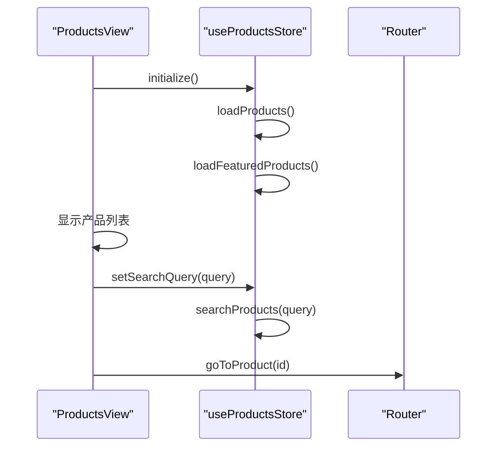

**图表来源**  
- [ProductsView.vue](file://src/views/ProductsView.vue#L0-L737)
- [products.ts](file://src/stores/products.ts#L1-L362)

**本节来源**  
- [ProductsView.vue](file://src/views/ProductsView.vue#L0-L737)

### ProductDetailView.vue 使用示例

`ProductDetailView.vue`展示了产品详情的消费模式：

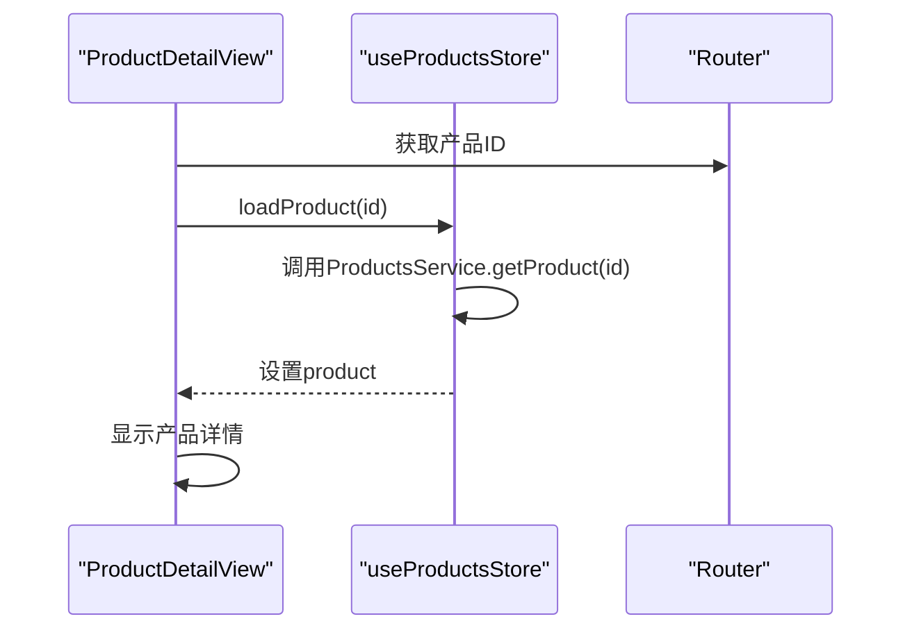

**图表来源**  
- [ProductDetailView.vue](file://src/views/ProductDetailView.vue#L0-L500)
- [products.ts](file://src/stores/products.ts#L82-L138)

**本节来源**  
- [ProductDetailView.vue](file://src/views/ProductDetailView.vue#L0-L500)

## 状态同步与冲突解决

### 管理后台更新后的状态同步

当在管理后台更新产品时，系统通过以下机制确保状态同步：

1. **直接更新**: `updateProduct` action在成功更新后立即更新本地状态
2. **双向同步**: 同时更新`products`列表和`currentProduct`详情
3. **错误处理**: 失败时保持原有状态并显示错误信息

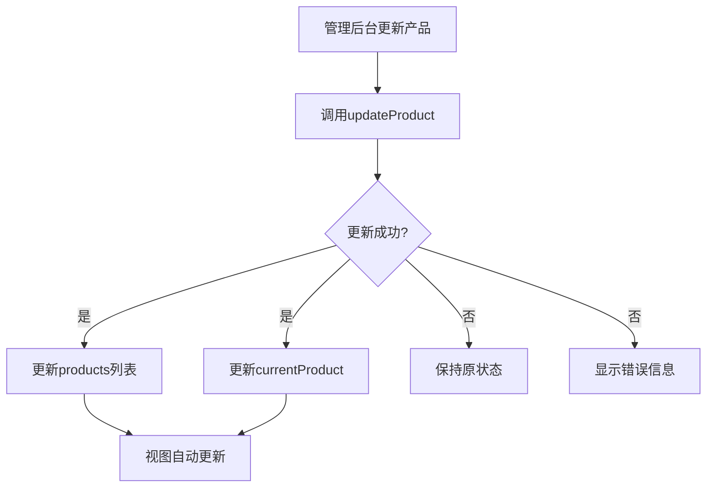

### 并发更新的冲突解决策略

当前系统采用乐观更新策略处理并发更新：

- **最后写入获胜**: 最后提交的更新会覆盖之前的更改
- **版本控制**: 通过`updated_at`字段记录更新时间
- **用户提示**: 在发生冲突时通过错误信息提示用户

虽然当前没有实现复杂的冲突解决机制，但可以通过引入ETag或版本号来增强并发控制能力。

**本节来源**  
- [products.ts](file://src/stores/products.ts#L176-L224)
- [productsService.ts](file://src/services/productsService.ts#L183-L237)