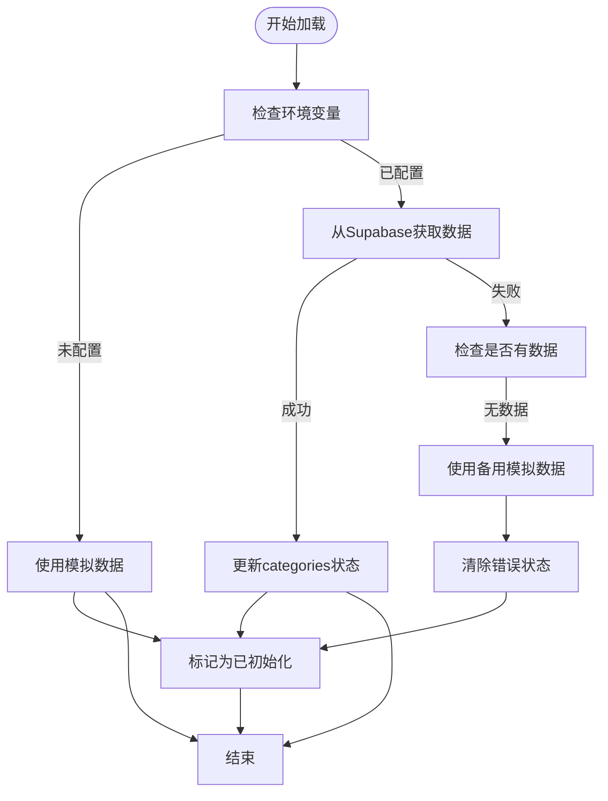
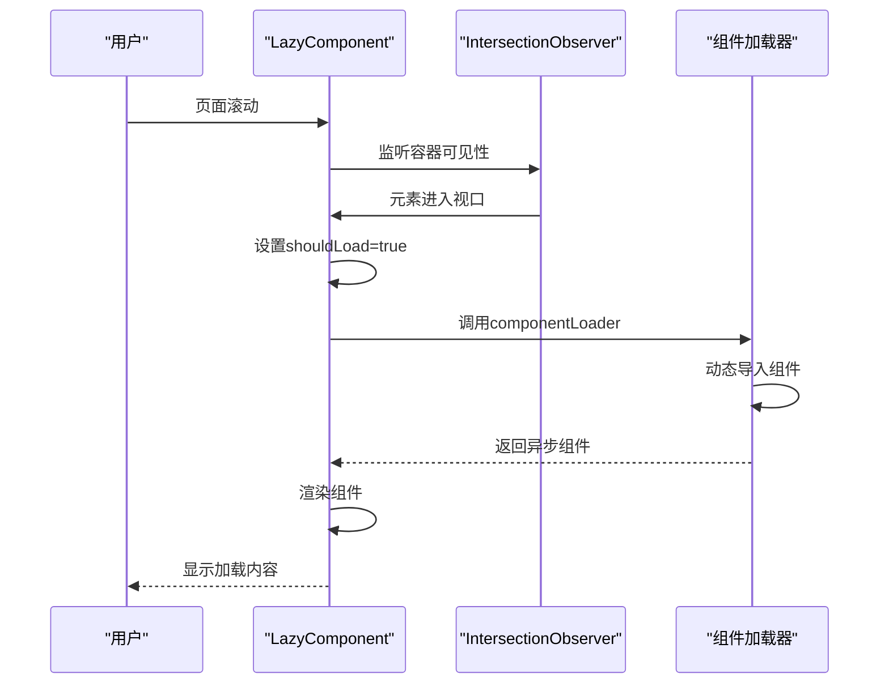

# 分类状态管理

<cite>
**本文档引用文件**  
- [categories.ts](file://src/stores/categories.ts)
- [categoriesService.ts](file://src/services/categoriesService.ts)
- [useLazyLoading.ts](file://src/composables/useLazyLoading.ts)
- [LazyComponent.vue](file://src/components/common/LazyComponent.vue)
- [ToolsView.vue](file://src/views/ToolsView.vue)
- [ProductsView.vue](file://src/views/ProductsView.vue)
- [database.ts](file://src/types/database.ts)
</cite>

## 目录
1. [分类状态管理](#分类状态管理)
2. [状态字段与初始化策略](#状态字段与初始化策略)
3. [异步加载逻辑分析](#异步加载逻辑分析)
4. [派生数据构建](#派生数据构建)
5. [按需加载与性能优化](#按需加载与性能优化)
6. [API文档](#api文档)
7. [实际应用示例](#实际应用示例)
8. [全局状态同步](#全局状态同步)

## 状态字段与初始化策略

分类状态管理模块通过Pinia store实现，定义了核心状态字段及其初始化策略。`categories`字段存储分类数据数组，`loading`字段标识加载状态，`error`字段记录错误信息，`initialized`字段用于跟踪数据是否已成功获取。

初始化策略采用惰性加载模式，通过`initialize`方法检查`initialized`标志位，仅在未初始化时调用`fetchCategories`。这种策略避免了不必要的重复请求，确保数据只在首次需要时加载。状态初始化在`categories.ts`中通过`ref`函数实现，确保响应式更新。

**状态字段说明**
- `categories`: 存储从数据库获取的分类数据
- `loading`: 控制加载指示器显示
- `error`: 捕获和传递错误信息
- `initialized`: 防止重复加载的标志位

**Section sources**
- [categories.ts](file://src/stores/categories.ts#L10-L18)

## 异步加载逻辑分析

`fetchCategories` action实现了完整的异步加载逻辑，包含环境检测、主数据获取和错误回退机制。加载流程首先检查Supabase环境变量配置，若未正确配置则使用模拟数据，确保开发和测试环境的可用性。

主加载逻辑通过Supabase客户端从`categories`表获取数据，应用`is_active`过滤和`sort_order`排序。查询结果映射到`categories`状态，成功后设置`initialized`为true。错误处理机制包含两级回退：首先记录错误，然后在无数据情况下提供简化版模拟数据，最后清除错误状态以提供良好用户体验。

加载过程中通过`loading`状态控制UI反馈，确保用户感知到操作正在进行。整个流程在`try-catch-finally`块中执行，保证`loading`状态最终被正确重置。



**Diagram sources**
- [categories.ts](file://src/stores/categories.ts#L48-L155)

**Section sources**
- [categories.ts](file://src/stores/categories.ts#L48-L155)

## 派生数据构建

分类服务通过`buildCategoryTree`方法构建树形结构，支持多级分类展示。该方法创建分类映射表，遍历所有分类并根据`parent_id`建立父子关系。无父级的分类作为根节点，最终返回根分类数组。

树结构构建采用两阶段算法：首先创建所有分类的映射，然后建立父子链接。这种方法确保即使父分类在子分类之后定义也能正确构建树形结构。每个分类节点包含`children`数组，形成递归数据结构，便于在UI中实现嵌套渲染。

`transformCategoryRow`方法将数据库行转换为业务对象，重命名字段如`parent_id`为`parentId`，并初始化`count`字段为0，为后续统计信息填充做准备。

```mermaid
classDiagram
class Category {
+string id
+string name
+string description
+string icon
+string color
+string parentId
+number count
+number sortOrder
+boolean isActive
+string createdAt
+string updatedAt
+Category[] children
}
class CategoriesService {
+static getCategories() Promise~Category[]~
+static getCategory(id) Promise~Category~
+static createCategory(data) Promise~Category~
+static updateCategory(id, data) Promise~Category~
+static deleteCategory(id) Promise~void~
+static getCategoryStats() Promise~{categoryId, count}[]~
+static getCategoriesWithStats() Promise~Category[]~
-buildCategoryTree(categories) Category[]
+transformCategoryRow(row) Category
}
CategoriesService --> Category : "构建"
```

**Diagram sources**
- [categoriesService.ts](file://src/services/categoriesService.ts#L210-L276)

**Section sources**
- [categoriesService.ts](file://src/services/categoriesService.ts#L210-L276)

## 按需加载与性能优化

分类数据的按需加载通过`LazyComponent.vue`和`useLazyLoading.ts`的组合实现。`useLazyComponent`组合式函数利用`IntersectionObserver`检测组件可见性，当组件进入视口时触发加载，实现真正的懒加载。

`LazyComponent.vue`封装了完整的懒加载逻辑，包含占位符、加载状态、错误处理和重试机制。组件通过`componentLoader`属性接收异步组件加载器，`preloadDistance`控制预加载距离。内部使用`defineAsyncComponent`创建异步组件，并通过`shouldLoad`信号控制实际渲染时机。

性能优化策略包括：骨架屏占位避免布局抖动，错误重试机制提升可靠性，加载状态反馈改善用户体验。`useLazyLoading.ts`还提供了`usePreloader`用于数据预加载，`useResourcePreloader`用于资源预载，形成完整的性能优化方案。



**Diagram sources**
- [LazyComponent.vue](file://src/components/common/LazyComponent.vue#L47-L151)
- [useLazyLoading.ts](file://src/composables/useLazyLoading.ts#L101-L157)

**Section sources**
- [LazyComponent.vue](file://src/components/common/LazyComponent.vue#L47-L151)
- [useLazyLoading.ts](file://src/composables/useLazyLoading.ts#L101-L157)

## API文档

### 数据结构定义
分类数据结构基于Supabase数据库模式定义，包含以下字段：
- `id`: 分类唯一标识符
- `name`: 分类名称
- `description`: 分类描述
- `icon`: 分类图标
- `color`: 主题颜色
- `parentId`: 父分类ID，null表示根分类
- `sortOrder`: 排序序号
- `isActive`: 激活状态
- `createdAt`: 创建时间
- `updatedAt`: 更新时间

### 加载状态机转换规则
状态机包含三种主要状态：空闲、加载中、错误。转换规则如下：
- 空闲 → 加载中：调用`fetchCategories`
- 加载中 → 空闲：加载成功且有数据
- 加载中 → 错误：加载失败且无回退数据
- 加载中 → 空闲：加载失败但有回退数据
- 错误 → 加载中：调用`clearError`后重试

### 错误恢复机制
错误恢复采用多级策略：
1. 主要数据源失败时尝试使用模拟数据
2. 清除错误状态允许用户重试
3. 提供重试按钮和错误信息
4. 最大重试次数限制防止无限循环

**Section sources**
- [categories.ts](file://src/stores/categories.ts#L10-L155)
- [database.ts](file://src/types/database.ts#L43-L91)

## 实际应用示例

### ToolsView.vue中的应用
`ToolsView.vue`通过`useToolsStore`消费分类状态，但实际依赖`useCategoriesStore`获取分类数据。视图中通过`categories`字段渲染分类筛选器，`loading`状态控制加载指示器，`error`状态显示错误信息。

分类数据用于构建筛选标签，支持按分类过滤工具。视图监听路由参数变化，根据`category`参数更新选中分类。虽然当前实现使用模拟数据，但架构已准备好集成真实分类数据。

### ProductsView.vue中的应用
`ProductsView.vue`直接使用模拟分类数据，但设计模式与真实状态管理一致。`categories`数组包含分类名称和计数，用于构建筛选标签。视图通过`selectedCategory`响应式变量跟踪当前选中分类，实现按分类过滤产品。

两个视图都采用响应式设计，通过计算属性`filteredTools`和`filteredProducts`实现数据过滤和排序，确保UI与状态同步更新。

```mermaid
flowchart TD
subgraph "状态管理"
CategoriesStore["useCategoriesStore"]
end
subgraph "视图组件"
ToolsView["ToolsView.vue"]
ProductsView["ProductsView.vue"]
end
CategoriesStore --> ToolsView : "提供categories数据"
CategoriesStore --> ProductsView : "提供categories数据"
ToolsView --> Filter["分类筛选器"]
ProductsView --> Filter["分类筛选器"]
Filter --> UI["用户界面"]
style CategoriesStore fill:#4CAF50,stroke:#388E3C,color:white
style ToolsView fill:#2196F3,stroke:#1976D2,color:white
style ProductsView fill:#2196F3,stroke:#1976D2,color:white
style Filter fill:#FF9800,stroke:#F57C00,color:white
```

**Diagram sources**
- [ToolsView.vue](file://src/views/ToolsView.vue#L280-L295)
- [ProductsView.vue](file://src/views/ProductsView.vue#L100-L110)

**Section sources**
- [ToolsView.vue](file://src/views/ToolsView.vue#L280-L295)
- [ProductsView.vue](file://src/views/ProductsView.vue#L100-L110)

## 全局状态同步

管理后台分类更新后，通过调用`fetchCategories`重新加载数据实现全局状态同步。`updateCategory`和`createCategory`等服务方法成功后，应触发状态刷新以确保所有视图显示最新数据。

状态同步策略包括：
1. 关键操作后调用`fetchCategories`强制刷新
2. 使用`clearError`重置错误状态
3. 通过`initialized`标志位管理加载周期
4. 利用Pinia的响应式系统自动更新所有订阅组件

这种集中式状态管理确保了数据一致性，避免了多个数据源导致的状态不一致问题。

**Section sources**
- [categories.ts](file://src/stores/categories.ts#L157-L198)
- [categoriesService.ts](file://src/services/categoriesService.ts#L50-L124)