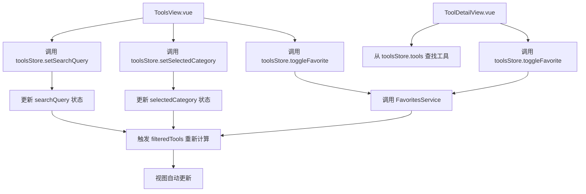

# 工具状态管理

<cite>
**本文档引用文件**  
- [tools.ts](file://src/stores/tools.ts)
- [favoritesService.ts](file://src/services/favoritesService.ts)
- [toolsService.ts](file://src/services/toolsService.ts)
- [ToolsView.vue](file://src/views/ToolsView.vue)
- [ToolDetailView.vue](file://src/views/ToolDetailView.vue)
- [database.ts](file://src/types/database.ts)
- [auth.ts](file://src/stores/auth.ts)
</cite>

## 目录
1. [核心状态结构与初始化](#核心状态结构与初始化)
2. [工具数据加载机制](#工具数据加载机制)
3. [收藏功能实现逻辑](#收藏功能实现逻辑)
4. [智能推荐算法](#智能推荐算法)
5. [视图层状态渲染](#视图层状态渲染)
6. [多设备同步与离线处理](#多设备同步与离线处理)
7. [常见问题诊断](#常见问题诊断)

## 核心状态结构与初始化

工具状态管理的核心位于 `tools.ts` Store 中，其状态（state）字段定义了应用的全局工具数据。主要状态字段包括：

- **tools**: 存储所有工具对象的数组，每个工具对象（`Tool` 类型）包含基础信息（ID、名称、描述、URL）、分类信息（通过 `categories` 字段关联）和标签信息（通过 `tags` 字段）。
- **loading**: 布尔值，表示当前是否正在从后端加载数据。
- **error**: 存储加载过程中发生的错误对象。
- **initialized**: 布尔值，标记 Store 是否已完成初始化，防止重复加载。
- **searchQuery**: 存储当前的搜索关键词，由 `AppHeader.vue` 组件更新。
- **selectedCategory**: 存储当前选中的分类 ID，"all" 表示所有分类。
- **sidebarCollapsed**: 存储侧边栏的折叠状态。

状态的初始化通过 `initialize` action 实现，该方法会检查 `initialized` 标志，若未初始化则调用 `fetchTools` 方法加载数据。这确保了应用在启动时或组件首次访问时，数据只被加载一次。

**Section sources**
- [tools.ts](file://src/stores/tools.ts#L10-L48)

## 工具数据加载机制

`fetchTools` action 负责从 Supabase 数据库批量加载工具数据，其策略体现了健壮性和用户体验的平衡。

该方法首先检查 Supabase 环境变量（`VITE_SUPABASE_URL` 和 `VITE_SUPABASE_ANON_KEY`）是否已正确配置。如果未配置或仍为默认占位符，系统会输出警告并使用内置的模拟数据进行填充，保证了开发和演示环境的可用性。

当环境变量配置正确时，系统会发起数据库查询，通过 `select` 语句获取 `tools` 表中所有状态为 "active" 的记录，并同时关联查询其分类（`categories`）信息。查询结果按 `sort_order` 字段升序排列。

在数据处理阶段，`fetchTools` 会将数据库返回的复杂嵌套结构（如 `tool_tags` 数组）转换为更易用的 `tags` 字符串数组，并将其合并到 `Tool` 对象中。整个加载过程被 `loading` 状态包裹，确保 UI 能正确显示加载中状态。

为应对网络或数据库故障，该方法实现了优雅的降级策略：当 Supabase 查询失败时，会捕获错误并再次回退到使用模拟数据，确保用户始终能看到内容，不会因后端问题导致应用完全不可用。

**Section sources**
- [tools.ts](file://src/stores/tools.ts#L80-L180)

## 收藏功能实现逻辑

`toggleFavorite` action 是收藏功能的核心，但根据代码分析，其当前实现尚不完整，仅包含一个 `TODO` 占位符。完整的实现逻辑应结合 `favoritesService.ts` 和认证状态。

正确的实现逻辑应如下：
1.  **认证检查**：首先检查用户是否已登录（通过 `authStore.isAuthenticated`）。若未登录，则应引导用户跳转至登录页面。
2.  **状态查询**：调用 `FavoritesService.checkFavoriteExists` 方法，传入用户 ID 和工具 ID，以确定该工具是否已被收藏。
3.  **状态切换**：根据查询结果，调用 `FavoritesService.addToolToFavorites` 或 `removeToolFromFavorites` 方法来添加或移除收藏。
4.  **本地状态更新**：在服务调用成功后，立即更新 `tools` 数组中对应工具的 `isFavorite` 状态，实现即时的 UI 反馈。
5.  **原子性保证**：整个过程通过 `async/await` 保证了操作的原子性。只有当远程数据库操作成功后，本地状态才会被更新。如果远程操作失败，本地状态将保持不变，并通过 `error` 字段向用户报告错误。

尽管 `toolsStore` 中的 `toggleFavorite` 尚未实现，但在 `ToolDetailView.vue` 和 `HomeView.vue` 的组件中，已经通过 `authStore` 和 `toolsStore` 的组合调用了此方法，表明其设计意图是清晰的。

**Section sources**
- [tools.ts](file://src/stores/tools.ts#L334-L341)
- [favoritesService.ts](file://src/services/favoritesService.ts#L1-L150)
- [ToolDetailView.vue](file://src/views/ToolDetailView.vue#L216-L222)
- [HomeView.vue](file://src/views/HomeView.vue#L192-L198)

## 智能推荐算法

`tools.ts` Store 中的 `filteredTools` 是一个计算属性（getter），它实现了基础的智能推荐算法。

该算法的计算方式是动态的，基于当前的 `searchQuery` 和 `tools` 数组。当 `searchQuery` 为空时，它直接返回所有工具。当存在搜索词时，它会遍历 `tools` 数组，对每个工具的 `name`（名称）、`description`（描述）和 `categories.name`（分类名称）进行小写化处理，并检查是否包含搜索词的小写形式。只要任一字段匹配，该工具就会被包含在返回结果中。

此算法简单高效，利用了 Vue 的响应式系统，当 `searchQuery` 或 `tools` 发生变化时，`filteredTools` 会自动重新计算，无需手动触发。

**Section sources**
- [tools.ts](file://src/stores/tools.ts#L36-L48)

## 视图层状态渲染

工具状态在视图层通过 `ToolsView.vue` 和 `ToolDetailView.vue` 两个组件进行渲染和交互。

在 `ToolsView.vue` 中，组件通过 `useToolsStore()` 获取 `toolsStore` 实例。`filteredTools` 计算属性被用于渲染工具列表。UI 提供了搜索框、分类筛选、排序和视图模式（网格/列表）等交互控件，这些控件通过调用 `toolsStore` 的 `setSearchQuery`、`setSelectedCategory` 等 action 来更新 Store 状态，从而驱动视图变化。收藏按钮绑定了 `toolsStore.toggleFavorite(tool.id)`，实现了收藏状态的切换。

在 `ToolDetailView.vue` 中，组件同样依赖 `toolsStore` 来查找和显示单个工具的详细信息。其收藏按钮也通过 `toggleFavorite` 方法与 Store 交互。该组件还展示了工具的关联数据，如相关工具推荐，这些推荐是基于与当前工具相同的 `category_id` 从 `toolsStore.tools` 中筛选出来的。

**Diagram sources**
- [ToolsView.vue](file://src/views/ToolsView.vue#L192-L222)
- [ToolDetailView.vue](file://src/views/ToolDetailView.vue#L216-L222)

**Section sources**
- [ToolsView.vue](file://src/views/ToolsView.vue#L1-L799)
- [ToolDetailView.vue](file://src/views/ToolDetailView.vue#L1-L510)

## 多设备同步与离线处理

收藏状态的多设备同步依赖于 Supabase 的实时数据库。当用户在一台设备上执行 `toggleFavorite` 操作时，`favoritesService` 会将变更写入 `favorites` 表。由于 `favorites` 表与用户账户绑定，当用户在另一台设备上登录并初始化应用时，`fetchTools` 或 `favoritesService.getFavoriteTools` 会从云端获取最新的收藏数据，从而实现状态同步。

对于离线场景，当前代码库未实现本地持久化（如使用 `localStorage`）。因此，如果用户在离线状态下尝试收藏，由于 `toggleFavorite` 依赖于网络服务，操作会失败。理想情况下，应结合 `localStorageService` 实现离线队列，将收藏操作暂存于本地，待网络恢复后再同步到云端。

**Section sources**
- [favoritesService.ts](file://src/services/favoritesService.ts#L1-L150)
- [tools.ts](file://src/stores/tools.ts#L80-L180)

## 常见问题诊断

**问题：收藏状态不同步**

1.  **检查网络连接**：确保设备已连接到互联网。
2.  **检查用户登录状态**：确认用户已在所有设备上使用同一账户登录。收藏数据与用户 ID 绑定。
3.  **强制刷新**：在另一台设备上，尝试手动刷新页面或重新进入工具列表页，以触发 `fetchTools` 重新加载数据。
4.  **检查控制台错误**：打开浏览器开发者工具，查看是否有来自 `favoritesService` 的网络请求错误，这可能指示后端服务问题。
5.  **验证数据库**：通过 Supabase 仪表板直接检查 `favorites` 表，确认收藏记录是否已成功创建。

**Section sources**
- [favoritesService.ts](file://src/services/favoritesService.ts#L1-L150)
- [tools.ts](file://src/stores/tools.ts#L334-L341)