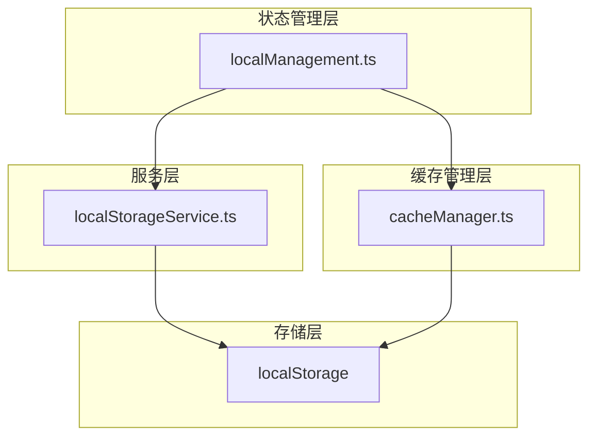
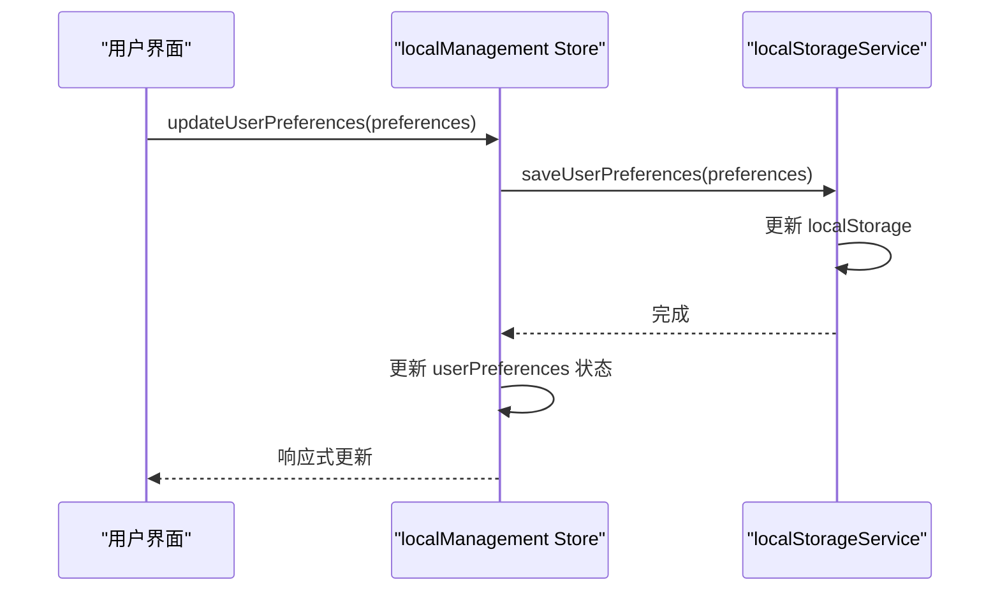
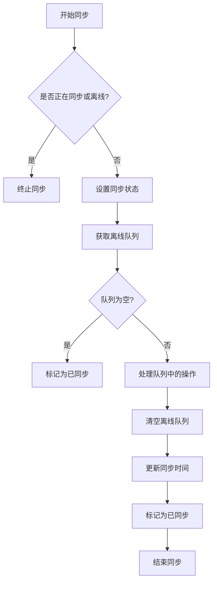
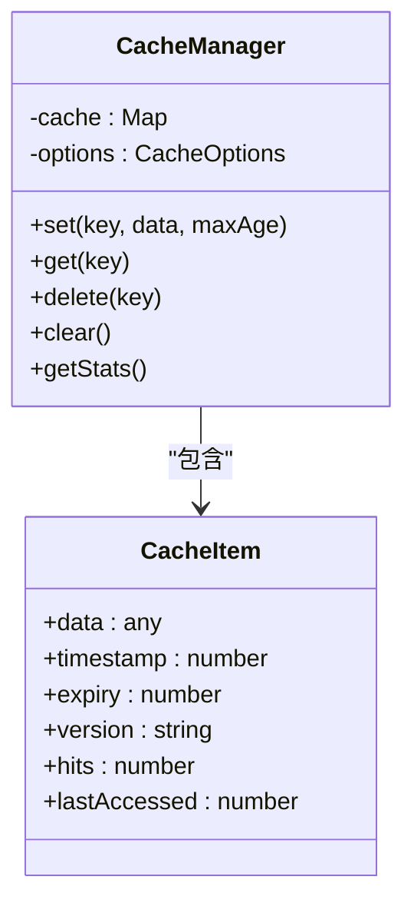
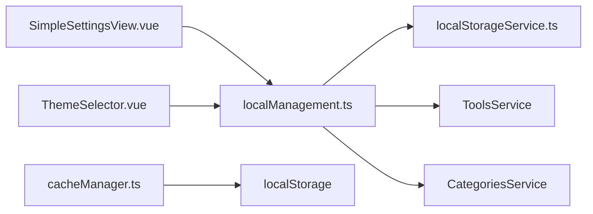

# 本地管理状态

<cite>
**本文档引用的文件**   
- [localManagement.ts](file://src/stores/localManagement.ts)
- [cacheManager.ts](file://src/utils/cacheManager.ts)
- [localStorageService.ts](file://src/services/localStorageService.ts)
- [SimpleSettingsView.vue](file://src/views/SimpleSettingsView.vue)
- [ThemeSelector.vue](file://src/components/theme/ThemeSelector.vue)
</cite>

## 目录
1. [简介](#简介)
2. [项目结构](#项目结构)
3. [核心组件](#核心组件)
4. [架构概述](#架构概述)
5. [详细组件分析](#详细组件分析)
6. [依赖分析](#依赖分析)
7. [性能考虑](#性能考虑)
8. [故障排除指南](#故障排除指南)
9. [结论](#结论)

## 简介
本文档全面解析 `localManagement.ts` 中本地化管理状态的设计与实现。详细说明 state 中 `language`、`theme`、`layoutPreference` 等用户偏好设置的存储结构；阐述 actions 中 `updatePreference` 方法的持久化逻辑，包括与 `localStorageService` 的交互及跨设备同步策略；分析初始化时从本地存储恢复状态的流程。结合 `cacheManager.ts` 的缓存管理机制，说明如何保证状态一致性与性能平衡。提供各 getter 的计算逻辑说明及响应式更新机制。通过 `SimpleSettingsView.vue` 和 `ThemeSelector.vue` 的实际调用案例，展示偏好设置的读取与更新模式。同时说明在多实例环境下状态冲突的处理方案及数据清理策略。

## 项目结构
本项目采用模块化设计，将本地状态管理、缓存管理、本地存储服务等功能分离到不同的模块中。核心的本地管理功能由 `localManagement.ts` 实现，通过 Pinia store 管理应用的本地状态。缓存管理由 `cacheManager.ts` 提供，支持多种缓存策略和持久化选项。本地存储服务封装在 `localStorageService.ts` 中，提供统一的本地数据访问接口。用户界面组件如 `SimpleSettingsView.vue` 和 `ThemeSelector.vue` 通过调用 store 的方法来实现用户偏好设置的读取与更新。

**Section sources**
- [localManagement.ts](file://src/stores/localManagement.ts#L1-L350)
- [cacheManager.ts](file://src/utils/cacheManager.ts#L1-L396)
- [localStorageService.ts](file://src/services/localStorageService.ts#L1-L339)

## 核心组件
`localManagement.ts` 是本系统的核心组件，负责管理所有本地数据和离线功能。它使用 Pinia 定义了一个名为 "localManagement" 的 store，包含多个响应式状态变量，如 `isOfflineMode`、`userPreferences`、`localTools` 等。这些状态通过计算属性（如 `pendingSyncCount`、`hasLocalChanges`）进行派生，并通过一系列方法（如 `initialize`、`syncData`、`updateUserPreferences`）进行操作。store 与 `localStorageService` 紧密协作，确保数据在内存和本地存储之间保持同步。

**Section sources**
- [localManagement.ts](file://src/stores/localManagement.ts#L1-L350)

## 架构概述
本系统的本地管理架构采用分层设计模式，分为状态管理层、服务层和存储层。状态管理层由 `localManagement.ts` 实现，负责管理应用的本地状态并提供响应式接口。服务层由 `localStorageService.ts` 实现，封装了对 `localStorage` 的访问，提供类型安全的数据操作接口。存储层是浏览器的 `localStorage`，用于持久化存储用户数据。缓存管理层由 `cacheManager.ts` 实现，独立于本地管理状态，但可以与之协同工作以优化性能。

**Diagram sources**
- [localManagement.ts](file://src/stores/localManagement.ts#L1-L350)
- [localStorageService.ts](file://src/services/localStorageService.ts#L1-L339)
- [cacheManager.ts](file://src/utils/cacheManager.ts#L1-L396)

## 详细组件分析

### 用户偏好设置管理
`localManagement.ts` 中的 `userPreferences` 状态用于存储用户的个性化设置，包括主题、语言、侧边栏状态等。该状态在初始化时从 `localStorageService` 加载，并通过 `updateUserPreferences` 方法进行更新。当用户更改偏好设置时，系统会立即调用 `localStorageService.saveUserPreferences` 将更改持久化到 `localStorage` 中，确保数据不会因页面刷新而丢失。

**Diagram sources**
- [localManagement.ts](file://src/stores/localManagement.ts#L121-L170)
- [localStorageService.ts](file://src/services/localStorageService.ts#L201-L249)

### 数据同步机制
系统实现了完整的离线优先数据同步机制。当用户在离线状态下进行数据操作时，这些操作会被记录在 `offlineQueue` 中。一旦网络恢复，系统会自动或手动触发 `syncData` 方法，将队列中的操作逐一同步到服务器。同步完成后，系统会清空离线队列并更新 `lastSyncTime`，确保数据的一致性。

**Diagram sources**
- [localManagement.ts](file://src/stores/localManagement.ts#L121-L170)

### 缓存管理机制
`cacheManager.ts` 实现了一个智能缓存管理系统，支持内存缓存和 `localStorage` 持久化。缓存项具有过期时间、版本号和访问统计等元数据，系统会定期清理过期的缓存项。通过 `withCache` 装饰器，可以轻松地为异步函数添加缓存功能，显著减少不必要的 API 调用，提高应用性能。

**Diagram sources**
- [cacheManager.ts](file://src/utils/cacheManager.ts#L0-L51)

### 实际调用案例
`SimpleSettingsView.vue` 和 `ThemeSelector.vue` 展示了如何在实际组件中使用本地管理状态。`SimpleSettingsView.vue` 允许用户修改网站的基本信息，并将这些设置保存到 `localStorage` 中。`ThemeSelector.vue` 提供了一个主题切换界面，用户可以选择浅色、深色或跟随系统主题，选择结果会通过 `useSimpleTheme` 组合式 API 更新到 `localManagement` store 中。

**Section sources**
- [SimpleSettingsView.vue](file://src/views/SimpleSettingsView.vue#L1-L499)
- [ThemeSelector.vue](file://src/components/theme/ThemeSelector.vue#L1-L486)

## 依赖分析
`localManagement.ts` 依赖于 `localStorageService.ts` 进行数据持久化，依赖于 `ToolsService` 和 `CategoriesService` 进行数据同步。`cacheManager.ts` 独立于其他组件，但可以通过配置与 `localStorage` 协同工作。`SimpleSettingsView.vue` 和 `ThemeSelector.vue` 依赖于 `localManagement.ts` 提供的状态管理功能。整个系统的依赖关系清晰，各组件职责分明，便于维护和扩展。

**Diagram sources**
- [localManagement.ts](file://src/stores/localManagement.ts#L1-L43)
- [cacheManager.ts](file://src/utils/cacheManager.ts#L255-L308)

## 性能考虑
系统在性能方面做了多项优化。首先，通过 `cacheManager.ts` 的缓存机制，减少了对后端 API 的频繁调用，降低了网络延迟。其次，`localManagement.ts` 中的计算属性（如 `pendingSyncCount`、`hasLocalChanges`）采用响应式设计，只有在相关状态变化时才会重新计算，避免了不必要的性能开销。此外，系统定期清理过期的缓存和本地数据，防止存储空间无限增长，确保应用长期运行的稳定性。

## 故障排除指南
当遇到本地管理相关的问题时，可以按照以下步骤进行排查：首先检查浏览器的 `localStorage` 是否已满或被禁用；其次查看控制台是否有相关的错误日志，特别是 `localStorageService` 操作失败的提示；然后确认网络状态是否正常，离线模式是否被意外启用；最后可以尝试清除本地数据并重新初始化，看问题是否得到解决。对于缓存相关的问题，可以检查缓存的版本号和过期时间设置是否合理。

**Section sources**
- [localManagement.ts](file://src/stores/localManagement.ts#L254-L300)
- [cacheManager.ts](file://src/utils/cacheManager.ts#L214-L260)

## 结论
`localManagement.ts` 实现了一个功能完整、设计合理的本地状态管理系统，能够有效管理用户的偏好设置和本地数据。通过与 `localStorageService.ts` 和 `cacheManager.ts` 的紧密协作，系统在数据持久化、性能优化和用户体验之间取得了良好的平衡。`SimpleSettingsView.vue` 和 `ThemeSelector.vue` 的实际应用案例证明了该设计的实用性和灵活性。未来可以考虑增加更多的同步策略和冲突解决机制，以支持更复杂的多设备协同场景。