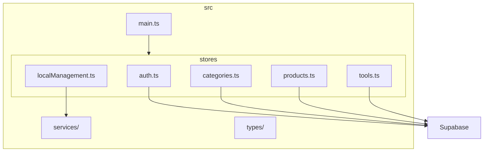
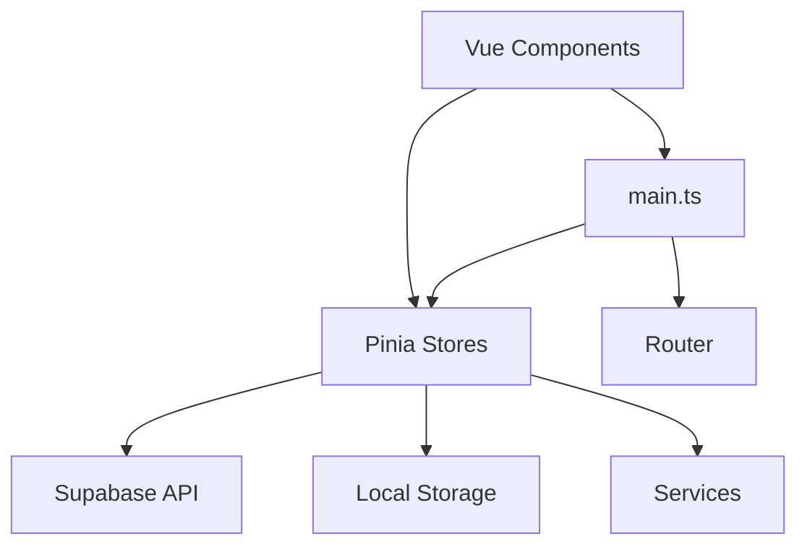
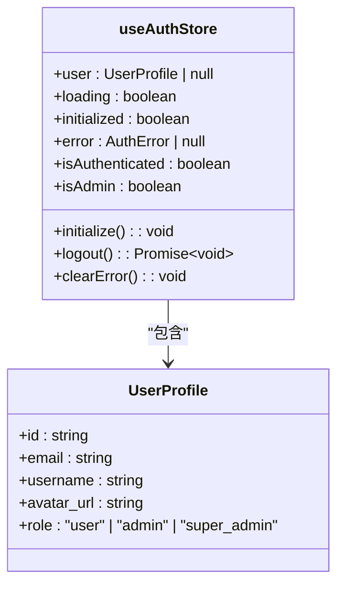
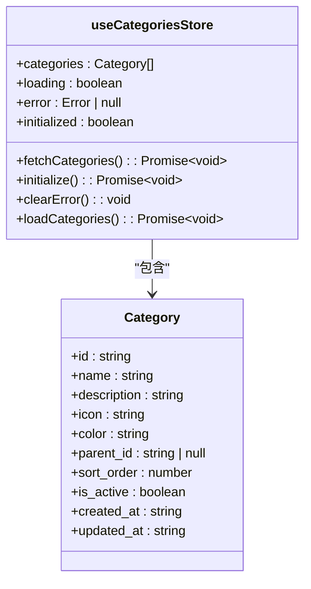
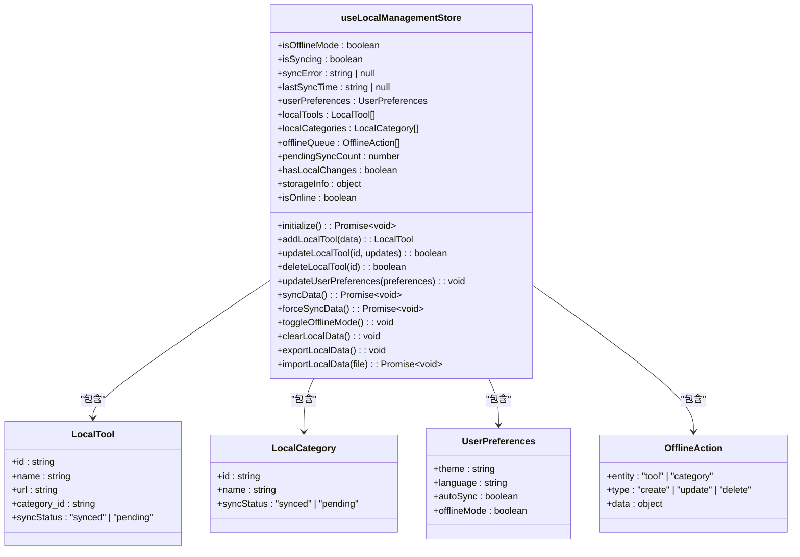
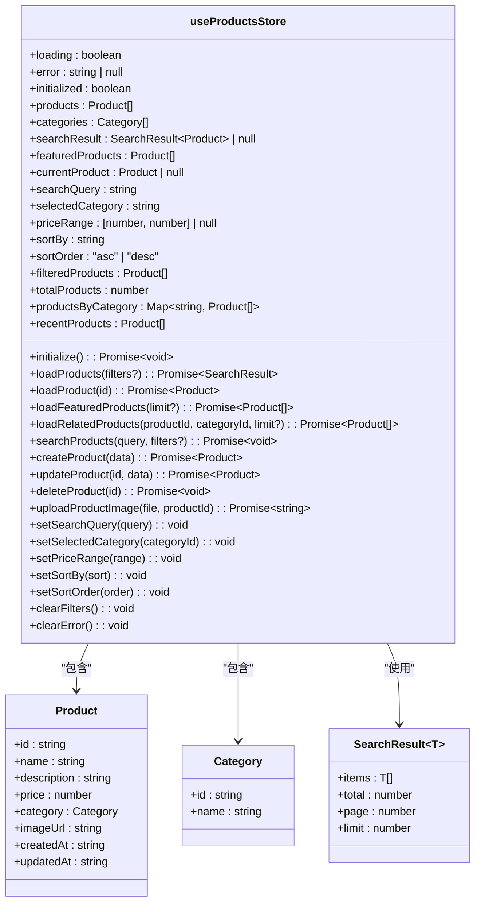
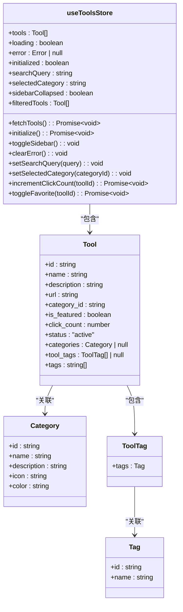
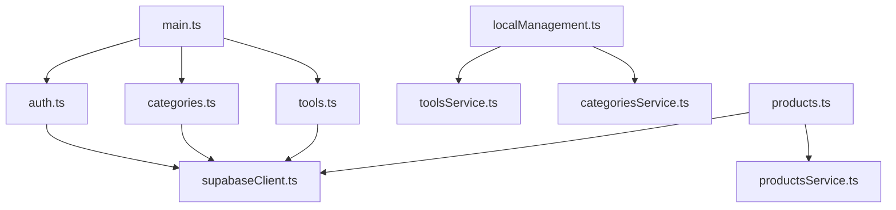

# 状态管理结构

<cite>
**本文档中引用的文件**  
- [auth.ts](file://src/stores/auth.ts)
- [categories.ts](file://src/stores/categories.ts)
- [localManagement.ts](file://src/stores/localManagement.ts)
- [products.ts](file://src/stores/products.ts)
- [tools.ts](file://src/stores/tools.ts)
- [main.ts](file://src/main.ts)
</cite>

## 目录
1. [简介](#简介)
2. [项目结构](#项目结构)
3. [核心组件](#核心组件)
4. [架构概览](#架构概览)
5. [详细组件分析](#详细组件分析)
6. [依赖分析](#依赖分析)
7. [性能考虑](#性能考虑)
8. [故障排除指南](#故障排除指南)
9. [结论](#结论)

## 简介
本项目采用 Vue 3 和 Pinia 构建，实现了基于 Supabase 的全栈工具导航系统。状态管理模块是整个应用的核心，负责用户认证、工具数据、分类信息、产品管理及本地化功能的统一管理。通过 Pinia 的模块化 Store 设计，实现了状态的集中化、响应式和可维护性。本文档深入解析 `src/stores` 目录下的各个状态管理模块及其在 `main.ts` 中的集成方式。

## 项目结构
项目采用标准的 Vue + Vite 架构，状态管理集中于 `src/stores` 目录。各 Store 模块职责分明，通过 `main.ts` 统一注册和初始化。

**Diagram sources**
- [main.ts](file://src/main.ts#L1-L59)
- [auth.ts](file://src/stores/auth.ts#L1-L152)
- [categories.ts](file://src/stores/categories.ts#L1-L199)
- [localManagement.ts](file://src/stores/localManagement.ts#L1-L350)
- [products.ts](file://src/stores/products.ts#L1-L363)
- [tools.ts](file://src/stores/tools.ts#L1-L342)

**Section sources**
- [main.ts](file://src/main.ts#L1-L59)
- [src/stores](file://src/stores)

## 核心组件
`src/stores` 目录下的五个核心 Store 模块构成了应用的全局状态中心，分别管理用户认证、分类数据、本地化功能、产品信息和工具列表。

**Section sources**
- [auth.ts](file://src/stores/auth.ts#L1-L152)
- [categories.ts](file://src/stores/categories.ts#L1-L199)
- [localManagement.ts](file://src/stores/localManagement.ts#L1-L350)
- [products.ts](file://src/stores/products.ts#L1-L363)
- [tools.ts](file://src/stores/tools.ts#L1-L342)

## 架构概览
系统采用分层架构，Pinia Store 作为中间层，连接 Vue 组件与后端服务（Supabase）。`main.ts` 负责初始化所有核心 Store。

**Diagram sources**
- [main.ts](file://src/main.ts#L1-L59)
- [auth.ts](file://src/stores/auth.ts#L1-L152)
- [services](file://src/services)

## 详细组件分析

### 认证模块分析
`auth.ts` 模块负责管理用户登录状态、权限和用户资料。

#### 类图

**Diagram sources**
- [auth.ts](file://src/stores/auth.ts#L1-L152)

**Section sources**
- [auth.ts](file://src/stores/auth.ts#L1-L152)

### 分类模块分析
`categories.ts` 模块管理工具分类数据，支持缓存和离线回退。

#### 类图

**Diagram sources**
- [categories.ts](file://src/stores/categories.ts#L1-L199)

**Section sources**
- [categories.ts](file://src/stores/categories.ts#L1-L199)

### 本地化管理模块分析
`localManagement.ts` 模块提供离线功能、数据同步和用户偏好设置。

#### 类图

**Diagram sources**
- [localManagement.ts](file://src/stores/localManagement.ts#L1-L350)

**Section sources**
- [localManagement.ts](file://src/stores/localManagement.ts#L1-L350)

### 产品模块分析
`products.ts` 模块管理产品数据，支持分页、筛选和详情缓存。

#### 类图

**Diagram sources**
- [products.ts](file://src/stores/products.ts#L1-L363)

**Section sources**
- [products.ts](file://src/stores/products.ts#L1-L363)

### 工具模块分析
`tools.ts` 模块管理工具列表，支持搜索、分类和点击统计。

#### 类图

**Diagram sources**
- [tools.ts](file://src/stores/tools.ts#L1-L342)

**Section sources**
- [tools.ts](file://src/stores/tools.ts#L1-L342)

## 依赖分析
各 Store 模块之间通过 `main.ts` 进行协调初始化，部分模块依赖于 `services` 层。

**Diagram sources**
- [main.ts](file://src/main.ts#L1-L59)
- [auth.ts](file://src/stores/auth.ts#L1-L152)
- [categories.ts](file://src/stores/categories.ts#L1-L199)
- [localManagement.ts](file://src/stores/localManagement.ts#L1-L350)
- [products.ts](file://src/stores/products.ts#L1-L363)
- [tools.ts](file://src/stores/tools.ts#L1-L342)
- [services](file://src/services)

**Section sources**
- [main.ts](file://src/main.ts#L1-L59)
- [services](file://src/services)

## 性能考虑
- `main.ts` 中使用 `Promise.all` 并发初始化核心 Store，提升启动性能。
- 各 Store 模块均实现 `initialized` 标志，避免重复数据加载。
- `categories.ts` 和 `tools.ts` 在环境变量未配置时提供模拟数据，保证开发体验。
- `localManagement.ts` 实现离线队列和自动同步，优化离线用户体验。

## 故障排除指南
- **Store 方法未定义**：确保在 `return` 语句中正确导出 action 方法。
- **数据未加载**：检查 `initialize` 方法是否被正确调用。
- **Supabase 连接失败**：确认 `.env` 文件中的 `VITE_SUPABASE_URL` 和 `VITE_SUPABASE_ANON_KEY` 已正确配置。
- **类型错误**：确保 `@/types/database` 类型文件已由 Supabase CLI 生成并保持最新。

## 结论
该项目的状态管理设计清晰、模块化程度高。通过 Pinia 的模块化 Store，实现了复杂状态的可维护性。`main.ts` 中的集中初始化确保了应用启动的可靠性。各 Store 模块职责分明，既独立又通过服务层协同工作，构成了一个健壮的应用状态管理架构。