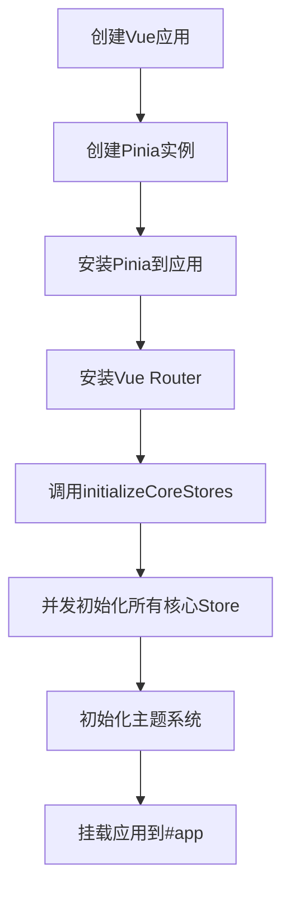
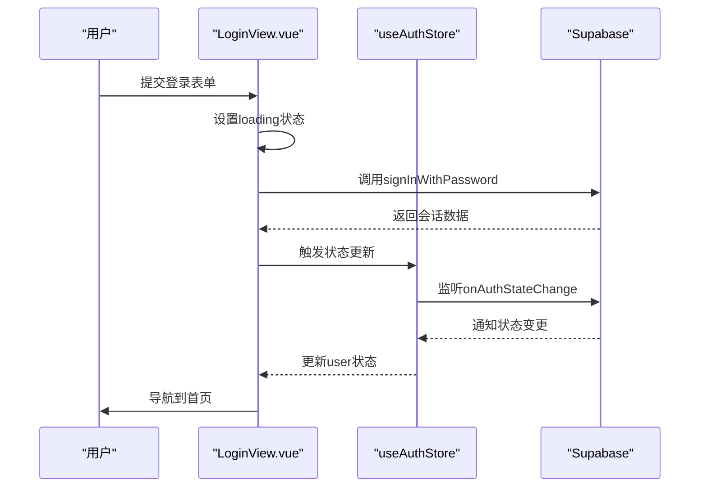
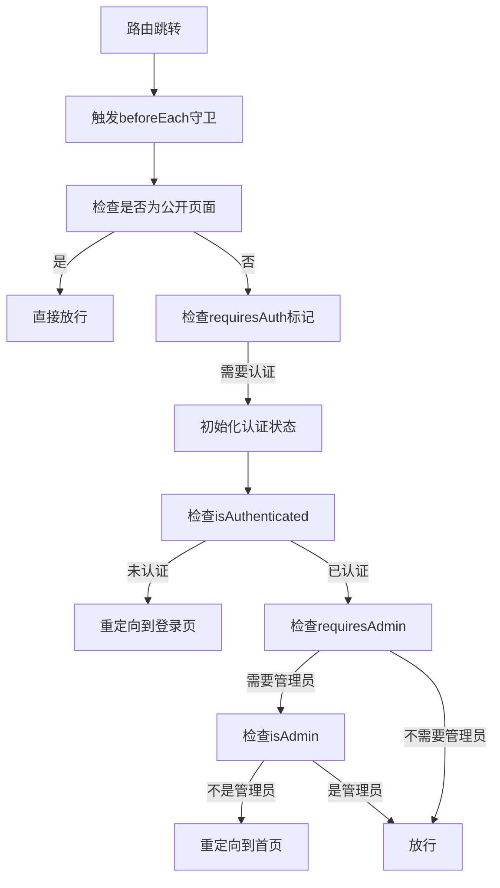

# 认证状态管理

<cite>
**本文档中引用的文件**
- [auth.ts](file://src/stores/auth.ts)
- [main.ts](file://src/main.ts)
- [LoginView.vue](file://src/views/auth/LoginView.vue)
- [RegisterView.vue](file://src/views/auth/RegisterView.vue)
- [permission.ts](file://src/permission.ts)
- [supabaseClient.ts](file://src/lib/supabaseClient.ts)
- [authService.ts](file://src/services/authService.ts)
</cite>

## 目录
1. [简介](#简介)
2. [核心状态设计](#核心状态设计)
3. [核心操作方法](#核心操作方法)
4. [计算属性](#计算属性)
5. [Pinia初始化与全局注入](#pinia初始化与全局注入)
6. [接口文档](#接口文档)
7. [实际使用场景](#实际使用场景)
8. [与Vue Router导航守卫集成](#与vue-router导航守卫集成)
9. [常见问题排查](#常见问题排查)
10. [结论](#结论)

## 简介
本项目采用Pinia作为Vue应用的状态管理方案，其中`auth.ts`文件实现了用户认证状态的核心管理逻辑。该模块负责维护用户登录状态、用户信息、认证流程控制等关键功能，并与Supabase后端服务紧密集成。通过在应用启动时初始化认证状态，实现了用户会话的持久化和自动恢复，为整个应用提供了统一的认证基础。

## 核心状态设计
认证状态管理模块定义了多个核心状态字段，用于反映当前用户的认证情况。

- **user**: 存储当前登录用户的信息，类型为`UserProfile`，结合了Supabase Auth User和自定义的用户资料数据
- **loading**: 布尔值，表示当前是否有正在进行的异步操作（如登录、登出）
- **initialized**: 布尔值，标记是否已完成首次认证状态检查，防止重复初始化
- **error**: 存储最近发生的认证相关错误信息

这些状态通过`ref`函数创建，确保了响应式特性，当状态发生变化时，所有依赖这些状态的组件都会自动更新。

**Section sources**
- [auth.ts](file://src/stores/auth.ts#L15-L22)

## 核心操作方法
认证模块提供了多个关键操作方法，处理用户认证的核心流程。

### 初始化方法
`initialize()`方法是认证模块的核心，它在应用启动时被调用，负责监听Supabase的认证状态变化。该方法通过`supabase.auth.onAuthStateChange`注册状态变更监听器，当用户登录或登出时自动更新本地状态。首次调用时会检查当前会话，如果存在有效会话则自动恢复用户信息。

### 登出方法
`logout()`方法处理用户登出流程。它首先设置`loading`状态为true，然后调用Supabase的`signOut`方法终止会话。无论成功与否，最终都会将`loading`状态重置为false。登出成功后，`onAuthStateChange`监听器会自动将`user`状态设置为null。

### 错误清除方法
`clearError()`方法用于清除存储的错误信息，通常在用户尝试重新操作前调用。

**Section sources**
- [auth.ts](file://src/stores/auth.ts#L86-L138)

## 计算属性
认证模块定义了两个重要的计算属性，用于派生用户状态信息。

### isAuthenticated
该计算属性返回一个布尔值，表示用户是否已登录。其实现简单地检查`user`状态是否为非null值。这个属性被广泛用于条件渲染，控制需要认证才能访问的功能可见性。

### isAdmin
该计算属性判断当前用户是否具有管理员权限。它检查用户角色是否为"admin"或"super_admin"。此属性在`AppHeader.vue`中用于决定是否显示管理后台链接，实现了基于角色的界面控制。

**Section sources**
- [auth.ts](file://src/stores/auth.ts#L30-L40)

## Pinia初始化与全局注入
在`main.ts`文件中，应用启动流程包含了Pinia的初始化和认证模块的全局注入。

应用首先创建Pinia实例并通过`app.use(pinia)`将其安装到Vue应用中。然后定义了一个异步函数`initializeCoreStores`，该函数并发初始化所有核心store（包括认证store）。这种并发初始化方式提升了应用启动性能。只有当所有store初始化完成后，应用才会挂载到DOM上，确保了状态管理的完整性。

**Diagram sources**
- [main.ts](file://src/main.ts#L45-L57)

**Section sources**
- [main.ts](file://src/main.ts#L34-L57)

## 接口文档
以下是认证模块提供的主要接口及其详细说明。

### initialize()
- **参数**: 无
- **返回值**: void
- **调用时机**: 应用启动时，在Vue应用挂载前调用一次

### logout()
- **参数**: 无
- **返回值**: Promise<void>
- **调用时机**: 用户点击登出按钮时

### clearError()
- **参数**: 无
- **返回值**: void
- **调用时机**: 在显示错误信息后，用户准备进行新操作前

**Section sources**
- [auth.ts](file://src/stores/auth.ts#L86-L138)

## 实际使用场景
认证模块在多个视图组件中被实际使用，展示了典型的调用模式。

### LoginView.vue中的使用
登录视图组件`LoginView.vue`展示了用户登录的UI界面。虽然当前实现中登录逻辑被注释，但其结构清晰地展示了如何集成认证功能。表单提交时会触发`handleLogin`方法，该方法应调用认证服务完成登录流程，然后导航到首页。

### RegisterView.vue中的使用
注册视图组件`RegisterView.vue`提供了用户注册界面。它包含了完整的表单验证逻辑，包括密码强度检测和确认密码匹配检查。注册成功后，用户被重定向到登录页面。

**Diagram sources**
- [LoginView.vue](file://src/views/auth/LoginView.vue#L150-L180)
- [auth.ts](file://src/stores/auth.ts#L86-L95)

**Section sources**
- [LoginView.vue](file://src/views/auth/LoginView.vue#L150-L180)
- [RegisterView.vue](file://src/views/auth/RegisterView.vue#L250-L280)

## 与Vue Router导航守卫集成
认证模块与Vue Router的导航守卫机制深度集成，实现了路由级别的权限控制。

在`permission.ts`文件中，通过`setupRouterGuard`函数设置了全局前置守卫。该守卫检查目标路由的元信息（meta.requiresAuth或meta.requiresAdmin），根据需要自动触发认证状态初始化。如果用户未登录但尝试访问受保护路由，则被重定向到登录页面并记录原始目标路径，以便登录后自动跳转。

这种集成确保了应用级别的权限一致性，防止了未经授权的访问，同时提供了流畅的用户体验。

**Diagram sources**
- [permission.ts](file://src/permission.ts#L15-L90)

**Section sources**
- [permission.ts](file://src/permission.ts#L15-L90)

## 常见问题排查
在使用认证状态管理模块时，可能会遇到一些常见问题，以下是排查方案。

### 令牌过期处理失败
当用户会话过期时，应自动重定向到登录页面。如果此机制失效，检查`onAuthStateChange`监听器是否正确注册，以及`initialize()`方法是否在应用启动时被调用。

### 状态不同步
如果出现UI显示与实际认证状态不一致的情况，确保所有组件都通过Pinia store访问认证状态，而不是维护本地副本。同时检查是否有多个store实例被创建。

### 初始化失败
如果认证模块初始化失败，检查Supabase客户端配置是否正确，特别是环境变量`VITE_SUPABASE_URL`和`VITE_SUPABASE_ANON_KEY`是否设置。

**Section sources**
- [auth.ts](file://src/stores/auth.ts#L86-L95)
- [supabaseClient.ts](file://src/lib/supabaseClient.ts#L5-L25)

## 结论
`auth.ts`中的Pinia store实现了健壮的用户认证状态管理机制，通过与Supabase后端服务的紧密集成，提供了完整的认证功能。该模块的设计考虑了用户体验、性能优化和错误处理，为应用的安全性提供了坚实基础。通过与Vue Router导航守卫的集成，实现了统一的权限控制策略，确保了应用在路由级别的安全性一致性。