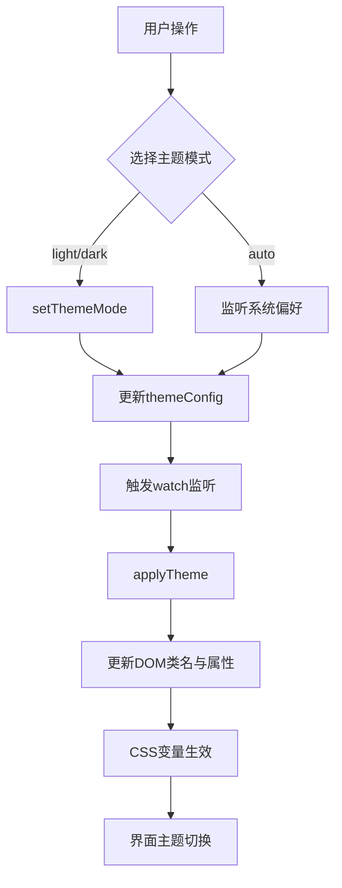
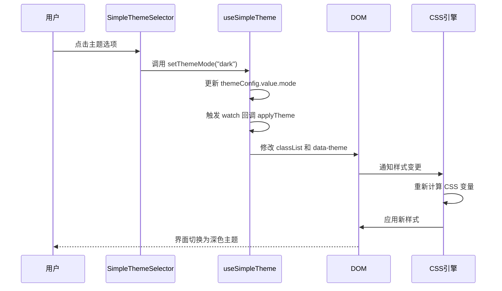

# 主题切换组合式函数

<cite>
**本文档引用文件**  
- [useSimpleTheme.ts](file://src/composables/useSimpleTheme.ts)
- [SimpleThemeSelector.vue](file://src/components/theme/SimpleThemeSelector.vue)
- [simple-theme.css](file://src/styles/simple-theme.css)
</cite>

## 目录
1. [简介](#简介)
2. [核心功能概述](#核心功能概述)
3. [状态管理机制](#状态管理机制)
4. [主题应用与DOM更新](#主题应用与dom更新)
5. [组件集成与响应式流程](#组件集成与响应式流程)
6. [初始化与事件监听](#初始化与事件监听)
7. [扩展指南](#扩展指南)
8. [无障碍访问兼容性](#无障碍访问兼容性)

## 简介
`useSimpleTheme` 是一个基于 Vue 3 的组合式函数，用于实现轻量级的主题管理方案。该函数通过读取和修改 CSS 自定义属性（CSS Variables）实现动态主题切换，支持浅色、深色以及跟随系统偏好三种模式。结合 `SimpleThemeSelector` 组件，用户可直观地选择主题模式，系统会自动将配置持久化至 `localStorage` 并响应系统级 `prefers-color-scheme` 媒体查询变化。

本方案采用简洁的设计理念，避免复杂的主题引擎，专注于核心功能：状态管理、主题持久化、系统偏好同步与无障碍支持。

**Section sources**
- [useSimpleTheme.ts](file://src/composables/useSimpleTheme.ts#L1-L110)

## 核心功能概述
`useSimpleTheme` 提供了完整的主题管理能力，主要包括：

- **主题模式切换**：支持 `"light"`（浅色）、`"dark"`（深色）、`"auto"`（跟随系统）三种模式。
- **系统偏好集成**：利用 `@vueuse/core` 的 `usePreferredColorScheme` 监听操作系统颜色偏好。
- **本地持久化**：使用 `useStorage` 将主题配置保存在 `localStorage` 中，确保刷新后设置不丢失。
- **动态样式更新**：通过操作 DOM 元素的类名、`data-theme` 属性和内联样式，触发 CSS 变量的重新计算。
- **响应式接口**：暴露 `isDark`、`activeColorScheme` 等计算属性，供其他组件消费。

该函数返回一组状态和方法，便于在组件中灵活调用。



**Diagram sources**
- [useSimpleTheme.ts](file://src/composables/useSimpleTheme.ts#L1-L110)

**Section sources**
- [useSimpleTheme.ts](file://src/composables/useSimpleTheme.ts#L1-L110)

## 状态管理机制
`useSimpleTheme` 的状态管理基于 Vue 的响应式系统，核心状态包括：

### 主题配置 (themeConfig)
通过 `useStorage('simple-theme-config', defaultConfig)` 创建一个与 `localStorage` 同步的响应式对象。`defaultConfig` 默认为 `{ mode: "auto" }`。任何对 `themeConfig.value.mode` 的修改都会自动持久化。

### 系统偏好 (preferredColorScheme)
使用 `usePreferredColorScheme()` 获取当前操作系统的颜色方案偏好（`light` 或 `dark`），这是一个只读的响应式引用。

### 激活方案 (activeColorScheme)
一个计算属性，根据当前 `mode` 决定实际应用的主题：
- 若 `mode` 为 `"auto"`，则返回 `preferredColorScheme.value`。
- 否则，直接返回 `mode` 的值（`"light"` 或 `"dark"`）。

### 暗色模式标识 (isDark)
另一个计算属性，仅当 `activeColorScheme.value === "dark"` 时返回 `true`，便于在模板中使用 `v-if="isDark"` 等逻辑。

```mermaid
classDiagram
class useSimpleTheme {
+themeConfig : Ref~SimpleThemeConfig~
+preferredColorScheme : Ref~'light'|'dark'~
+activeColorScheme : ComputedRef~'light'|'dark'~
+isDark : ComputedRef~boolean~
+setThemeMode(mode : SimpleThemeMode)
+toggleDark()
+getThemeTitle()
+applyTheme()
}
note right of useSimpleTheme
核心状态与方法
themeConfig 持久化至 localStorage
activeColorScheme 根据 mode 和系统偏好计算得出
end
```

**Diagram sources**
- [useSimpleTheme.ts](file://src/composables/useSimpleTheme.ts#L15-L45)

**Section sources**
- [useSimpleTheme.ts](file://src/composables/useSimpleTheme.ts#L15-L45)

## 主题应用与DOM更新
`applyTheme` 方法是主题切换的核心执行逻辑，负责将当前计算出的主题方案应用到 DOM 上。

### 执行步骤
1. **清理旧类**：移除 `document.documentElement` 和 `document.body` 上的旧主题类（如 `theme-light`、`theme-dark`、`light`、`dark`）。
2. **添加新类**：根据 `activeColorScheme.value` 的值，向根元素和 body 添加相应的类名（如 `theme-dark` 和 `dark`）。
3. **设置属性**：
   - 设置 `data-theme` 属性，便于 CSS 选择器定位。
   - 设置 `colorScheme` 样式属性，告知浏览器应使用何种颜色方案进行渲染。
4. **日志输出**：控制台输出当前应用的主题，便于调试。

### CSS 变量机制
`simple-theme.css` 文件定义了两套 CSS 变量：
- `:root` 中定义浅色主题的默认值。
- `.theme-dark` 类中重写这些变量为深色值。

当 `applyTheme` 添加 `.theme-dark` 类时，CSS 优先级规则会自动应用深色变量，从而实现全局样式切换。



**Diagram sources**
- [useSimpleTheme.ts](file://src/composables/useSimpleTheme.ts#L60-L80)
- [simple-theme.css](file://src/styles/simple-theme.css#L1-L253)

**Section sources**
- [useSimpleTheme.ts](file://src/composables/useSimpleTheme.ts#L60-L80)
- [simple-theme.css](file://src/styles/simple-theme.css#L1-L253)

## 组件集成与响应式流程
`SimpleThemeSelector.vue` 是 `useSimpleTheme` 的典型使用示例，展示了如何在组件中集成该组合式函数。

### 集成步骤
1. **导入与解构**：通过 `import { useSimpleTheme } from "@/composables/useSimpleTheme"` 导入，并解构所需的状态和方法。
2. **状态绑定**：将 `themeConfig` 用于判断当前激活的模式，以高亮选中项。
3. **方法调用**：`selectMode` 函数调用 `setThemeMode` 来更改主题。
4. **UI 反馈**：`getThemeTitle` 提供按钮的 `title` 属性，显示当前主题状态。

### 响应式更新流程
1. 用户点击某个主题选项。
2. `selectMode` 被调用，执行 `setThemeMode(newMode)`。
3. `themeConfig.value.mode` 被更新，触发其响应式依赖。
4. `watch` 监听器检测到 `themeConfig` 变化，执行 `applyTheme`。
5. DOM 被更新，CSS 变量生效，界面完成切换。

```mermaid
flowchart LR
A[用户点击按钮] --> B[selectMode(mode)]
B --> C[setThemeMode(mode)]
C --> D[更新 themeConfig]
D --> E[触发 watch 监听]
E --> F[执行 applyTheme]
F --> G[修改 DOM 类名]
G --> H[CSS 变量重新计算]
H --> I[界面主题更新]
```

**Section sources**
- [SimpleThemeSelector.vue](file://src/components/theme/SimpleThemeSelector.vue#L1-L303)

## 初始化与事件监听
`useSimpleTheme` 在组件挂载时完成初始化，并建立必要的监听机制。

### 初始化逻辑
在 `onMounted` 钩子中调用 `applyTheme()`，确保页面首次加载时即应用正确的主题。这解决了服务端渲染或快速加载时可能出现的“主题闪烁”问题。

### 事件监听
使用 `watch` 监听两个响应式源的组合：`[themeConfig, preferredColorScheme]`。当任一源发生变化时（用户手动切换或系统偏好改变），都会触发 `applyTheme` 以同步更新 DOM。

- **deep: true**：确保能监听到 `themeConfig` 对象内部的变化。
- **immediate: false**：避免在初始化时立即触发（已在 `onMounted` 中处理）。

此设计确保了主题状态的实时性和一致性。

**Section sources**
- [useSimpleTheme.ts](file://src/composables/useSimpleTheme.ts#L100-L110)

## 扩展指南
### 添加新主题
虽然当前设计为“简化版”仅支持三种模式，但可通过以下方式扩展：
1. 修改 `SimpleThemeMode` 类型，添加新值（如 `"blue"`）。
2. 在 `simple-theme.css` 中添加新的类（如 `.theme-blue`）并定义对应的 CSS 变量。
3. 更新 `activeColorScheme` 的计算逻辑以支持新主题。

### 自定义颜色变量
直接在 `simple-theme.css` 的 `:root` 和 `.theme-dark` 中修改 `--theme-*` 变量的值。建议使用设计系统中定义的色彩值，确保一致性。

### 主题切换动画
可通过 CSS 添加过渡效果：
```css
:root {
  transition: background-color 0.3s ease, color 0.3s ease;
}
```
已在 `simple-theme.css` 中实现。

**Section sources**
- [simple-theme.css](file://src/styles/simple-theme.css#L1-L253)

## 无障碍访问兼容性
本主题方案在设计上已考虑无障碍（a11y）需求：

- **语义化属性**：使用 `data-theme` 属性明确标识当前主题，便于辅助技术识别。
- **系统偏好同步**：自动跟随 `prefers-color-scheme`，尊重用户的系统级无障碍设置（如深色模式常用于减少眩光）。
- **高对比度**：CSS 变量设计时已确保浅色和深色主题均具备足够的文本与背景对比度。
- **键盘导航**：`SimpleThemeSelector` 中的按钮和选项均支持键盘操作（`@click` 事件对键盘友好）。
- **焦点样式**：全局定义了 `:focus-visible` 样式，提供清晰的焦点指示。

通过遵循这些实践，确保了主题切换功能对所有用户都是可访问的。

**Section sources**
- [simple-theme.css](file://src/styles/simple-theme.css#L240-L253)
- [SimpleThemeSelector.vue](file://src/components/theme/SimpleThemeSelector.vue#L1-L303)