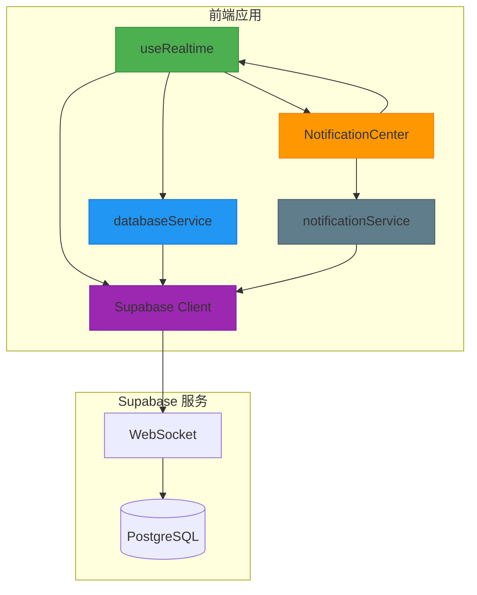
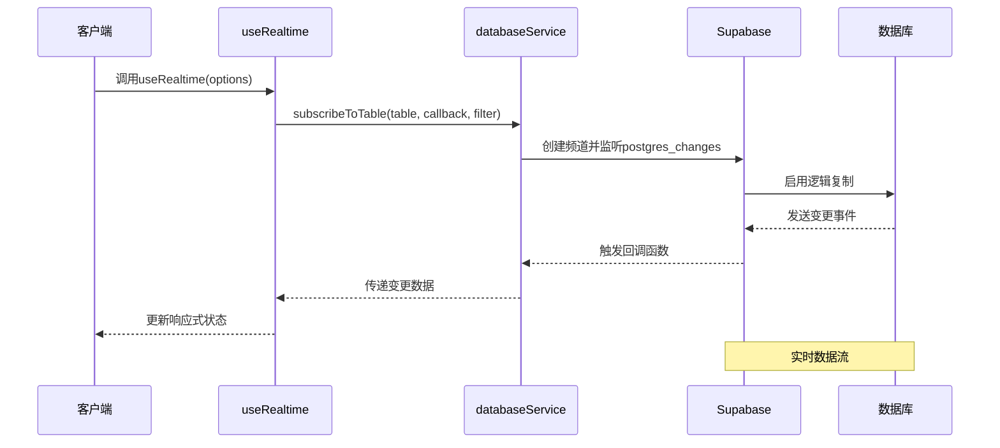
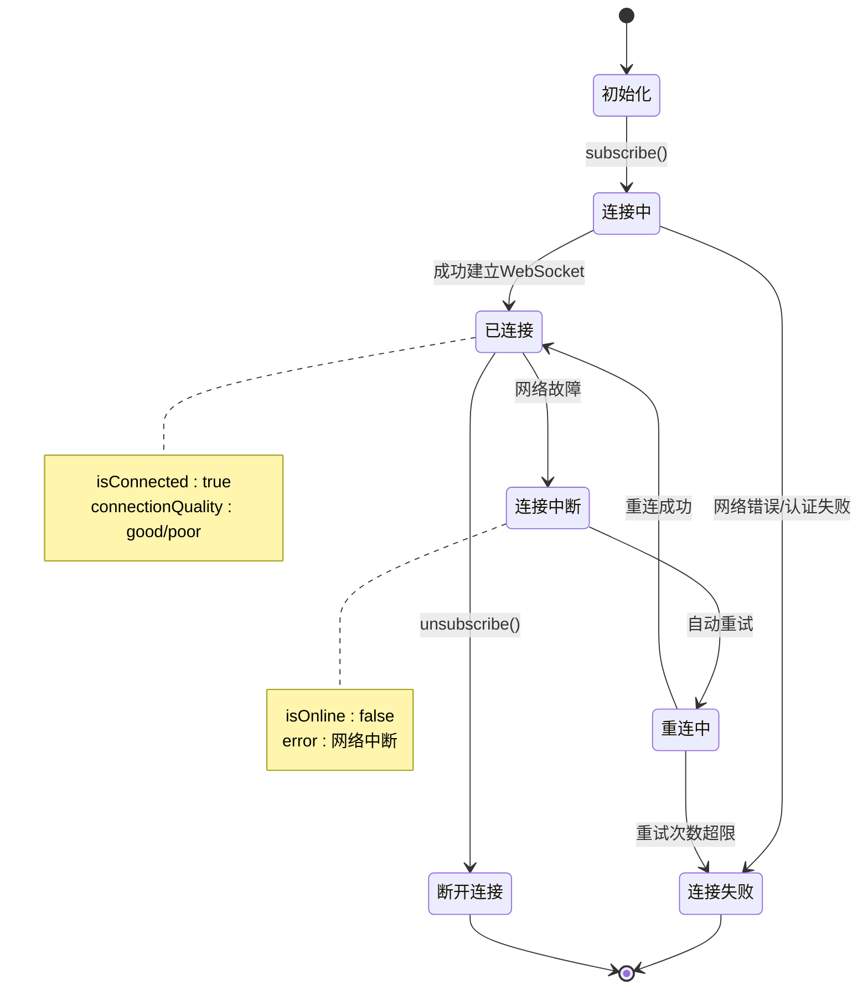
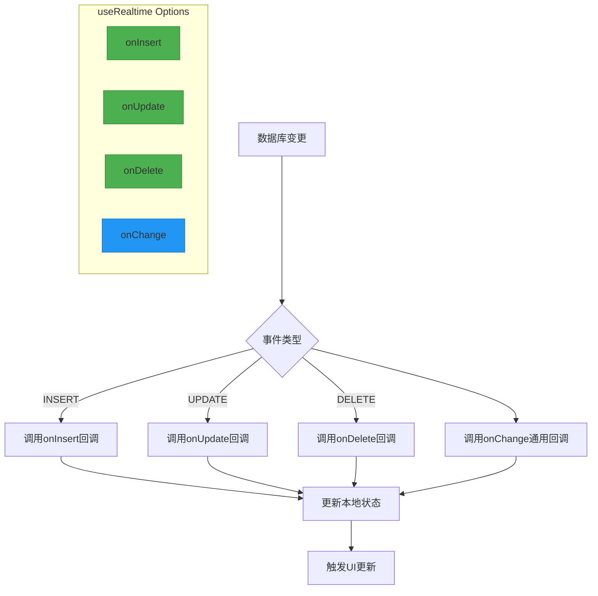
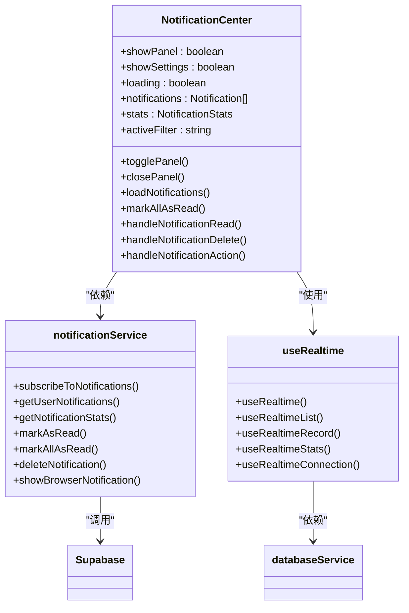
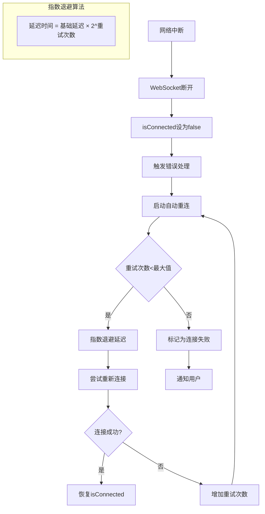
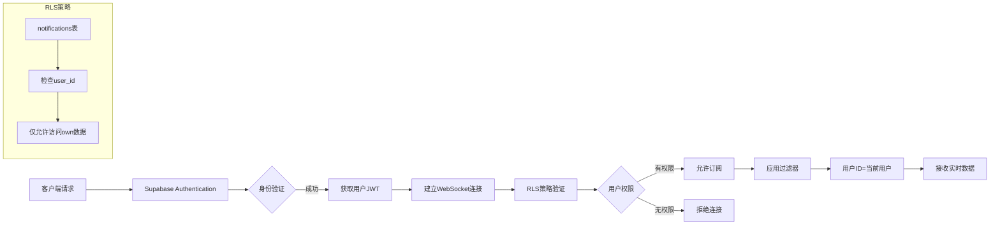
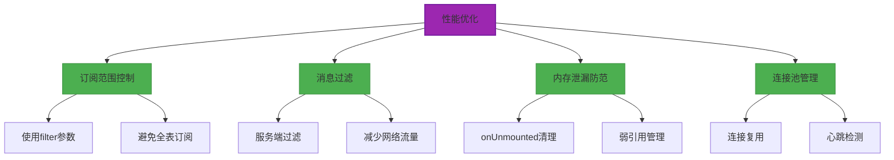

# 实时功能组合式函数

<cite>
**本文档引用文件**   
- [useRealtime.ts](file://src/composables/useRealtime.ts)
- [databaseService.ts](file://src/services/databaseService.ts)
- [supabaseClient.ts](file://src/lib/supabaseClient.ts)
- [NotificationCenter.vue](file://src/components/notifications/NotificationCenter.vue)
- [notificationService.ts](file://src/services/notificationService.ts)
</cite>

## 目录
1. [引言](#引言)
2. [核心架构与设计模式](#核心架构与设计模式)
3. [实时通信机制](#实时通信机制)
4. [连接状态管理](#连接状态管理)
5. [消息分发与处理](#消息分发与处理)
6. [实际应用案例：通知中心](#实际应用案例：通知中心)
7. [订阅生命周期管理](#订阅生命周期管理)
8. [错误恢复与网络中断处理](#错误恢复与网络中断处理)
9. [权限验证集成](#权限验证集成)
10. [性能优化策略](#性能优化策略)
11. [结论](#结论)

## 引言
本文档深入剖析 `useRealtime` 组合式函数的实时通信机制，详细说明其如何通过 Supabase Realtime 客户端建立 WebSocket 连接，订阅数据库变更事件（如工具更新、通知推送等）。文档将解析其连接状态管理、自动重连策略和消息分发机制的实现原理，并结合 NotificationCenter 的实际应用，展示如何监听特定频道并处理实时消息。

## 核心架构与设计模式
`useRealtime` 组合式函数采用分层架构设计，将实时通信功能封装为可复用的 Vue 组合式 API。该设计模式通过依赖注入方式与 `databaseService` 服务解耦，实现了高内聚低耦合的模块化结构。



**图示来源**
- [useRealtime.ts](file://src/composables/useRealtime.ts#L14-L106)
- [databaseService.ts](file://src/services/databaseService.ts#L27-L399)
- [notificationService.ts](file://src/services/notificationService.ts#L60-L508)

**本节来源**
- [useRealtime.ts](file://src/composables/useRealtime.ts#L1-L402)
- [databaseService.ts](file://src/services/databaseService.ts#L1-L405)

## 实时通信机制
`useRealtime` 组合式函数通过 Supabase Realtime 客户端建立 WebSocket 连接，实现与数据库的实时双向通信。该机制基于 PostgreSQL 的逻辑复制功能，能够捕获数据库表的 INSERT、UPDATE 和 DELETE 变更事件。



**图示来源**
- [useRealtime.ts](file://src/composables/useRealtime.ts#L14-L106)
- [databaseService.ts](file://src/services/databaseService.ts#L27-L399)

**本节来源**
- [useRealtime.ts](file://src/composables/useRealtime.ts#L14-L106)
- [databaseService.ts](file://src/services/databaseService.ts#L27-L399)

## 连接状态管理
`useRealtime` 函数通过响应式变量管理连接状态，提供 `isConnected`、`error` 和 `lastEvent` 等状态标识。同时，`useRealtimeConnection` 函数实现了更高级的连接质量监控，包括网络在线状态、连接延迟和连接质量评估。



**图示来源**
- [useRealtime.ts](file://src/composables/useRealtime.ts#L14-L106)
- [useRealtime.ts](file://src/composables/useRealtime.ts#L341-L401)

**本节来源**
- [useRealtime.ts](file://src/composables/useRealtime.ts#L14-L106)
- [useRealtime.ts](file://src/composables/useRealtime.ts#L341-L401)

## 消息分发与处理
实时消息分发机制采用观察者模式，通过回调函数将数据库变更事件分发给订阅者。`useRealtime` 提供了事件类型过滤功能，支持 onInsert、onUpdate、onDelete 和 onChange 等特定事件的处理。



**图示来源**
- [useRealtime.ts](file://src/composables/useRealtime.ts#L14-L106)

**本节来源**
- [useRealtime.ts](file://src/composables/useRealtime.ts#L14-L106)

## 实际应用案例：通知中心
`NotificationCenter` 组件是 `useRealtime` 函数的典型应用场景，通过实时订阅用户通知，实现即时消息推送功能。该组件结合 `notificationService` 服务，构建了完整的实时通知系统。



**图示来源**
- [NotificationCenter.vue](file://src/components/notifications/NotificationCenter.vue#L1-L715)
- [notificationService.ts](file://src/services/notificationService.ts#L60-L508)
- [useRealtime.ts](file://src/composables/useRealtime.ts#L1-L402)

**本节来源**
- [NotificationCenter.vue](file://src/components/notifications/NotificationCenter.vue#L1-L715)
- [notificationService.ts](file://src/services/notificationService.ts#L60-L508)

## 订阅生命周期管理
`useRealtime` 函数实现了完整的订阅生命周期管理，包括订阅、取消订阅和重新订阅操作。通过 Vue 的 `onUnmounted` 钩子，确保组件销毁时自动清理订阅，防止内存泄漏。

```mermaid
flowchart LR
A[创建组件] --> B[调用useRealtime]
B --> C{autoSubscribe}
C --> |true| D[自动subscribe]
C --> |false| E[等待手动subscribe]
D --> F[建立WebSocket连接]
E --> F
F --> G[监听数据库变更]
G --> H[接收实时消息]
H --> I[执行回调函数]
I --> J[更新UI]
J --> K{组件是否销毁}
K --> |是| L[onUnmounted触发]
L --> M[自动unsubscribe]
M --> N[关闭WebSocket连接]
N --> O[清理资源]
O --> [*]
style C fill:#FFEB3B,stroke:#FBC02D
style K fill:#FFEB3B,stroke:#FBC02D
```

**图示来源**
- [useRealtime.ts](file://src/composables/useRealtime.ts#L14-L106)

**本节来源**
- [useRealtime.ts](file://src/composables/useRealtime.ts#L14-L106)

## 错误恢复与网络中断处理
系统实现了 robust 的错误恢复机制，包括自动重连策略和网络中断处理。`useRealtimeConnection` 函数通过浏览器的 online/offline 事件监听网络状态变化，并定期进行健康检查。



**图示来源**
- [useRealtime.ts](file://src/composables/useRealtime.ts#L341-L401)
- [databaseService.ts](file://src/services/databaseService.ts#L27-L399)

**本节来源**
- [useRealtime.ts](file://src/composables/useRealtime.ts#L341-L401)
- [databaseService.ts](file://src/services/databaseService.ts#L27-L399)

## 权限验证集成
实时通信系统与 Supabase 的 RLS（Row Level Security）策略深度集成，确保数据访问的安全性。`notificationService` 在订阅通知时，通过用户 ID 过滤器确保用户只能接收自己的通知。



**图示来源**
- [notificationService.ts](file://src/services/notificationService.ts#L60-L508)
- [supabaseClient.ts](file://src/lib/supabaseClient.ts#L1-L266)

**本节来源**
- [notificationService.ts](file://src/services/notificationService.ts#L60-L508)
- [supabaseClient.ts](file://src/lib/supabaseClient.ts#L1-L266)

## 性能优化策略
为确保实时通信的高效性，系统实施了多项性能优化措施，包括订阅范围控制、消息过滤和内存泄漏防范。

### 订阅范围控制
通过 `filter` 参数精确控制订阅范围，减少不必要的数据传输：
- 使用 `id=eq.${recordId}` 订阅单个记录
- 使用 `user_id=eq.${userId}` 订阅用户特定数据
- 避免无过滤器的全表订阅

### 消息过滤
在服务端进行消息过滤，仅传输符合条件的变更事件：
```typescript
// 示例：只订阅特定状态的订单
useRealtime({
  table: 'orders',
  filter: 'status=eq.pending',
  onUpdate: handleOrderUpdate
})
```

### 内存泄漏防范
- 在组件卸载时自动取消订阅
- 使用 Map 数据结构管理频道引用，便于清理
- 避免在回调函数中创建闭包引用



**图示来源**
- [useRealtime.ts](file://src/composables/useRealtime.ts#L14-L106)
- [databaseService.ts](file://src/services/databaseService.ts#L27-L399)

**本节来源**
- [useRealtime.ts](file://src/composables/useRealtime.ts#L14-L106)
- [databaseService.ts](file://src/services/databaseService.ts#L27-L399)

## 结论
`useRealtime` 组合式函数通过精心设计的架构和实现，为 Vue 应用提供了强大而可靠的实时通信能力。其核心优势包括：
- 响应式状态管理，无缝集成 Vue 3 的 Composition API
- 完整的生命周期管理，自动处理订阅和清理
- robust 的错误恢复机制，确保连接的稳定性
- 灵活的事件处理，支持多种数据库变更类型
- 与 Supabase 安全策略的深度集成

通过 `NotificationCenter` 等实际应用案例，展示了该函数在构建实时交互式应用中的价值。建议在使用时遵循性能优化最佳实践，合理控制订阅范围，确保应用的高效运行。