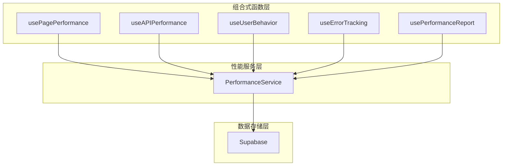
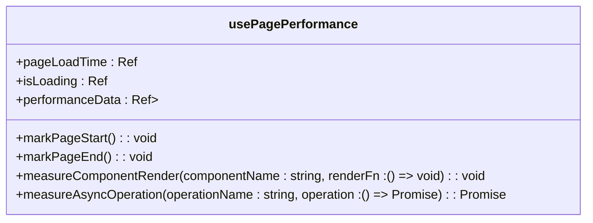
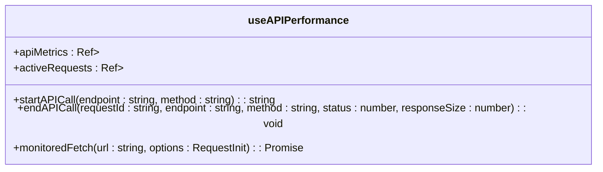
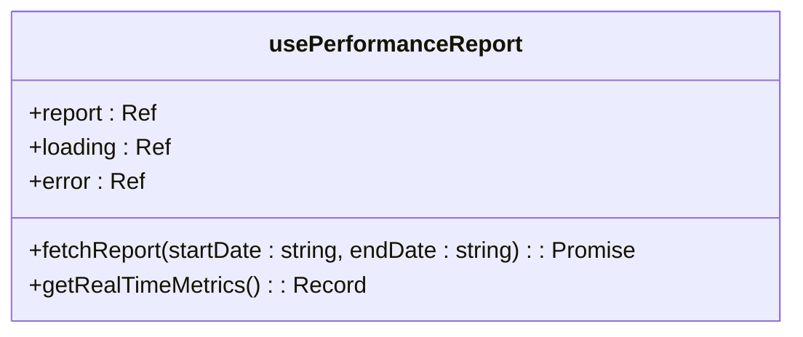
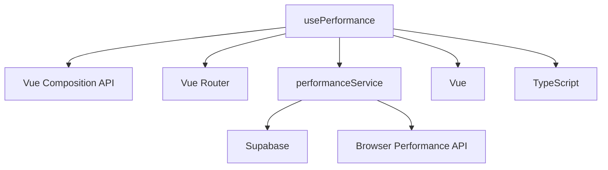

# 性能监控组合式函数

<cite>
**本文档引用的文件**
- [usePerformance.ts](file://src/composables/usePerformance.ts)
- [performanceService.ts](file://src/services/performanceService.ts)
</cite>

## 目录
1. [简介](#简介)
2. [项目结构](#项目结构)
3. [核心组件](#核心组件)
4. [架构概述](#架构概述)
5. [详细组件分析](#详细组件分析)
6. [依赖分析](#依赖分析)
7. [性能考量](#性能考量)
8. [故障排除指南](#故障排除指南)
9. [结论](#结论)

## 简介
本文档全面解析 `usePerformance` 组合式函数的设计与实现，详细说明其如何采集关键性能指标、集成浏览器性能 API、暴露监控接口以及在实际业务场景中的应用。文档涵盖错误处理机制、数据上报策略、生产环境优化设计，并提供性能瓶颈诊断指南和优化建议。

## 项目结构
项目采用典型的 Vue 3 + TypeScript 架构，性能监控功能主要集中在 `src/composables` 和 `src/services` 目录下。`usePerformance.ts` 文件提供了多个组合式函数用于不同维度的性能监控，而 `performanceService.ts` 则作为底层服务负责数据的收集、处理和上报。

**Section sources**
- [usePerformance.ts](file://src/composables/usePerformance.ts#L1-L50)
- [performanceService.ts](file://src/services/performanceService.ts#L1-L50)

## 核心组件
核心组件包括页面性能监控、API 性能监控、用户行为监控、错误监控和性能报告生成等功能。这些功能通过组合式函数的形式提供给上层应用使用，实现了关注点分离和代码复用。

**Section sources**
- [usePerformance.ts](file://src/composables/usePerformance.ts#L1-L488)
- [performanceService.ts](file://src/services/performanceService.ts#L1-L499)

## 架构概述
系统采用分层架构设计，上层为组合式函数层，提供易用的 API 接口；中层为性能服务层，负责核心逻辑处理；底层为数据存储层，通过 Supabase 实现数据持久化。这种设计使得性能监控功能既灵活又可靠。



**Diagram sources**
- [usePerformance.ts](file://src/composables/usePerformance.ts#L1-L488)
- [performanceService.ts](file://src/services/performanceService.ts#L1-L499)

## 详细组件分析

### 页面性能监控分析
`usePagePerformance` 函数负责监控页面级别的性能指标，包括页面加载时间、组件渲染耗时等。

#### 组件分析


**Diagram sources**
- [usePerformance.ts](file://src/composables/usePerformance.ts#L1-L90)

**Section sources**
- [usePerformance.ts](file://src/composables/usePerformance.ts#L1-L90)

### API 性能监控分析
`useAPIPerformance` 函数专门用于监控 API 调用的性能，包括响应延迟、成功率等指标。

#### 组件分析


**Diagram sources**
- [usePerformance.ts](file://src/composables/usePerformance.ts#L91-L144)

**Section sources**
- [usePerformance.ts](file://src/composables/usePerformance.ts#L91-L144)

### 用户行为监控分析
`useUserBehavior` 函数用于跟踪用户在页面上的各种操作行为，如点击、滚动、表单交互等。

#### 组件分析
```mermaid
classDiagram
class useUserBehavior {
+userActions : Ref<Array<{ action : string; timestamp : number; element? : string }>>
+sessionStartTime : Ref<number>
+trackUserAction(action : string, element? : string, duration? : number) : void
+setupClickTracking() : Function
+trackFormInteraction(formName : string, fieldName : string, action : "focus" | "blur" | "change") : void
+setupScrollTracking() : Function
+getSessionDuration() : number
}
```

**Diagram sources**
- [usePerformance.ts](file://src/composables/usePerformance.ts#L145-L230)

**Section sources**
- [usePerformance.ts](file://src/composables/usePerformance.ts#L145-L230)

### 错误监控分析
`useErrorTracking` 函数提供全面的错误监控能力，能够捕获并记录 JavaScript 错误和 Promise 拒绝。

#### 组件分析
```mermaid
classDiagram
class useErrorTracking {
+errors : Ref<Array<{ message : string; timestamp : number; stack? : string }>>
+trackError(error : Error, context? : string) : void
+withErrorTracking<T extends (...args : any[]) => any>(fn : T, context? : string) : T
}
```

**Diagram sources**
- [usePerformance.ts](file://src/composables/usePerformance.ts#L231-L280)

**Section sources**
- [usePerformance.ts](file://src/composables/usePerformance.ts#L231-L280)

### 性能报告分析
`usePerformanceReport` 函数负责获取和展示性能报告，支持按时间范围查询历史数据。

#### 组件分析


**Diagram sources**
- [usePerformance.ts](file://src/composables/usePerformance.ts#L281-L340)

**Section sources**
- [usePerformance.ts](file://src/composables/usePerformance.ts#L281-L340)

## 依赖分析
性能监控系统依赖于多个外部模块和服务，形成了一个完整的监控生态。



**Diagram sources**
- [usePerformance.ts](file://src/composables/usePerformance.ts#L1-L10)
- [performanceService.ts](file://src/services/performanceService.ts#L1-L10)

**Section sources**
- [usePerformance.ts](file://src/composables/usePerformance.ts#L1-L488)
- [performanceService.ts](file://src/services/performanceService.ts#L1-L499)

## 性能考量
系统在设计时充分考虑了生产环境的性能影响，采用了多种优化策略来最小化对应用性能的影响。

- **批量上报**：采用批量上报机制，减少网络请求次数
- **节流处理**：设置合理的上报频率，避免过度消耗资源
- **异步处理**：所有监控操作均采用异步方式，不影响主线程执行
- **条件启用**：支持动态启用/禁用监控功能，便于生产环境控制

**Section sources**
- [performanceService.ts](file://src/services/performanceService.ts#L113-L118)
- [performanceService.ts](file://src/services/performanceService.ts#L404-L456)

## 故障排除指南
当遇到性能监控相关问题时，可以参考以下指南进行排查和解决。

### 常见问题及解决方案
| 问题现象 | 可能原因 | 解决方案 |
|---------|--------|--------|
| 数据未上报 | 网络问题或 Supabase 连接失败 | 检查网络连接，确认 Supabase 配置正确 |
| 监控数据不准确 | 浏览器不支持 Performance API | 检测浏览器兼容性，提供降级方案 |
| 页面性能下降 | 监控代码过于频繁 | 调整采样频率，优化监控逻辑 |
| 报告生成失败 | 数据库查询超时 | 优化数据库索引，增加超时重试机制 |

**Section sources**
- [performanceService.ts](file://src/services/performanceService.ts#L404-L456)
- [performanceService.ts](file://src/services/performanceService.ts#L452-L498)

## 结论
`usePerformance` 组合式函数提供了一套完整的前端性能监控解决方案，通过模块化设计实现了功能的灵活组合和复用。系统不仅能够采集关键性能指标，还提供了丰富的分析工具和报告功能，帮助开发者识别和解决性能瓶颈。其优雅的架构设计和对生产环境的充分考虑，使其成为现代 Web 应用性能监控的理想选择。