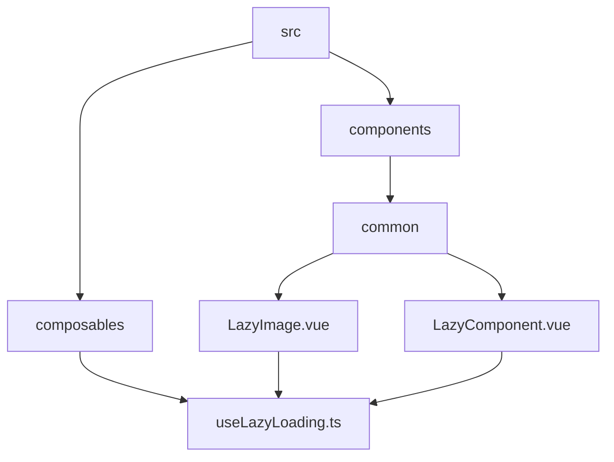
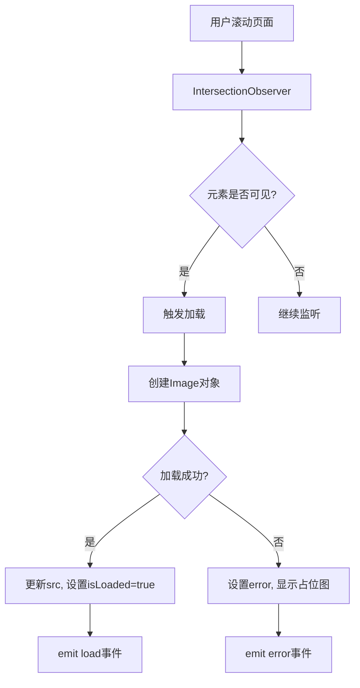
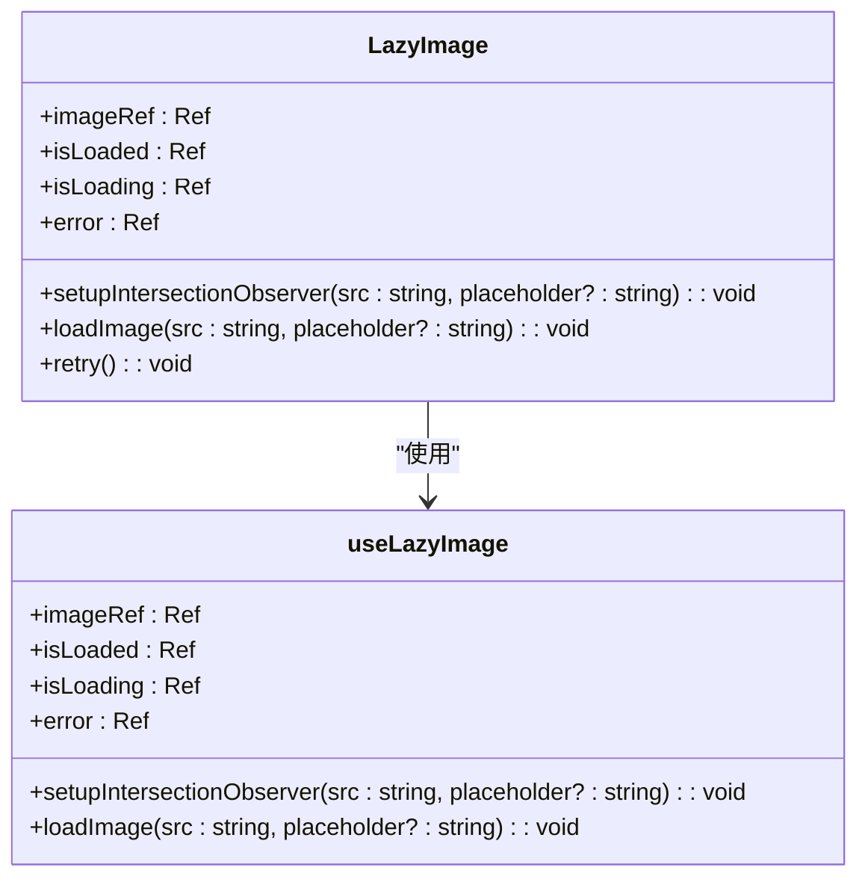
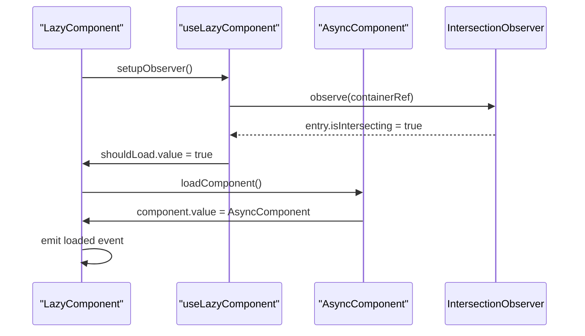
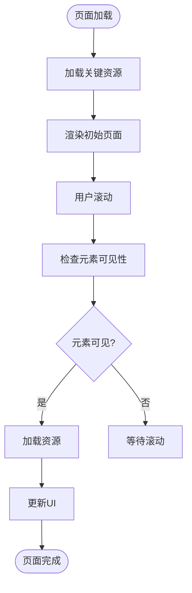
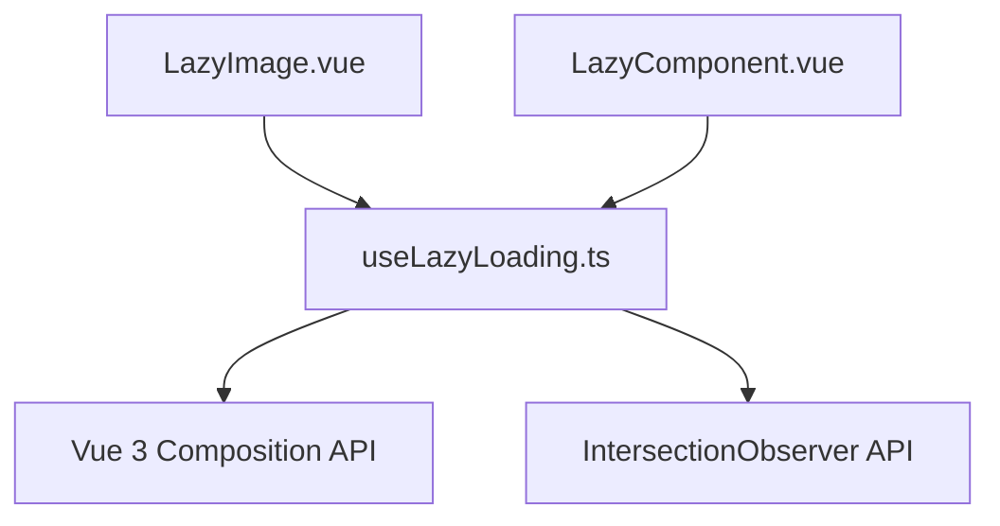

# 懒加载组合式函数

<cite>
**本文档中引用的文件**   
- [useLazyLoading.ts](file://src/composables/useLazyLoading.ts)
- [LazyImage.vue](file://src/components/common/LazyImage.vue)
- [LazyComponent.vue](file://src/components/common/LazyComponent.vue)
</cite>

## 目录
1. [简介](#简介)
2. [项目结构](#项目结构)
3. [核心组件](#核心组件)
4. [架构概述](#架构概述)
5. [详细组件分析](#详细组件分析)
6. [依赖分析](#依赖分析)
7. [性能考虑](#性能考虑)
8. [故障排除指南](#故障排除指南)
9. [结论](#结论)

## 简介
本文档详细阐述了 `useLazyLoading` 组合式函数的技术实现，重点说明其如何基于 Intersection Observer API 实现元素可见性检测，完成图片或组件的延迟加载。文档分析了其内部状态管理机制，包括加载状态（isLoading）、错误处理（error）和重试逻辑的封装方式。结合 `LazyImage` 和 `LazyComponent` 的实际应用，展示了该函数如何通过暴露 `load` 方法和 `isIntersecting` 响应式引用实现灵活控制。同时，文档包含了与 Vue 3 响应式系统集成的细节，如 `watchEffect` 的使用和生命周期清理（onScopeDispose）。最后，提供了性能优化建议和在低性能设备上的降级处理方案。

## 项目结构
本项目采用典型的 Vue 3 + TypeScript 架构，核心懒加载功能位于 `src/composables` 目录下，由 `useLazyLoading.ts` 文件提供。该组合式函数被 `src/components/common` 目录下的 `LazyImage.vue` 和 `LazyComponent.vue` 两个通用组件所使用，实现了图片和组件级别的懒加载。项目结构清晰，遵循了功能模块化的设计原则。

**Diagram sources**
- [useLazyLoading.ts](file://src/composables/useLazyLoading.ts)
- [LazyImage.vue](file://src/components/common/LazyImage.vue)
- [LazyComponent.vue](file://src/components/common/LazyComponent.vue)

**Section sources**
- [useLazyLoading.ts](file://src/composables/useLazyLoading.ts)
- [LazyImage.vue](file://src/components/common/LazyImage.vue)
- [LazyComponent.vue](file://src/components/common/LazyComponent.vue)

## 核心组件
`useLazyLoading` 组合式函数是本项目的核心，它提供了 `useLazyImage` 和 `useLazyComponent` 两个主要功能。`useLazyImage` 负责图片的懒加载，通过 `IntersectionObserver` 检测图片元素是否进入视口，一旦进入则加载真实图片。`useLazyComponent` 则用于组件的懒加载，当组件进入视口时，触发组件的加载和渲染。这两个函数都封装了加载状态、错误处理和重试逻辑，为上层组件提供了简洁易用的 API。

**Section sources**
- [useLazyLoading.ts](file://src/composables/useLazyLoading.ts)

## 架构概述
整个懒加载系统的架构基于 Vue 3 的组合式 API 和响应式系统。`useLazyLoading` 函数利用 `ref` 创建响应式状态，通过 `IntersectionObserver` API 监听元素的可见性变化。当元素进入视口时，触发相应的加载逻辑。加载完成后，通过 `emit` 事件通知上层组件。该架构实现了关注点分离，将复杂的懒加载逻辑封装在组合式函数中，使得上层组件可以专注于 UI 展现。

**Diagram sources**
- [useLazyLoading.ts](file://src/composables/useLazyLoading.ts)

## 详细组件分析

### LazyImage 分析
`LazyImage` 组件是 `useLazyImage` 组合式函数的具体应用。它通过 `ref` 绑定图片元素，并将 `src` 属性传递给 `setupIntersectionObserver` 方法。组件内部通过 `watch` 监听 `src` 的变化，确保在图片源更新时能重新设置观察器。`LazyImage` 还提供了占位符、错误处理和重试功能，极大地提升了用户体验。

#### 对于 Object-Oriented Components:

**Diagram sources**
- [useLazyLoading.ts](file://src/composables/useLazyLoading.ts)
- [LazyImage.vue](file://src/components/common/LazyImage.vue)

### LazyComponent 分析
`LazyComponent` 组件利用 `useLazyComponent` 实现了组件级别的懒加载。它通过 `defineAsyncComponent` 动态加载组件，并在组件加载过程中显示加载状态。`LazyComponent` 支持自定义预加载距离，允许开发者根据需要提前加载组件，优化用户体验。

#### 对于 API/Service Components:

**Diagram sources**
- [useLazyLoading.ts](file://src/composables/useLazyLoading.ts)
- [LazyComponent.vue](file://src/components/common/LazyComponent.vue)

### 概念概述
懒加载是一种优化网页性能的技术，它允许页面在初始加载时只加载必要的资源，而将其他资源的加载推迟到需要时。这可以显著减少初始加载时间，提高用户体验，特别是在移动设备和网络条件较差的情况下。

[No sources needed since this diagram shows conceptual workflow, not actual code structure]

[No sources needed since this section doesn't analyze specific source files]

## 依赖分析
`useLazyLoading` 组合式函数主要依赖于 Vue 3 的响应式 API（`ref`, `computed`, `watch`）和生命周期钩子（`onMounted`, `onUnmounted`）。它还依赖于浏览器的 `IntersectionObserver` API 来检测元素的可见性。`LazyImage` 和 `LazyComponent` 组件则依赖于 `useLazyLoading` 提供的功能。这种依赖关系清晰，耦合度低，便于维护和测试。

**Diagram sources**
- [useLazyLoading.ts](file://src/composables/useLazyLoading.ts)
- [LazyImage.vue](file://src/components/common/LazyImage.vue)
- [LazyComponent.vue](file://src/components/common/LazyComponent.vue)

**Section sources**
- [useLazyLoading.ts](file://src/composables/useLazyLoading.ts)
- [LazyImage.vue](file://src/components/common/LazyImage.vue)
- [LazyComponent.vue](file://src/components/common/LazyComponent.vue)

## 性能考虑
为了优化性能，`useLazyLoading` 提供了多种配置选项。开发者可以通过调整 `threshold` 和 `rootMargin` 来控制元素何时开始加载。例如，设置较大的 `rootMargin` 可以提前加载元素，减少用户等待时间。此外，`useResourcePreloader` 函数可以用于预加载关键资源，进一步提升性能。在低性能设备上，系统会自动降级到直接加载模式，确保功能可用。

**Section sources**
- [useLazyLoading.ts](file://src/composables/useLazyLoading.ts)

## 故障排除指南
当遇到懒加载问题时，首先应检查浏览器是否支持 `IntersectionObserver` API。如果不支持，函数会自动降级到直接加载模式。其次，检查 `src` 属性是否正确设置。如果图片加载失败，可以尝试使用 `retry` 方法重新加载。对于组件加载失败，应检查 `componentLoader` 函数是否正确返回一个 Promise。

**Section sources**
- [useLazyLoading.ts](file://src/composables/useLazyLoading.ts)
- [LazyImage.vue](file://src/components/common/LazyImage.vue)
- [LazyComponent.vue](file://src/components/common/LazyComponent.vue)

## 结论
`useLazyLoading` 组合式函数及其相关组件提供了一套完整、高效且易于使用的懒加载解决方案。通过与 Vue 3 响应式系统的深度集成，它实现了优雅的状态管理和生命周期控制。该方案不仅提升了应用性能，还改善了用户体验，是现代 Web 应用开发中不可或缺的一部分。