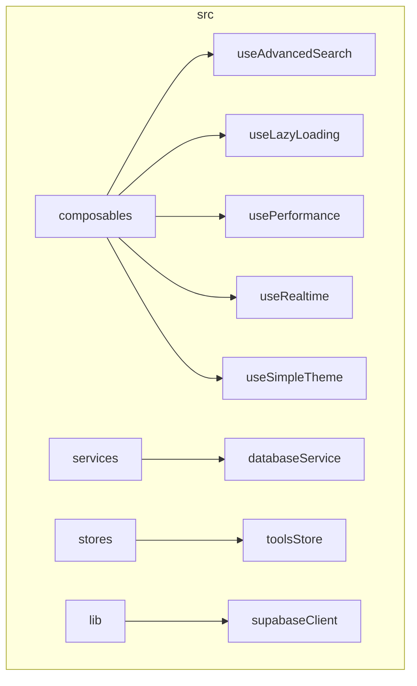
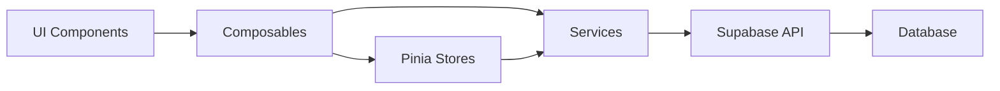
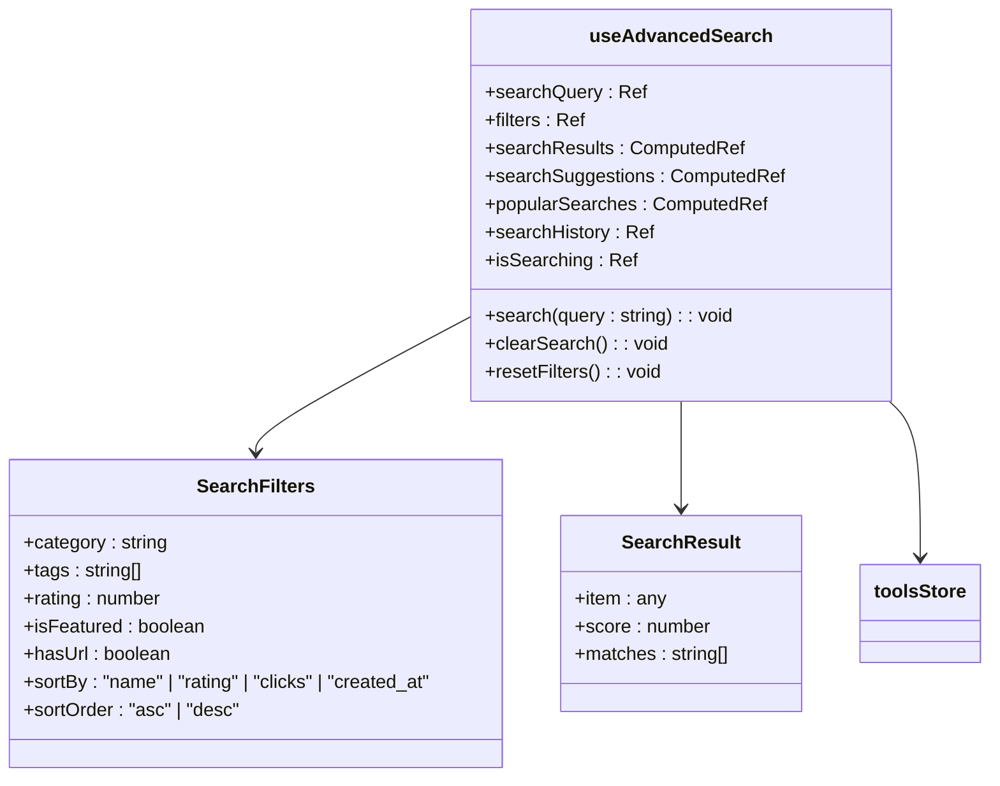
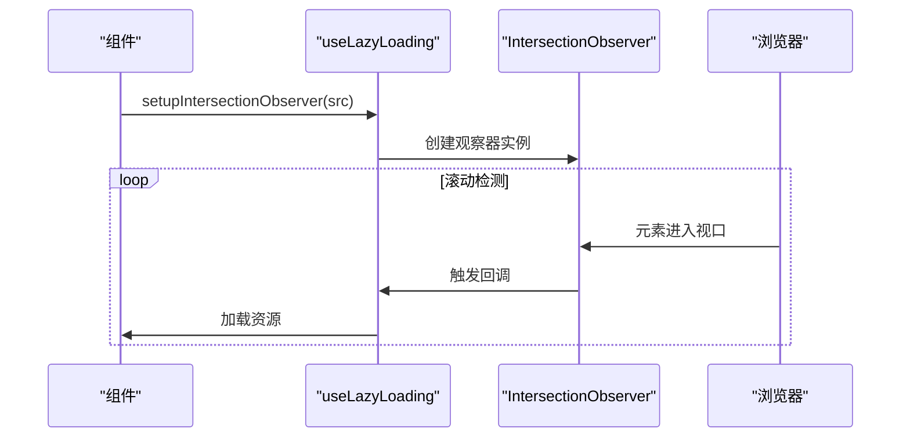
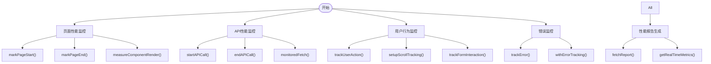
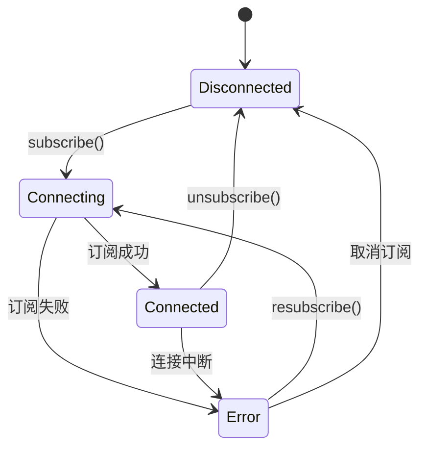
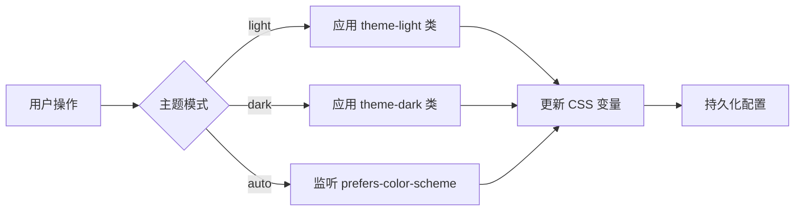
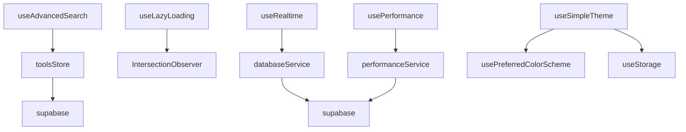

# 组合式函数结构

<cite>
**本文档中引用的文件**  
- [useAdvancedSearch.ts](file://src/composables/useAdvancedSearch.ts)
- [useLazyLoading.ts](file://src/composables/useLazyLoading.ts)
- [usePerformance.ts](file://src/composables/usePerformance.ts)
- [useRealtime.ts](file://src/composables/useRealtime.ts)
- [useSimpleTheme.ts](file://src/composables/useSimpleTheme.ts)
- [databaseService.ts](file://src/services/databaseService.ts)
- [supabaseClient.ts](file://src/lib/supabaseClient.ts)
- [tools.ts](file://src/stores/tools.ts)
- [AdvancedSearchPanel.vue](file://src/components/search/AdvancedSearchPanel.vue)
</cite>

## 目录
1. [简介](#简介)
2. [项目结构](#项目结构)
3. [核心组件](#核心组件)
4. [架构概述](#架构概述)
5. [详细组件分析](#详细组件分析)
6. [依赖分析](#依赖分析)
7. [性能考虑](#性能考虑)
8. [故障排除指南](#故障排除指南)
9. [结论](#结论)

## 简介
本文档深入解析 `src/composables` 目录下的组合式函数设计，涵盖高级搜索、懒加载、性能监控、实时数据同步和主题切换等关键功能模块。通过分析各组合式函数的实现机制、响应式数据流及使用模式，为开发者提供全面的技术参考和最佳实践指导。

## 项目结构
项目采用标准的 Vue 3 + TypeScript 架构，核心功能模块组织清晰，遵循关注点分离原则。

**图示来源**  
- [useAdvancedSearch.ts](file://src/composables/useAdvancedSearch.ts)
- [useLazyLoading.ts](file://src/composables/useLazyLoading.ts)
- [usePerformance.ts](file://src/composables/usePerformance.ts)
- [useRealtime.ts](file://src/composables/useRealtime.ts)
- [useSimpleTheme.ts](file://src/composables/useSimpleTheme.ts)
- [databaseService.ts](file://src/services/databaseService.ts)
- [tools.ts](file://src/stores/tools.ts)
- [supabaseClient.ts](file://src/lib/supabaseClient.ts)

**本节来源**  
- [src/composables](file://src/composables)
- [src/services](file://src/services)
- [src/stores](file://src/stores)
- [src/lib](file://src/lib)

## 核心组件
`src/composables` 目录下的组合式函数封装了应用的核心业务逻辑，通过 Vue 3 Composition API 实现了功能的高内聚和可复用性。

**本节来源**  
- [useAdvancedSearch.ts](file://src/composables/useAdvancedSearch.ts)
- [useLazyLoading.ts](file://src/composables/useLazyLoading.ts)
- [usePerformance.ts](file://src/composables/usePerformance.ts)
- [useRealtime.ts](file://src/composables/useRealtime.ts)
- [useSimpleTheme.ts](file://src/composables/useSimpleTheme.ts)

## 架构概述
系统采用分层架构设计，组合式函数作为业务逻辑层，连接状态管理(store)与数据服务层(service)，形成清晰的数据流。

**图示来源**  
- [useAdvancedSearch.ts](file://src/composables/useAdvancedSearch.ts)
- [useRealtime.ts](file://src/composables/useRealtime.ts)
- [databaseService.ts](file://src/services/databaseService.ts)
- [tools.ts](file://src/stores/tools.ts)

## 详细组件分析
对每个组合式函数进行深入分析，阐明其设计原理、实现细节和使用方法。

### useAdvancedSearch 高级搜索逻辑
`useAdvancedSearch` 封装了复杂的搜索逻辑，包括查询参数构建、过滤条件管理和搜索结果处理。

#### 智能搜索算法
该函数实现了基于权重的智能搜索算法，支持多字段匹配和模糊搜索。

**图示来源**  
- [useAdvancedSearch.ts](file://src/composables/useAdvancedSearch.ts#L1-L310)
- [tools.ts](file://src/stores/tools.ts#L1-L342)

**本节来源**  
- [useAdvancedSearch.ts](file://src/composables/useAdvancedSearch.ts#L1-L310)
- [AdvancedSearchPanel.vue](file://src/components/search/AdvancedSearchPanel.vue#L1-L594)

### useLazyLoading 懒加载实现
`useLazyLoading` 提供了多种懒加载策略，包括图片懒加载、组件懒加载和资源预加载。

#### Intersection Observer 集成
该函数利用 Intersection Observer API 实现了高效的懒加载机制。

**图示来源**  
- [useLazyLoading.ts](file://src/composables/useLazyLoading.ts#L1-L321)

**本节来源**  
- [useLazyLoading.ts](file://src/composables/useLazyLoading.ts#L1-L321)

### usePerformance 性能监控
`usePerformance` 提供了全面的性能监控能力，涵盖页面性能、API 性能和用户行为。

#### 指标采集与分析
该函数集成了多种性能指标采集方法，支持实时监控和报告生成。

**图示来源**  
- [usePerformance.ts](file://src/composables/usePerformance.ts#L1-L489)

**本节来源**  
- [usePerformance.ts](file://src/composables/usePerformance.ts#L1-L489)

### useRealtime 实时数据同步
`useRealtime` 管理 Supabase 实时订阅，确保数据的实时性和一致性。

#### 连接状态维护
该函数实现了完整的连接状态管理，包括错误重连机制。

**图示来源**  
- [useRealtime.ts](file://src/composables/useRealtime.ts#L1-L403)
- [databaseService.ts](file://src/services/databaseService.ts#L1-L405)

**本节来源**  
- [useRealtime.ts](file://src/composables/useRealtime.ts#L1-L403)
- [databaseService.ts](file://src/services/databaseService.ts#L1-L405)

### useSimpleTheme 主题切换
`useSimpleTheme` 实现了主题切换逻辑，支持浅色、深色和自动模式。

#### CSS 变量动态更新
该函数通过操作 DOM 类和属性来实现主题的动态切换。

**图示来源**  
- [useSimpleTheme.ts](file://src/composables/useSimpleTheme.ts#L1-L111)

**本节来源**  
- [useSimpleTheme.ts](file://src/composables/useSimpleTheme.ts#L1-L111)

## 依赖分析
分析各组合式函数之间的依赖关系及其与外部服务的交互。

**图示来源**  
- [useAdvancedSearch.ts](file://src/composables/useAdvancedSearch.ts)
- [useLazyLoading.ts](file://src/composables/useLazyLoading.ts)
- [usePerformance.ts](file://src/composables/usePerformance.ts)
- [useRealtime.ts](file://src/composables/useRealtime.ts)
- [useSimpleTheme.ts](file://src/composables/useSimpleTheme.ts)
- [databaseService.ts](file://src/services/databaseService.ts)

**本节来源**  
- [useAdvancedSearch.ts](file://src/composables/useAdvancedSearch.ts)
- [useLazyLoading.ts](file://src/composables/useLazyLoading.ts)
- [usePerformance.ts](file://src/composables/usePerformance.ts)
- [useRealtime.ts](file://src/composables/useRealtime.ts)
- [useSimpleTheme.ts](file://src/composables/useSimpleTheme.ts)
- [databaseService.ts](file://src/services/databaseService.ts)

## 性能考虑
各组合式函数在设计时充分考虑了性能优化，采用了多种策略来提升应用性能。

- `useAdvancedSearch` 使用计算属性实现响应式搜索结果
- `useLazyLoading` 利用 Intersection Observer 避免不必要的资源加载
- `usePerformance` 通过节流和防抖减少性能数据采集的开销
- `useRealtime` 实现了连接池管理，避免重复建立连接
- `useSimpleTheme` 使用本地存储持久化主题配置，减少重复计算

## 故障排除指南
提供常见问题的解决方案和调试建议。

**本节来源**  
- [useAdvancedSearch.ts](file://src/composables/useAdvancedSearch.ts)
- [useLazyLoading.ts](file://src/composables/useLazyLoading.ts)
- [usePerformance.ts](file://src/composables/usePerformance.ts)
- [useRealtime.ts](file://src/composables/useRealtime.ts)
- [useSimpleTheme.ts](file://src/composables/useSimpleTheme.ts)

## 结论
`src/composables` 目录下的组合式函数通过 Vue 3 Composition API 实现了业务逻辑的高效封装和复用。这些函数不仅提供了强大的功能，还充分考虑了性能、可维护性和用户体验，为应用的稳定运行提供了坚实的基础。