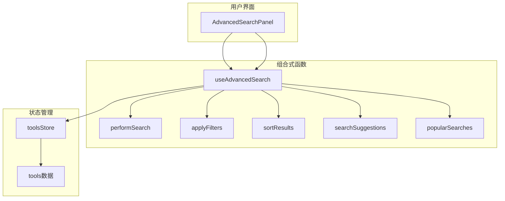
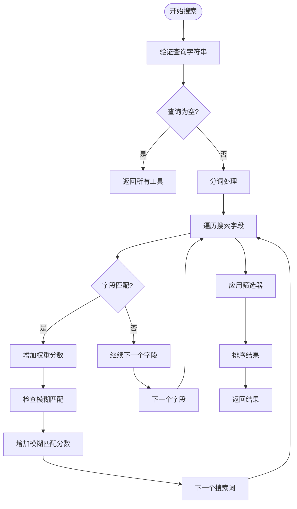
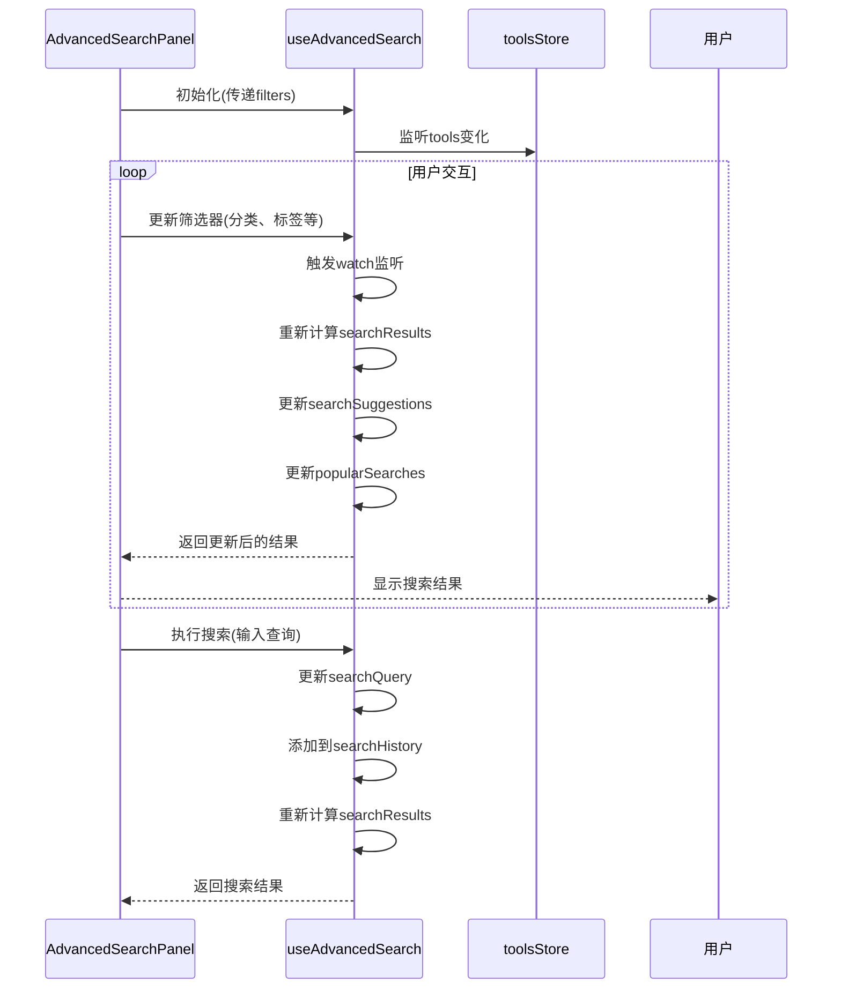
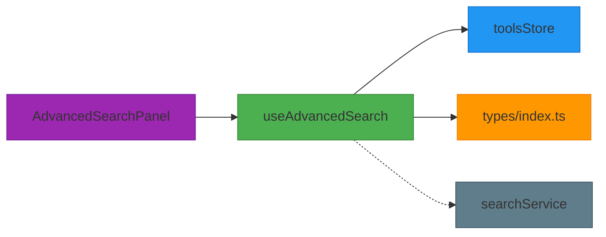

# 高级搜索组合式函数

<cite>
**本文档引用的文件**   
- [useAdvancedSearch.ts](file://src/composables/useAdvancedSearch.ts)
- [AdvancedSearchPanel.vue](file://src/components/search/AdvancedSearchPanel.vue)
- [searchService.ts](file://src/services/searchService.ts)
- [tools.ts](file://src/stores/tools.ts)
- [index.ts](file://src/types/index.ts)
</cite>

## 目录
1. [简介](#简介)
2. [核心组件](#核心组件)
3. [架构概述](#架构概述)
4. [详细组件分析](#详细组件分析)
5. [依赖分析](#依赖分析)
6. [性能考虑](#性能考虑)
7. [故障排除指南](#故障排除指南)
8. [结论](#结论)

## 简介
`useAdvancedSearch` 是一个 Vue 3 组合式函数，用于封装高级搜索功能。该函数为应用程序提供了一套完整的搜索解决方案，包括动态查询参数构建、多条件过滤管理、搜索结果排序以及搜索历史记录等功能。它通过响应式数据流与 `AdvancedSearchPanel` 组件和 `toolsStore` 状态管理器紧密集成，实现了高效的本地搜索体验。该函数特别适用于需要复杂搜索逻辑的应用场景，能够处理文本搜索、分类筛选、标签过滤、评分条件等多种搜索需求。

## 核心组件

`useAdvancedSearch` 函数是高级搜索功能的核心实现，它封装了搜索逻辑并提供了响应式的数据接口。该函数通过 `ref` 和 `computed` 创建响应式状态，包括搜索查询、筛选条件、搜索结果等。其主要功能包括：执行智能文本搜索、应用多维度筛选器、对结果进行排序、管理搜索历史和生成搜索建议。函数返回的 API 包括 `search`、`clearSearch` 和 `resetFilters` 等方法，供组件调用以控制搜索行为。该函数与 `AdvancedSearchPanel` 组件协同工作，后者提供用户界面来设置搜索条件，而 `useAdvancedSearch` 则负责处理这些条件并生成相应的搜索结果。

**Section sources**
- [useAdvancedSearch.ts](file://src/composables/useAdvancedSearch.ts#L0-L310)

## 架构概述

`useAdvancedSearch` 函数的架构设计体现了 Vue 3 组合式 API 的最佳实践。该函数通过依赖注入获取 `toolsStore`，从而访问应用程序的工具数据。搜索过程分为三个主要阶段：首先执行 `performSearch` 进行文本匹配和相关性评分，然后通过 `applyFilters` 应用用户设置的筛选条件，最后使用 `sortResults` 对结果进行排序。整个搜索流程被封装在 `searchResults` 计算属性中，确保了响应式更新。函数还提供了 `searchSuggestions` 和 `popularSearches` 等计算属性，用于增强用户体验。这种架构设计将搜索逻辑与 UI 完全分离，提高了代码的可维护性和可重用性。

**Diagram sources **
- [useAdvancedSearch.ts](file://src/composables/useAdvancedSearch.ts#L0-L310)
- [AdvancedSearchPanel.vue](file://src/components/search/AdvancedSearchPanel.vue#L0-L594)
- [tools.ts](file://src/stores/tools.ts#L0-L342)

## 详细组件分析

### useAdvancedSearch 分析
`useAdvancedSearch` 函数实现了复杂的搜索算法，能够根据用户输入的查询字符串和筛选条件返回排序后的结果。搜索算法采用加权评分机制，不同字段具有不同的权重（如名称权重为10，描述权重为5），确保更相关的结果排在前面。函数还实现了模糊匹配功能，即使用户输入有轻微拼写错误也能找到匹配项。筛选功能支持分类、标签、评分、特色工具和URL可用性等多种条件的组合。排序功能支持按名称、评分、点击量和创建时间等多种方式。所有搜索状态（查询、筛选器、历史记录等）都通过 `ref` 实现响应式，任何变化都会自动触发重新计算。

#### 搜索算法流程

**Diagram sources **
- [useAdvancedSearch.ts](file://src/composables/useAdvancedSearch.ts#L54-L200)

#### 高级搜索面板交互

**Diagram sources **
- [AdvancedSearchPanel.vue](file://src/components/search/AdvancedSearchPanel.vue#L0-L594)
- [useAdvancedSearch.ts](file://src/composables/useAdvancedSearch.ts#L0-L310)

**Section sources**
- [useAdvancedSearch.ts](file://src/composables/useAdvancedSearch.ts#L0-L310)
- [AdvancedSearchPanel.vue](file://src/components/search/AdvancedSearchPanel.vue#L0-L594)

## 依赖分析

`useAdvancedSearch` 函数与其他组件和模块存在明确的依赖关系。该函数直接依赖于 `toolsStore` 来获取工具数据，这是其主要的数据源。同时，它被 `AdvancedSearchPanel` 组件所使用，为该组件提供搜索功能。在类型定义方面，函数使用了 `SearchFilters` 和 `SearchResult` 接口，这些接口在 `types/index.ts` 中定义。虽然 `searchService` 提供了类似的搜索功能，但 `useAdvancedSearch` 实现的是客户端本地搜索，两者服务于不同的场景。这种依赖关系设计使得搜索逻辑可以独立于具体的 UI 组件，提高了代码的可重用性。

**Diagram sources **
- [useAdvancedSearch.ts](file://src/composables/useAdvancedSearch.ts#L0-L310)
- [tools.ts](file://src/stores/tools.ts#L0-L342)
- [index.ts](file://src/types/index.ts#L0-L389)

**Section sources**
- [useAdvancedSearch.ts](file://src/composables/useAdvancedSearch.ts#L0-L310)
- [tools.ts](file://src/stores/tools.ts#L0-L342)
- [index.ts](file://src/types/index.ts#L0-L389)

## 性能考虑
`useAdvancedSearch` 函数在性能方面进行了多项优化。首先，搜索操作被封装在 `computed` 属性中，利用 Vue 的响应式系统进行缓存，只有当依赖的数据发生变化时才会重新计算。其次，函数实现了搜索历史限制，最多只保存50条历史记录，防止内存无限增长。对于大型数据集，虽然当前实现是对所有工具进行全量搜索，但可以通过分页或虚拟滚动等技术进一步优化。值得注意的是，该函数执行的是客户端搜索，避免了网络请求的开销，但同时也意味着所有数据必须预先加载到内存中。对于非常大的数据集，可能需要考虑结合服务端搜索来平衡性能和用户体验。

## 故障排除指南
在使用 `useAdvancedSearch` 时可能遇到的常见问题包括：搜索结果不更新、筛选器不生效、性能下降等。如果搜索结果不更新，应检查 `toolsStore` 中的数据是否正确加载，以及 `searchQuery` 和 `filters` 是否被正确修改。如果筛选器不生效，需要确认 `AdvancedSearchPanel` 组件是否正确地将筛选条件传递给 `useAdvancedSearch`。对于性能问题，如果工具数据量很大，可以考虑实现防抖机制或分页加载。调试时，可以检查 `searchResults` 计算属性的依赖关系，确保所有相关的响应式数据都被正确追踪。此外，应确保 `toolsStore` 已经完成初始化并成功加载了工具数据。

**Section sources**
- [useAdvancedSearch.ts](file://src/composables/useAdvancedSearch.ts#L0-L310)
- [tools.ts](file://src/stores/tools.ts#L0-L342)

## 结论
`useAdvancedSearch` 组合式函数为应用程序提供了一个功能完整、性能良好的高级搜索解决方案。通过合理利用 Vue 3 的响应式系统和组合式 API，该函数成功地将复杂的搜索逻辑封装在一个可重用的单元中。其架构设计清晰，职责分明，易于维护和扩展。与 `AdvancedSearchPanel` 组件的配合使用，为用户提供了直观的搜索界面。虽然当前实现主要针对客户端搜索，但其模块化的设计使得未来可以轻松地集成服务端搜索或其他高级功能。总体而言，这是一个体现现代 Vue 应用开发最佳实践的优秀示例。