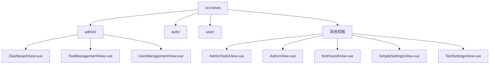
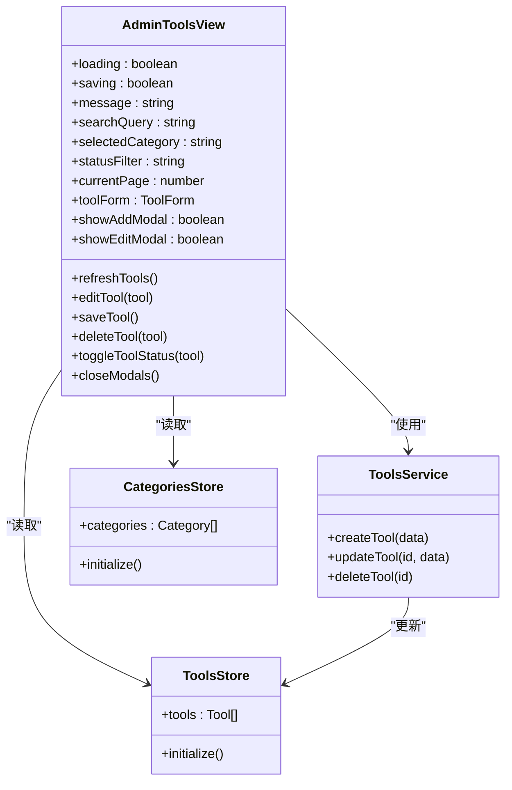
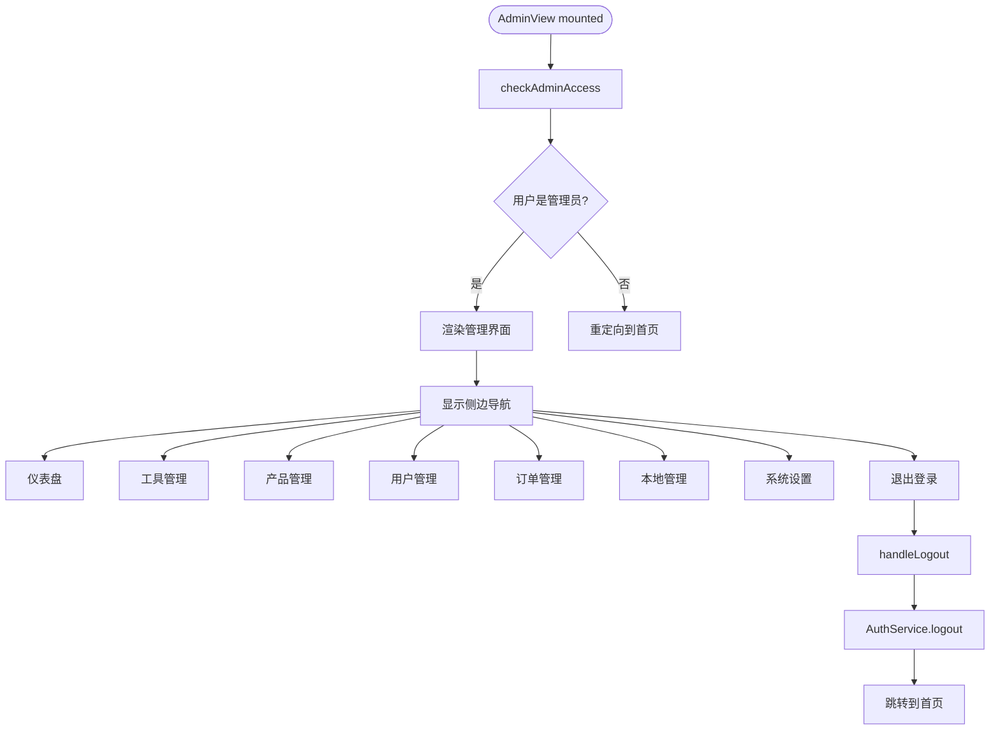
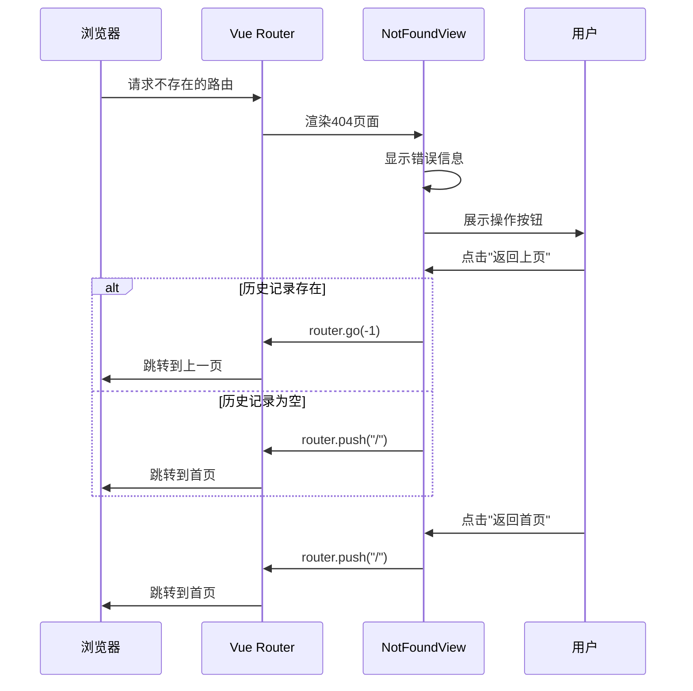
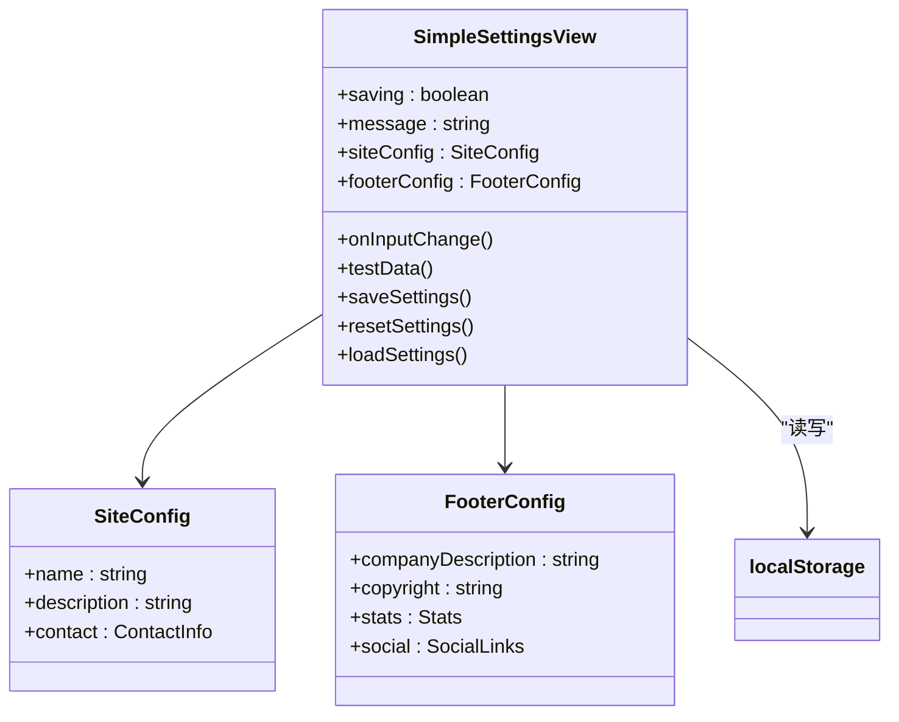
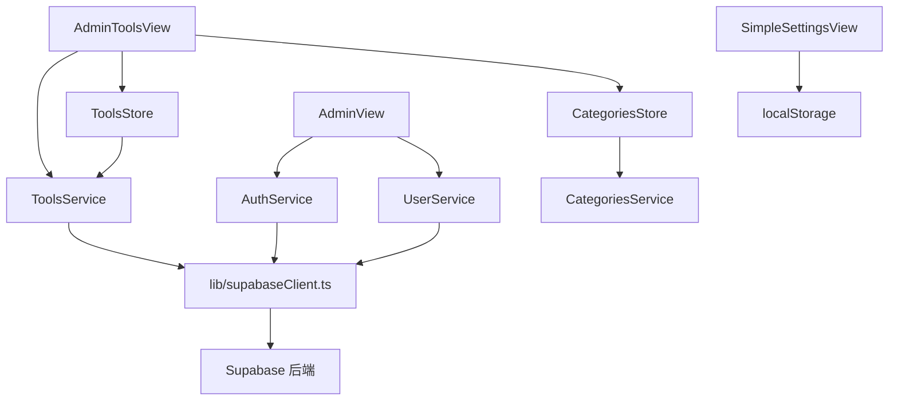

# 其他视图

<cite>
**本文档中引用的文件**  
- [AdminToolsView.vue](file://src/views/AdminToolsView.vue)
- [AdminView.vue](file://src/views/AdminView.vue)
- [NotFoundView.vue](file://src/views/NotFoundView.vue)
- [SimpleSettingsView.vue](file://src/views/SimpleSettingsView.vue)
- [TestSettingsView.vue](file://src/views/TestSettingsView.vue)
</cite>

## 目录
1. [简介](#简介)
2. [项目结构](#项目结构)
3. [核心组件](#核心组件)
4. [架构概览](#架构概览)
5. [详细组件分析](#详细组件分析)
6. [依赖分析](#依赖分析)
7. [性能考虑](#性能考虑)
8. [故障排除指南](#故障排除指南)
9. [结论](#结论)

## 简介
本文档详细说明系统中其他功能性视图的实现与用途，涵盖管理员工具集、管理后台布局、404错误页面处理以及配置测试功能。这些视图作为系统补充，分别承担管理入口、错误处理与开发调试等职责，完善整体应用架构。

## 项目结构
系统视图模块位于`src/views`目录下，按功能划分为多个子目录和独立视图文件。管理员相关视图集中于`admin`子目录，公共功能视图如404页面、设置页面等以独立组件形式存在。



**Diagram sources**
- [src/views](file://src/views)

**Section sources**
- [src/views](file://src/views)

## 核心组件
本节分析系统中关键的辅助性视图组件，包括管理员工具视图、管理主视图、404页面及设置测试视图，这些组件在系统中承担着管理、容错和开发支持的重要角色。

**Section sources**
- [AdminToolsView.vue](file://src/views/AdminToolsView.vue)
- [AdminView.vue](file://src/views/AdminView.vue)
- [NotFoundView.vue](file://src/views/NotFoundView.vue)
- [SimpleSettingsView.vue](file://src/views/SimpleSettingsView.vue)
- [TestSettingsView.vue](file://src/views/TestSettingsView.vue)

## 架构概览
系统采用模块化视图架构，将管理功能、用户界面与错误处理分离。主管理视图提供导航框架，具体管理功能通过路由动态加载，形成清晰的职责划分。

```mermaid
graph TD
AdminView[AdminView.vue] --> |包含| Navigation[侧边导航]
AdminView --> |渲染| RouterView[<router-view>]
Navigation --> DashboardLink[/admin/dashboard]
Navigation --> ToolsLink[/admin/tools]
Navigation --> ProductsLink[/admin/products]
Navigation --> UsersLink[/admin/users]
Navigation --> OrdersLink[/admin/orders]
Navigation --> LocalLink[/admin/local]
Navigation --> SettingsLink[/admin/settings]
RouterView --> DashboardView[DashboardView.vue]
RouterView --> AdminToolsView[AdminToolsView.vue]
RouterView --> ProductManagement[ProductManagementView.vue]
RouterView --> UserManagement[UserManagementView.vue]
RouterView --> OrderManagement[OrderManagementView.vue]
RouterView --> LocalManagement[LocalManagementView.vue]
RouterView --> SettingsView[SettingsView.vue]
```

**Diagram sources**
- [AdminView.vue](file://src/views/AdminView.vue)
- [AdminToolsView.vue](file://src/views/AdminToolsView.vue)

## 详细组件分析
本节深入分析各辅助视图的实现细节、设计思路与功能用途。

### AdminToolsView 分析
`AdminToolsView`组件实现工具数据的全生命周期管理，提供直观的界面用于添加、编辑、删除和统计工具信息。

#### 功能特性
- 工具增删改查操作
- 多维度筛选与搜索功能
- 分页显示与数据统计
- 响应式表单验证

#### 组件关系


**Diagram sources**
- [AdminToolsView.vue](file://src/views/AdminToolsView.vue)
- [services/toolsService.ts](file://src/services/toolsService.ts)
- [stores/tools.ts](file://src/stores/tools.ts)
- [stores/categories.ts](file://src/stores/categories.ts)

**Section sources**
- [AdminToolsView.vue](file://src/views/AdminToolsView.vue)

### AdminView 分析
`AdminView`组件作为管理后台的主容器，提供统一的布局结构和导航集成，是所有管理功能的入口。

#### 布局结构
- 顶部标题区域：显示管理后台标题和描述
- 侧边导航栏：提供各管理模块的快速跳转
- 主内容区域：通过`<router-view>`动态渲染子视图

#### 导航集成


**Diagram sources**
- [AdminView.vue](file://src/views/AdminView.vue)
- [services/authService.ts](file://src/services/authService.ts)
- [services/userService.ts](file://src/services/userService.ts)

**Section sources**
- [AdminView.vue](file://src/views/AdminView.vue)

### NotFoundView 分析
`NotFoundView`组件处理系统中的404错误，提供友好的用户体验和有效的路由重定向逻辑。

#### 错误处理流程


#### 用户体验优化
- 动态插图：使用动画元素增强视觉吸引力
- 智能导航：提供"返回上页"和"返回首页"选项
- 推荐链接：展示常用功能入口，引导用户继续浏览
- 响应式设计：适配不同屏幕尺寸的设备

**Diagram sources**
- [NotFoundView.vue](file://src/views/NotFoundView.vue)

**Section sources**
- [NotFoundView.vue](file://src/views/NotFoundView.vue)

### SimpleSettingsView 与 TestSettingsView 分析
`SimpleSettingsView`和`TestSettingsView`组件提供配置测试功能，主要用于开发辅助和内容管理。

#### 配置管理功能


#### 开发辅助用途
- **实时预览**：输入时通过`onInputChange`方法输出当前配置
- **数据测试**：`testData`方法弹出当前配置信息用于验证
- **本地存储**：配置保存在`localStorage`中，无需后端支持
- **快速重置**：提供一键恢复默认设置功能
- **自动刷新**：保存后自动刷新页面以显示更新效果

**Diagram sources**
- [SimpleSettingsView.vue](file://src/views/SimpleSettingsView.vue)

**Section sources**
- [SimpleSettingsView.vue](file://src/views/SimpleSettingsView.vue)

## 依赖分析
各视图组件依赖于系统核心服务和状态管理模块，形成清晰的依赖关系。



**Diagram sources**
- [services](file://src/services)
- [stores](file://src/stores)
- [lib/supabaseClient.ts](file://src/lib/supabaseClient.ts)

**Section sources**
- [services](file://src/services)
- [stores](file://src/stores)

## 性能考虑
各视图组件在设计时考虑了性能优化：

- **懒加载**：管理子视图通过路由按需加载
- **本地缓存**：设置视图使用`localStorage`避免频繁请求
- **计算属性**：工具视图使用`computed`优化过滤和分页性能
- **事件委托**：减少事件监听器数量
- **防抖处理**：搜索输入可添加防抖优化

## 故障排除指南
### 常见问题及解决方案

| 问题现象 | 可能原因 | 解决方案 |
|---------|--------|---------|
| 无法访问管理后台 | 权限不足或未登录 | 检查用户角色是否为admin或super_admin |
| 工具列表无法刷新 | 数据服务异常 | 检查Supabase连接状态和API可用性 |
| 设置无法保存 | localStorage受限 | 检查浏览器隐私设置是否禁用本地存储 |
| 404页面样式错乱 | 响应式断点问题 | 检查CSS媒体查询设置 |

**Section sources**
- [errorHandler.ts](file://src/utils/errorHandler.ts)
- [supabaseClient.ts](file://src/lib/supabaseClient.ts)

## 结论
本文档详细分析了系统的辅助视图组件，这些视图虽然不直接面向核心业务，但在管理、容错和开发支持方面发挥着重要作用。`AdminToolsView`提供了高效的工具管理界面，`AdminView`构建了统一的管理入口，`NotFoundView`增强了系统的容错能力，而`SimpleSettingsView`则为开发和内容管理提供了便利。这些组件共同完善了系统的整体架构，提升了可维护性和用户体验。