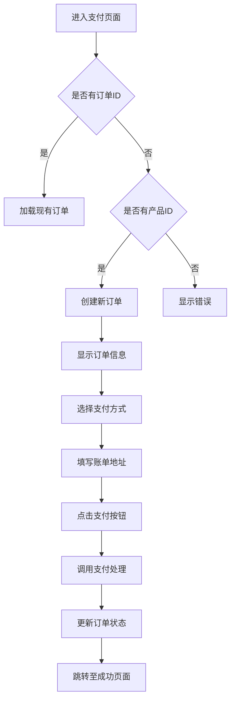
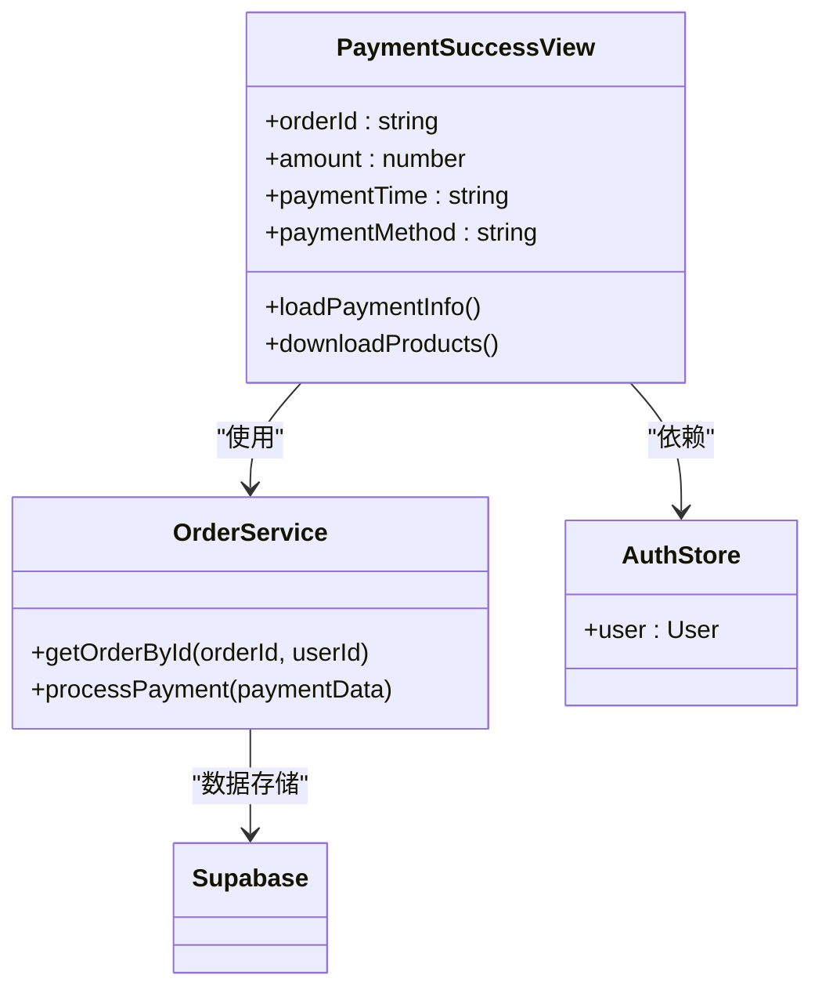
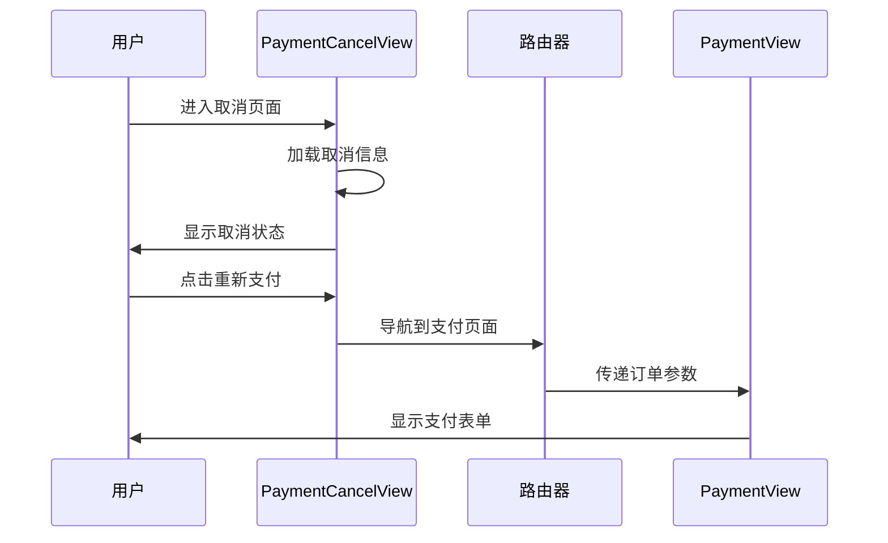
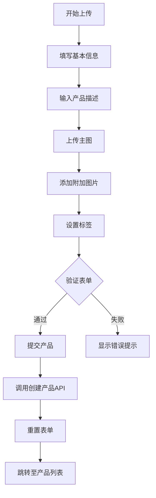
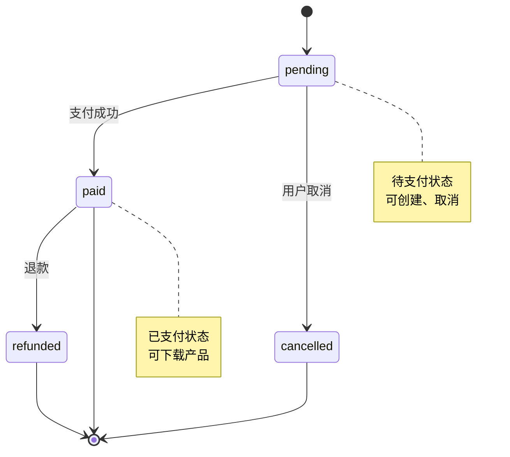
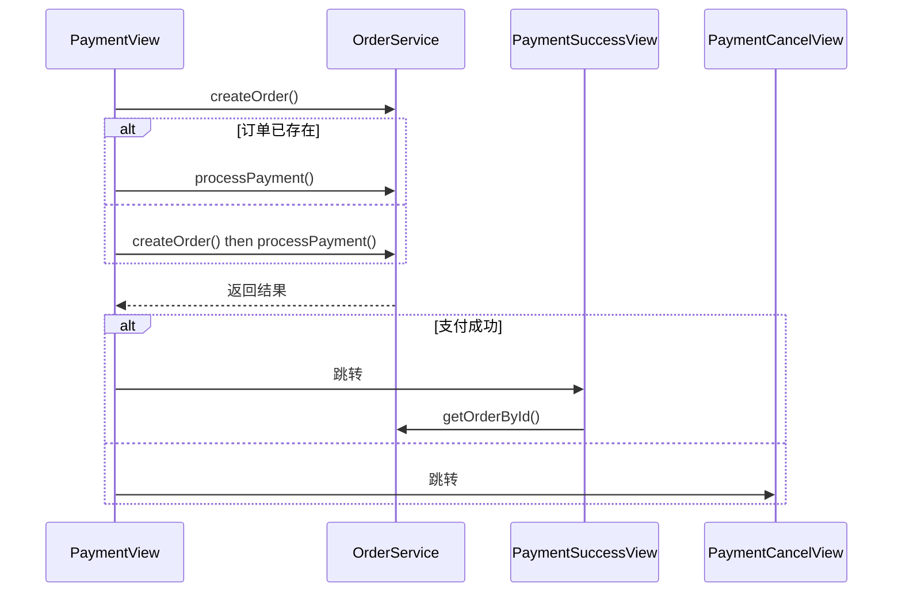
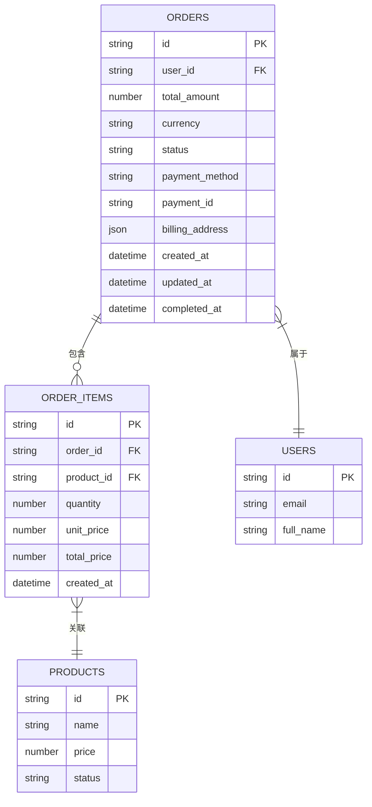
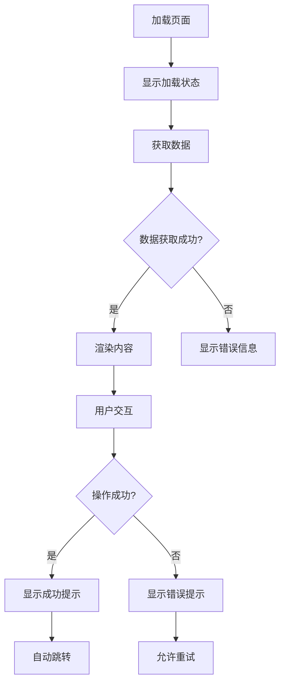

# 支付相关视图

<cite>
**本文档中引用的文件**   
- [PaymentView.vue](file://src/views/PaymentView.vue)
- [PaymentSuccessView.vue](file://src/views/PaymentSuccessView.vue)
- [PaymentCancelView.vue](file://src/views/PaymentCancelView.vue)
- [ProductUploadView.vue](file://src/views/ProductUploadView.vue)
- [orderService.ts](file://src/services/orderService.ts)
- [index.ts](file://src/types/index.ts)
</cite>

## 目录
1. [支付流程概览](#支付流程概览)
2. [支付信息确认与第三方支付集成](#支付信息确认与第三方支付集成)
3. [支付成功页面展示](#支付成功页面展示)
4. [支付取消处理逻辑](#支付取消处理逻辑)
5. [产品上传表单实现](#产品上传表单实现)
6. [订单服务与状态管理](#订单服务与状态管理)
7. [支付生命周期事件处理](#支付生命周期事件处理)
8. [数据一致性维护](#数据一致性维护)
9. [用户体验优化](#用户体验优化)

## 支付流程概览

本系统实现了完整的支付流程，包含支付确认、支付成功、支付取消和产品上传四个核心视图组件。这些组件协同工作，确保交易流程的可靠性与用户体验的流畅性。

支付流程从`PaymentView`开始，用户在此页面确认订单信息、选择支付方式并填写账单地址。支付成功后跳转至`PaymentSuccessView`，展示订单详情并提供后续操作引导。若用户取消支付，则进入`PaymentCancelView`，提供重新支付或继续购物的选项。同时，`ProductUploadView`为商家提供了产品上传功能，完善了整个交易生态。

**Section sources**
- [PaymentView.vue](file://src/views/PaymentView.vue#L1-L683)
- [PaymentSuccessView.vue](file://src/views/PaymentSuccessView.vue#L1-L445)
- [PaymentCancelView.vue](file://src/views/PaymentCancelView.vue#L1-L383)
- [ProductUploadView.vue](file://src/views/ProductUploadView.vue#L1-L550)

## 支付信息确认与第三方支付集成

`PaymentView`组件负责支付信息的确认和第三方支付网关的集成。该视图提供了完整的订单信息展示、多种支付方式选择和账单地址填写功能。

**Diagram sources**
- [PaymentView.vue](file://src/views/PaymentView.vue#L1-L683)
- [orderService.ts](file://src/services/orderService.ts#L16-L589)

**Section sources**
- [PaymentView.vue](file://src/views/PaymentView.vue#L1-L683)
- [orderService.ts](file://src/services/orderService.ts#L16-L589)

## 支付成功页面展示

`PaymentSuccessView`组件负责展示支付成功后的页面内容，包括订单信息呈现和后续操作引导。该视图通过清晰的视觉设计和明确的操作指引，提升用户满意度。

**Diagram sources**
- [PaymentSuccessView.vue](file://src/views/PaymentSuccessView.vue#L1-L445)
- [orderService.ts](file://src/services/orderService.ts#L16-L589)

**Section sources**
- [PaymentSuccessView.vue](file://src/views/PaymentSuccessView.vue#L1-L445)

## 支付取消处理逻辑

`PaymentCancelView`组件处理支付取消的逻辑，提供用户挽回策略。该视图不仅告知用户支付已被取消，还提供重新支付的便捷入口，减少用户流失。

**Diagram sources**
- [PaymentCancelView.vue](file://src/views/PaymentCancelView.vue#L1-L383)
- [PaymentView.vue](file://src/views/PaymentView.vue#L1-L683)

**Section sources**
- [PaymentCancelView.vue](file://src/views/PaymentCancelView.vue#L1-L383)

## 产品上传表单实现

`ProductUploadView`组件实现了产品上传的完整表单流程，包括文件验证与提交处理。该视图为商家提供了友好的产品发布界面，支持图片上传、标签管理和内容编辑。

**Diagram sources**
- [ProductUploadView.vue](file://src/views/ProductUploadView.vue#L1-L550)
- [products.ts](file://src/stores/products.ts)

**Section sources**
- [ProductUploadView.vue](file://src/views/ProductUploadView.vue#L1-L550)

## 订单服务与状态管理

`orderService`提供了完整的订单管理功能，与支付状态管理紧密集成。该服务定义了订单的多种状态，确保交易流程的可靠性和数据的一致性。

**Diagram sources**
- [orderService.ts](file://src/services/orderService.ts#L16-L589)
- [index.ts](file://src/types/index.ts#L116)

**Section sources**
- [orderService.ts](file://src/services/orderService.ts#L16-L589)
- [index.ts](file://src/types/index.ts#L116)

## 支付生命周期事件处理

各视图组件协同处理支付生命周期的各个事件，确保流程的完整性和用户体验的连贯性。从支付开始到结束，系统通过状态变更和页面跳转实现无缝衔接。

**Diagram sources**
- [PaymentView.vue](file://src/views/PaymentView.vue#L1-L683)
- [PaymentSuccessView.vue](file://src/views/PaymentSuccessView.vue#L1-L445)
- [PaymentCancelView.vue](file://src/views/PaymentCancelView.vue#L1-L383)
- [orderService.ts](file://src/services/orderService.ts#L16-L589)

**Section sources**
- [PaymentView.vue](file://src/views/PaymentView.vue#L1-L683)
- [PaymentSuccessView.vue](file://src/views/PaymentSuccessView.vue#L1-L445)
- [PaymentCancelView.vue](file://src/views/PaymentCancelView.vue#L1-L383)
- [orderService.ts](file://src/services/orderService.ts#L16-L589)

## 数据一致性维护

系统通过`orderService`和数据库约束确保支付流程中的数据一致性。所有订单操作都经过严格的验证和事务处理，防止数据不一致的情况发生。

**Diagram sources**
- [orderService.ts](file://src/services/orderService.ts#L16-L589)
- [supabase/migrations/20241224000001_initial_schema.sql](file://supabase/migrations/20241224000001_initial_schema.sql)

**Section sources**
- [orderService.ts](file://src/services/orderService.ts#L16-L589)

## 用户体验优化

各支付相关视图均注重用户体验的优化，通过直观的界面设计、清晰的操作指引和及时的反馈机制，确保用户能够顺利完成交易流程。

**Diagram sources**
- [PaymentView.vue](file://src/views/PaymentView.vue#L1-L683)
- [PaymentSuccessView.vue](file://src/views/PaymentSuccessView.vue#L1-L445)
- [PaymentCancelView.vue](file://src/views/PaymentCancelView.vue#L1-L383)

**Section sources**
- [PaymentView.vue](file://src/views/PaymentView.vue#L1-L683)
- [PaymentSuccessView.vue](file://src/views/PaymentSuccessView.vue#L1-L445)
- [PaymentCancelView.vue](file://src/views/PaymentCancelView.vue#L1-L383)