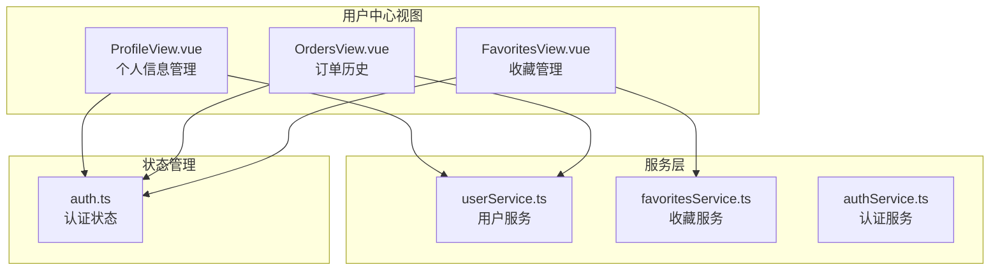
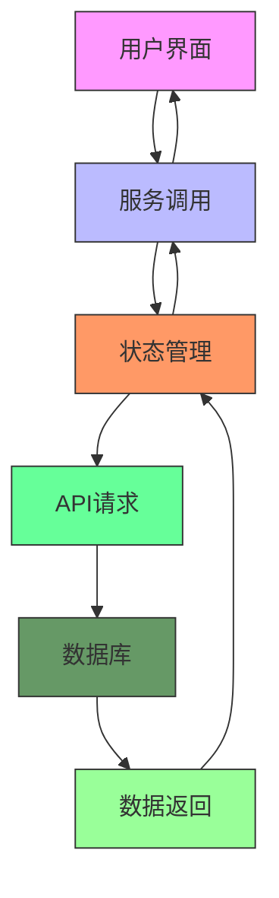
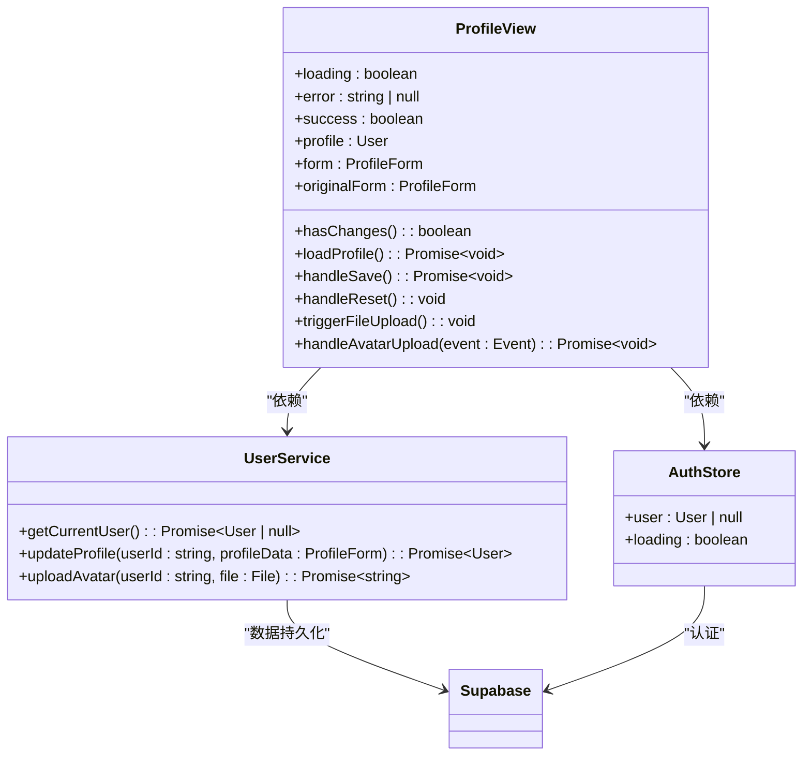
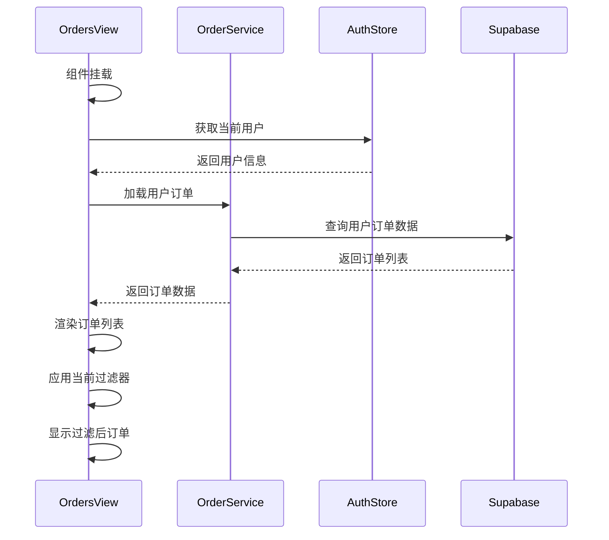
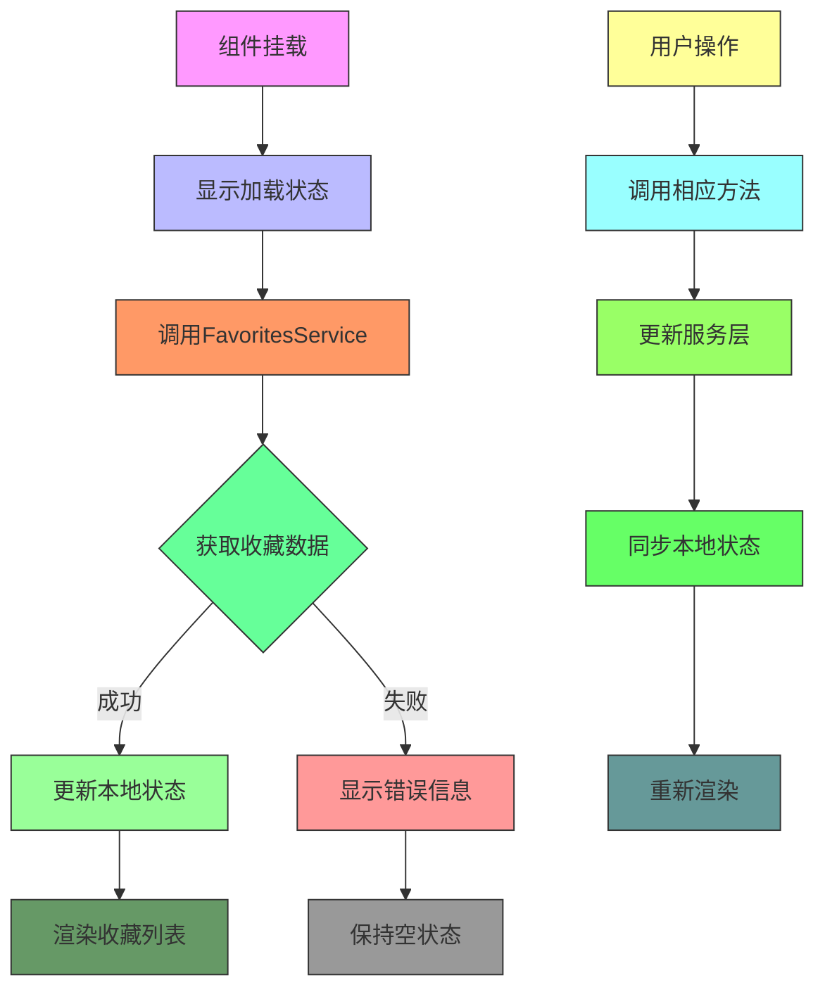
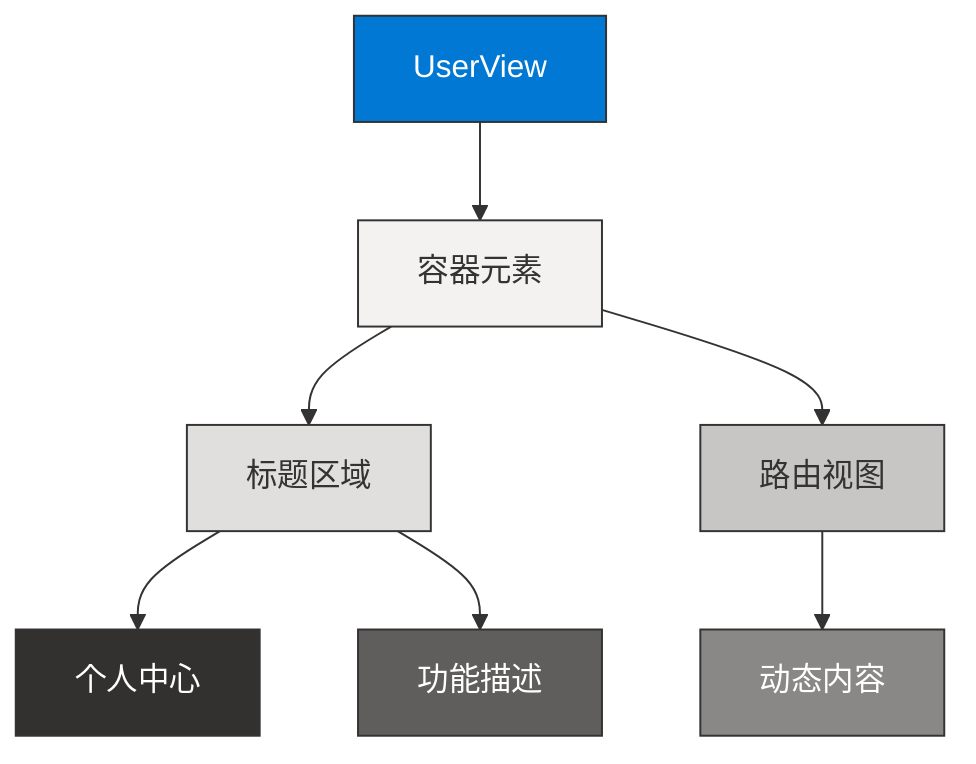
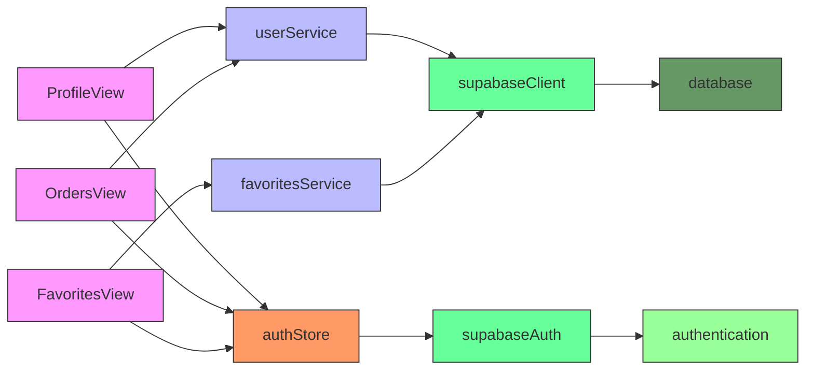

# 用户视图

<cite>
**本文档中引用的文件**   
- [ProfileView.vue](file://src/views/user/ProfileView.vue)
- [OrdersView.vue](file://src/views/user/OrdersView.vue)
- [FavoritesView.vue](file://src/views/user/FavoritesView.vue)
- [UserView.vue](file://src/views/UserView.vue)
- [userService.ts](file://src/services/userService.ts)
- [favoritesService.ts](file://src/services/favoritesService.ts)
- [auth.ts](file://src/stores/auth.ts)
</cite>

## 目录
1. [简介](#简介)
2. [项目结构](#项目结构)
3. [核心组件](#核心组件)
4. [架构概述](#架构概述)
5. [详细组件分析](#详细组件分析)
6. [依赖分析](#依赖分析)
7. [性能考虑](#性能考虑)
8. [故障排除指南](#故障排除指南)
9. [结论](#结论)

## 简介
本文档深入解析用户中心相关视图的实现细节，涵盖ProfileView、OrdersView、FavoritesView和UserView四大核心视图。详细说明各视图的功能实现、数据加载机制、状态管理及与其他服务的交互方式，为用户中心功能开发提供完整指导。

## 项目结构
用户中心相关视图位于`src/views/user`目录下，包含个人信息、订单历史和收藏管理三大功能模块。这些视图通过`userService`和`favoritesService`等服务与后端进行数据交互，并利用`auth` store管理用户认证状态。

**图示来源**
- [ProfileView.vue](file://src/views/user/ProfileView.vue)
- [OrdersView.vue](file://src/views/user/OrdersView.vue)
- [FavoritesView.vue](file://src/views/user/FavoritesView.vue)
- [userService.ts](file://src/services/userService.ts)
- [favoritesService.ts](file://src/services/favoritesService.ts)
- [auth.ts](file://src/stores/auth.ts)

**章节来源**
- [src/views/user](file://src/views/user)

## 核心组件
用户中心包含四个核心组件：ProfileView负责个人信息展示与编辑，OrdersView管理订单历史，FavoritesView处理收藏功能，UserView作为整体布局容器。这些组件通过统一的服务层和状态管理机制实现数据的一致性和用户体验的连贯性。

**章节来源**
- [ProfileView.vue](file://src/views/user/ProfileView.vue)
- [OrdersView.vue](file://src/views/user/OrdersView.vue)
- [FavoritesView.vue](file://src/views/user/FavoritesView.vue)
- [UserView.vue](file://src/views/UserView.vue)

## 架构概述
用户中心采用分层架构设计，视图层负责UI展示和用户交互，服务层处理业务逻辑和数据持久化，状态管理层维护用户认证和全局状态。这种架构确保了关注点分离，提高了代码的可维护性和可测试性。

**图示来源**
- [userService.ts](file://src/services/userService.ts)
- [favoritesService.ts](file://src/services/favoritesService.ts)
- [auth.ts](file://src/stores/auth.ts)

## 详细组件分析

### ProfileView分析
ProfileView组件实现个人信息的展示、编辑和持久化功能。通过集成userService服务，实现用户资料的加载和更新。

#### 个人信息管理

**图示来源**
- [ProfileView.vue](file://src/views/user/ProfileView.vue#L1-L554)
- [userService.ts](file://src/services/userService.ts#L1-L288)

**章节来源**
- [ProfileView.vue](file://src/views/user/ProfileView.vue#L1-L554)
- [userService.ts](file://src/services/userService.ts#L1-L288)

### OrdersView分析
OrdersView组件负责订单历史的列表渲染、状态追踪和详情查看功能。通过订单过滤机制，用户可以按不同状态查看订单。

#### 订单管理流程

**图示来源**
- [OrdersView.vue](file://src/views/user/OrdersView.vue#L1-L743)
- [orderService.ts](file://src/services/orderService.ts#L1-L200)

**章节来源**
- [OrdersView.vue](file://src/views/user/OrdersView.vue#L1-L743)

### FavoritesView分析
FavoritesView组件实现收藏工具和产品的展示与实时同步逻辑。通过标签页设计，用户可以在工具和产品收藏之间切换。

#### 收藏同步机制

**图示来源**
- [FavoritesView.vue](file://src/views/user/FavoritesView.vue#L1-L617)
- [favoritesService.ts](file://src/services/favoritesService.ts#L1-L342)

**章节来源**
- [FavoritesView.vue](file://src/views/user/FavoritesView.vue#L1-L617)
- [favoritesService.ts](file://src/services/favoritesService.ts#L1-L342)

### UserView分析
UserView作为用户中心的布局容器，提供导航结构和权限控制基础。虽然当前为占位实现，但其设计为未来功能扩展提供了框架。

#### 布局容器结构

**图示来源**
- [UserView.vue](file://src/views/UserView.vue#L1-L41)

**章节来源**
- [UserView.vue](file://src/views/UserView.vue#L1-L41)

## 依赖分析
用户中心视图依赖于多个服务和状态管理模块，形成清晰的依赖关系网络。这些依赖确保了数据的一致性和功能的完整性。

**图示来源**
- [userService.ts](file://src/services/userService.ts)
- [favoritesService.ts](file://src/services/favoritesService.ts)
- [auth.ts](file://src/stores/auth.ts)
- [supabaseClient.ts](file://src/lib/supabaseClient.ts)

**章节来源**
- [src/services](file://src/services)
- [src/stores](file://src/stores)
- [src/lib](file://src/lib)

## 性能考虑
用户中心在性能方面采取了多项优化措施，包括数据懒加载、状态缓存和异步操作管理。这些措施确保了用户界面的响应性和流畅性。

- **数据加载**：采用异步加载机制，避免阻塞主线程
- **状态管理**：通过计算属性优化渲染性能
- **错误处理**：完善的错误捕获和用户反馈机制
- **资源管理**：头像上传时自动清理旧文件

## 故障排除指南
当用户中心功能出现问题时，可参考以下常见问题及解决方案：

**章节来源**
- [ProfileView.vue](file://src/views/user/ProfileView.vue)
- [OrdersView.vue](file://src/views/user/OrdersView.vue)
- [FavoritesView.vue](file://src/views/user/FavoritesView.vue)
- [userService.ts](file://src/services/userService.ts)
- [favoritesService.ts](file://src/services/favoritesService.ts)

### 常见问题
1. **无法加载用户资料**：检查网络连接和认证状态
2. **订单数据不更新**：确认用户ID正确并检查API权限
3. **收藏功能失效**：验证收藏服务是否正常运行
4. **头像上传失败**：检查文件大小和格式限制

## 结论
用户中心通过模块化设计实现了个人信息管理、订单跟踪和收藏功能。各视图组件通过统一的服务层和状态管理机制协同工作，为用户提供一致的体验。未来可在此基础上扩展更多个性化功能，如用户偏好设置、通知中心等。