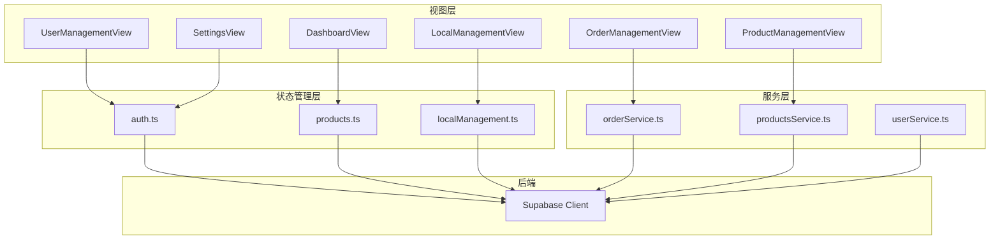
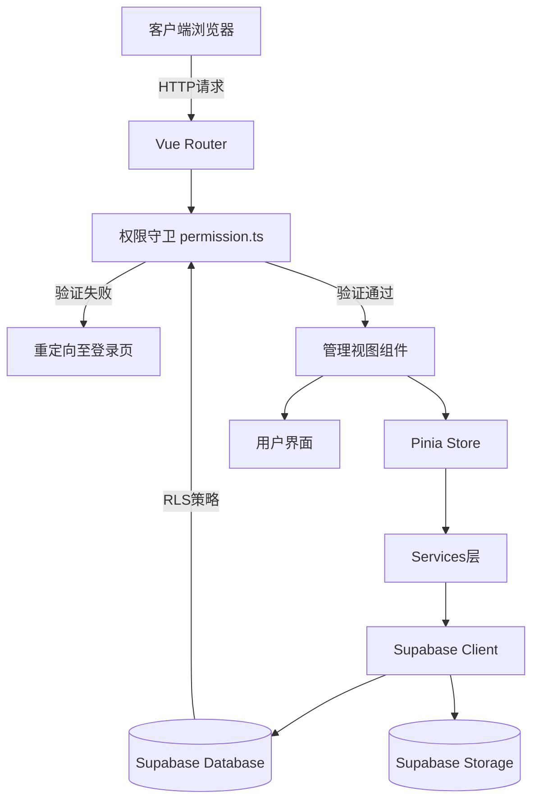
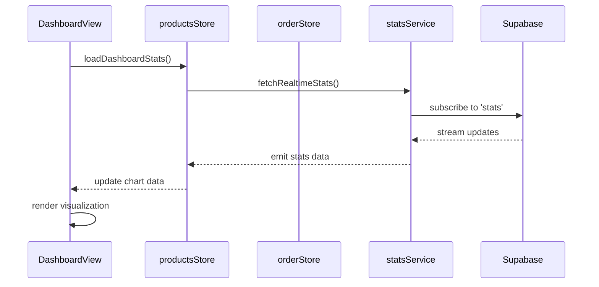
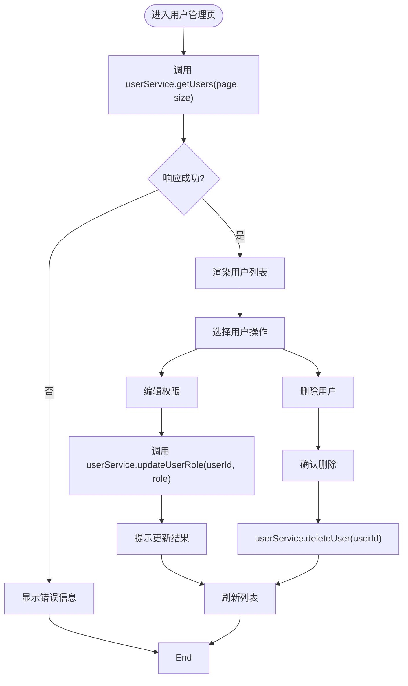
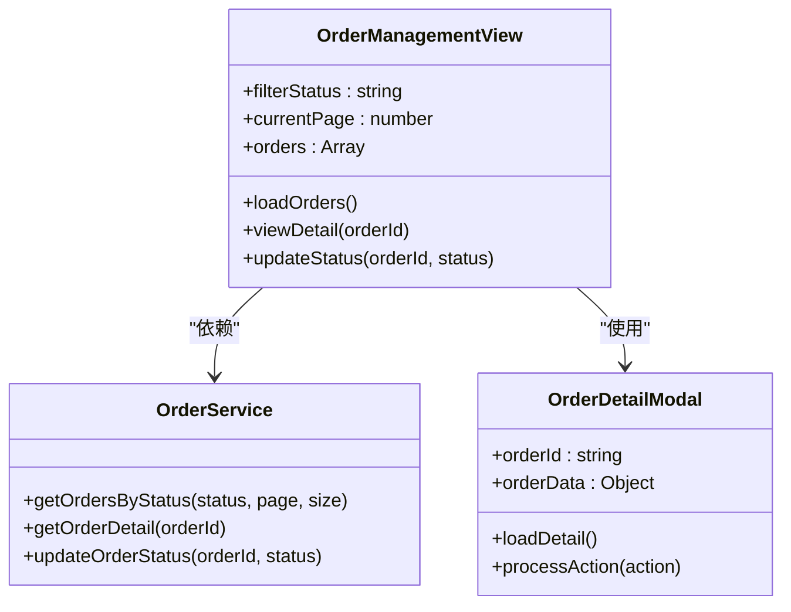
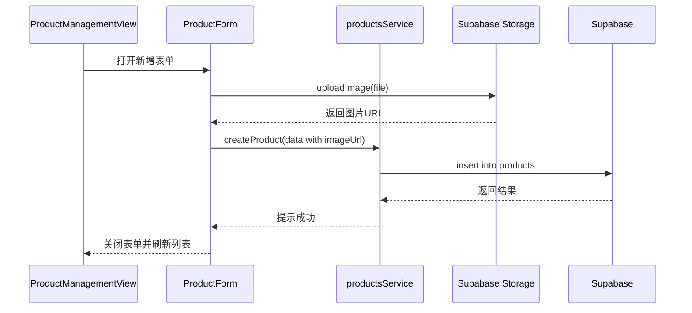
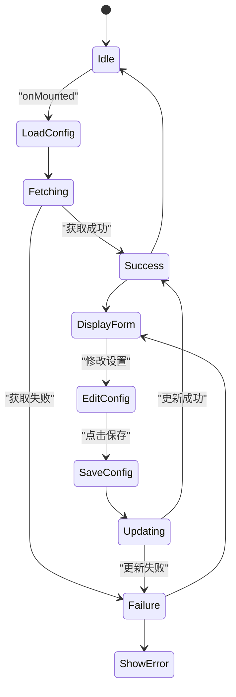
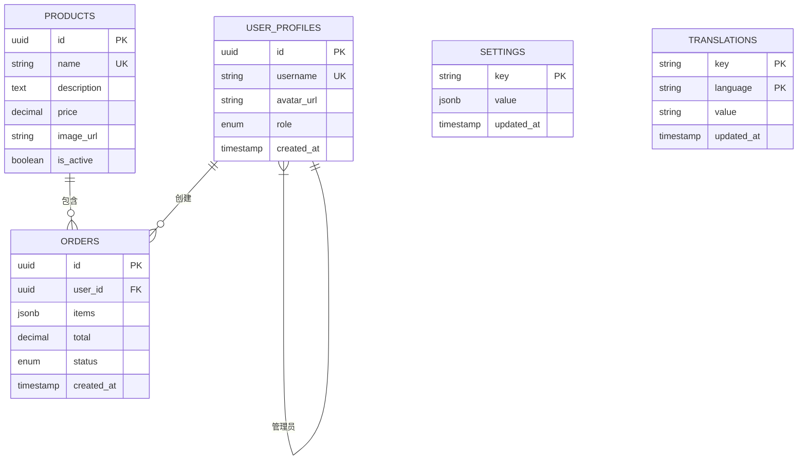

# 管理视图

<cite>
**本文档引用文件**  
- [DashboardView.vue](file://src/views/admin/DashboardView.vue)
- [UserManagementView.vue](file://src/views/admin/UserManagementView.vue)
- [OrderManagementView.vue](file://src/views/admin/OrderManagementView.vue)
- [ProductManagementView.vue](file://src/views/admin/ProductManagementView.vue)
- [LocalManagementView.vue](file://src/views/admin/LocalManagementView.vue)
- [SettingsView.vue](file://src/views/admin/SettingsView.vue)
- [auth.ts](file://src/stores/auth.ts)
- [products.ts](file://src/stores/products.ts)
- [localManagement.ts](file://src/stores/localManagement.ts)
- [orderService.ts](file://src/services/orderService.ts)
- [productsService.ts](file://src/services/productsService.ts)
- [userService.ts](file://src/services/userService.ts)
- [supabaseClient.ts](file://src/lib/supabaseClient.ts)
- [permission.ts](file://src/permission.ts)
</cite>

## 目录
1. [简介](#简介)
2. [项目结构](#项目结构)
3. [核心组件](#核心组件)
4. [架构概览](#架构概览)
5. [详细组件分析](#详细组件分析)
6. [依赖分析](#依赖分析)
7. [性能考虑](#性能考虑)
8. [故障排除指南](#故障排除指南)
9. [结论](#结论)

## 简介
本文档深入解析管理后台各视图组件的实现机制，涵盖数据可视化、用户管理、订单处理、产品操作、本地化内容及系统配置等关键功能。结合Pinia状态管理与Supabase后端交互，全面展示管理员视图的安全访问控制与数据持久化方案。

## 项目结构
管理视图组件集中于`src/views/admin`目录下，通过Pinia状态库与Supabase服务层进行数据交互。权限控制由`permission.ts`中的路由守卫统一管理，确保仅授权用户可访问敏感功能。



**图示来源**  
- [DashboardView.vue](file://src/views/admin/DashboardView.vue)
- [UserManagementView.vue](file://src/views/admin/UserManagementView.vue)
- [OrderManagementView.vue](file://src/views/admin/OrderManagementView.vue)
- [ProductManagementView.vue](file://src/views/admin/ProductManagementView.vue)
- [LocalManagementView.vue](file://src/views/admin/LocalManagementView.vue)
- [SettingsView.vue](file://src/views/admin/SettingsView.vue)
- [auth.ts](file://src/stores/auth.ts)
- [products.ts](file://src/stores/products.ts)
- [localManagement.ts](file://src/stores/localManagement.ts)
- [orderService.ts](file://src/services/orderService.ts)
- [productsService.ts](file://src/services/productsService.ts)
- [userService.ts](file://src/services/userService.ts)
- [supabaseClient.ts](file://src/lib/supabaseClient.ts)

**本节来源**  
- [src/views/admin](file://src/views/admin)
- [src/stores](file://src/stores)
- [src/services](file://src/services)

## 核心组件
各管理视图均采用组合式API设计，通过`setup()`函数初始化状态与逻辑。组件依赖Pinia Store获取全局状态，并调用对应services完成数据操作。所有视图均受权限守卫保护，确保仅管理员可访问。

**本节来源**  
- [DashboardView.vue](file://src/views/admin/DashboardView.vue#L1-L50)
- [UserManagementView.vue](file://src/views/admin/UserManagementView.vue#L1-L50)
- [OrderManagementView.vue](file://src/views/admin/OrderManagementView.vue#L1-L50)

## 架构概览
系统采用分层架构：视图层负责UI渲染，状态管理层维护响应式数据，服务层封装业务逻辑，Supabase提供后端支持。权限控制贯穿整个调用链，从路由守卫到数据库行级安全策略（RLS）形成多层防护。



**图示来源**  
- [permission.ts](file://src/permission.ts#L10-L90)
- [supabaseClient.ts](file://src/lib/supabaseClient.ts#L1-L20)
- [auth.ts](file://src/stores/auth.ts#L1-L30)

## 详细组件分析

### DashboardView 分析
该组件集成实时统计指标与数据可视化功能，通过监听Supabase实时通道获取动态数据，并利用ECharts或类似库渲染图表。数据源来自多个Store聚合结果。



**图示来源**  
- [DashboardView.vue](file://src/views/admin/DashboardView.vue#L50-L100)
- [products.ts](file://src/stores/products.ts#L20-L60)

**本节来源**  
- [DashboardView.vue](file://src/views/admin/DashboardView.vue#L1-L150)

### UserManagementView 分析
实现用户列表渲染、分页查询与权限编辑功能。通过`userService`获取分页数据，使用`<el-table>`或类似组件展示，并提供模态框进行权限修改。



**图示来源**  
- [UserManagementView.vue](file://src/views/admin/UserManagementView.vue#L60-L120)
- [userService.ts](file://src/services/userService.ts#L15-L80)

**本节来源**  
- [UserManagementView.vue](file://src/views/admin/UserManagementView.vue#L1-L200)
- [userService.ts](file://src/services/userService.ts#L1-L100)

### OrderManagementView 分析
支持订单状态过滤、详情查看与处理流程。通过`orderService`查询不同状态的订单，点击查看详情并执行发货、退款等操作。



**图示来源**  
- [OrderManagementView.vue](file://src/views/admin/OrderManagementView.vue#L25-L90)
- [orderService.ts](file://src/services/orderService.ts#L10-L70)
- [UserDetailModal.vue](file://src/components/admin/UserDetailModal.vue#L1-L40)

**本节来源**  
- [OrderManagementView.vue](file://src/views/admin/OrderManagementView.vue#L1-L180)
- [orderService.ts](file://src/services/orderService.ts#L1-L80)

### ProductManagementView 分析
实现产品CRUD操作与图片上传集成。利用`ProductForm.vue`组件处理新增与编辑，通过Supabase Storage上传图片，并更新products表。



**图示来源**  
- [ProductManagementView.vue](file://src/views/admin/ProductManagementView.vue#L30-L80)
- [ProductForm.vue](file://src/components/admin/ToolForm.vue#L1-L50)
- [productsService.ts](file://src/services/productsService.ts#L20-L60)

**本节来源**  
- [ProductManagementView.vue](file://src/views/admin/ProductManagementView.vue#L1-L160)
- [productsService.ts](file://src/services/productsService.ts#L1-L70)

### LocalManagementView 分析
负责本地化内容管理，通过`localManagement.ts` Store维护多语言键值对，支持动态添加、编辑和删除翻译项。

```mermaid
flowchart LR
A[LocalManagementView] --> B[加载语言包]
B --> C[显示翻译表格]
C --> D[编辑单元格]
D --> E[保存变更]
E --> F[调用 updateTranslation(key, lang, value)]
F --> G[持久化到数据库]
G --> H[更新Store状态]
H --> C
```

**图示来源**  
- [LocalManagementView.vue](file://src/views/admin/LocalManagementView.vue#L15-L50)
- [localManagement.ts](file://src/stores/localManagement.ts#L10-L40)

**本节来源**  
- [LocalManagementView.vue](file://src/views/admin/LocalManagementView.vue#L1-L100)
- [localManagement.ts](file://src/stores/localManagement.ts#L1-L50)

### SettingsView 分析
实现系统配置项的持久化方案，配置数据存储于数据库settings表中，通过`SettingsView`读取与更新，变更后实时同步至应用状态。



**图示来源**  
- [SettingsView.vue](file://src/views/admin/SettingsView.vue#L20-L70)
- [databaseService.ts](file://src/services/databaseService.ts#L15-L50)

**本节来源**  
- [SettingsView.vue](file://src/views/admin/SettingsView.vue#L1-L120)
- [databaseService.ts](file://src/services/databaseService.ts#L1-L60)

## 依赖分析
各管理视图通过Pinia Store与Services层解耦，Services层统一调用Supabase Client进行数据交互。权限守卫`permission.ts`作为入口控制点，防止未授权访问。



**图示来源**  
- [supabase/migrations](file://supabase/migrations/20241224000001_initial_schema.sql)
- [types/database.ts](file://src/types/database.ts)

**本节来源**  
- [supabase/migrations](file://supabase/migrations)
- [types/database.ts](file://src/types/database.ts)

## 性能考虑
- 路由守卫中避免重复初始化，使用`initialized`标志位控制
- 数据加载采用懒加载与分页机制，减少初始请求负载
- 实时订阅仅在必要视图激活时建立，离开时自动清理
- 图片资源通过Supabase Storage CDN分发，提升加载速度

## 故障排除指南
常见问题包括权限拒绝、数据加载失败、图片上传异常等。应检查：
1. 用户角色是否为admin或super_admin
2. Supabase RLS策略是否正确配置
3. Storage bucket权限是否开放
4. 网络连接是否正常
5. 浏览器控制台是否有JavaScript错误

**本节来源**  
- [auth.ts](file://src/stores/auth.ts#L100-L150)
- [errorHandler.ts](file://src/utils/errorHandler.ts#L1-L30)
- [supabase_deploy_fixed.sql](file://scripts/database/supabase_deploy_fixed.sql)

## 结论
管理视图通过Pinia状态管理、Services服务封装与Supabase后端集成，实现了高内聚低耦合的架构设计。权限守卫与RLS策略共同保障系统安全，为管理员功能开发提供了可扩展、易维护的完整参考方案。