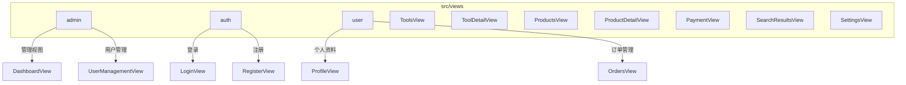
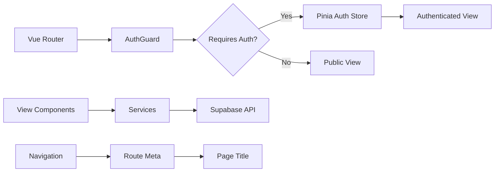
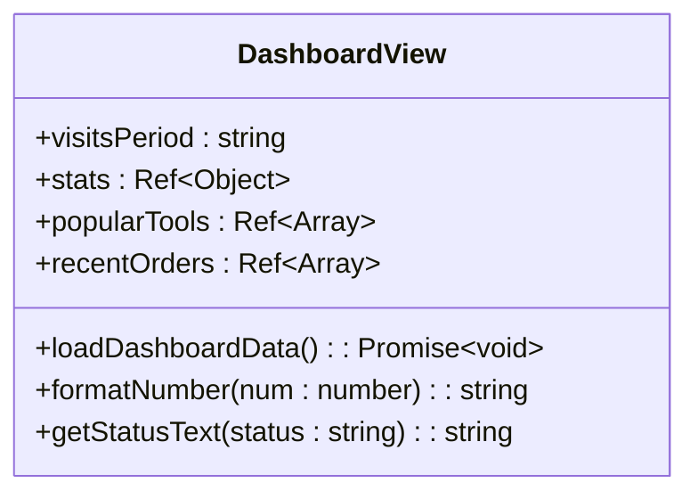
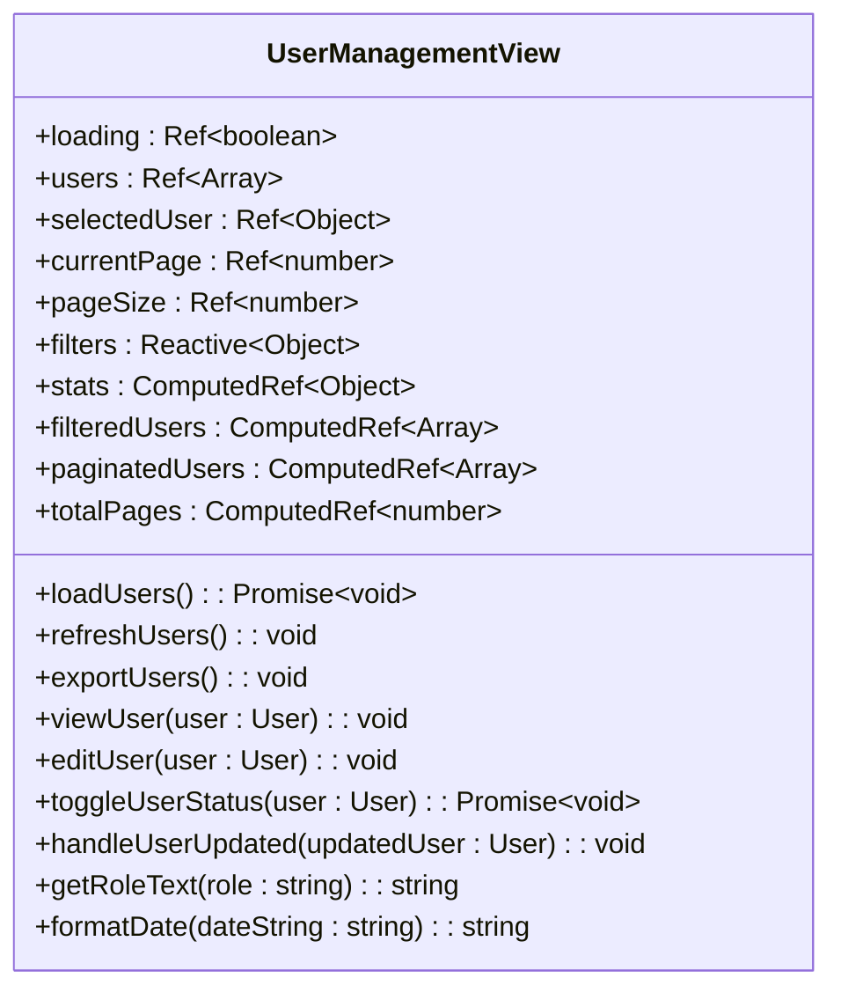
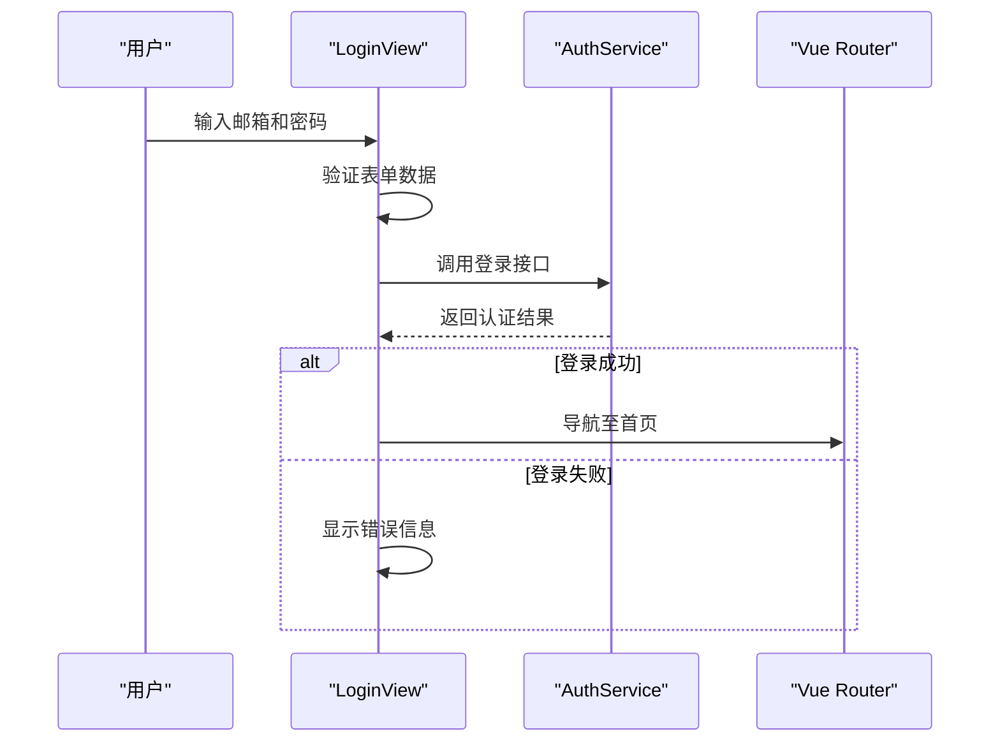
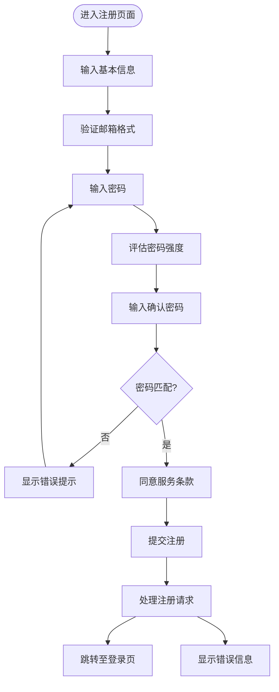
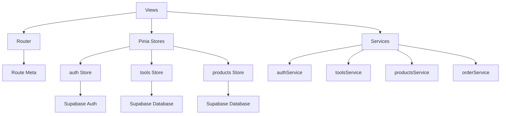

# 视图层结构

<cite>
**本文档中引用的文件**  
- [DashboardView.vue](file://src/views/admin/DashboardView.vue)
- [UserManagementView.vue](file://src/views/admin/UserManagementView.vue)
- [LoginView.vue](file://src/views/auth/LoginView.vue)
- [RegisterView.vue](file://src/views/auth/RegisterView.vue)
- [ProfileView.vue](file://src/views/user/ProfileView.vue)
- [OrdersView.vue](file://src/views/user/OrdersView.vue)
- [ToolsView.vue](file://src/views/ToolsView.vue)
- [ToolDetailView.vue](file://src/views/ToolDetailView.vue)
- [ProductsView.vue](file://src/views/ProductsView.vue)
- [ProductDetailView.vue](file://src/views/ProductDetailView.vue)
- [PaymentView.vue](file://src/views/PaymentView.vue)
- [PaymentSuccessView.vue](file://src/views/PaymentSuccessView.vue)
- [PaymentCancelView.vue](file://src/views/PaymentCancelView.vue)
- [SearchResultsView.vue](file://src/views/SearchResultsView.vue)
- [SettingsView.vue](file://src/views/admin/SettingsView.vue)
- [SimpleSettingsView.vue](file://src/views/SimpleSettingsView.vue)
- [TestSettingsView.vue](file://src/views/TestSettingsView.vue)
- [router/index.ts](file://src/router/index.ts)
- [auth.ts](file://src/stores/auth.ts)
- [permission.ts](file://src/permission.ts)
</cite>

## 目录
1. [介绍](#介绍)
2. [项目结构](#项目结构)
3. [核心组件](#核心组件)
4. [架构概览](#架构概览)
5. [详细组件分析](#详细组件分析)
6. [依赖分析](#依赖分析)
7. [性能考虑](#性能考虑)
8. [故障排除指南](#故障排除指南)
9. [结论](#结论)

## 介绍
本文档全面解析 `src/views` 目录下的页面视图结构，涵盖管理视图、认证流程、用户中心、工具导航、产品展示、支付流程、搜索结果及系统设置等核心功能模块。结合 Vue Router 路由配置与 Pinia 状态管理机制，阐明各视图的访问路径、导航守卫应用及状态交互模式，为开发者提供清晰的页面开发范式。

## 项目结构

**图示来源**  
- [DashboardView.vue](file://src/views/admin/DashboardView.vue)
- [UserManagementView.vue](file://src/views/admin/UserManagementView.vue)
- [LoginView.vue](file://src/views/auth/LoginView.vue)
- [RegisterView.vue](file://src/views/auth/RegisterView.vue)
- [ProfileView.vue](file://src/views/user/ProfileView.vue)
- [OrdersView.vue](file://src/views/user/OrdersView.vue)

## 核心组件

本文档深入分析 `src/views` 目录下各子模块的核心视图组件，包括 admin 子目录中的管理视图、auth 子目录中的认证流程视图、user 子目录中的用户中心视图，以及 ToolsView、ProductsView、PaymentView 等功能视图。这些组件构成了系统的用户界面核心，通过 Vue 3 的组合式 API 实现响应式数据绑定与逻辑封装。

**组件来源**  
- [DashboardView.vue](file://src/views/admin/DashboardView.vue)
- [UserManagementView.vue](file://src/views/admin/UserManagementView.vue)
- [LoginView.vue](file://src/views/auth/LoginView.vue)
- [RegisterView.vue](file://src/views/auth/RegisterView.vue)
- [ProfileView.vue](file://src/views/user/ProfileView.vue)
- [OrdersView.vue](file://src/views/user/OrdersView.vue)
- [ToolsView.vue](file://src/views/ToolsView.vue)
- [ProductDetailView.vue](file://src/views/ProductDetailView.vue)
- [PaymentView.vue](file://src/views/PaymentView.vue)
- [SearchResultsView.vue](file://src/views/SearchResultsView.vue)

## 架构概览

**图示来源**  
- [router/index.ts](file://src/router/index.ts)
- [auth.ts](file://src/stores/auth.ts)
- [permission.ts](file://src/permission.ts)

## 详细组件分析

### 管理视图分析

#### DashboardView 分析
`DashboardView.vue` 作为管理后台的仪表盘，采用网格布局展示系统关键指标，包括工具总数、产品总数、用户总数和总收入等统计卡片。通过 `stats` 响应式对象管理数据状态，结合 `loadDashboardData` 方法实现数据加载逻辑。视图包含访问趋势、热门工具、最新订单和系统状态四个主要模块，使用 `visitsPeriod` 控制器实现时间范围筛选功能。

**图示来源**  
- [DashboardView.vue](file://src/views/admin/DashboardView.vue#L1-L562)

#### UserManagementView 分析
`UserManagementView.vue` 实现用户管理功能，提供用户列表展示、筛选、排序和分页能力。通过 `filters` 响应式对象管理搜索、角色、状态和排序条件，利用 `computed` 属性实现数据过滤与排序逻辑。视图包含统计卡片、筛选区域、用户表格和分页控件，支持查看、编辑和启用/禁用用户操作。`UserDetailModal` 组件用于展示用户详情信息。

**图示来源**  
- [UserManagementView.vue](file://src/views/admin/UserManagementView.vue#L1-L799)

### 认证流程视图分析

#### LoginView 分析
`LoginView.vue` 实现用户登录功能，包含邮箱、密码输入字段及"记住我"选项。通过 `form` 响应式对象管理表单数据，`showPassword` 控制器实现密码可见性切换。视图集成表单验证机制，使用 `required` 属性确保必填字段，并通过 `loading` 状态防止重复提交。错误信息通过 `error` 变量显示，登录成功后重定向至首页。

**图示来源**  
- [LoginView.vue](file://src/views/auth/LoginView.vue#L1-L325)

#### RegisterView 分析
`RegisterView.vue` 实现用户注册功能，包含姓名、邮箱、密码、确认密码等字段及服务条款同意选项。视图集成密码强度检测机制，通过 `passwordStrength` 计算属性评估密码安全性，并提供视觉反馈。表单验证确保密码匹配、长度要求及条款同意，`isFormValid` 计算属性控制提交按钮状态。注册成功后重定向至登录页面。

**图示来源**  
- [RegisterView.vue](file://src/views/auth/RegisterView.vue#L1-L441)

### 用户中心视图分析

#### ProfileView 分析
`ProfileView.vue` 作为用户个人资料页面，集成权限控制与个性化数据加载策略。通过 Pinia 的 `auth` store 获取当前用户信息，利用 `isAuthenticated` 计算属性确保仅认证用户可访问。视图从 Supabase 数据库加载用户详细资料，包括头像、用户名、角色等信息，并提供编辑功能。数据加载在组件挂载时触发，确保用户信息及时更新。

**组件来源**  
- [ProfileView.vue](file://src/views/user/ProfileView.vue)

#### OrdersView 分析
`OrdersView.vue` 实现用户订单管理功能，展示用户的购买历史记录。视图通过 `orderService` 服务获取订单数据，结合分页机制处理大量订单记录。每个订单项显示订单号、商品信息、金额、状态等关键信息，并提供订单详情查看功能。状态流转通过颜色编码和文本标签清晰呈现，支持按时间范围筛选订单。

**组件来源**  
- [OrdersView.vue](file://src/views/user/OrdersView.vue)

### 工具与产品视图分析

#### ToolsView 与 ToolDetailView 分析
`ToolsView.vue` 作为工具导航主页面，展示分类工具列表，支持搜索和筛选功能。`ToolDetailView.vue` 提供工具详情展示，包含工具描述、使用教程、评分和评论等信息。两个视图通过路由参数 `id` 关联，实现从列表到详情的无缝导航。工具数据通过 `toolsService` 统一管理，确保数据一致性。

**组件来源**  
- [ToolsView.vue](file://src/views/ToolsView.vue)
- [ToolDetailView.vue](file://src/views/ToolDetailView.vue)

#### ProductsView 与 ProductDetailView 分析
`ProductsView.vue` 展示平台产品列表，集成分类导航和搜索功能。`ProductDetailView.vue` 提供产品详情页面，包含购买流程集成。视图通过 `productsService` 获取产品数据，结合 `favoritesService` 实现收藏功能。购买按钮触发导航至 `PaymentView`，完成交易流程。

**组件来源**  
- [ProductsView.vue](file://src/views/ProductsView.vue)
- [ProductDetailView.vue](file://src/views/ProductDetailView.vue)

### 支付视图分析
`PaymentView.vue`、`PaymentSuccessView.vue` 和 `PaymentCancelView.vue` 构成完整的支付流程。`PaymentView` 处理支付初始化，集成第三方支付对接；`PaymentSuccessView` 显示支付成功确认信息；`PaymentCancelView` 处理支付取消场景。支付状态通过路由参数传递，确保状态管理的可靠性。

**组件来源**  
- [PaymentView.vue](file://src/views/PaymentView.vue)
- [PaymentSuccessView.vue](file://src/views/PaymentSuccessView.vue)
- [PaymentCancelView.vue](file://src/views/PaymentCancelView.vue)

### 搜索与设置视图分析

#### SearchResultsView 分析
`SearchResultsView.vue` 实现搜索结果渲染与分页处理。视图接收查询参数，通过 `searchService` 执行全文搜索，返回匹配的工具和产品结果。结果按相关性排序，支持分页浏览。搜索状态通过 URL 参数持久化，允许用户分享搜索结果链接。

**组件来源**  
- [SearchResultsView.vue](file://src/views/SearchResultsView.vue)

#### SettingsView 系列分析
`SettingsView.vue`、`SimpleSettingsView.vue` 和 `TestSettingsView.vue` 提供不同层级的配置管理功能。管理后台的 `SettingsView` 包含系统级配置，普通用户的 `SimpleSettingsView` 提供个性化设置。配置数据通过 `localStorageService` 或数据库持久化，确保用户偏好设置的跨会话保留。

**组件来源**  
- [SettingsView.vue](file://src/views/admin/SettingsView.vue)
- [SimpleSettingsView.vue](file://src/views/SimpleSettingsView.vue)
- [TestSettingsView.vue](file://src/views/TestSettingsView.vue)

## 依赖分析

**图示来源**  
- [router/index.ts](file://src/router/index.ts)
- [auth.ts](file://src/stores/auth.ts)
- [tools.ts](file://src/stores/tools.ts)
- [products.ts](file://src/stores/products.ts)
- [services/authService.ts](file://src/services/authService.ts)
- [services/toolsService.ts](file://src/services/toolsService.ts)
- [services/productsService.ts](file://src/services/productsService.ts)
- [services/orderService.ts](file://src/services/orderService.ts)

## 性能考虑
视图层采用懒加载策略，通过动态导入（`() => import()`）实现路由组件的按需加载，优化首屏加载性能。数据获取采用分页机制，避免一次性加载大量数据。状态管理通过 Pinia 实现，确保跨组件数据共享的高效性。对于复杂列表渲染，建议使用虚拟滚动技术进一步提升性能。

## 故障排除指南
常见问题包括路由守卫拦截、认证状态不同步、数据加载失败等。检查 `permission.ts` 中的导航守卫逻辑，确保 `requiresAuth` 和 `requiresAdmin` 元字段正确配置。验证 `authStore` 的初始化流程，确保用户状态正确同步。对于数据加载问题，检查相关服务的 API 调用和错误处理机制。

**问题来源**  
- [permission.ts](file://src/permission.ts#L1-L91)
- [auth.ts](file://src/stores/auth.ts#L1-L152)

## 结论
本文档全面解析了 `src/views` 目录下的页面视图结构，阐明了各功能模块的设计理念与实现机制。通过 Vue Router 的路由配置与 Pinia 状态管理的深度集成，系统实现了清晰的导航结构与可靠的状态管理。开发者可基于此文档理解现有代码架构，遵循统一的开发范式进行功能扩展与维护。