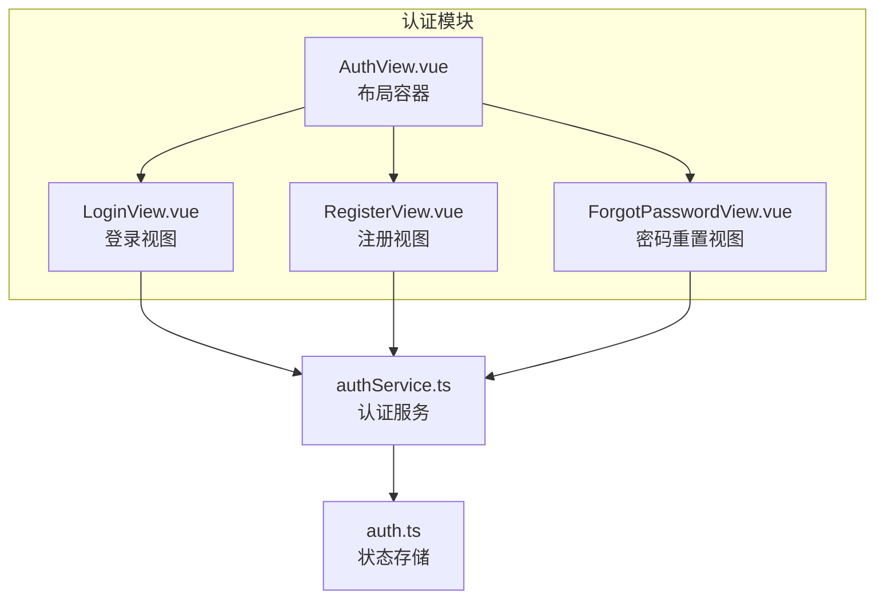
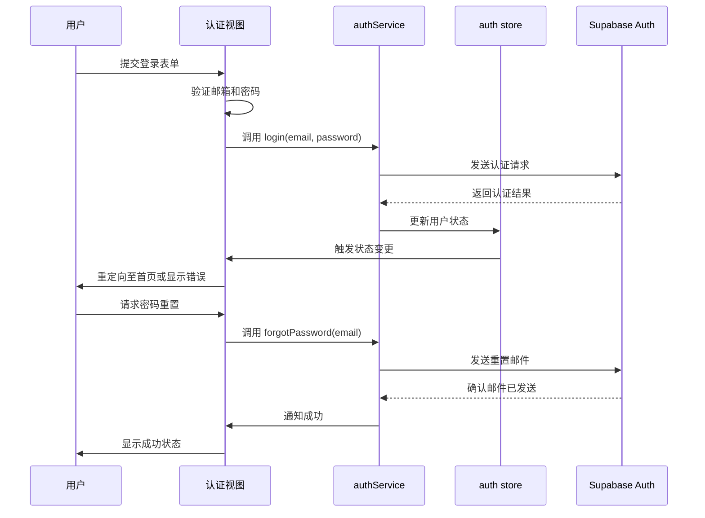
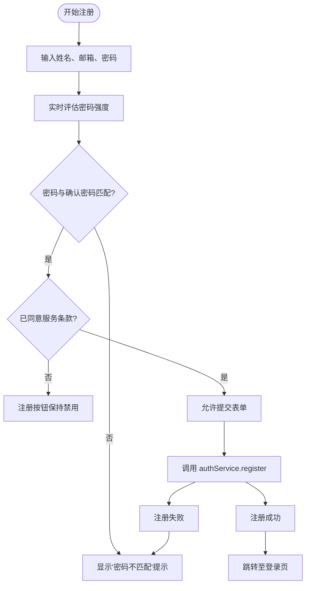
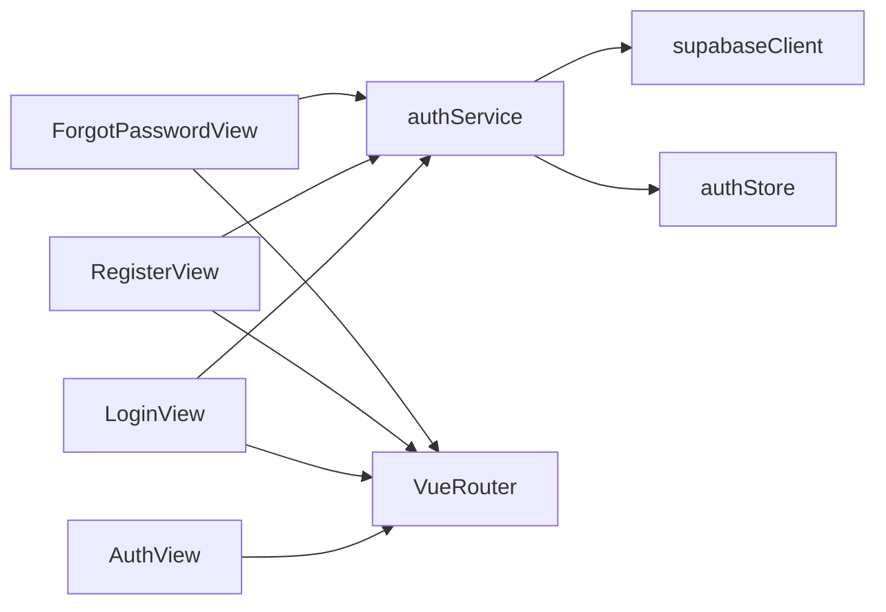

# 认证视图

<cite>
**本文档中引用的文件**  
- [LoginView.vue](file://src/views/auth/LoginView.vue)
- [RegisterView.vue](file://src/views/auth/RegisterView.vue)
- [ForgotPasswordView.vue](file://src/views/auth/ForgotPasswordView.vue)
- [AuthView.vue](file://src/views/AuthView.vue)
- [authService.ts](file://src/services/authService.ts)
- [auth.ts](file://src/stores/auth.ts)
</cite>

## 目录
1. [简介](#简介)
2. [项目结构](#项目结构)
3. [核心组件](#核心组件)
4. [架构概览](#架构概览)
5. [详细组件分析](#详细组件分析)
6. [依赖分析](#依赖分析)
7. [性能考虑](#性能考虑)
8. [故障排除指南](#故障排除指南)
9. [结论](#结论)

## 简介
本文档全面解析用户认证流程中的视图实现，涵盖登录、注册、忘记密码及认证布局容器的设计与交互逻辑。结合认证服务与状态管理机制，说明各视图如何处理认证状态流转、错误提示展示及成功后的重定向策略，为后续功能扩展提供开发范式。

## 项目结构
认证相关视图集中存放于 `src/views/auth` 目录下，包括登录、注册和密码重置三个主要功能页面。这些视图由统一的 `AuthView` 布局容器承载，并通过 Vue Router 实现路由切换。认证逻辑由 `authService` 提供，状态由 Pinia 的 `auth` store 统一管理。

**图示来源**  
- [AuthView.vue](file://src/views/AuthView.vue#L1-L92)
- [LoginView.vue](file://src/views/auth/LoginView.vue#L1-L325)
- [RegisterView.vue](file://src/views/auth/RegisterView.vue#L1-L441)
- [ForgotPasswordView.vue](file://src/views/auth/ForgotPasswordView.vue#L1-L347)
- [authService.ts](file://src/services/authService.ts)

**本节来源**  
- [src/views/auth](file://src/views/auth)
- [src/views/AuthView.vue](file://src/views/AuthView.vue#L1-L92)

## 核心组件
认证视图系统由四个核心组件构成：`LoginView` 处理用户登录与表单验证；`RegisterView` 实现注册字段校验与密码强度评估；`ForgotPasswordView` 管理密码重置邮件发送与重发冷却机制；`AuthView` 作为顶层布局容器，提供统一的视觉风格与路由承载能力。所有组件通过 `authService` 与后端 Supabase Auth 集成，并响应 `auth store` 的状态变化。

**本节来源**  
- [LoginView.vue](file://src/views/auth/LoginView.vue#L1-L325)
- [RegisterView.vue](file://src/views/auth/RegisterView.vue#L1-L441)
- [ForgotPasswordView.vue](file://src/views/auth/ForgotPasswordView.vue#L1-L347)
- [AuthView.vue](file://src/views/AuthView.vue#L1-L92)

## 架构概览
整个认证流程采用分层架构设计，视图层负责用户交互与输入验证，服务层封装与 Supabase 的 API 通信，状态层统一管理认证状态。`AuthView` 作为根容器提供一致的 UI 框架，其内部通过 `<router-view />` 动态渲染具体认证页面。用户操作触发视图方法调用 `authService`，服务处理完成后更新 `auth store`，视图监听状态变化实现重定向或错误提示。

**图示来源**  
- [LoginView.vue](file://src/views/auth/LoginView.vue#L1-L325)
- [ForgotPasswordView.vue](file://src/views/auth/ForgotPasswordView.vue#L1-L347)
- [authService.ts](file://src/services/authService.ts)
- [auth.ts](file://src/stores/auth.ts)

## 详细组件分析

### LoginView 分析
`LoginView` 实现了完整的登录流程，包含邮箱与密码的必填验证、密码可见性切换功能以及记住我选项。表单提交时触发 `handleLogin` 方法，该方法通过 `authService` 进行认证，并处理加载状态、错误提示和成功后的路由跳转。错误信息通过响应式 `error` 变量在模板中条件渲染。

**本节来源**  
- [LoginView.vue](file://src/views/auth/LoginView.vue#L1-L325)

### RegisterView 分析
`RegisterView` 提供了注册所需的字段输入，包括姓名、邮箱、密码及确认密码。组件通过计算属性 `passwordStrength` 实时评估密码强度并可视化显示强度条。表单有效性由 `isFormValid` 计算属性控制，确保密码匹配、长度达标且用户同意条款。注册成功后自动跳转至登录页面。

**图示来源**  
- [RegisterView.vue](file://src/views/auth/RegisterView.vue#L1-L441)

**本节来源**  
- [RegisterView.vue](file://src/views/auth/RegisterView.vue#L1-L441)

### ForgotPasswordView 分析
`ForgotPasswordView` 实现了密码重置的核心功能。当用户提交邮箱后，视图切换至成功状态，显示邮件已发送的确认信息。组件内置 60 秒重发冷却机制，通过 `resendCooldown` 和定时器防止频繁请求。用户可选择返回登录或重新发送重置链接，提升了用户体验的完整性。

**本节来源**  
- [ForgotPasswordView.vue](file://src/views/auth/ForgotPasswordView.vue#L1-L347)

### AuthView 分析
`AuthView` 作为认证流程的根布局，提供了渐变背景、毛玻璃效果的容器和品牌标识。其核心作用是通过 `<router-view />` 动态渲染子路由对应的认证页面，实现统一的视觉框架。该组件不包含业务逻辑，专注于 UI 布局与品牌展示，支持响应式设计以适配移动设备。

**本节来源**  
- [AuthView.vue](file://src/views/AuthView.vue#L1-L92)

## 依赖分析
认证视图组件依赖于 `authService` 进行后端通信，依赖 `auth store` 获取全局认证状态。`authService` 进一步依赖 Supabase 客户端与后端服务交互。视图间通过 Vue Router 实现导航，使用 `router-link` 和 `useRouter` 进行页面跳转。UI 组件如图标来自 `lucide-vue-next` 库，确保视觉一致性。

**图示来源**  
- [authService.ts](file://src/services/authService.ts)
- [auth.ts](file://src/stores/auth.ts)
- [lib/supabaseClient.ts](file://src/lib/supabaseClient.ts)

**本节来源**  
- [src/services/authService.ts](file://src/services/authService.ts)
- [src/stores/auth.ts](file://src/stores/auth.ts)
- [src/lib/supabaseClient.ts](file://src/lib/supabaseClient.ts)

## 性能考虑
所有认证视图采用组合式 API 优化响应性，计算属性避免重复计算。加载状态通过 `loading` 标志控制按钮禁用与加载动画，防止重复提交。密码强度评估在输入时实时计算但无额外 API 调用，保证流畅体验。`AuthView` 的布局容器使用 CSS 变换和阴影提升视觉质量，同时通过响应式设计确保移动端性能。

## 故障排除指南
常见问题包括表单验证失败、密码强度显示异常、重置邮件未收到等。开发时应检查 `authService` 的 API 调用是否正确，确认 Supabase 配置有效。若状态未更新，需验证 `auth store` 的 mutation 是否被正确调用。对于 UI 问题，检查响应式变量绑定和条件渲染逻辑，确保错误信息能正确显示。

**本节来源**  
- [LoginView.vue](file://src/views/auth/LoginView.vue#L1-L325)
- [RegisterView.vue](file://src/views/auth/RegisterView.vue#L1-L441)
- [ForgotPasswordView.vue](file://src/views/auth/ForgotPasswordView.vue#L1-L347)
- [authService.ts](file://src/services/authService.ts)

## 结论
认证视图系统设计清晰，职责分离明确。通过 `AuthView` 统一布局，各功能视图专注特定业务流程，结合 `authService` 和 `auth store` 实现完整的认证闭环。该架构易于扩展，可方便地添加双因素认证、社交登录等新功能，为应用的安全性与用户体验提供了坚实基础。