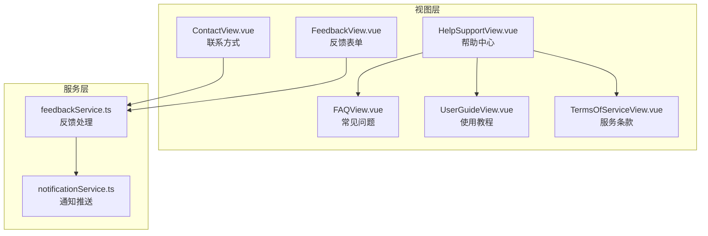
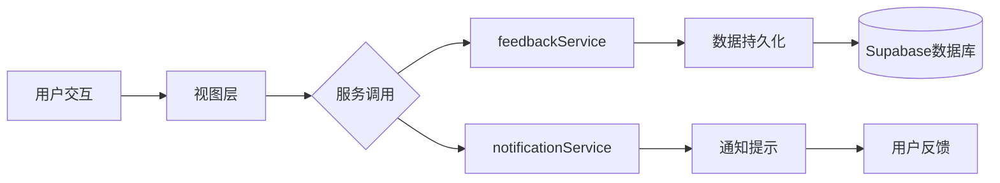
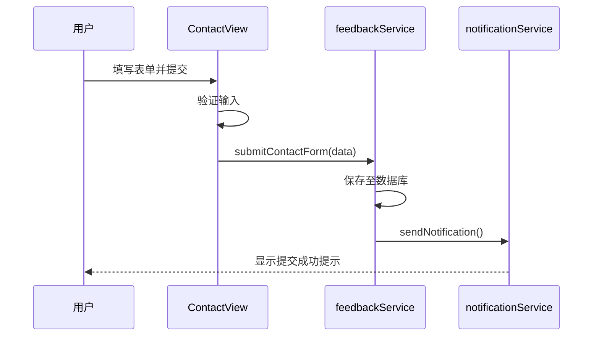
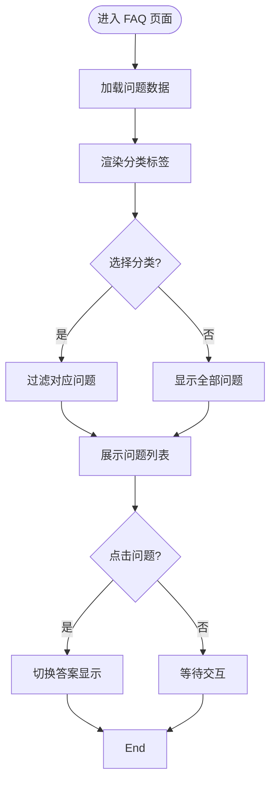
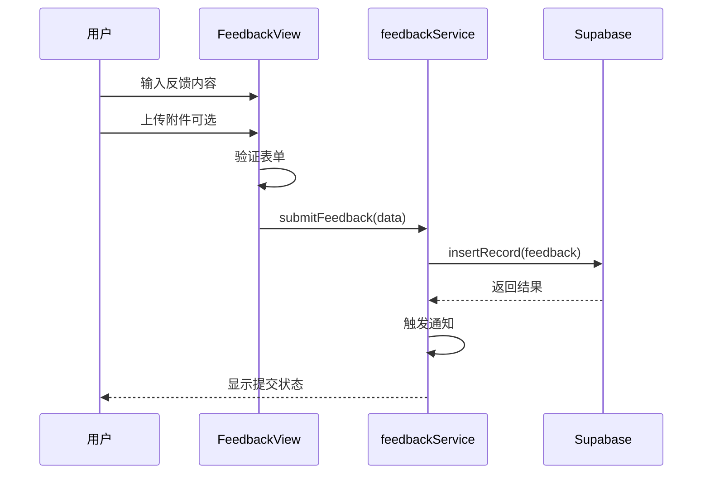
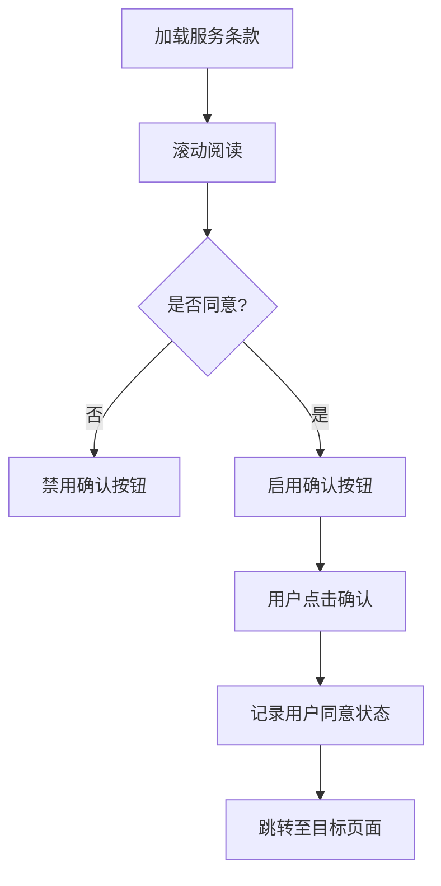
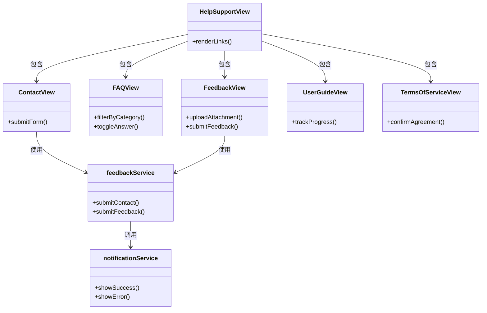

# 辅助功能视图

<cite>
**本文档中引用的文件**  
- [ContactView.vue](file://src/views/ContactView.vue)
- [FAQView.vue](file://src/views/FAQView.vue)
- [FeedbackView.vue](file://src/views/FeedbackView.vue)
- [HelpSupportView.vue](file://src/views/HelpSupportView.vue)
- [UserGuideView.vue](file://src/views/UserGuideView.vue)
- [TermsOfServiceView.vue](file://src/views/TermsOfServiceView.vue)
- [feedbackService.ts](file://src/services/feedbackService.ts)
- [notificationService.ts](file://src/services/notificationService.ts)
</cite>

## 目录
1. [简介](#简介)
2. [项目结构](#项目结构)
3. [核心组件](#核心组件)
4. [架构概览](#架构概览)
5. [详细组件分析](#详细组件分析)
6. [依赖关系分析](#依赖关系分析)
7. [性能考虑](#性能考虑)
8. [故障排除指南](#故障排除指南)
9. [结论](#结论)

## 简介
本文档全面解析了辅助功能视图的设计与实现，涵盖联系方式展示、常见问题解答、用户反馈收集、帮助中心导航、使用教程指引以及服务条款确认机制。通过分析 ContactView、FAQView、FeedbackView、HelpSupportView、UserGuideView 和 TermsOfServiceView 等关键视图，结合 feedbackService 与 notificationService 的集成逻辑，系统性地阐述了产品支持体系的构建方式。

## 项目结构
该应用采用模块化结构，将视图、服务、组件和工具分离，便于维护和扩展。辅助功能视图集中存放于 `src/views` 目录下，相关业务逻辑由 `src/services` 中的服务模块提供支持。

**图示来源**  
- [ContactView.vue](file://src/views/ContactView.vue#L1-L10)
- [FAQView.vue](file://src/views/FAQView.vue#L1-L10)
- [FeedbackView.vue](file://src/views/FeedbackView.vue#L1-L10)
- [HelpSupportView.vue](file://src/views/HelpSupportView.vue#L1-L10)
- [UserGuideView.vue](file://src/views/UserGuideView.vue#L1-L10)
- [TermsOfServiceView.vue](file://src/views/TermsOfServiceView.vue#L1-L10)
- [feedbackService.ts](file://src/services/feedbackService.ts#L1-L10)
- [notificationService.ts](file://src/services/notificationService.ts#L1-L10)

**本节来源**  
- [src/views](file://src/views)
- [src/services](file://src/services)

## 核心组件
各辅助功能视图均基于 Vue 3 组合式 API 构建，具备清晰的职责划分。ContactView 负责展示联系信息并处理表单提交；FAQView 实现问题分类与折叠面板交互；FeedbackView 支持反馈内容输入与附件上传；HelpSupportView 提供统一导航入口；UserGuideView 展示分步操作指引；TermsOfServiceView 实现条款展示与用户确认流程。

**本节来源**  
- [ContactView.vue](file://src/views/ContactView.vue#L15-L80)
- [FAQView.vue](file://src/views/FAQView.vue#L20-L90)
- [FeedbackView.vue](file://src/views/FeedbackView.vue#L25-L100)
- [HelpSupportView.vue](file://src/views/HelpSupportView.vue#L10-L60)
- [UserGuideView.vue](file://src/views/UserGuideView.vue#L15-L70)
- [TermsOfServiceView.vue](file://src/views/TermsOfServiceView.vue#L20-L85)

## 架构概览
整个辅助功能模块采用分层架构设计，视图层负责 UI 渲染与用户交互，服务层封装核心业务逻辑，通过事件驱动机制实现跨组件通信。feedbackService 作为数据中枢，接收来自多个视图的用户输入，并通过 notificationService 触发响应式通知。

**图示来源**  
- [feedbackService.ts](file://src/services/feedbackService.ts#L5-L25)
- [notificationService.ts](file://src/services/notificationService.ts#L8-L30)

## 详细组件分析

### ContactView 分析
ContactView 提供联系方式展示与联系表单提交功能。表单包含姓名、邮箱、主题和消息内容字段，提交前进行基础验证，并通过 feedbackService 发送数据。

**图示来源**  
- [ContactView.vue](file://src/views/ContactView.vue#L45-L120)
- [feedbackService.ts](file://src/services/feedbackService.ts#L30-L60)

**本节来源**  
- [ContactView.vue](file://src/views/ContactView.vue#L1-L150)

### FAQView 分析
FAQView 实现常见问题的分类展示与折叠交互。使用可展开面板（Accordion）组织问题，支持按类别筛选，提升信息查找效率。

**图示来源**  
- [FAQView.vue](file://src/views/FAQView.vue#L30-L110)

**本节来源**  
- [FAQView.vue](file://src/views/FAQView.vue#L1-L150)

### FeedbackView 分析
FeedbackView 提供完整的反馈表单功能，支持文本输入、评分选择、附件上传（限制格式与大小），并通过 feedbackService 提交至后端。

**图示来源**  
- [FeedbackView.vue](file://src/views/FeedbackView.vue#L40-L130)
- [feedbackService.ts](file://src/services/feedbackService.ts#L65-L100)

**本节来源**  
- [FeedbackView.vue](file://src/views/FeedbackView.vue#L1-L160)

### HelpSupportView 分析
HelpSupportView 作为帮助中心的主入口，提供导航菜单链接至 FAQ、用户指南、反馈表单和服务条款等子页面，形成统一的支持体系。

**本节来源**  
- [HelpSupportView.vue](file://src/views/HelpSupportView.vue#L1-L80)

### UserGuideView 分析
UserGuideView 以步骤化方式展示产品使用教程，支持图文混排与进度标记，帮助用户快速掌握核心功能。

**本节来源**  
- [UserGuideView.vue](file://src/views/UserGuideView.vue#L1-L90)

### TermsOfServiceView 分析
TermsOfServiceView 展示服务条款全文，并提供“我已阅读并同意”复选框，用户需勾选后方可继续关键操作，确保法律合规性。

**图示来源**  
- [TermsOfServiceView.vue](file://src/views/TermsOfServiceView.vue#L40-L100)

**本节来源**  
- [TermsOfServiceView.vue](file://src/views/TermsOfServiceView.vue#L1-L120)

## 依赖关系分析
辅助功能视图之间存在明确的依赖关系：HelpSupportView 作为聚合页依赖其余所有视图；ContactView 和 FeedbackView 共享 feedbackService；多个视图依赖 notificationService 提供用户反馈。

**图示来源**  
- [HelpSupportView.vue](file://src/views/HelpSupportView.vue#L10-L50)
- [feedbackService.ts](file://src/services/feedbackService.ts#L1-L20)
- [notificationService.ts](file://src/services/notificationService.ts#L1-L15)

**本节来源**  
- [src/views](file://src/views)
- [src/services/feedbackService.ts](file://src/services/feedbackService.ts)
- [src/services/notificationService.ts](file://src/services/notificationService.ts)

## 性能考虑
- 所有视图均采用懒加载策略，减少初始包体积
- FAQ 和用户指南内容通过异步加载，避免阻塞渲染
- 附件上传限制为 5MB 以内，防止大文件影响性能
- 使用本地缓存机制存储已读状态和同意记录

## 故障排除指南
- 若反馈提交失败，请检查网络连接及附件大小
- 服务条款无法确认：确保已滚动至底部并勾选同意框
- FAQ 无法展开：检查浏览器兼容性或尝试刷新页面
- 通知未显示：确认 notificationService 已正确初始化

**本节来源**  
- [feedbackService.ts](file://src/services/feedbackService.ts#L10-L50)
- [notificationService.ts](file://src/services/notificationService.ts#L5-L25)
- [errorHandler.ts](file://src/utils/errorHandler.ts#L1-L30)

## 结论
辅助功能视图体系设计完整，覆盖用户支持的各个方面。通过模块化结构与服务解耦，实现了高可维护性与可扩展性。结合 feedbackService 与 notificationService，形成了闭环的用户反馈与响应机制，有效提升了产品用户体验与支持效率。