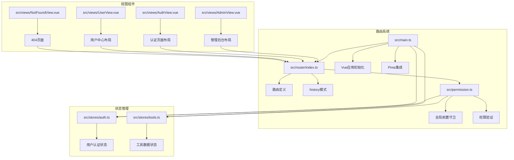
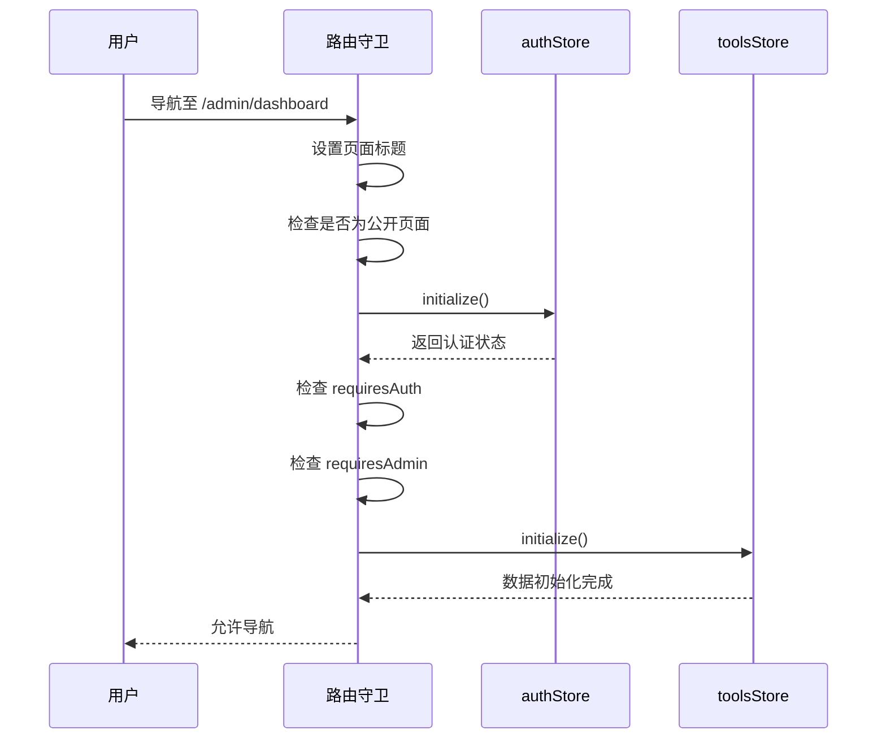
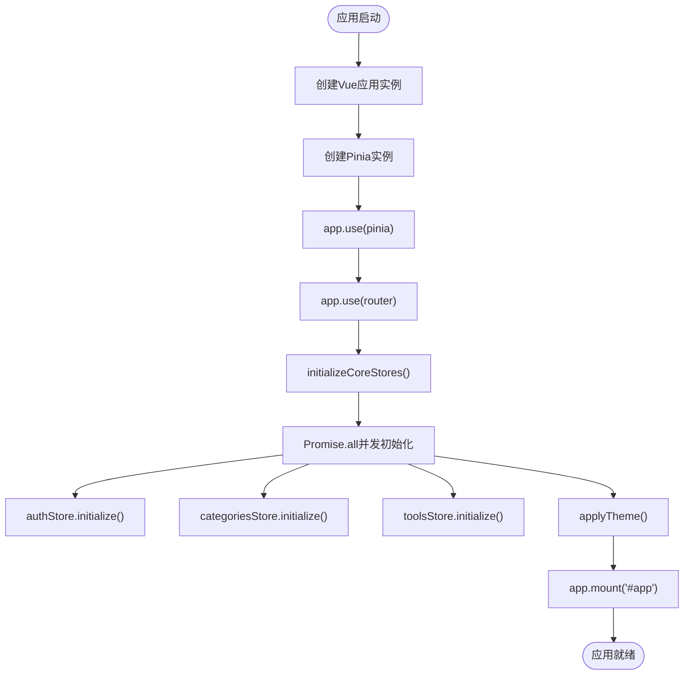

# 路由系统结构

<cite>
**本文档中引用的文件**  
- [index.ts](file://src/router/index.ts)
- [permission.ts](file://src/permission.ts)
- [main.ts](file://src/main.ts)
- [auth.ts](file://src/stores/auth.ts)
- [tools.ts](file://src/stores/tools.ts)
- [AdminView.vue](file://src/views/AdminView.vue)
- [AuthView.vue](file://src/views/AuthView.vue)
- [UserView.vue](file://src/views/UserView.vue)
- [NotFoundView.vue](file://src/views/NotFoundView.vue)
</cite>

## 目录
1. [项目结构](#项目结构)
2. [路由配置详解](#路由配置详解)
3. [路由守卫与权限控制](#路由守卫与权限控制)
4. [主应用初始化流程](#主应用初始化流程)
5. [嵌套路由与布局组件](#嵌套路由与布局组件)
6. [动态路由与懒加载](#动态路由与懒加载)
7. [路由元信息应用](#路由元信息应用)
8. [404页面与错误处理](#404页面与错误处理)
9. [性能优化建议](#性能优化建议)

## 项目结构

本项目采用模块化Vue 3 + TypeScript架构，路由系统集中于`src/router/index.ts`，权限控制逻辑位于`src/permission.ts`，状态管理使用Pinia存储于`src/stores/`目录。路由配置与组件按功能划分，视图组件集中于`src/views/`目录，包含用户、认证、管理后台等模块。

**图示来源**  
- [index.ts](file://src/router/index.ts)
- [permission.ts](file://src/permission.ts)
- [main.ts](file://src/main.ts)
- [auth.ts](file://src/stores/auth.ts)
- [tools.ts](file://src/stores/tools.ts)
- [AdminView.vue](file://src/views/AdminView.vue)
- [AuthView.vue](file://src/views/AuthView.vue)
- [UserView.vue](file://src/views/UserView.vue)
- [NotFoundView.vue](file://src/views/NotFoundView.vue)

**本节来源**  
- [src/router/index.ts](file://src/router/index.ts)
- [src/permission.ts](file://src/permission.ts)
- [src/main.ts](file://src/main.ts)

## 路由配置详解

路由配置定义于`src/router/index.ts`，采用Vue Router的`RouteRecordRaw`类型声明。系统使用`createWebHistory`模式，提供更友好的URL结构。路由表包含首页、搜索、帮助支持、用户中心、认证、管理后台等核心功能模块。

路由支持嵌套结构，如`/user`下包含`profile`、`favorites`、`orders`等子路由，`/admin`下包含`dashboard`、`tools`、`products`等管理功能。动态路由参数通过`:id`形式定义，如`/tools/:id`和`/product/:id`用于详情页展示。

所有路由均配置`meta`字段，包含页面标题、描述及权限要求（`requiresAuth`、`requiresAdmin`），为后续权限控制和SEO优化提供基础。

**本节来源**  
- [index.ts](file://src/router/index.ts)

## 路由守卫与权限控制

权限控制逻辑封装在`src/permission.ts`的`setupRouterGuard`函数中，通过`router.beforeEach`注册全局前置守卫。守卫逻辑首先设置页面标题，基于路由`meta.title`动态更新`document.title`。

系统定义公开页面白名单（如首页、产品页、404页），无需认证即可访问。对于需要认证的页面（`requiresAuth: true`），守卫会调用`useAuthStore().initialize()`检查登录状态，未登录用户将重定向至登录页并携带原路径作为`redirect`参数。

管理员权限检查（`requiresAdmin: true`）在认证基础上进行，通过`authStore.isAdmin`判断用户角色，无权限者将被重定向至首页。守卫还负责初始化`toolsStore`，确保工具数据在进入相关页面前已加载。

**图示来源**  
- [permission.ts](file://src/permission.ts)
- [auth.ts](file://src/stores/auth.ts)
- [tools.ts](file://src/stores/tools.ts)

**本节来源**  
- [permission.ts](file://src/permission.ts)
- [auth.ts](file://src/stores/auth.ts)
- [tools.ts](file://src/stores/tools.ts)

## 主应用初始化流程

应用入口`src/main.ts`中，通过`initializeCoreStores`函数异步初始化核心Pinia存储。该函数使用`Promise.all`并发加载`authStore`、`categoriesStore`和`toolsStore`，提升启动性能。

在所有核心状态初始化完成后，才调用`app.mount("#app")`挂载Vue应用，确保用户界面渲染时数据已准备就绪。此设计避免了组件因数据未加载而出现的空状态或错误。

**图示来源**  
- [main.ts](file://src/main.ts)
- [auth.ts](file://src/stores/auth.ts)
- [tools.ts](file://src/stores/tools.ts)

**本节来源**  
- [main.ts](file://src/main.ts)
- [auth.ts](file://src/stores/auth.ts)
- [tools.ts](file://src/stores/tools.ts)

## 嵌套路由与布局组件

系统采用嵌套路由实现多级页面布局。`/admin`路由对应`AdminView.vue`，其模板中包含`<router-view />`作为子路由的渲染出口。侧边导航菜单通过`<router-link>`绑定各管理功能路径，`active-class`属性实现当前页高亮。

类似地，`/auth`路由使用`AuthView.vue`作为布局容器，包含登录、注册、忘记密码等子页面的统一视觉风格。`/user`路由的`UserView.vue`为用户中心提供基础布局，其子路由在内部渲染。

这种布局模式实现了导航结构的复用，避免了重复代码，同时保证了同一功能模块下的视觉一致性。

**本节来源**  
- [index.ts](file://src/router/index.ts)
- [AdminView.vue](file://src/views/AdminView.vue)
- [AuthView.vue](file://src/views/AuthView.vue)
- [UserView.vue](file://src/views/UserView.vue)

## 动态路由与懒加载

所有路由组件均采用动态导入（`import()`）实现懒加载，如`component: () => import("../views/HomeView.vue")`。此方式将代码分割为独立的chunk，仅在导航到对应路由时才加载组件代码，显著减少首屏加载时间。

动态路由参数通过路径中的`:`标识符定义，如`/tools/:id`。在`ToolDetailView.vue`中，可通过`useRoute().params.id`获取参数值，用于加载特定工具的详细信息。

**本节来源**  
- [index.ts](file://src/router/index.ts)

## 路由元信息应用

路由的`meta`字段被广泛用于增强应用功能：
- **页面标题**：在路由守卫中读取`meta.title`并更新`document.title`，提升用户体验和SEO。
- **权限控制**：`requiresAuth`和`requiresAdmin`字段作为守卫逻辑的判断依据，实现细粒度访问控制。
- **导航高亮**：结合`active-class`属性，根据当前路由自动高亮导航菜单项。
- **页面描述**：`meta.description`可用于SEO或社交分享卡片。

**本节来源**  
- [index.ts](file://src/router/index.ts)
- [permission.ts](file://src/permission.ts)

## 404页面与错误处理

系统通过通配符路由`/:pathMatch(.*)*`捕获所有未匹配的路径，统一重定向至`NotFoundView.vue`。该页面提供友好的错误提示、返回首页按钮、返回上一页功能及常见页面推荐，改善用户迷失导航时的体验。

在路由守卫中，使用`try-catch`包裹核心逻辑，任何异常均会捕获并重定向至首页，防止应用因路由错误而崩溃。`toolsStore`的初始化也包含错误处理，失败时会显示错误信息并尝试回退到模拟数据。

**本节来源**  
- [index.ts](file://src/router/index.ts)
- [NotFoundView.vue](file://src/views/NotFoundView.vue)
- [permission.ts](file://src/permission.ts)
- [tools.ts](file://src/stores/tools.ts)

## 性能优化建议

1. **代码分割**：已通过动态导入实现路由级代码分割，建议对大型组件进一步拆分。
2. **并发初始化**：主应用采用`Promise.all`并发加载核心状态，最大化利用网络资源。
3. **守卫优化**：公开页面快速放行，避免不必要的认证检查，提升导航响应速度。
4. **缓存策略**：`toolsStore`等数据存储应实现本地缓存，减少重复API调用。
5. **预加载**：可考虑对关键路由（如首页、登录页）使用`<link rel="prefetch">`进行预加载。

**本节来源**  
- [main.ts](file://src/main.ts)
- [permission.ts](file://src/permission.ts)
- [tools.ts](file://src/stores/tools.ts)